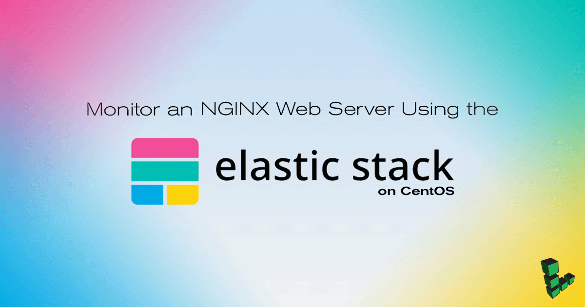

## What is the Elastic Stack?

The [Elastic Stack](https://www.elastic.co/) is a set of open-source tools that aid in analyzing different types of data. Tools such as Filebeat and Metricbeat can collect system and webserver logs and send them to Elasticsearch where the data can be searched, analyzed, and visualized using Kibana as a browser-based application.

This guide will explain how to install different components of the stack in order to monitor a typical webserver. It will use version 6 of each of the tools in the Elastic Stack, which is a recent release featuring additional features and fixes.


This guide is written for a non-root user. Commands that require elevated privileges are prefixed with `sudo`. If you're not familiar with the `sudo` command, you can check our [Users and Groups](/docs/guides/linux-users-and-groups/) guide.


## Before You Begin

1.  If you have not already done so, create a Linode account and Compute Instance. See our [Getting Started with Linode](/docs/products/platform/get-started/) and [Creating a Compute Instance](/docs/products/compute/compute-instances/guides/create/) guides.

1.  Follow our [Setting Up and Securing a Compute Instance](/docs/products/compute/compute-instances/guides/set-up-and-secure/) guide to update your system. You may also wish to set the timezone, configure your hostname, create a limited user account, and harden SSH access.

1.  Follow the steps in our [Install a LEMP Stack on CentOS 7 with FastCGI](/docs/guides/lemp-stack-on-centos-7-with-fastcgi/) guide to set up a web server stack with NGINX on your CentOS host.

## Install OpenJDK 8

Elasticsearch requires recent versions of Java. On CentOS 7, OpenJDK 8 is available for installation from the official repositories.

1.  Install the headless OpenJDK package:

        sudo yum install -y java-1.8.0-openjdk-headless

2.  Ensure that Java is ready for use by Elasticsearch by checking that the installed version is at least at version 1.8.0:

        java -version

    The installed version should be similar to the following:

        openjdk version "1.8.0_151"
        OpenJDK Runtime Environment (build 1.8.0_151-b12)
        OpenJDK 64-Bit Server VM (build 25.151-b12, mixed mode)

## Install Elastic Yum Repository

The Elastic Yum package repository contains all the necessary packages for the remainder of this tutorial.

1.  Trust the Elastic signing key:

        sudo rpm --import https://artifacts.elastic.co/GPG-KEY-elasticsearch

2.  Create a yum repository configuration to use the Elastic yum repository:

[elasticsearch-6.x]
name=Elastic repository for 6.x packages
baseurl=https://artifacts.elastic.co/packages/6.x/yum
gpgcheck=1
gpgkey=https://artifacts.elastic.co/GPG-KEY-elasticsearch
enabled=1
autorefresh=1
type=rpm-md


3.  Update the `yum` cache to ensure any new packages become available:

        sudo yum update

## Install Stack Components

This tutorial will use several parts of the Elastic Stack for log analysis and machine metrics. Before starting, it may be helpful to summarize how each piece will help form the final stack of software:

- [**Filebeat**](https://www.elastic.co/products/beats/filebeat) will watch and collect web server access logs from NGINX. Filebeat will also manage configuring Elasticsearch to ensure logs are parsed as expected and loaded into the correct indices.
- [**Metricbeat**](https://www.elastic.co/products/beats/metricbeat) will collect system metrics such as CPU, memory, and disk usage, and store this as numerical data in Elasticsearch.
- [**Elasticsearch**](https://www.elastic.co/) will store logs and metrics sent to it from each Beat. Documents are indexed for searching and available over the default Elasticsearch port (9200).
- [**Kibana**](https://www.elastic.co/products/kibana) will connect to Elasticsearch to expose indexed documents in a searchable, browser-based visualization interface.

### Elasticsearch

In order to provide a datastore for each Beat and Kibana, Elasticsearch must first be installed and configured.

1.  Install the `elasticsearch` package:

         sudo yum install -y elasticsearch

2.  Set the JVM heap size to approximately half of your server's available memory. For example, if your server has 1GB of RAM, change the `Xms` and `Xmx` values in the `/etc/elasticsearch/jvm.options` file `512m`. Leave the other values in this file unchanged:

    
-Xms512m
-Xmx512m


3.  In order for Filebeat to properly parse and process certain documents, two _ingest_ plugins must be installed for elasticsearch. First, install the `ingest-user-agent` plugin, which enables Elasticsearch to accurately parse user-agent strings:

         sudo /usr/share/elasticsearch/bin/elasticsearch-plugin install ingest-user-agent

4.  Next, install the geoip processor plugin. The `elasticsearch-plugin` command may ask for confirmation to make changes to the `/etc/elasticsearch` path, which is safe to do:

        sudo /usr/share/elasticsearch/bin/elasticsearch-plugin install ingest-geoip

5.  Start and enable the `elasticsearch` service:

         sudo systemctl enable elasticsearch
         sudo systemctl start elasticsearch

6.  Wait a few moments for the service to start, then confirm that the Elasticsearch API is available:

         curl localhost:9200

    Elasticsearch may take some time to start up. If you need to determine whether the service has started successfully or not, you can use the `systemctl status elasticsearch` command to see the most recent logs. The Elasticsearch REST API should return a JSON response similar to the following:

        {
          "name" : "Q1R2Oz7",
          "cluster_name" : "elasticsearch",
          "cluster_uuid" : "amcxppmvTkmuApEdTz673A",
          "version" : {
            "number" : "6.0.0",
            "build_hash" : "8f0685b",
            "build_date" : "2017-11-10T18:41:22.859Z",
            "build_snapshot" : false,
            "lucene_version" : "7.0.1",
            "minimum_wire_compatibility_version" : "5.6.0",
            "minimum_index_compatibility_version" : "5.0.0"
          },
          "tagline" : "You Know, for Search"
        }

### Filebeat

Install the `filebeat` package:

     sudo yum install filebeat

### Metricbeat

Install the `metricbeat` package:

     sudo yum install metricbeat

### Kibana

Install the `kibana` package:

     sudo yum install kibana

## Configure The Stack

### Elasticsearch

By default, Elasticsearch will create five shards and one replica for every index that's created. When deploying to production, these are reasonable settings to use. In this tutorial, only one server is used in the Elasticsearch setup, so multiple shards and replicas are unnecessary. Changing these defaults can avoid unnecessary overhead.

1.  Create a temporary JSON file with an *index template* that instructs Elasticsearch to set the number of shards to one and number of replicas to zero for all matching index names (in this case, a wildcard `*`):

    
"template": "*",
"settings":
"index":
"number_of_shards": 1,
"number_of_replicas": 0


2.  Use `curl` to create an index template with these settings that'll be applied to all indices created hereafter:

        curl -H'Content-Type: application/json' -XPUT http://localhost:9200/_template/defaults -d @template.json

3.  Elasticsearch should return:

        {"acknowledged":true}

### Kibana

Enable and start the Kibana service:

    sudo systemctl enable kibana
    sudo systemctl start kibana

In order to securely access Kibana, this guide will use an SSH tunnel to access the web application. This avoids opening Kibana on a publicly accessible IP address and port.

By default, Kibana will be listening for requests from its local address only. In order to view Kibana in a local browser, issue the following command in a new terminal window:

    ssh -L 5601:localhost:5601 username@<Linode public IP> -N

Replace `username` with your Linux user name and `<Linode public IP>` with the public IP address of your Linode.

### Filebeat

Filebeat version 6 ships with the ability to use [modules](https://www.elastic.co/guide/en/beats/filebeat/current/filebeat-modules.html) in order to automate how logs are collected, indexed, and visualized. This guide will use the NGINX module in order to handle most of the necessary configuration in order to instruct the stack how to process system logs.


Your Linode should already have NGINX configured following the [Install a LEMP Stack on CentOS 7 with FastCGI](/docs/guides/lemp-stack-on-centos-7-with-fastcgi/) guide.


1.  Using a text editor, create `/etc/filebeat/filebeat.yml` and add the following content:

    
filebeat.config.modules:
    path: ${path.config}/modules.d/*.yml

setup.kibana:
    host: "localhost:5601"

output.elasticsearch:
    hosts: ["localhost:9200"]

setup.dashboards.enabled: true


2.  You can enable Filebeat modules by removing `.disabled` from the file names. Enable the NGINX module:

        sudo mv /etc/filebeat/modules.d/nginx.yml.disabled /etc/filebeat/modules.d/nginx.yml

2.  Enable and start the `filebeat` service:

        sudo systemctl enable filebeat
        sudo systemctl start filebeat

### Metricbeat

Like Filebeat, Metricbeat also provides a variety of built-in modules to help configure itself to monitor different aspects of the host system automatically. The following steps will configure Metricbeat to use these features and enable the system service.

1.  Create the following Metricbeat configuration:


metricbeat.config.modules:
  path: ${path.config}/modules.d/*.yml

setup.kibana:
  host: "localhost:5601"

output.elasticsearch:
  hosts: ["localhost:9200"]

setup.dashboards.enabled: true



2.  Rename the Elasticsearch, Kibana, and NGINX module configuration files in order to enable them:

        sudo mv /etc/metricbeat/modules.d/elasticsearch.yml.disabled /etc/metricbeat/modules.d/elasticsearch.yml
        sudo mv /etc/metricbeat/modules.d/kibana.yml.disabled /etc/metricbeat/modules.d/kibana.yml
        sudo mv /etc/metricbeat/modules.d/nginx.yml.disabled /etc/metricbeat/modules.d/nginx.yml

2.  Start and enable the `metricbeat` service:

        sudo systemctl enable metricbeat
        sudo systemctl start metricbeat

## Creating and Using Visualizations

The rest of this guide will use Kibana's browser-based interface in order to view and search machine data.

1.  Although Filebeat is now monitoring NGINX access and error logs, traffic must be generated to create data to visualize in Kibana. Run the following command in another terminal window or tab in order to generate webserver requests in the background:

        while true ; do n=$(( RANDOM % 10 )) ; curl "localhost/?$n" ; sleep $n ; done

    This process may be terminated by entering **Ctrl-C** at the terminal to exit the request loop at the conclusion of this tutorial.

2.  Open Kibana by navigating to `http://localhost:5601` in a browser to access the SSH-forwarded port. The landing page should look similar to the following:

    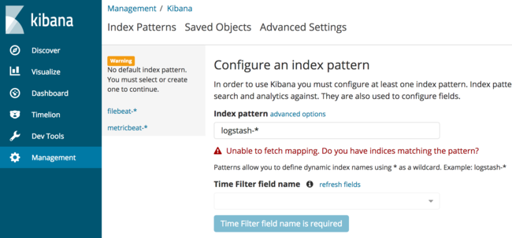

    The interface asks for a default index pattern, which can be selected from the left sidebar. This will instruct Kibana to use the documents that either Filebeat or Metricbeat have indexed by default when presenting search dashboards. Click on `filebeat-*` in order to view the Filebeat index pattern.

3.  From this screen, select the star icon to choose `filebeat-*` as the default index pattern.

    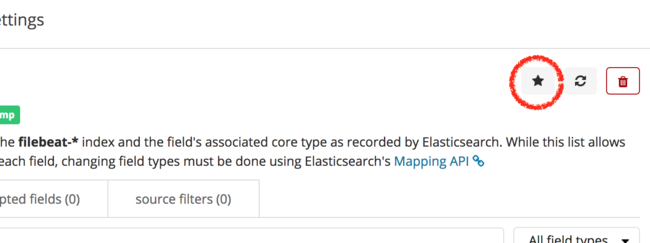

4.  Click on "Discover" from the far left sidebar in order to view logs that are being indexed by Filebeat. A screen similar to the one shown below should appear:

    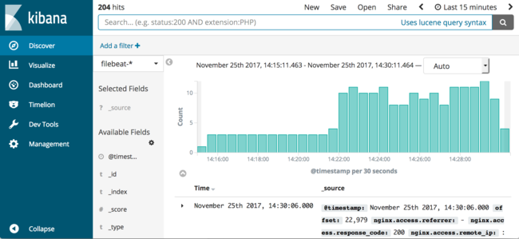

5.  From this screen, logs can be easily searched and analyzed. For example, to search the NGINX access logs for all requests for `/?5` that are being generated by the running shell loop in the background, enter the following into the search box and click the magnifying glass or hit **Enter**:

        nginx.access.url:"/?5"

    The interface will perform an Elasticsearch query and show only matching documents.


Throughout this guide, logs will be retrieved based upon a time window in the upper right corner of the Kibana interface (such as "Last 15 Minutes"). If at any point log entries are no longer visible in the Kibana interface, click this timespan and choose a wider range, such as "Last Hour" or "Last 1 Hour" or "Last 4 Hours," to see as many logs as possible.


### Filebeat Dashboards

In addition to collecting NGINX access logs, Filebeat also installs several dashboards into Kibana in order to provide useful default visualizations for your data.

1.  From the "Discover" screen, select the "Dashboard" item from the sidebar menu.

    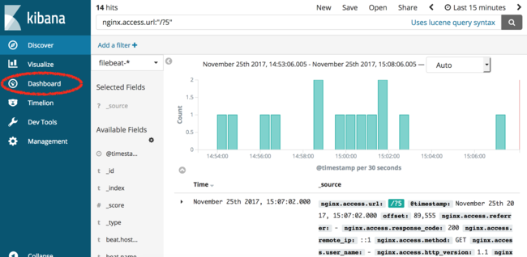

2.  The following screen will appear, which lists all dashboards available to Kibana.

    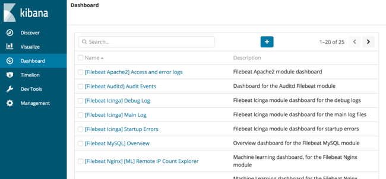

3.  In the search box, enter "nginx" to search for all NGINX dashboards. In the list of results, select the dashboard titled "[Filebeat Nginx] Access and error logs". The following dashboard will load:

    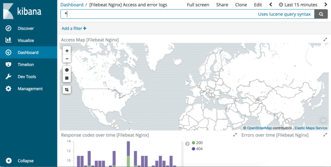

4.  Scroll further down to view the visualizations available in this default dashboard. There are several virtualizations including a geolocation map, response codes by URL, and user-agent summaries. These dashboards can help summarize traffic to a webserver in addition to debugging issues. For example, when the Metricbeat NGINX module was enabled, we did not enable the NGINX server-status endpoint for use with Metricbeat. This dashboard can help find this misconfiguration.

5.  To begin, scroll to the "Response codes over time" visualization in this dashboard. Observe that there are many 404 responses and click on one of the color-coded 404 bars:

    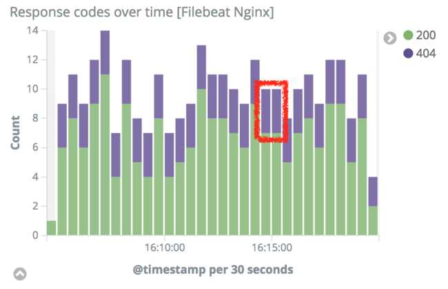

6.  Scroll to the top of the Kibana interface and click the "Apply Now" button to filter the access logs only for logs that returned 404 to the user.

  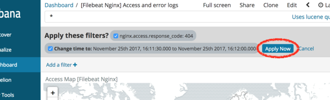

7.  After applying this filter, scroll down again to view the visualizations for all 404 logs. Observe that "Response codes by top URLs" visualization indicates that NGINX is only returning 404 response codes for the `/server-status` url:

    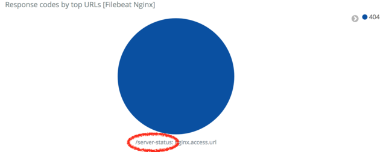

    We can now fix the NGINX configuration to resolve this error.

#### Reconfiguring NGINX

1.  Open the `/etc/nginx/nginx.conf` file and add the following `location` block in between the `include` and `location /` lines:

    

include /etc/nginx/default.d/*.conf;

    location /server-status {
            stub_status on
            access_log off;
            allow 127.0.0.1;
            allow ::1;
            deny all;
        }

    location / {
        }



2.  Restart NGINX:

        sudo systemctl restart nginx

3.  Repeat the steps in the preceding section in order to observe response code history. 404 response codes should gradually stop appearing as you perform fresh searches in Kibana to view new logs.

### Metricbeat

In addition to web server access logs, host metrics can be viewed in Kibana by using visualizations created by Metricbeat.

1.  From the left-hand sidebar, select "Dashboard" and enter "metricbeat" in the search box to filter for Metricbeat dashboards. Select the dashboard named "[Metricbeat System] Overview". A new dashboard should open with visualizations similar to the following:

    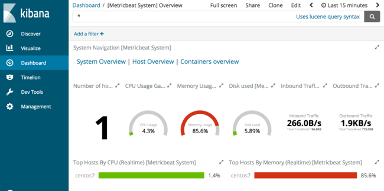

    This dashboard provides a high-level overview of host metrics including CPU, memory, disk, and network use. If you install Metricbeat on any additional hosts and send metrics to a central Elasticsearch instance, Kibana provides a centralized monitoring view for a fleet of individual hosts. From this dashboard, select "Host Overview" from the "System Navigation" section of the dashboard.

2.  From this dashboard, scroll down to view all of the host data being collected by Metricbeat. These visualizations provide a wealth of information.

    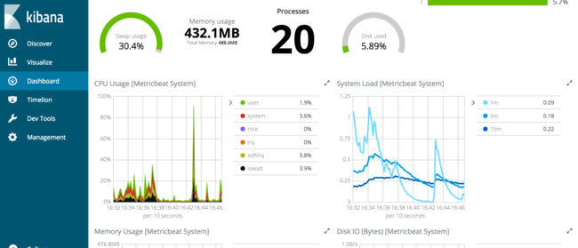

    These dashboards are a sample of the types of machine metrics collected by Metricbeat. By using the collected metrics for datasets such as load, memory, and process resource usage, useful dashboards can be created for high-level overviews of servers.

## Further Reading

This tutorial has covered only a portion of the data available for searching and analysis that Filebeat and Metricbeat provide. By drawing upon existing dashboards for examples, additional charts, graphs, and other visualizations can be created to answer specific questions and provide useful dashboards for a variety of purposes.

Comprehensive documentation for each piece of the stack is available from the Elastic web site:

- The [Elasticsearch reference](https://www.elastic.co/guide/en/elasticsearch/reference/current/index.html) contains additional information regarding how to operate Elasticsearch, including clustering, managing indices, and more.
- [Metricbeat's documentation](https://www.elastic.co/guide/en/beats/metricbeat/current/index.html) provides additional information regarding configuration options and modules for other projects such as Apache, MySQL, and more.
- The [Filebeat documentation](https://www.elastic.co/guide/en/beats/filebeat/current/index.html) is useful if additional logs need to be collected and processed outside of the logs covered in this tutorial.
- [Kibana's documentation pages](https://www.elastic.co/guide/en/kibana/current/index.html) provide additional information regarding how to create useful visualizations and dashboards.
