The [Elastic](https://www.elastic.co/) stack is a troika of tools that includes Elasticsearch, Logstash, and Kibana. These tools provide a free and open-source solution that searches, collects, and analyzes data. This data can be from any source and in any format. They also visualize the data in real time.


Version 7.11 of the Elastic stack is used in this guide, which is the latest at the time of this writing.


## In this Guide

This guide shows how to:

- [Install Elasticsearch, Logstash, and Kibana](#install-the-elastic-stack).

- [Configure Elasticsearch](#configure-elasticsearch) to run with one shard and no replicas, which is appropriate for testing on a single Linode.

- [Configure Logstash](#configure-logstash) to process logs from the Apache web server.

- [Connect Kibana](#configure-kibana) to the Logstash index.

- [View the logs](#view-logs-in-kibana) from your connected Logstash index in Kibana.

- [Search the logs](#search-logs-in-kibana) in Kibana.

- [Visualize the logs](#visualize-logs-in-kibana) in a pie chart, categorized by HTTP response code, in Kibana.

## Before You Begin

1.  Familiarize yourself with our [Getting Started](/docs/products/platform/get-started/) guide and create a Linode to install the Elastic stack on. Then, complete the steps for setting your Linode's hostname and timezone.

    
Multiple services are run on a single Linode in this guide. We recommend using at least a 2G (or `g6-standard-1`) sized Linode instance to support these services.


1.  This guide uses `sudo` wherever possible. Complete the sections of our [Setting Up and Securing a Compute Instance](/docs/products/compute/compute-instances/guides/set-up-and-secure/) guide to create a standard user account with `sudo` privileges, harden SSH access, and remove unnecessary network services.

    
Commands that require elevated privileges are prefixed with `sudo`. If you're not familiar with the `sudo` command, you can check our [Users and Groups](/docs/guides/linux-users-and-groups/) guide.


1.  Update your system:

        sudo apt-get update && sudo apt-get upgrade

1.  Follow the steps in our [Apache Web Server on Ubuntu 18.04](/docs/guides/how-to-install-apache-web-server-ubuntu-18-04/) guide to set up and configure Apache on your server.

1.  The Elasticsearch package is bundled with its own version of a Java runtime, but Logstash requires Java to be present on the system. Install the default version of Java available on Ubuntu 18.04:

        sudo apt-get install default-jre-headless

## Install the Elastic Stack

Before configuring and loading log data, install each piece of the stack, individually.

### Install the Elastic APT Repository

The Elastic package repositories contain all of the necessary packages for this tutorial, so install it first before proceeding with the individual services.

1.  Install the official Elastic APT package signing key:

        wget -qO - https://artifacts.elastic.co/GPG-KEY-elasticsearch | sudo apt-key add -

1.  Add the APT repository information to your server's list of sources:

        echo "deb https://artifacts.elastic.co/packages/7.x/apt stable main" | sudo tee -a /etc/apt/sources.list.d/elastic-7.x.list

1.  Refresh the list of available packages:

        sudo apt-get update

### Install Elasticsearch

1.  Install the `elasticsearch` package:

        sudo apt-get install elasticsearch

1.  Set the JVM heap size to approximately one-quarter of your server's available memory. For example, on a Linode instance with 2GB of memory, ensure that the `Xms` and `Xmx` values in the `/etc/elasticsearch/jvm.options` file are set to the following, and leave the other values in this file unchanged.

    
-Xms512m
-Xmx512m


    
By default, these options are commented out and have the following values. So, you need to uncomment the lines as well (by removing the two `#` symbols at the beginning of the line):

```
## -Xms4g
## -Xmx4g
```



1.  Start and enable the `elasticsearch` service:

         sudo systemctl enable elasticsearch
         sudo systemctl start elasticsearch

1.  Wait a few moments for the service to start, then confirm that the Elasticsearch API is available:

         curl localhost:9200

    Elasticsearch may take some time to start up. If you need to determine whether the service has started successfully or not, you can use the `systemctl status elasticsearch` command to see the most recent logs. The Elasticsearch REST API should return a JSON response similar to the following:

    
{
  "name" : "localhost",
  "cluster_name" : "elasticsearch",
  "cluster_uuid" : "tTuwONK4QMW918XkF9VecQ",
  "version" : {
    "number" : "7.11.1",
    "build_flavor" : "default",
    "build_type" : "deb",
    "build_hash" : "ff17057114c2199c9c1bbecc727003a907c0db7a",
    "build_date" : "2021-02-15T13:44:09.394032Z",
    "build_snapshot" : false,
    "lucene_version" : "8.7.0",
    "minimum_wire_compatibility_version" : "6.8.0",
    "minimum_index_compatibility_version" : "6.0.0-beta1"
  },
  "tagline" : "You Know, for Search"
}


### Install Logstash

Install the `logstash` package:

     sudo apt-get install logstash

### Install Kibana

Install the `kibana` package:

     sudo apt-get install kibana

## Configure the Elastic Stack

### Configure Elasticsearch

By default, Elasticsearch creates five shards and one replica for every index that's created. When deploying to production, these are reasonable settings to use. In this tutorial, only one server is used in the Elasticsearch setup. Multiple shards and replicas are unnecessary. Changing these defaults can avoid unnecessary overhead.

1.  Create a temporary JSON file in your user's home folder with an *index template*. This template instructs Elasticsearch to set the number of shards to one and the number of replicas to zero for all matching index names (in this case, a wildcard `*`):

    
{
  "index_patterns": ["*"],
  "template": {
    "settings": {
      "index": {
        "number_of_shards": 1,
        "number_of_replicas": 0
      }
    }
  }
}




1.  Use `curl` to create an index template with these settings that is applied to all indices created hereafter:

        curl -XPUT -H'Content-type: application/json' http://localhost:9200/_index_template/defaults -d @template.json

    Elasticsearch should return:

    
{"acknowledged":true}


### Configure Logstash

In order to collect Apache access logs, Logstash must be configured to watch any necessary files and then process them, eventually sending them to Elasticsearch.

1.  Set the JVM heap size to approximately one quarter of your server's available memory. For example, if your server has 2GB of RAM, change the `Xms` and `Xmx` values in the `/etc/logstash/jvm.options` file to the following, and leave the other values in this file unchanged:

    
-Xms512m
-Xmx512m


    
These options have the following values by default:

```
## -Xms1g
## -Xmx1g
```


1.  Create the following Logstash configuration:

    
input {
  file {
    path => '/var/www/*/logs/access.log'
    start_position => 'beginning'
  }
}

filter {
  grok {
    match => { "message" => "%{COMBINEDAPACHELOG}" }
  }
}

output {
  elasticsearch { }
}


    
This example configuration assumes that your website logs are stored in the `/var/www/*/logs/access.log` file path.

If your site was set up by following the [Configure Apache for Virtual Hosting](/docs/guides/how-to-install-apache-web-server-ubuntu-18-04/#configure-virtual-hosting) section of the [Apache Web Server on Ubuntu 18.04](/docs/guides/how-to-install-apache-web-server-ubuntu-18-04/) guide, then your logs are stored in this location. If you website logs are stored in another location, update the file path in the configuration file before proceeding.


1.  Start and enable `logstash`:

        sudo systemctl enable logstash
        sudo systemctl start logstash

### Configure Kibana

1.  Enable and start the Kibana service:

        sudo systemctl enable kibana
        sudo systemctl start kibana

1.  In order for Kibana to find log entries, logs must first be sent to Elasticsearch. With the three daemons started, log files should be collected with Logstash and stored in Elasticsearch. To generate logs, issue several requests to Apache:

        for i in `seq 1 5` ; do curl localhost ; sleep 0.2 ; done

1.  By default, Kibana binds to the local address `127.0.0.1`. This only permits connections that originate from localhost. This is recommended in order to avoid exposing the dashboard to the public internet. However, in order to access Kibana's web interface in a browser, the `ssh` command can forward the port to your workstation.

    Run the following command in a local terminal (on your local computer, not your Linode). Leave the command running for the duration of the tutorial. Press `Ctrl-C` to end the port forward at the conclusion of this tutorial.

        ssh -N -L 5601:localhost:5601 <your Linode's IP address>

1.  Next, open Kibana in your browser at [http://localhost:5601](http://localhost:5601). The landing page should look similar to the following. Click on **Explore on my own** to begin configuring Kibana.

    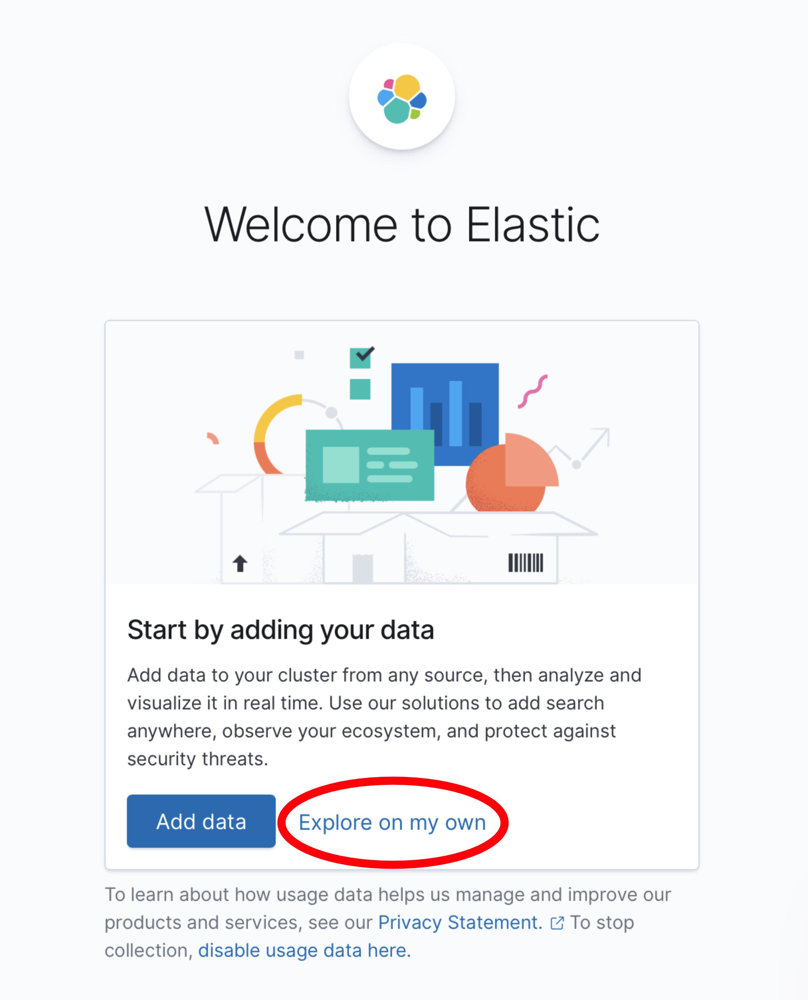

    
The first time that Kibana starts, the daemon performs several optimization steps that may delay startup time. If the web page is not available immediately, wait a few minutes or check the logs with the command `sudo journalctl -u kibana`.


1.  The following dashboard interface appears. Click on the hamburger button in the left side of the top navigation to open the sidebar interface.

    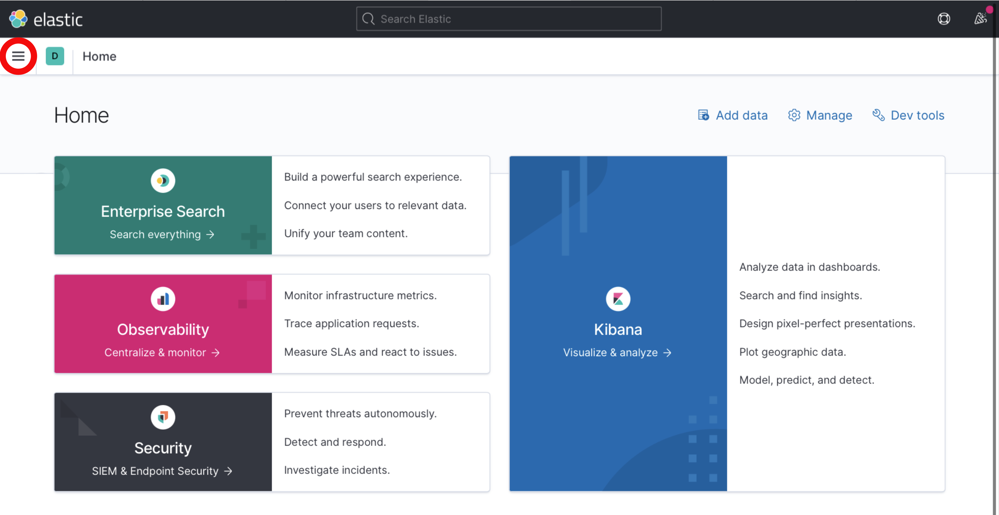

1.  Click on the **Discover** menu item in the sidebar.

    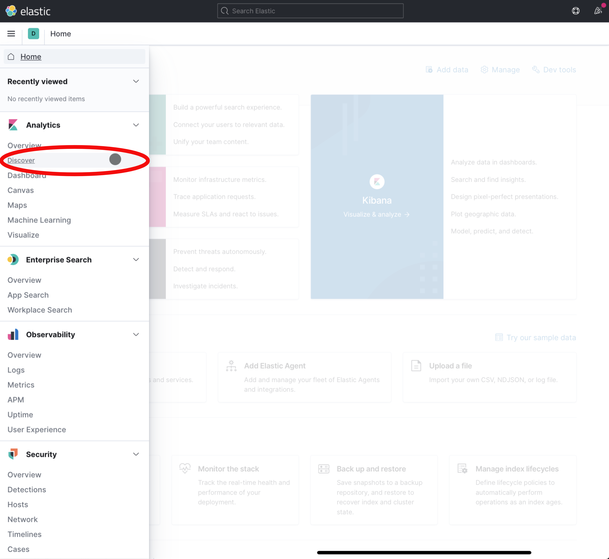

1.  Kibana prompts you to create an *index pattern*, which identifies the logs that should be retrieved. Click on the **Create index pattern** button.

    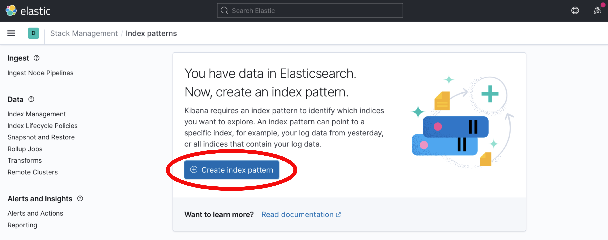

1.  The **Create index pattern** form appears. Enter the text `logstash-*` into the **Index pattern name** field. Then click the **Next step** button to continue.

    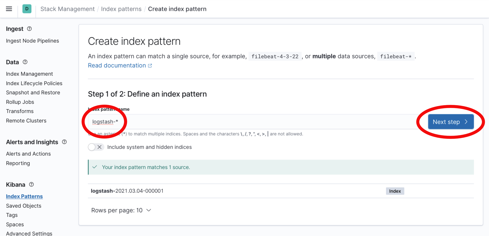

1.  From the **Time field** drop down menu, select `@timestamp` as the time field. This corresponds with the parsed time from web server logs. Click the **Create index pattern** button to continue.

    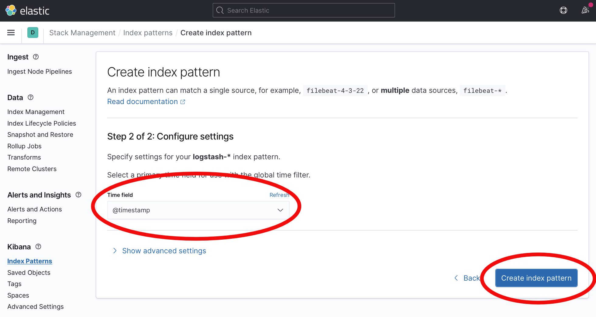

Kibana is now able to display logs stored in indices that match the `logstash-*` wildcard pattern.

## View Logs in Kibana

When the previous `curl` commands generated entries in the Apache access logs, Logstash indexed them in Elasticsearch. These are now visible in Kibana.


Logs are retrieved based upon a time window that is shown in the upper right corner of the Kibana interface. By default, this panel displays "Last 15 minutes". At certain points, you may find that log entries are not shown in the Kibana interface. If this happens, click the timespan panel and choose a wider range, such as "Last hour" or "Last 4 hours." After choosing a broad enough range of time, your logs should appear.


1. From the left menu, select the hamburger icon to expand the available menu options.

    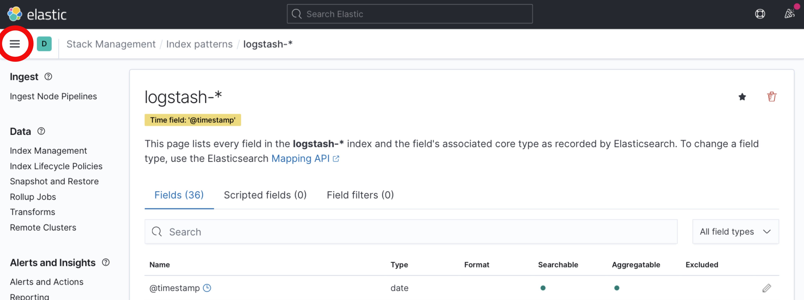

1. Select the **Discover** menu item that appears.

    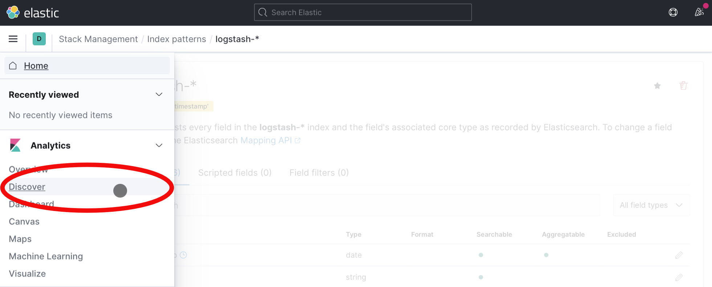

1. The Discover interface should show a timeline of log events:

    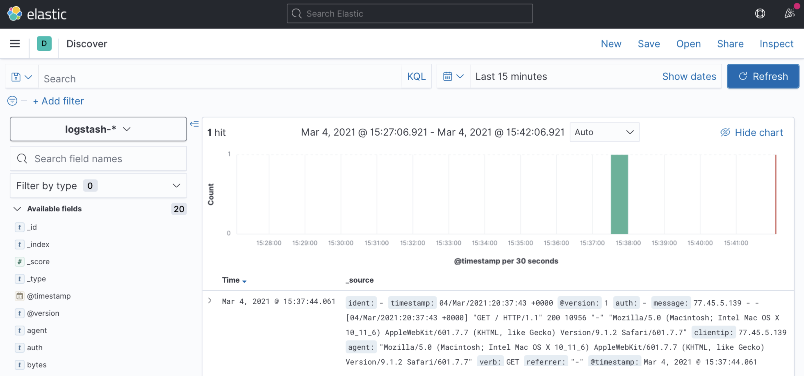

    Over time, and as other requests are made to the web server via `curl` or a browser, additional logs can be seen and searched from Kibana. The Discover tab is a good way to familiarize yourself with the structure of the indexed logs and determine what to search and analyze.

1. In order to view the details of a log entry, click the drop-down arrow to see individual document fields:

    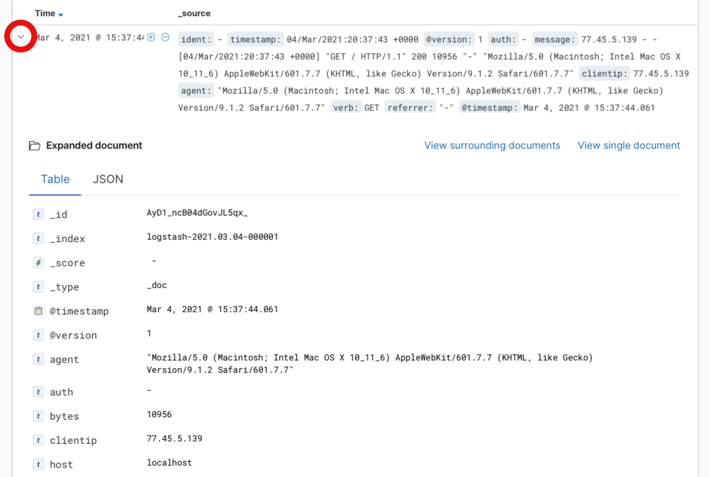

    Fields represent the values parsed from the Apache logs, such as `agent`, which represents the `User-Agent` header, and `bytes`, which indicates the size of the web server response.

## Search Logs in Kibana

1. Generate a couple of dummy 404 log events in your web server logs to demonstrate how to search and analyze logs within Kibana:

        for i in `seq 1 2` ; do curl localhost/notfound-$i ; sleep 0.2 ; done

1. The top search bar within the Kibana interface allows you to search for queries following the [Kibana Query Language](https://www.elastic.co/guide/en/kibana/current/kuery-query.html) to find results. For example, to find the 404 error requests you generated from among 200 OK requests, enter the following in the search box:

        response:404

    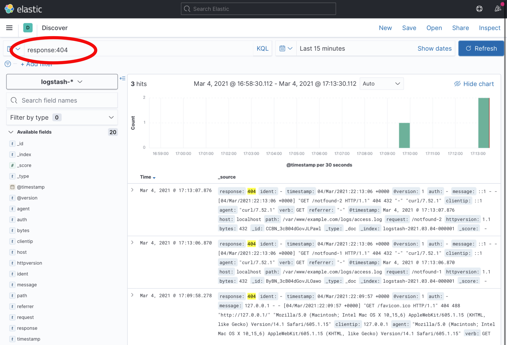

1. Then, click the **Update** button. The user interface now only returns logs that contain the "404" code in their response field.

## Visualize Logs in Kibana

Kibana supports many types of Elasticsearch queries to gain insight into indexed data. For example, consider the traffic that resulted in a "404 - not found" response code. Using [aggregations](https://www.elastic.co/guide/en/elasticsearch/reference/current/search-aggregations.html), useful summaries of data can be extracted and displayed natively in Kibana.

1. To create a visualization, begin by selecting the **Visualize** menu item from the sidebar. You may first need to expand the menu using the hamburger icon in the upper left-hand corner of the interface:

    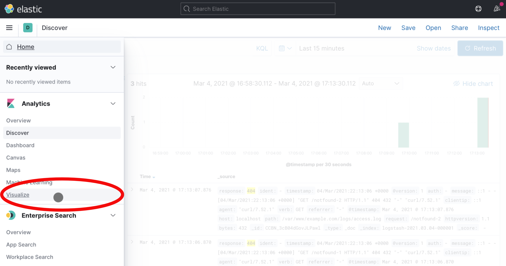

1. Then, select the **Create new visualization** button on the page that appears:

    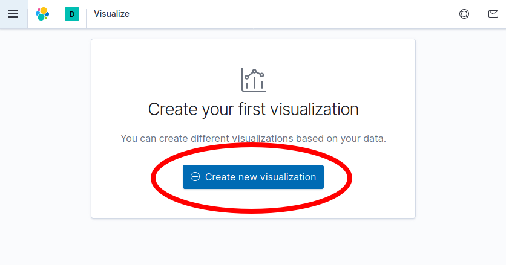

1. Select the **Aggregation based** option from the choices that appear:

    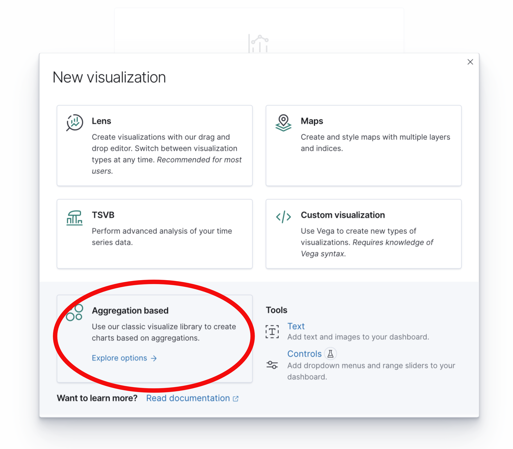

1. Select **Pie** from the choices that appear to create a new pie chart. Note that you may need to scroll down to find the **Pie** visualization:

    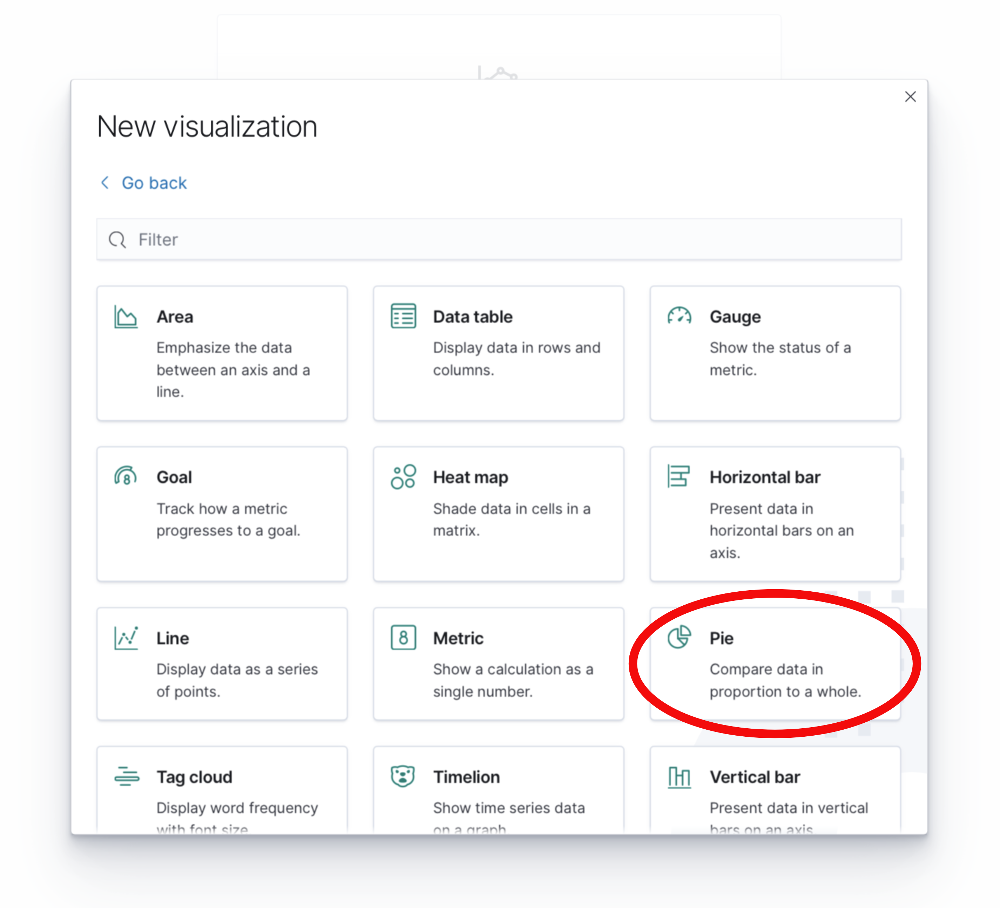

1. Then select the `logstash-*` index pattern to determine where the data for the pie chart is retrieved from:

    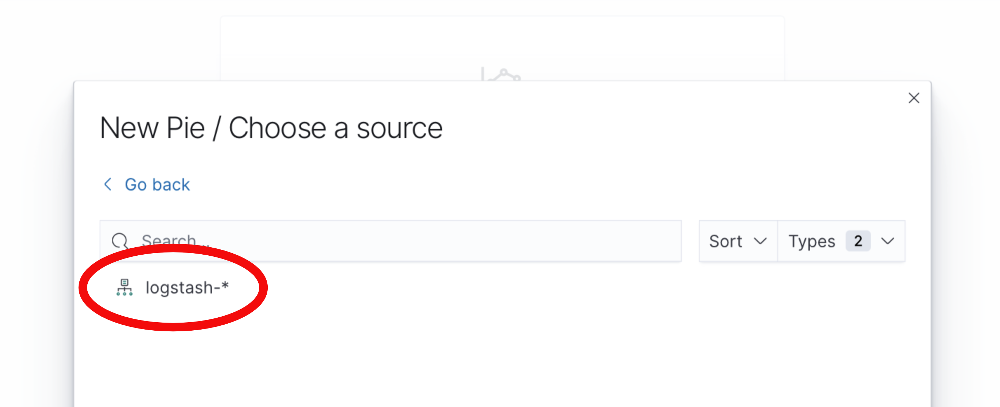

1. At this point, a pie chart should appear in the interface ready to be configured. Follow these steps to configure the visualization in the user interface pane that appears to the left of the pie chart:

    - Select **+ Add** under the **Buckets** card in the right-hand sidebar.
    - Select **Split Slices** to create more than one slice in the visualization.
    - From the **Aggregation** drop-down menu, select **Terms** to indicate that unique terms of a field are the basis for each slice of the pie chart.
    - From the **Field** drop-down menu, select `response.keyword`. This indicates that the `response` field determines the size of the pie chart slices.
    - Finally, click the **Update** button to update the pie chart and complete the visualization.

    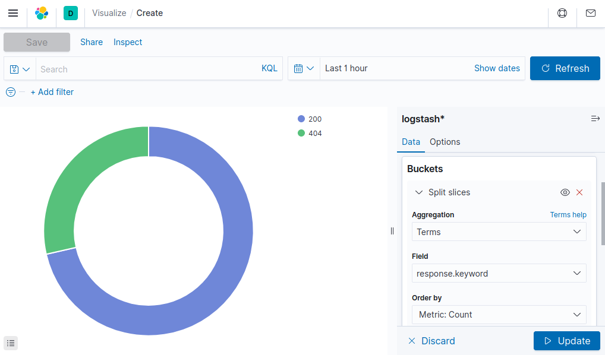

    
You may need to view a longer time span for the pie chart to show both 200 and 404 HTTP responses. This may be done by clicking the calendar icon next to the search bar and selecting a longer time period, such as "Last 1 Hour".


1. Observe that only a portion of requests have returned a 404 response code (remember to change the time span if your curl requests occurred earlier than you are currently viewing). This approach of collecting summarized statistics about the values of fields within your logs can be similarly applied to other fields, such as the http verb (GET, POST, etc.). Or, you can even create summaries of numerical data, such as the total amount of bytes transferred over a given time period.

1. If you wish to save this visualization for use later use, click the **Save** button near the top of the browser window to name the visualization and save it permanently to Elasticsearch.

## Further Reading

This tutorial has provided an overview of each piece of the Elastic stack. More reading is available to learn additional ways to process and view data. For example:

- Additional Logstash filters can enrich log data.
- Other Kibana visualizations can present data in new and useful ways.

Comprehensive documentation for each piece of the stack is available from the Elastic web site:

- The [Elasticsearch reference](https://www.elastic.co/guide/en/elasticsearch/reference/current/index.html) contains additional information regarding how to operate Elasticsearch, including clustering, managing indices, and more.
- The [Logstash documentation](https://www.elastic.co/guide/en/logstash/current/index.html) contains useful information on additional plug-ins that can further process raw data, such as geolocating IP addresses, parsing user-agent strings, and other plug-ins.
- [Kibana's documentation pages](https://www.elastic.co/guide/en/kibana/current/index.html) provide additional information regarding how to create useful visualizations and dashboards.