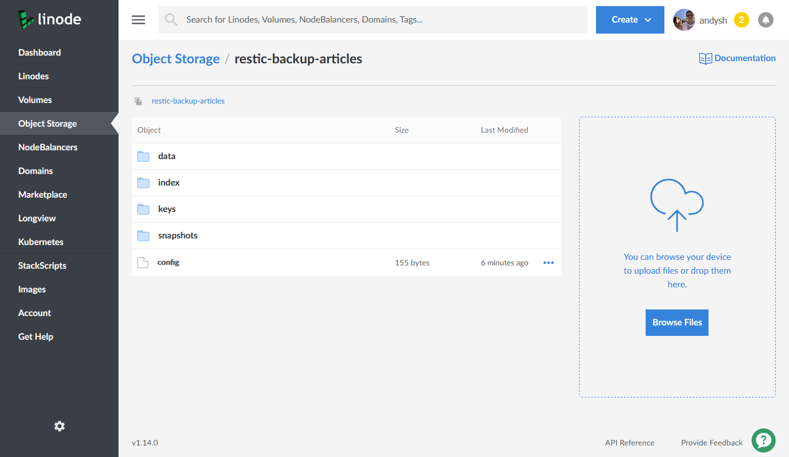

## Introduction

It is vital to have backups of your databases to allow you to restore in the event of a server fault, a user error or —worst-case— a hacking or defacing of your website or applications.

To be successful, backups should be automatic, reliable, and secure. This guide explains how to configure [Restic](https://restic.net/) on your Linode to backup your MariaDB (or MySQL) databases onto [Linode Object Storage](https://www.linode.com/products/object-storage/), so they can be recovered even if your Linode is no longer accessible.

Restic is a backup utility written in Go. It is cross-platform and works on most Linux distributions with a kernel newer than 2.6.23. Each backup is stored as a *snapshot* in a *repository*. The repository can be stored on most cloud storage providers, or even in a separate directory on your Linode (not recommended.) This guide explains how to use Linode Object Storage to hold your backup repository.


MariaDB is a fork of MySQL. Where you see a reference to *MariaDB* in this guide, it should apply to MySQL also.



The steps in this guide require root privileges, and commands are run with `sudo` unless otherwise noted. For more information on privileges, see our [Users and Groups](/docs/guides/linux-users-and-groups/) guide.


## Before You Begin

1.  If you have not already done so, create a Linode account and Compute Instance. See our [Getting Started with Linode](/docs/products/platform/get-started/) and [Creating a Compute Instance](/docs/products/compute/compute-instances/guides/create/) guides.

1.  Follow our [Setting Up and Securing a Compute Instance](/docs/products/compute/compute-instances/guides/set-up-and-secure/) guide to update your system. You may also wish to set the timezone, configure your hostname, create a limited user account, and harden SSH access.

1. Install MariaDB on your Linode by following the [How to Install MariaDB](/docs/databases/mariadb/) guide that is appropriate for your Linode's distribution.

1.  Create an Object Storage bucket to hold your backup repository. Follow the [Create a Bucket](/docs/products/storage/object-storage/guides/manage-buckets/) guide if you do not already have one.

    

1.  [Generate Object Storage access keys](/docs/products/storage/object-storage/guides/access-keys/).

1. Ensure your Linode has the `wget` and `bzip2` utilities installed. Install them with the following commands:

   **CentOS / Fedora**

       yum install wget bzip2

   **Ubuntu / Debian**

       apt install wget bzip

## Install Restic



## Create the Restic Repository



## Backup All Databases


In this section's commands, remember to replace `your-bucket-name` and `us-east-1.linodeobjects.com` with the name of your Object Storage bucket and its cluster hostname.


The mysqldump utility is used to dump the contents of a database to a file stored on your Linode. This section's example script, loops through all databases on your server and dumps each one to its own SQL file.

1. Create a file in your `/usr/local/bin` directory:

        sudo nano /usr/local/bin/backup_mariadb

1. Copy the following contents into the file:

    
#!/bin/bash
PATH="/usr/local/bin:$PATH"
source /root/restic_params
mysql --defaults-extra-file=/root/mysql_cnf -N -e 'show databases' | while read dbname; do /usr/bin/mysqldump --defaults-extra-file=/root/mysql_cnf --complete-insert "$dbname" > "/var/backups/mariadb/$dbname".sql; done
restic -r s3:us-east-1.linodeobjects.com/your-bucket-name -p /root/restic_pw backup /var/backups/mariadb


1. Make the script executable and create the folder to store the backup files (if it doesn't already exist):

        sudo chmod u+x /usr/local/bin/backup_mariadb
        sudo mkdir -p /var/backups/mariadb/

1. Line 3 of the script refers to a MySQL configuration file named `msql_cnf`, which is used to authenticate with your database. Create this file under your `/root` directory and add the username and password for your database:

        sudo nano /root/mysql_cnf

    Copy and past the contents of the example file and replace the values of `your-database-username` and `your-database-password` with your own.

    
[client]
user="your-database-username"
password="your-database-password"


1. Run your first backup using the script you created:

        sudo backup_mariadb

    You should see a similar output:

    
mysqldump: Got error: 1044: "Access denied for user 'root'@'localhost' to database 'information_schema'" when using LOCK TABLES
mysqldump: Got error: 1142: "SELECT, LOCK TABLES command denied to user 'root'@'localhost' for table 'accounts'" when using LOCK TABLES
repository 1689c602 opened successfully, password is correct

Files:           4 new,     0 changed,     0 unmodified
Dirs:            2 new,     0 changed,     0 unmodified
Added to the repo: 470.844 KiB

processed 4 files, 469.825 KiB in 0:01
snapshot 81072f28 saved


1. Verify that your backups have been created. You should see one backup file per database:

        ls -al /var/backups/mariadb

    The output displays all backup files stored in the backups directory you created:

    
total 492
drwxr-xr-x 2 root root   4096 Jul 21 19:47 .
drwxr-xr-x 3 root root   4096 Jul 21 19:46 ..
-rw-r--r-- 1 root root    830 Jul 21 19:47 information_schema.sql
-rw-r--r-- 1 root root 479441 Jul 21 19:47 mysql.sql
-rw-r--r-- 1 root root    830 Jul 21 19:47 performance_schema.sql
-rw-r--r-- 1 root root   1292 Jul 21 19:47 wordpress.sql


1. Executing the script also creates a snapshot in your Restic repository. Use Restic's `snapshot` command to view it:

        sudo /bin/bash -c "source /root/restic_params; restic -r s3:us-east-1.linodeobjects.com/your-bucket-name -p /root/restic_pw snapshots"

    Restic returns a similar output:

    
repository 1689c602 opened successfully, password is correct
ID        Time                 Host        Tags        Paths
---------------------------------------------------------------------------
81072f28  2020-07-21 19:47:19  li1356-54               /var/backups/mariadb
---------------------------------------------------------------------------
1 snapshots


## Set Up Automated Database Backups

Linux has several ways of running a job on a defined schedule. This section outlines several common methods that you can use to configure the backup script to run periodically. Read through the methods and select one that suits your needs.


When choosing how often to run your script, consider your databases' usage, how much data you could potentially lose, and the storage space required.


### Cron

System Cron jobs exist as entries in the `/etc/crontab` file. Open your systems `crontab` file for editing with the following command:

    sudo crontab -e

Add a line pointing to your backup script. This example runs the backup every hour, on the hour. See the [Schedule tasks with Cron](/docs/guides/schedule-tasks-with-cron/) article for additional scheduling options.

    0 * * * * /usr/local/bin/backup_mariadb > /tmp/mariadb-backup-log.txt 2>&1

### Systemd

Systemd can run commands (known as *units*) on a periodic basis using *timers*. You can use systemd commands to monitor when the timers and commands last ran, and the output from running the commands.

To schedule a command, you need two configuration files: the service file which includes the commands to run and a timer file which defines when to run the service.

Create the service configuration file and copy and paste the contents of the example:

    sudo nano /etc/systemd/system/backup-mariadb.service

[Unit]
Description=Backup MariaDB databases
[Service]
ExecStart=/usr/local/bin/backup_mariadb
Environment=USER=root HOME=/root


Create the timer configuration file and copy and paste the contents of the example. The `OnCalendar` line instructs Systemd when to execute the service file's commands. In the example, the service file's commands are run on-the-hour, every hour.

    sudo nano /etc/systemd/system/backup-mariadb.timer

[Unit]
Description=Backup MariaDB databases
[Timer]
OnCalendar=*-*-* *:00:00
[Install]
WantedBy=timers.target


When you are satisfied with your timer's configurations, enable the timer:

    sudo systemctl enable --now backup-mariadb.timer

You can monitor all your system's timers with the following command:

    sudo systemctl list-timers

You should see a similar output:


NEXT                        LEFT          LAST                        PASSED        UNIT                         ACTIVATES
Mon 2020-07-20 16:00:00 BST 35min left    Mon 2020-07-20 15:00:03 BST 24min ago     backup-mariadb.timer         backup-mariadb.service


The `NEXT` and `LEFT` column tells you the exact time and how long until the timer executes the service file next. The `LAST` and `PASSED` columns display information on when the timer last executed the service file.

## Finishing Up

Log into your [Linode Cloud Manager](https://cloud.linode.com/) account and view the Object Storage bucket you created to store your Restic backups. You should see a set of files like the ones displayed in the screenshot below. These files collectively make up the Restic repository; you will not see your individual database backup files.

To explore the backups and files held within the Restic repository, you must issue the `restic` command from the machine that you installed Restic on when following the steps in the [Before You Begin](#before-you-begin) section.

### Create an Alias

It can get tedious typing out the arguments to the Restic command. To make life easier for maintenance and daily management, create an alias for the command with the arguments you need.


Because the credentials that Restic uses were created under the root user's home folder, the example alias in this section only works for the root user.


In your `root` user's `.profile` file, add the lines in the example. For example, on an Ubuntu system this file is located in `/root/.profile`. To learn more about creating reusable aliases, see the [How to Add the Linux alias Command in the .bashrc File](/docs/guides/how-to-add-linux-alias-command-in-bashrc-file/) guide.

    source /root/restic_params
    alias myrestic='restic -r s3:us-east-1.linodeobjects.com/your-bucket-name -p /root/restic_pw'

After logging out of your system and back in again, you can run restic using your aliased command:

    myrestic snapshots

### Restore a Backup

Backups are not useful if you cannot restore them. It's a good idea to test out your backups once in a while. To restore the latest usable backup from Restic, run the `restore latest` command:

    restic -r s3:us-east-1.linodeobjects.com/your-bucket-name -p /root/restic_pw restore latest -t /root


The `-t` option tells Restic where to restore your backup. Restic restores your backup's files and recreates the full directory structure that existed at the time the backup was taken.

For example, consider the backup file `/var/backups/mariadb/wordpress.sql`. Restoring a backup containing this file to a target of `/home/myuser` results in the file being restored as:

    /home/myuser/var/backups/mariadb/wordpress.sql


To restore a backup from a particular point-in-time, issue the example command to find the snapshot ID for the specific backup.

    sudo /bin/bash -c "source /root/restic_params; restic -r s3:us-east-1.linodeobjects.com/your-bucket-name -p /root/restic_pw snapshots"

The output resembles the example, where the first column displays the snapshot ID:


repository 1689c602 opened successfully, password is correct
ID        Time                 Host        Tags        Paths
---------------------------------------------------------------------------
81072f28  2020-07-21 19:47:19  li1356-54               /var/backups/mariadb
---------------------------------------------------------------------------
1 snapshots


Pass the selected ID to the restore command instead of `latest`. Replace `81072f28` in the example with your own snapshot ID:

    sudo /bin/bash -c "source /root/restic_params; restic -r s3:us-east-1.linodeobjects.com/your-bucket-name -p /root/restic_pw restore 81072f28 -t /root"

The above commands restore all databases taken in the backup. If you only want a selected backup, pass the filename using the `-i` option, along with either `latest` or the snapshot ID:

    sudo /bin/bash -c "source /root/restic_params; restic -r s3:us-east-1.linodeobjects.com/your-bucket-name -p /root/restic_pw restore 81072f28 -i wordpress.sql -t /root"

### Maintain your Repository

Your backup repository's size can grow very quickly, especially if you backup a large database every hour.

Restic can automatically clean-up your backup snapshots according to a flexible policy using [snapshot policies](https://restic.readthedocs.io/en/stable/060_forget.html#removing-snapshots-according-to-a-policy).

Consider automatically running a policy using the `forget` command on a frequent basis (e.g. daily) to keep your backup repository's size down. Refer to the [snapshot policies](https://restic.readthedocs.io/en/stable/060_forget.html#removing-snapshots-according-to-a-policy) article for more details.


Don't forget to pass the `--prune` option to the `forget` command or the space won't actually be freed from your repository.

Pruning a repository can take significant time and stops new backups from taking place while it is being run, so it is best to run it often and non-interactively.
