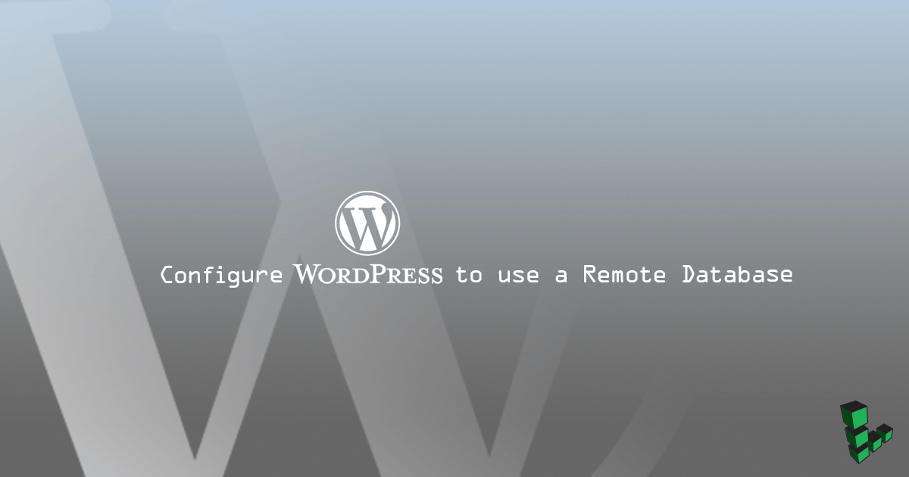
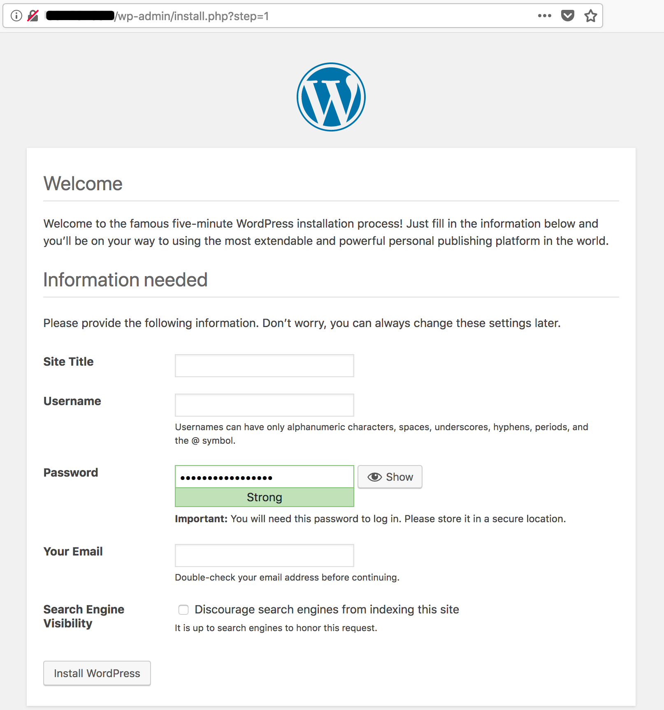

## Before You Begin

- This guide uses two Linodes in the same data center to communicate via [private IP](/docs/products/compute/compute-instances/guides/manage-ip-addresses/#adding-an-ip-address) addresses. You will need to configure a [LEMP](/docs/web-servers/lemp/) or [LAMP](/docs/web-servers/lamp/) stack on one.

- Ensure that all packages are up to date.

- Follow the [Setting Up and Securing a Compute Instance](/docs/products/compute/compute-instances/guides/set-up-and-secure/) and [Secure your Server](/docs/products/compute/compute-instances/guides/set-up-and-secure/) guides to create a non-root sudo user.

- While the steps to configure an existing database may be similar, this guide is written for a fresh database and WordPress installation. Visit our guide on how to [backup an existing database](/docs/guides/mysqldump-backups/#creating-backups-of-a-single-database).

### Variables Used in This Guide

* *Database server*: Linode on which the database is installed.
* *Web server*: Linode on which [WordPress is downloaded](/docs/guides/install-wordpress-on-ubuntu-16-04/).
* `example.com`: Your fully qualified domain name (FQDN) or IP address.
* `wordpress`: Database name.
* `wpuser`: The WordPress client database user.
* `password`: SQL database password.
* `192.0.2.100`: Database server's private IP.
* `192.0.2.255`: Web server's private IP.
* `example_user`: Local non-root sudo user.
* `203.0.113.15`: Web server's FQDN or IP.

## Install MariaDB on its Own Linode

Run these steps on the database server.

1.  Install MariaDB:

        sudo apt install mariadb-server

2.   Run the `mysql_secure_installation` script to set a root password and remove unnecessary services. Set a root password and respond `y` to all of the prompts:

        sudo mysql_secure_installation

### Accept Remote Connections



1.  Change the `bind-address` to the database server's private IP to configure the MariaDB to accept remote connections:

    
bind-address    = 192.0.2.100


2.  Restart MariaDB and allow connections to port `3306` through the firewall. This example uses UFW to automatically open the port over both IPv4 and IPv6:

        sudo systemctl restart mysql
        sudo ufw allow mysql

3.  Log in to MariaDB as root, create the database and remote user, and grant the remote user access to the database. Replace `192.0.2.255` with your web server's private IP:

        sudo mysql -u root -p
        CREATE DATABASE wordpress;
        CREATE USER 'wpuser'@'localhost' IDENTIFIED BY 'password';
        GRANT ALL PRIVILEGES ON wordpress.* TO 'wpuser'@'localhost';
        CREATE USER 'wpuser'@'192.0.2.255' IDENTIFIED BY 'password';
        GRANT ALL PRIVILEGES ON wordpress.* TO 'wpuser'@'192.0.2.255';
        FLUSH PRIVILEGES;
        exit

4.  Test the new user's local login:

        mysql -u wpuser -p
        status;
        exit

## Connect to the Remote Database from the Web Server

Run these steps on the web server.

1.  The web server should already have MariaDB installed. If it doesn't, install it. PHP-MySQL is required for WordPress:

        sudo apt update && sudo apt install mariadb-client php-mysql

2.  Test remote login with the new remote user. Replace `192.0.2.100` with the database Linode’s private IP:

        mysql -u wpuser -h 192.0.2.100 -p
        status;
        exit

    The web server can now connect to the remote database.

## Configure WordPress to Use a Remote Database

When first installed and configured through the web interface and a local database, WordPress creates a file called `wp-config.php`. Configure the initial remote database settings.

1.  Navigate to the directory to which [WordPress was extracted](/docs/guides/install-wordpress-on-ubuntu-16-04/#install-wordpress), copy the sample configuration and set it to use the remote database:

        cd /var/www/html/example.com/public_html
        sudo cp wp-config-sample.php wp-config.php

2.  Change the login variables to match the database and user. Replace `192.0.2.100` with the database server's private IP:

    
/** The name of the database for WordPress */
define('DB_NAME', 'wordpress');

/** MySQL database username */
define('DB_USER', 'wpuser');

/** MySQL database password */
define('DB_PASSWORD', 'password');

/** MySQL hostname */
define('DB_HOST', '192.0.2.100');


### Add Security Keys to Secure wp-admin Logins

Use the [WordPress Security Key Generator](https://api.wordpress.org/secret-key/1.1/salt/) to create randomized, complicated hashes that WordPress will use to encrypt login data. Copy the result and replace the matching section in `wp-config.php`:


/**#@+
 * Authentication Unique Keys and Salts.
 *
 * Change these to different unique phrases!
 * You can generate these using the {@link https://api.wordpress.org/secret-key/1.1/salt/ WordPress.org secret-key service}
 * You can change these at any point in time to invalidate all existing cookies. This will force all users to have to log in again.
 *
 * @since 2.6.0
 */
define('AUTH_KEY',         'put your unique phrase here');
define('SECURE_AUTH_KEY',  'put your unique phrase here');
define('LOGGED_IN_KEY',    'put your unique phrase here');
define('NONCE_KEY',        'put your unique phrase here');
define('AUTH_SALT',        'put your unique phrase here');
define('SECURE_AUTH_SALT', 'put your unique phrase here');
define('LOGGED_IN_SALT',   'put your unique phrase here');
define('NONCE_SALT',       'put your unique phrase here');
/**#@-*/


## Secure WordPress Database Traffic with SSL

1.  **On the web server**

    Create a directory to receive the certificates created in this section:

        mkdir ~/certs

2.  **On the database server**

    Create and switch to a directory for generating keys and certificates:

        mkdir ~/certs && cd ~/certs

3.  Generate a CA key and create the certificate and private key. Respond to the prompts as appropriate. The key in this example expires in 100 years. Change the `-days 36500` value in this and the following steps to set the certificates to expire as needed:

        sudo openssl genrsa 4096 > ca-key.pem
        sudo openssl req -new -x509 -nodes -days 36500 -key ca-key.pem -out cacert.pem

    
You are about to be asked to enter information that will be incorporated
into your certificate request.
What you are about to enter is what is called a Distinguished Name or a DN.
There are quite a few fields but you can leave some blank
For some fields there will be a default value,
If you enter '.', the field will be left blank.
-----
Country Name (2 letter code) [AU]:US
State or Province Name (full name) [Some-State]:PA
Locality Name (eg, city) []:Phila
Organization Name (eg, company) [Internet Widgits Pty Ltd]:
Organizational Unit Name (eg, section) []:
Common Name (e.g. server FQDN or YOUR name) []:MariaDB
Email Address []:


4.  Create a server certificate and write the RSA key. The `Common Name` should be your web server's FQDN or IP address:

        sudo openssl req -newkey rsa:4096 -days 36500 -nodes -keyout server-key.pem -out server-req.pem

    
Generating a 4096 bit RSA private key
......................+++
.............................+++
writing new private key to 'server-key.pem'
-----
You are about to be asked to enter information that will be incorporated
into your certificate request.
What you are about to enter is what is called a Distinguished Name or a DN.
There are quite a few fields but you can leave some blank
For some fields there will be a default value,
If you enter '.', the field will be left blank.
-----
Country Name (2 letter code) [AU]:US
State or Province Name (full name) [Some-State]:PA
Locality Name (eg, city) []:Phila
Organization Name (eg, company) [Internet Widgits Pty Ltd]:
Organizational Unit Name (eg, section) []:
Common Name (e.g. server FQDN or YOUR name) []:203.0.113.15
Email Address []:

Please enter the following 'extra' attributes
to be sent with your certificate request
A challenge password []:
An optional company name []:


        sudo openssl rsa -in server-key.pem -out server-key.pem

5.  Sign the certificate:

        sudo openssl x509 -req -in server-req.pem -days 36500 -CA cacert.pem -CAkey ca-key.pem -set_serial 01 -out server-cert.pem

6.  Move the keys and certificate to a permanent location:

        sudo mkdir /etc/mysql/ssl
        sudo mv *.* /etc/mysql/ssl && cd /etc/mysql/ssl

7.  Generate a client key. Respond to the prompts as appropriate and set the `Common Name` to your web server's FQDN or IP address:

        sudo openssl req -newkey rsa:2048 -days 36500 -nodes -keyout client-key.pem -out client-req.pem

    
Generating a 4096 bit RSA private key
....................+++
............................................................................................+++
writing new private key to 'client-key.pem'
-----
You are about to be asked to enter information that will be incorporated
into your certificate request.
What you are about to enter is what is called a Distinguished Name or a DN.
There are quite a few fields but you can leave some blank
For some fields there will be a default value,
If you enter '.', the field will be left blank.
-----
Country Name (2 letter code) [AU]:US
State or Province Name (full name) [Some-State]:PA
Locality Name (eg, city) []:Phila
Organization Name (eg, company) [Internet Widgits Pty Ltd]:
Organizational Unit Name (eg, section) []:
Common Name (e.g. server FQDN or YOUR name) []:203.0.113.15
Email Address []:

Please enter the following 'extra' attributes
to be sent with your certificate request
A challenge password []:
An optional company name []:


8.  Write the RSA key:

        sudo openssl rsa -in client-key.pem -out client-key.pem

9.  Sign the client certificate:

        sudo openssl x509 -req -in client-req.pem -days 36500 -CA cacert.pem -CAkey ca-key.pem -set_serial 01 -out client-cert.pem

10.  Verify the certificates:

        openssl verify -CAfile cacert.pem server-cert.pem client-cert.pem

11. Configure the MariaDB server to use the certificates. Find the following lines and remove the `#` to uncomment the certificate locations. Modify the paths to match:

    
ssl-ca=/etc/mysql/ssl/cacert.pem
ssl-cert=/etc/mysql/ssl/server-cert.pem
ssl-key=/etc/mysql/ssl/server-key.pem


12. Log in to MariaDB and require SSL for all logins to the database. Replace `192.0.2.255` with the web server Linode's private IP:

        sudo mysql -u root -p
        GRANT ALL PRIVILEGES ON wordpress.* TO 'wpuser'@'192.0.2.255' REQUIRE SSL;
        FLUSH PRIVILEGES;
        exit

13. Restart MariaDB:

        sudo systemctl restart mysql

14. Copy the certificates and key to the web server. Replace `example_user` with the web server's user and `192.0.2.255` with the web server's private IP:

        scp cacert.pem client-cert.pem client-key.pem example_user@192.0.2.255:~/certs

**On the web server**

1.  Create the directory and move the certificates and key to `/etc/mysql/ssl`:

        sudo mkdir /etc/mysql/ssl && sudo mv ~/certs/*.* /etc/mysql/ssl

2.  Configure the web server's MariaDB client to use SSL. Find the `[mysql]` section and add locations for the certificates and key:

    
[mysql]
ssl-ca=/etc/mysql/ssl/cacert.pem
ssl-cert=/etc/mysql/ssl/client-cert.pem
ssl-key=/etc/mysql/ssl/client-key.pem


    
If the web server uses MySQL you can find the configuration file in `/etc/mysql/mysql.conf.d/mysqld.cnf`.


3.  Log in to the remote database to test the login over SSL:

        mysql -u wpuser -h 192.0.2.100 -p

4.  Check the status:

        status;

5.  Exit MariaDB:

        exit

6.  Add a directive before the remote database information in `wp-config` which forces WordPress to use SSL for the database connection:

    
...
define( 'MYSQL_CLIENT_FLAGS', MYSQLI_CLIENT_SSL );

/** The name of the database for WordPress */
define('DB_NAME', 'wordpress');

/** MySQL database username */
define('DB_USER', 'wpuser');

/** MySQL database password */
define('DB_PASSWORD', 'password');

/** MySQL hostname */
define('DB_HOST', '192.0.2.100');
...


## Complete the WordPress Installation

Access the WordPress installation interface through `wp-admin`. Use a browser to navigate to `example.com/wp-admin`. If the database connection is successful, you'll see the installation screen:

## Next Steps

Now that the database is configured to communicate over a secure connection, consider using SSL/TLS for the web server itself. Our guide covering [TLS on NGINX](/docs/guides/getting-started-with-nginx-part-3-enable-tls-for-https/) details some best practices for securing NGINX and web servers in general. Visit the [SSL Certificates](/docs/security/ssl/) section of Linode Docs for information on other servers and Linux distributions.
