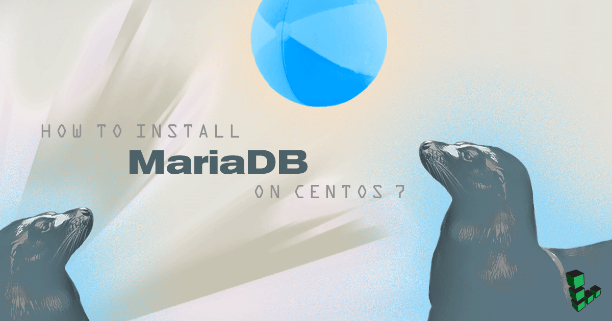

MariaDB is a fork of the popular cross-platform MySQL database management system and is considered a full [drop-in replacement](https://mariadb.com/kb/en/mariadb/mariadb-vs-mysql-features/) for MySQL. MariaDB was created by one of MySQL's original developers in 2009 after MySQL was acquired by Oracle during the Sun Microsystems merger. Today MariaDB is maintained and developed by the [MariaDB Foundation](https://mariadb.org/en/foundation/) and community contributors with the intention of it remaining GNU GPL software.

MariaDB replaced MySQL as the default database system in the CentOS 7 repositories. Though installing MySQL into CentOS 7 is not difficult see, [install mysql CentOS 7](/docs/guides/how-to-install-mysql-on-centos-7/), if you simply need a database MariaDB is recommended for official support and a minimal chance of incompatibilities with other repository software.


This guide is written for a non-root user. Commands that require elevated privileges are prefixed with `sudo`. If you're not familiar with the `sudo` command, you can check our [Users and Groups](/docs/guides/linux-users-and-groups/) guide.


## Before You Begin

1.  If you have not already done so, create a Linode account and Compute Instance. See our [Getting Started with Linode](/docs/products/platform/get-started/) and [Creating a Compute Instance](/docs/products/compute/compute-instances/guides/create/) guides.

1.  Follow our [Setting Up and Securing a Compute Instance](/docs/products/compute/compute-instances/guides/set-up-and-secure/) guide to update your system and configure the hostname. You may also wish to set the timezone, configure your hostname, create a limited user account, and harden SSH access.

    To check your hostname run:

        hostname
        hostname -f

    The first command should show your short hostname, and the second should show your fully qualified domain name (FQDN).

## Install and Start MariaDB

    sudo yum install mariadb-server

Enable MariaDB to start on boot and then start the service:

    sudo systemctl enable mariadb
    sudo systemctl start mariadb

MariaDB will bind to localhost (127.0.0.1) by default. For information on connecting to a remote database using SSH, see our [MySQL remote access guide](/docs/guides/create-an-ssh-tunnel-for-mysql-remote-access/), which also applies to MariaDB.


Allowing unrestricted access to MariaDB on a public IP not advised but you may change the address it listens on by modifying the `bind-address` parameter in `/etc/my.cnf`. If you decide to bind MariaDB to your public IP, you should implement firewall rules that only allow connections from specific IP addresses.


## Harden MariaDB Server

1.  Run the `mysql_secure_installation` script to address several security concerns in a default MariaDB installation:

        sudo mysql_secure_installation

You will be given the choice to change the MariaDB root password, remove anonymous user accounts, disable root logins outside of localhost, and remove test databases. It is recommended that you answer `yes` to these options. You can read more about the script in the [MariaDB Knowledge Base](https://mariadb.com/kb/en/mariadb/mysql_secure_installation/).

## Using MariaDB

The standard tool for interacting with MariaDB is the `mariadb` client, which installs with the `mariadb-server` package. The MariaDB client is used through a terminal.

### Root Login

1.  To log in to MariaDB as the root user:

        mysql -u root -p

2.  When prompted, enter the root password you assigned when the `mysql_secure_installation` script was run.

    You'll then be presented with a welcome header and the MariaDB prompt as shown below:

        MariaDB [(none)]>

3.  To generate a list of commands for the MariaDB prompt, enter `\h`. You'll then see:

        List of all MySQL commands:
        Note that all text commands must be first on line and end with ';'
        ?         (\?) Synonym for `help'.
        clear     (\c) Clear the current input statement.
        connect   (\r) Reconnect to the server. Optional arguments are db and host.
        delimiter (\d) Set statement delimiter.
        edit      (\e) Edit command with $EDITOR.
        ego       (\G) Send command to mysql server, display result vertically.
        exit      (\q) Exit mysql. Same as quit.
        go        (\g) Send command to mysql server.
        help      (\h) Display this help.
        nopager   (\n) Disable pager, print to stdout.
        notee     (\t) Don't write into outfile.
        pager     (\P) Set PAGER [to_pager]. Print the query results via PAGER.
        print     (\p) Print current command.
        prompt    (\R) Change your mysql prompt.
        quit      (\q) Quit mysql.
        rehash    (\#) Rebuild completion hash.
        source    (\.) Execute an SQL script file. Takes a file name as an argument.
        status    (\s) Get status information from the server.
        system    (\!) Execute a system shell command.
        tee       (\T) Set outfile [to_outfile]. Append everything into given outfile.
        use       (\u) Use another database. Takes database name as argument.
        charset   (\C) Switch to another charset. Might be needed for processing binlog with multi-byte charsets.
        warnings  (\W) Show warnings after every statement.
        nowarning (\w) Don't show warnings after every statement.

        For server side help, type 'help contents'

        MariaDB [(none)]>

### Create a New MariaDB User and Database
1. In the example below, `testdb` is the name of the database, `testuser` is the user, and `password` is the user's password:

        create database testdb;
        create user 'testuser'@localhost identified by 'password';
        grant all on testdb.* to 'testuser' identified by 'password';

    You can shorten this process by creating the user *while* assigning database permissions:

        create database testdb;
        grant all on testdb.* to 'testuser' identified by 'password';

2.  Then exit MariaDB:

        exit

### Create a Sample Table

1.  Log back in as `testuser`:

        mysql -u testuser -p

2.  Create a sample table called `customers`. This creates a table with a customer ID field of the type `INT` for integer (auto-incremented for new records, used as the primary key), as well as two fields for storing the customer's name:

        use testdb;
        create table customers (customer_id INT NOT NULL AUTO_INCREMENT PRIMARY KEY, first_name TEXT, last_name TEXT);

3.  View the new table:

        show tables;

3.  Then exit MariaDB:

        exit

## Reset the MariaDB Root Password

If you forget your root MariaDB password, it can be reset.

1.  Stop the current MariaDB server instance, then restart it with an option to not ask for a password:

        sudo systemctl stop mariadb
        sudo mysqld_safe --skip-grant-tables &

2.  Reconnect to the MariaDB server with the MariaDB root account:

        mysql -u root

3.  Use the following commands to reset root's password. Replace `password` with a strong password:

        use mysql;
        update user SET PASSWORD=PASSWORD("password") WHERE USER='root';
        flush privileges;
        exit

4.  Then restart MariaDB:

        sudo systemctl start mariadb
