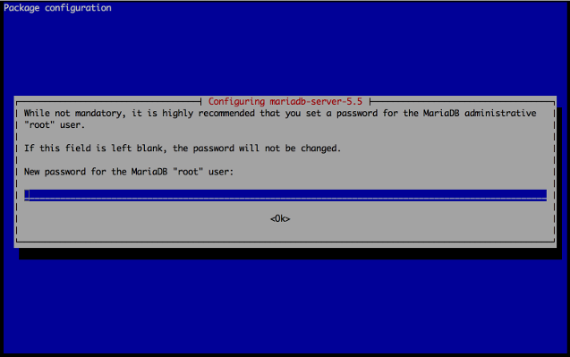

## What is MariaDB?

MariaDB is a drop-in replacement for MySQL. It strives to be the logical choice for database professionals looking for a robust, scalable and reliable SQL Server. This guide will help beginners install and configure MariaDB on Debian 9 (Stretch).

 
The steps required in this guide require root privileges. Be sure to run the steps below as `root` or with the **sudo** prefix. For more information on privileges see our [Users and Groups](/docs/guides/linux-users-and-groups/) guide.


## Install MariaDB

In this section, you will install MariaDB and set the password for the MariaDB root user. MariaDB maintains a shell script that automatically sets up the necessary package repositories.

1.  Update your system and install dependencies:

        apt update && apt upgrade
        apt install dirmngr

2.  Add the MariaDB signing key:

        apt-key adv --recv-keys --keyserver hkp://keyserver.ubuntu.com:80 0xF1656F24C74CD1D8

3.  Download and execute the script:

        curl -sS https://downloads.mariadb.com/MariaDB/mariadb_repo_setup | sudo bash

4.  Update your sources list:

        apt update

5.  Install MariaDB:

        apt install mariadb-server

    You will be prompted to set a password for the MariaDB root user:

    

    Choose a strong password to secure your server.

After installation, Debian will start the MariaDB server and also set the service to start automatically on reboot.

## Using MariaDB

In this section you will learn how to connect to MariaDB and perform basic SQL commands.

1.  The standard tool for interacting with MariaDB is the MySQL client. To get started, issue the following command to connect to MariaDB as the root user:

        mysql -u root -p

    When prompted, enter the root password you set when you installed MariaDB. You'll see output like the following:

        Welcome to the MariaDB monitor.  Commands end with ; or \g.
        Your MariaDB connection id is 30
        Server version: 5.5.37-MariaDB-1~wheezy-log mariadb.org binary distribution

        Copyright (c) 2000, 2014, Oracle, Monty Program Ab and others.

        Type 'help;' or '\h' for help. Type '\c' to clear the current input statement.

        MariaDB [(none)]>

    Note the `(none)` text in the MariaDB prompt. It will be used to display the current working database. Since you haven't selected any database yet, it is displayed as `(none)`.

2.  Create a sample database, to be populated with sample data. Use the following commands to create a database named **testdb**, which is owned by a new user **testuser**. These commands also set the password **secretpassword** for the new user:

        CREATE DATABASE testdb;
        CREATE USER 'testuser'@'localhost' IDENTIFIED BY 'password';
        GRANT ALL PRIVILEGES ON testdb.* TO testuser@localhost;
        FLUSH PRIVILEGES;
        quit

    The final line logs out the root user from MariaDB.

3.  Log in to MariaDB as **testuser**:

        mysql -u testuser -p

4.  Use the database **testdb**:

        USE testdb;

5.  Databases are composed of multiple **tables**. Create a new table and populate it with sample data:

        CREATE TABLE products (id INT NOT NULL AUTO_INCREMENT PRIMARY KEY, name VARCHAR(255), price DECIMAL(6,2));
        INSERT INTO products (name, price) VALUES ('MacBook Pro', 1600.0);
        INSERT INTO products (name, price) VALUES ('Dell', 850.0);
        INSERT INTO products (name, price) VALUES ('Acer', 775.0);

6.  Verify that the new data has been inserted:

        SELECT * FROM products;

    Which should show this output:

        +----+-------------+---------+
        | id | name        | price   |
        +----+-------------+---------+
        |  1 | MacBook Pro | 1600.00 |
        |  2 | Dell        |  850.00 |
        |  3 | Acer        |  775.00 |
        +----+-------------+---------+
        3 rows in set (0.00 sec)

7.  Exit the MariaDB client by typing:

        quit

For more information about SQL commands, refer to the [SQL Commands](https://mariadb.com/kb/en/sql-commands/) page on the MariaDB Knowledge Base. To view MariaDB's command list from within the client, type:

    \h

Output:

    MariaDB [(none)]> \h

    General information about MariaDB can be found at
    http://mariadb.org

    List of all MySQL commands:
    Note that all text commands must be first on line and end with ';'
    ?         (\?) Synonym for `help'.
    clear     (\c) Clear the current input statement.
    connect   (\r) Reconnect to the server. Optional arguments are db and host.
    delimiter (\d) Set statement delimiter.
    edit      (\e) Edit command with $EDITOR.
    ego       (\G) Send command to mysql server, display result vertically.
    exit      (\q) Exit mysql. Same as quit.
    go        (\g) Send command to mysql server.
    help      (\h) Display this help.
    nopager   (\n) Disable pager, print to stdout.
    notee     (\t) Don't write into outfile.
    pager     (\P) Set PAGER [to_pager]. Print the query results via PAGER.
    print     (\p) Print current command.
    prompt    (\R) Change your mysql prompt.
    quit      (\q) Quit mysql.
    rehash    (\#) Rebuild completion hash.
    source    (\.) Execute an SQL script file. Takes a file name as an argument.
    status    (\s) Get status information from the server.
    system    (\!) Execute a system shell command.
    tee       (\T) Set outfile [to_outfile]. Append everything into given outfile.
    use       (\u) Use another database. Takes database name as argument.
    charset   (\C) Switch to another charset. Might be needed for processing binlog with multi-byte charsets.
    warnings  (\W) Show warnings after every statement.
    nowarning (\w) Don't show warnings after every statement.

    For server side help, type 'help contents'

## Configure MariaDB

To configure MariaDB to run the way you want, edit the `/etc/mysql/my.cnf` file. This file controls most of the server system variables, which you will generally want to leave at the default setting.

Whenever you make changes to `/etc/mysql/my.cnf`, restart the server by issuing the following command:

    service mysql restart

## Secure MariaDB Server

MariaDB recommends that you secure your installation by executing the following command:

    mysql_secure_installation

You will be asked to change the root password, remove anonymous users, disable root logins outside of localhost, and remove the test database. It is recommended that you answer **Y** for all questions.

## Remote User Connections

This section will demonstrate how to allow the previously created user, **testuser**, to connect to MariaDB remotely (by default, MariaDB will allow connections from only localhost).

 
Opening a MariaDB server up to the internet makes it less secure. If you need to connect from somewhere other than localhost, make sure you implement [firewall](/docs/guides/control-network-traffic-with-iptables/) rules that allow connections only from specific IP addresses.


1.  Log in to MariaDB as root:

        mysql -u root -p

2.  Allow **testuser** to connect from remote hosts:

        GRANT ALL PRIVILEGES ON testdb.* TO testuser@'%' IDENTIFIED BY 'secretpassword';
        FLUSH PRIVILEGES;
        quit

3.  Configure MariaDB to listen to all network interfaces. Open the `/etc/mysql/my.cnf` file and edit the `bind-address` variable to listen to all network interfaces:

    
[mysqld]

bind-address = 0.0.0.0


4.  Restart the server:

        service mysql restart

5.  Test the connection from your local computer to the MariaDB server, replacing **testuser** with your username, and **example.com** with your domain or IP address:

        mysql -u testuser -h example.com -p

    If the login is successful, you should see the MariaDB welcome message and the shell prompt.

## Tune MariaDB

MySQL Tuner is a useful tool that connects to a running instance of MariaDB and provides configuration recommendations based on workload. You should let your MariaDB instance run for at least 24 hours before running the tuner. The longer the instance has been running, the better advice the tuner will provide.

1.  Install MySQL Tuner by issuing the following command:

        apt install mysqltuner

2.  Run MySQL tuner with the following command:

        mysqltuner

## Reset MariaDB's Root Password

If you forget your root password, reset it with these steps:

1.  Stop the MariaDB server:

        systemctl restart mysql

2.  Start the server with the `skip-grant-tables` setting so you can log in to MariaDB without the password:

        mysqld_safe --skip-grant-tables --skip_networking &

3.  Now you can connect to the MariaDB server as root without a password:

        mysql -u root

4.  Within the MariaDB client, issue the following commands to reset the password for the **root** user and log out:

        FLUSH PRIVILEGES;
        USE mysql;
        ALTER USER 'root'@'localhost' IDENTIFIED BY 'new_password';
        FLUSH PRIVILEGES;
        quit

5.  Restart the MariaDB server:

        service mysql restart

6.  Connect to the MariaDB server using your new password:

        mysql -u root -p
