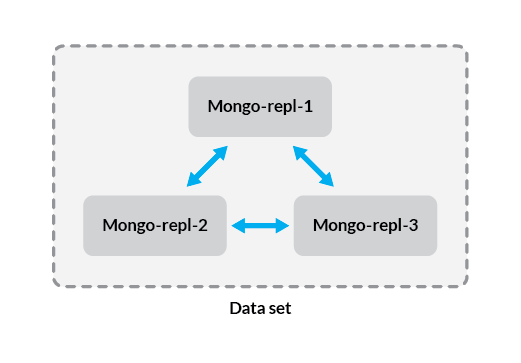

In this guide, you'll learn how to create a MongoDB *replica set*. A replica set is a cluster of MongoDB database servers that implements master-slave (primary-secondary) replication. Replica sets also fail over automatically, so if one of the members becomes unavailable, a new primary host is elected and your data is still accessible. When combined with sharded database clusters, replica sets allow you to create scalable, highly available database systems for use with growing datasets.

This guide has been tested with Ubuntu 16.04 and CentOS 7. Because most of the configuration is done within the MongoDB application, the steps should not vary significantly among other distributions, but additional configuration may be required.

## Before You Begin

1.  If you have not already done so, create a Linode account and *at least 3* Compute Instances. See our [Getting Started with Linode](/docs/products/platform/get-started/) and [Creating a Compute Instance](/docs/products/compute/compute-instances/guides/create/) guides.

1.  Follow our [Setting Up and Securing a Compute Instance](/docs/products/compute/compute-instances/guides/set-up-and-secure/) guide to update your system. You may also wish to set the timezone, configure your hostname, create a limited user account, and harden SSH access.

1.  Follow the guide on how to install MongoDB for your distribution. See [MongoDB guides](/docs/databases/mongodb/)


This guide is written for a non-root user. Commands that require elevated privileges are prefixed with `sudo`. If you’re not familiar with the `sudo` command, see the [Users and Groups](/docs/guides/linux-users-and-groups/) guide.


## Configure Networking

To allow for consistent replication, each node will need to communicate with all the others in the cluster. For example, in a three node set, data transfer will look like this:

There are two major ways to allow the members of your replica set to communicate.

The first method is to use [private IP addresses](/docs/products/compute/compute-instances/guides/manage-ip-addresses/#adding-an-ip-address) for each member of the replica set. This allows the Linodes in your replica set to communicate without exposing your data to the public internet. This method is recommended, but note that it requires all members of the replica set be in the same data center.

The second method is to simply use the public IP address assigned to each Linode. You'll need to use this method if your Linodes are located in different data centers, although this is not recommended because network latency will have a negative impact on replication. If you must use public IP addresses, you should [configure SSL/TLS encryption](https://docs.mongodb.com/manual/tutorial/configure-ssl/) for data sent between your hosts, or configure them to communicate over a VPN.

Whether you're using public or private IP addresses to send data, you'll need to secure each Linode with a [firewall](/docs/security/firewalls/) before deploying your replica set into production.

### Configure Hosts Files

Each member of your replica set should have a hostname that identifies it as a member of the set. This way, you'll be able to keep your infrastructure organized at scale (for example, if you add more replica sets). In order to simplify the configuration of your replica set, add the following lines to the `/etc/hosts` file on each member of the replica set:


192.0.2.1    mongo-repl-1
192.0.2.2    mongo-repl-2
192.0.2.3    mongo-repl-3



If you're using more than three Linodes, add all of your hosts at this stage. Replace the hostnames with your actual hostnames, and the IP addresses with the IP addresses of your Linodes.


These hostnames are only given as examples, but we'll use these names throughout this guide to refer to members of the replica set. When you see one of these names in a command or configuration file, substitute your own hostname if applicable.


## Set Up MongoDB Authentication

In this section you'll create a key file that will be used to secure authentication between the members of your replica set. While in this example you'll be using a key file generated with `openssl`, MongoDB recommends using an [X.509 certificate](https://docs.mongodb.com/manual/core/security-x.509/) to secure connections between production systems.

### Generate a Key file

1.  Issue this command to generate your key file:

        openssl rand -base64 756 > mongo-keyfile

2.  The rest of the steps in this section should be performed on each member of the replica set, so that they all have the key file located in the same directory, with identical permissions. Create the `/opt/mongo` directory to store your key file:

        sudo mkdir /opt/mongo

3.  Assuming that your key file is under the home directory for your user, move it to `/opt/mongo`, and assign it the correct permissions:

        sudo mv ~/mongo-keyfile /opt/mongo
        sudo chmod 400 /opt/mongo/mongo-keyfile

         Ensure that you copy the same generated key, to each member of your replica set in the `mongo-keyfile` file under `/opt/mongo`.
        

4.  Update the ownership of your key file, so that it belongs to the MongoDB user. Use the appropriate command for your distribution:

    **Ubuntu / Debian:**

        sudo chown mongodb:mongodb /opt/mongo/mongo-keyfile

    **CentOS:**

        sudo chown mongod:mongod /opt/mongo/mongo-keyfile

### Create an Administrative User

1.  On the Linode that you intend to use as the *primary* member of your replication set, log in to the `mongo` shell:

        mongosh

2.  Connect to the `admin` database:

        use admin

3.  Create an administrative user with `root` privileges. Replace "password" with a strong password of your choice:

        db.createUser({user: "mongo-admin", pwd: "password", roles:[{role: "root", db: "admin"}]})

## Configure MongoDB

On each of your Linodes, make the following changes to your `/etc/mongod.conf` file:


net:
  port: 27017
  bindIp: 127.0.0.1,192.0.2.1

security:
  keyFile: /opt/mongo/mongo-keyfile

replication:
  replSetName: rs0



The `port` value of 27017 is the default. If you have reason to use a different port you may do so, but the rest of this guide will use the default. The `bindIp` directive specifies the IP address on which the MongoDB daemon will listen, and since we're connecting several hosts, this should be the IP address that corresponds with the Linode on which you're configuring it (the same address added to the hosts files in the previous section). Leaving the default of `127.0.0.1` allows you to connect locally as well, which may be useful for testing replication.

Uncomment the `security` section, and use the `keyFile` option to direct MongoDB to the key you created previously. Enabling `keyFile` authentication automatically enables [role-based access control](https://docs.mongodb.com/manual/core/authorization/) as well, so you will need to [create users](/docs/guides/install-mongodb-on-ubuntu-16-04/#create-database-users) and assign them privileges to access specific databases.

The `replication` section needs to be uncommented to be enabled. Directives in this section are what directly affect the configuration of your replica set. The value `rs0` is the name we're using for our replica set; you can use a different naming convention if you like, but we'll be using `rs0` throughout this guide.

Once you've made these changes, restart the `mongod` service:

    sudo systemctl restart mongod

## Start Replication and Add Members

1.  Connect via SSH to the Linode that you intend to use as your *primary*. Once you're logged in, connect to the MongoDB shell using the [administrative user](#create-an-administrative-user) you created previously:

        mongosh -u mongo-admin -p --authenticationDatabase admin

    
If your connection is refused, be sure that the address for localhost (`127.0.0.1`) is included in your configuration's `bindIp` value.


2.  From the `mongo` shell, initiate the replica set:

        rs.initiate()

    This command initiates a replica set with the current host as its only member. This is confirmed by the output, which should resemble the following:

    
{
    "info2" : "no configuration specified. Using a default configuration for the set",
    "me" : "192.0.2.1:27017",
    "ok" : 1
}


3.  While still connected to the `mongo` shell, add the other hosts to the replica set:

        rs.add("mongo-repl-2")
        rs.add("mongo-repl-3")

    If you configured other members for your replica set, add them using the same command and the hostnames you set in your `/etc/hosts` file.

4.  Once all members have been added, check the configuration of your replica set:

        rs.conf()

    This will display a replica set configuration object with information about each member as well as some metadata about the replica set.

5.  If you need to do so in the future, you can also check the status of your replica set:

        rs.status()

    This shows the state, uptime, and other data about the set.

## Test Replication

At this stage, your replica set is fully functional and ready to use. The steps in this section are optional, but if you'd like a visual confirmation that your replication is working, you can follow along.

1.  Connect to the `mongo` as the administrative user, on the primary member of your replica set. This is usually the Linode from which you initiated the set, but if you're not sure, you can check the output of `rs.status()` from any of the members.

2.  Enter test data:

        use exampleDB
        for (var i = 0; i <= 10; i++) db.exampleCollection.insert( { x : i } )

    The first command creates a database called `exampleDB`, and the second command generates 20 simple documents, which are then inserted into a collection called `exampleCollection`.

3.  If your replica set is configured properly, the data should be present on your secondary members as well as the primary. To test this, connect to the `mongo` shell with the administrative user on one of your secondary members, and run:

        db.getMongo().setSlaveOk()

    This command enables secondary member read operations on a per-connection basis, so be sure to disconnect before you deploy your replica set into production. By default, read queries are not allowed on secondary members to avoid problems with your application retrieving stale data. This can become an issue when your database is undergoing more complex queries at a higher load, but because of the relatively simple test data we wrote, this is not an issue here.

    However, changing the overall read preference can have benefits in some cases. For more information, see the official [MongoDB documentation](https://docs.mongodb.com/manual/core/read-preference/).

4.  Before running the command in the previous step, any read operations, including simple ones like `show dbs` and `show collections` would fail with an error. Now that you've enabled reading, switch to the `exampleDB` database:

        use exampleDB

    Next, run a `find()` method with no arguments to show all documents in `exampleCollection`:

        db.exampleCollection.find()

    If replication is working, you'll see a list of the sample documents we created on the primary host.

5.  Disconnect from the `mongo` shell on your secondary member:

        quit()

    If you reconnect on the secondary host in the future, you'll be unable to perform read operations unless you enable it using the command in Step 3.

## Next Steps

Replica sets can be used as standalone components of a high availability system, or as part of a [sharded database cluster](https://docs.mongodb.com/manual/core/sharded-cluster-shards/). For larger datasets, a cluster allows you to distribute data across many database servers or replica sets and route queries to them based on criteria you specify. For more information on how to create a sharded cluster, see our guide on [building database clusters with MongoDB](/docs/guides/build-database-clusters-with-mongodb/).
