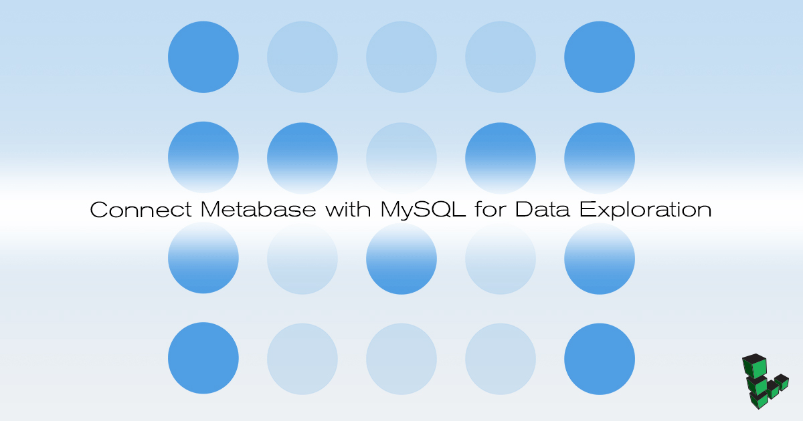

## What is Metabase

Metabase provides an interface to query data on your browser. In addition to supporting SQL querying, Metabase offers functionality to analyze data without SQL, create dashboards, and track metrics. This guide shows how to connect MySQL to Metabase then deploy on NGINX through a reverse proxy.

There are a number of additional databases that are supported from SQLite to PostgreSQL. Visualizing results become very simple through an intuitive interface. This makes Metabase versatile for sharing data even among those without an analytical background.

## Install Metabase

### Java Runtime Environment



### MySQL Server

1.  Download MySQL Server. Enter a root password when specified:

        sudo apt install mysql-server

2.  Log in as the root user:

        mysql -u root -p

3.  Create a database and user for Metabase:

        CREATE DATABASE employees;
        CREATE USER 'metabase_user' IDENTIFIED BY 'password';
        GRANT ALL PRIVILEGES ON employees.* TO 'metabase_user';
        GRANT RELOAD ON *.* TO 'metabase_user';
        FLUSH PRIVILEGES;
        quit

## Download Metabase

1.  Download the jar file from Metabase:

        wget http://downloads.metabase.com/v0.28.1/metabase.jar

2.  Move the file into `/var` so that it can start on reboot:

        sudo mv metabase.jar /var/metabase.jar

## Reverse Proxy with NGINX

1.  Install NGINX

        sudo apt install nginx

2.  Create a new NGINX configuration file with the settings below setting `server_name` with your FDQN or public IP address:

    
server {
        listen 80;
        listen [::]:80;

        server_name _;

        location / {
             proxy_pass http://localhost:3000/;
             proxy_redirect http://localhost:3000/ $scheme://$host/;
             proxy_http_version 1.1;
             proxy_set_header Upgrade $http_upgrade;
             proxy_set_header Connection "Upgrade";
        }
}


3.  Verify there are no issues with the configuration:

        sudo nginx -t

4.  Restart NGINX:

        sudo systemctl restart nginx

## Download Example MySQL Database

The [Employees Testing Database](https://github.com/datacharmer/test_db) is an example database that can be loaded into MySQL. The database consists of employee and salary data with over 2.8 million entries, this size makes it useful for experimenting in a non-trivial way.

1.  Install git:

        sudo apt install git

2.  Clone the repository containing the test database:

        git clone https://github.com/datacharmer/test_db.git

3.  Navigate into the cloned repository:

        cd test_db

4.  Load `employees.sql` into the `metabase_example` database and enter the database user password when prompted:

        mysql -u metabase_user -p employees < employees.sql

    The console will print out the tables that are loaded as well as total time to complete.

    
Enter password:
INFO
CREATING DATABASE STRUCTURE
INFO
storage engine: InnoDB
INFO
LOADING departments
INFO
LOADING employees
INFO
LOADING dept_emp
INFO
LOADING dept_manager
INFO
LOADING titles
INFO
LOADING salaries
data_load_time_diff
00:00:52


### Environment Variables

1.  Create a new text file containing the environment variables for Metabase:

    
export MB_DB_TYPE=mysql
export MB_DB_DBNAME=employees
export MB_DB_PORT=3306
export MB_DB_USER=metabase_user
export MB_DB_PASS=password
export MB_DB_HOST=localhost


2.  Load these environment variables:

        source metabase-env

## Set Metabase to Start at Reboot

1.  Check the path of your JDK binary:

        which java

    This should print a path such as `/usr/bin/java`.

1.  Create a systemd configuration file to ensure Metabase runs on start up. `ExecStart=` should set to the JDK path from above. Be sure to replace `User` with your Unix username:

    
[Unit]
Description=Metabase server
After=syslog.target
After=network.target[Service]
User=username
Type=simple

[Service]
ExecStart=/usr/bin/java -jar /var/metabase.jar
Restart=always
StandardOutput=syslog
StandardError=syslog
SyslogIdentifier=metabase

[Install]
WantedBy=multi-user.target


2.  Apply the changes:

        sudo systemctl start metabase

3.  Check that Metabase is active:

        sudo systemctl status metabase

### Firewall Rules



UFW is great for preventing unauthorized access to your database. A reasonable default is to allow port 80/443 and SSH:

    sudo ufw allow http
    sudo ufw allow https
    sudo ufw allow ssh
    sudo ufw enable

Check the firewall rules:

    sudo ufw status

## Metabase Interface

Metabase is now accessible on the browser on your Linode's public IP address.

1.  The first time you try to access, it will take some time because the MySQL database needs to migrate:

    

2.  Create an account:

    

3.  Enter the database information or skip this then add the information later from the Admin Panel:

    

4.  From the top right drop down menu, select Admin Panel then click Data Model on the top menu.

    

5.  On the left, select salaries to see information about the table, such as foreign keys and column names. Click **Add a Segment**:

    

6.  Create a filter to view all employees with a salary greater than $50,000 (Metabase allows you to create this filter without writing SQL):

    

7.  See the results:

    

Metabase has much more functionality you can explore. Refer to the [official documentation](https://metabase.com/docs/latest/) for other use cases with Metabase.
