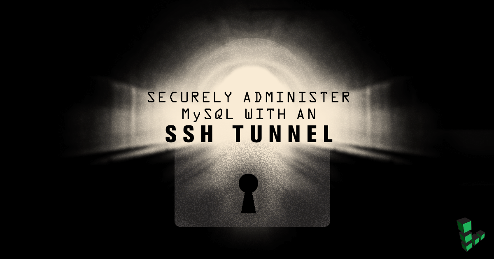
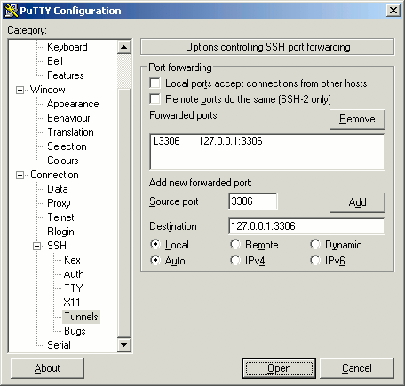
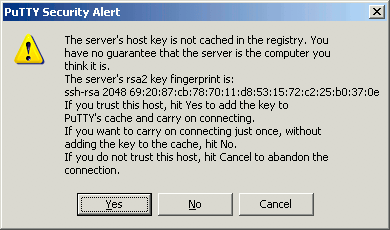

This guide will show you how to make a secure connection to your remote MySQL or MariaDB server from your local computer, using an *SSH tunnel*. This is useful if you want to use administration tools on your local computer to do work on your server.

An SSH tunnel is an encrypted tunnel made through an SSH protocol connection. You can use an SSH tunnel to communicate remotely with the MySQL database.
After following these instructions, you'll be able to connect to `localhost` on your workstation using your favorite MySQL management tool. The connection will be securely forwarded to your Linode over the Internet.


[MariaDB](https://mariadb.com/) is a fork of MySQL and considered a [drop-in replacement](https://mariadb.com/kb/en/mariadb/mariadb-vs-mysql-compatibility/). Although this guide refers to MySQL, it applies equally to MariaDB as well.


## Prerequisites

-   [MySQL](/docs/guides/hosting-a-website-ubuntu-18-04/#install-mysql) is installed.
-   MySQL is configured to listen on `localhost` (127.0.0.1). This is enabled by default.

## How to Access MySQL Remotely by Creating an SSH Tunnel with PuTTY

This section will show you how to create an SSH tunnel to MySQL on Windows, using the PuTTY tool.

### Setting Up the Tunnel

First, you need to establish a basic connection to your Linode:

1.  Download [PuTTY](http://www.chiark.greenend.org.uk/~sgtatham/putty/download.html).
2.  Save PuTTY to your desktop.
3.  Double-click the PuTTY file to begin - no need to install. You will see the following window:

    

4.  Enter the hostname or IP address of your Linode in the **Host Name (or IP address)** field.
5.  In the left-hand menu, go to **Connection -\> SSH -\> Tunnels**.
6.  In the **Source port** field, enter `3306`.
7.  In the **Destination** field, enter `127.0.0.1:3306`. See the final configuration below:

    

8.  Click **Open** to start the SSH session.
9.  If you haven't logged in to this system with PuTTY before, you will receive a warning similar to the following. Verify that this server is the one to which you want to connect, then click **Yes**:

    

    
This warning appears because PuTTY wants you to verify that the server you're logging in to is who it says it is. It is unlikely, but possible, that someone could be eavesdropping on your connection and posing as your Linode. To verify the server, compare the key fingerprint shown in the PuTTY warning - the string of numbers and letters starting with **ssh-rsa** in the image above - with your Linode's public key fingerprint. To get your Linode's fingerprint, log in to your Linode via the Lish console (see the **Console** tab in the Linode Manager) and executing the following command:

    ssh-keygen -l -f /etc/ssh/ssh_host_rsa_key.pub

The key fingerprints should match. Once you click **Yes**, you won't receive further warnings unless the key presented to PuTTY changes for some reason; typically, this should only happen if you reinstall the remote server's operating system. If you receive this warning again for the same Linode after the key has already been cached, you should not trust the connection and investigate matters further.


10. Direct your local MySQL client to `localhost:3306`. Your connection to the remote MySQL server will be encrypted through SSH, allowing you to access your databases without running MySQL on a public IP.

## Create an SSH Tunnel on Mac OS X or Linux

This section will show you how to create an SSH tunnel to MySQL on Mac OS X or Linux.

1.  Install a MySQL client. Installing MySQL server comes prepackaged with an installation of the client. To install the client only:

    **MacOS**

        brew install --cask mysql-shell

    **Ubuntu/Debian**

        sudo apt install mysql-client

2.  Open a command prompt and run the following command to open the SSH tunnel.

        ssh user@example.com -L 3306:127.0.0.1:3306 -N

    Replace <**user@example.com**> with your SSH username and your server's hostname or IP address. The long string of numbers in the command lists the local IP, the local port, the remote IP, and the remote port, separated by colons (**:**).

    `-L` - binds a local port to the remote host post.
    `-N` - means forwarding ports.

    
If you're already running a local MySQL server on your workstation, use a different local port (3307 is a common choice). Your new command would look like this:

    ssh user@example.com -L 3307:127.0.0.1:3306 -N


3.  Open a new terminal window. Direct your local MySQL client to `127.0.0.1:3306` with the MySQL server username and password.

    **MacOS**

        mysqlsh --host=127.0.0.1 --port=3306 -u user -p

    **Ubuntu/Debian**

        mysql --host=127.0.0.1 --port=3306 -u user -p

    Your connection to the remote MySQL server will be encrypted through SSH, allowing you to access your databases without running MySQL on a public IP.

4.  When you're ready to close the connection, issue a **CTRL-C** command or close the command prompt window. This will close the SSH tunnel.

### Persistent SSH Connections

If you need a persistent SSH tunnel, consider using [autossh](http://www.harding.motd.ca/autossh/). autossh starts and monitors an SSH connection, and restarts it if necessary.

