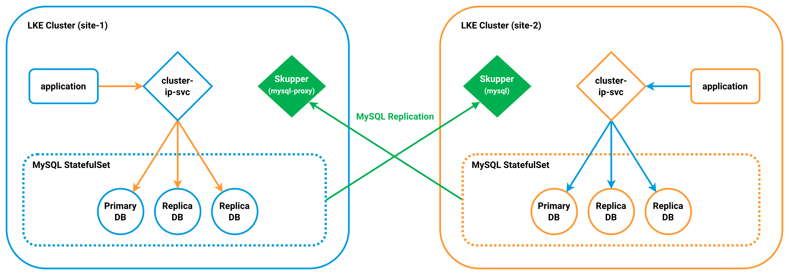

Running stateful workloads across multiple Kubernetes clusters introduces a fundamental challenge: maintaining data consistency between geographically distributed regions while preserving availability and performance.

This guide demonstrates how to deploy and replicate a MySQL database across two Linode Kubernetes Engine (LKE) clusters located in separate regions (New Jersey and Atlanta). Each region runs a replicated MySQL StatefulSet with intra-cluster replication between replicas. Percona XtraBackup is used to initialize replicas from consistent backups, while Skupper provides secure multi-cluster service connectivity between clusters without requiring direct network peering. Kubernetes headless and ClusterIP services manage how read and write traffic is routed between MySQL instances.

The result is a multi-region database architecture where:

-   Each site maintains internal replica redundancy
-   Writes originate from a designated primary
-   Replication streams securely to a secondary region
-   Applications in both regions can access up-to-date data

This approach enables active regional deployments with synchronized data, allowing application workloads to operate in multiple regions while reading from a consistent MySQL dataset.

## MySQL Replication Overview

This deployment spans two regions, New Jersey (site-1) and Atlanta (site-2). Each region runs its own MySQL StatefulSet consisting of three replicas. Within each site, MySQL instances replicate data internally to provide redundancy and ensure local availability.



The MySQL instances in site-1 act as the primary data source for the deployment. In addition to replicating data among themselves, changes written to the primary instance are replicated to MySQL instances in site-2. This ensures that both regions maintain synchronized copies of the database.

Secure communication between the two Kubernetes clusters is handled by Skupper, a layer-7 multi-cluster interconnection service. Skupper creates a virtual network that allows services in one cluster to securely discover and communicate with services in another cluster.

Within each site:
-   mysql-0 functions as the primary MySQL instance
-   mysql-1 and mysql-2 operate as replicas

Cross-site replication streams changes from the primary instance in site-1 to the MySQL replicas in site-2, enabling the MySQL instances across the two sites to replicate data securely and efficiently.

## Before You Begin

1.  If you do not already have a virtual machine to use, create a Compute Instance with at least 4 GB of memory. See our [Getting Started with Linode](/docs/products/platform/get-started/) and [Creating a Compute Instance](/docs/products/compute/compute-instances/guides/create/) guides.

1.  Follow our [Setting Up and Securing a Compute Instance](/docs/products/compute/compute-instances/guides/set-up-and-secure/) guide to update your system. You may also wish to set the timezone, configure your hostname, create a limited user account, and harden SSH access.

1.  Create two Linode Kubernetes Engine clusters in separate regions (e.g., New Jersey and Atlanta).

1.  Install `kubectl` on your local workstation and configure contexts for each LKE cluster.

## Deployment Components

The deployment consists of several components that work together to provide intra-site redundancy and cross-site replication between the two Kubernetes clusters. Each site includes MySQL StatefulSets, supporting services that route client and replication traffic, and Skupper components that enable secure communication between the clusters.

### New Jersey (site-1) MySQL StatefulSet

Several Pods run in site-1 to support the MySQL replication architecture. The MySQL StatefulSet includes three MySQL Pods that maintain intra-site replication:

```command
kubectl get pods
```

```output
NAME                                          READY   STATUS    RESTARTS   AGE
mysql-0                                       2/2     Running   0          3d
mysql-1                                       2/2     Running   0          3d
mysql-2                                       2/2     Running   0          3d
mysql-proxy-0                                 1/1     Running   0          2d23h
mysql-proxy-1                                 1/1     Running   0          2d23h
mysql-proxy-2                                 1/1     Running   0          2d23h
skupper-prometheus-796c6bf45f-hgwfn           2/2     Running   0          2d23h
skupper-router-757fc645f6-wf9d7               2/2     Running   0          2d23h
skupper-service-controller-c97774c54c-hlwtq   2/2     Running   0          2d23h
```

-   `mysql-0` is the *primary* MySQL instance.
-   `mysql-1` and `mysql-2` are *replica* instances that maintain copies of the primary database.
-   `mysql-proxy-` Pods handle replication forwarding between site-1 and site-2.
-   `skupper-` Pods provide the networking layer that connects the two clusters.

The New Jersey deployment runs a MySQL StatefulSet consisting of three Pods: `mysql-0`, `mysql-1`, and `mysql-2`. These instances are configured with MySQL replication so that `mysql-0` acts as the primary server while `mysql-1` and `mysql-2` function as replicas. This setup ensures that multiple copies of the database are maintained within the cluster.

In addition to the MySQL Pods, New Jersey (site-1) also runs three `mysql-proxy` Pods that act as intermediaries for replication traffic. These Pods forward replication updates generated by the primary MySQL instance to the MySQL replicas running in site-2.

### New Jersey (site-1) MySQL Services

Two Kubernetes services manage database connectivity in site-1:

```command
kubectl get svc
```

```output
NAME          TYPE        CLUSTER-IP      EXTERNAL-IP   PORT(S)               AGE
mysql-proxy   ClusterIP   None            <none>        3306/TCP,3307/TCP     3d18h
mysql-read    ClusterIP   10.128.46.187   <none>        3306/TCP,3307/TCP     3d18h
```

-   `mysql-proxy` is a headless service that exposes the `mysql-proxy` Pods. These Pods handle database traffic within site-1 and forward replication updates generated by the primary MySQL instance to the MySQL replicas running in site-2. They also act as intermediaries between the MySQL servers and the Skupper network.

-   `mysql-read` is a ClusterIP service that distributes read traffic across the available MySQL replicas within site-1.

### Atlanta (site-2) MySQL StatefulSet

Site-2 runs two MySQL StatefulSets. One receives replication from site-1 while the other maintains internal replication within the Atlanta cluster:

```command
kubectl get pods
```

```output
NAME                                        READY   STATUS    RESTARTS   AGE
mysql-0                                     1/1     Running   0          2d23h
mysql-1                                     1/1     Running   0          2d23h
mysql-2                                     1/1     Running   0          2d23h
mysql-site-b-0                              2/2     Running   0          2d23h
mysql-site-b-1                              2/2     Running   0          2d23h
mysql-site-b-2                              2/2     Running   0          2d23h
skupper-prometheus-796c6bf45f-2krj1         2/2     Running   0          2d23h
skupper-router-6d586575bc-qqprk             2/2     Running   0          2d23h
skupper-service-controller-68b576db-hqvg2   2/2     Running   0          2d23h
```

-   `mysql-0`, `mysql-1`, and `mysql-2` serve as replicas that receive updates from site-1.
-   `mysql-site-b-` Pods belong to a second StatefulSet used for intra-site replication in site-2.
-	`skupper-` Pods provide the networking components that connect site-2 to the Skupper network.

### Atlanta (site-2) MySQL Services

Three services manage database connectivity and replication in site-2:

```command
kubectl get svc
```

```output
NAME           TYPE        CLUSTER-IP      EXTERNAL-IP   PORT(S)               AGE
mysql          ClusterIP   None            <none>        3306/TCP,3307/TCP     3d18h
mysql-read     ClusterIP   10.128.72.170   <none>        3306/TCP              3d18h
mysql-site-b   ClusterIP   None            <none>        3306/TCP,3307/TCP     3d18h
```

-   `mysql` is a headless service associated with Skupper to route replication traffic to site-2.
-   `mysql-read` is a ClusterIP service that allows the application to write to the DB.
-   `mysql-site-b` is a headless service that takes care of replication amongst the DB instances on site-2.

### Skupper Components

-   **Skupper Router**: Acts as the core component of the virtual network, enabling secure communication between the services across the sites.

-   **Skupper Service Controller**: Manages the services exposed via Skupper, ensuring that the correct routing and discovery happen between the sites.

-   **Skupper Prometheus**: Used for monitoring traffic and performance within the Skupper network.

## Deploy the MySQL Replication Components

This section deploys the Kubernetes resources that configure MySQL replication across both sites. These manifests define the database configuration, services, and StatefulSets used to initialize replicas and maintain synchronized data.

### Configure MySQL Replication Settings

1.  Use a text editor (e.g., `nano`) to create a new file called `mysql-configmap.yaml`:

    ```command {title="Local Workstation"}
    nano mysql-configmap.yaml
    ```

    Give it the following contents:

    ```file {title="mysql-configmap.yaml"}
    apiVersion: v1
    kind: ConfigMap
    metadata:
      name: mysql
      labels:
        app: mysql
        app.kubernetes.io/name: mysql
    data:
      primary.cnf: |
        # config on the primary.
       [mysqld]
       log-bin
      replica.cnf: |
        # config only on replicas.
        [mysqld]
        super-read-only
        slave_net_timeout = 3600
    ```

    This ConfigMap defines separate MySQL configuration settings for the primary server and its replicas. The primary server writes binary logs used for replication, while the replicas run in super-read-only mode to prevent direct write operations.

    When done, press <kbd>CTRL</kbd>+<kbd>X</kbd>, followed by <kbd>Y</kbd> then <kbd>Enter</kbd> to save the file and exit `nano`.

1.  Apply the ConfigMap to the Kubernetes cluster deployed on site-1 (e.g., New Jersey):

    ```command {title="site-1"}
    kubectl apply -f mysql-configmap.yaml
    ```

    ```output
    configmap/mysql created
    ```

1.  Verify that the ConfigMap was created:

    ```command {title="site-1"}
    kubectl get configmap
    ```

    ```output
    NAME    DATA    AGE
    mysql   2       <seconds>
    ```

### Create MySQL Services

1.  Use a text editor (e.g., `nano`) to create another new file called `mysql-service.yaml`:

    ```command {title="Local Workstation"}
    nano mysql-service.yaml
    ```

    Give the file the following contents:

    ```file {title="mysql-service.yaml"}
    apiVersion: v1
    kind: Service
    metadata:
      name: mysql
      labels:
        app: mysql
        app.kubernetes.io/name: mysql
    spec:
      ports:
      - name: mysql
        port: 3306
      clusterIP: None
      selector:
        app: mysql
    ---
    # Client service for connecting to any MySQL instance for reads.
    # For writes, connect to the primary: mysql-0.mysql.
    apiVersion: v1
    kind: Service
    metadata:
      name: mysql-read
      labels:
        app: mysql
        app.kubernetes.io/name: mysql
        readonly: "true"
    spec:
      ports:
      - name: mysql
        port: 3306
      - name: mysql-rep
        port: 3307
      selector:
        app: mysql
    ```

    These services provide DNS-based access to the MySQL Pods and define how client traffic is routed within the cluster:

    -   `mysql` is a headless service that acts as a DNS registry for the StatefulSet. Each Pod can be reached using predictable DNS hostnames such as `mysql-0.mysql`, `mysql-1.mysql`, or `mysql-2.mysql`.
    -   `mysql-read` is a ClusterIP service that provides a single service endpoint that distributes read queries across all MySQL Pods that are marked as Ready.

    
    Applications should send read queries to the `mysql-read` service. Write operations should connect directly to the primary Pod (`mysql-0.mysql`), since there is only one writable MySQL instance.
    

    When done, press <kbd>CTRL</kbd>+<kbd>X</kbd>, followed by <kbd>Y</kbd> then <kbd>Enter</kbd> to save the file and exit `nano`.

1.  Apply the services to the Kubernetes cluster deployed on site-1 (e.g., New Jersey):

    ```command {title="site-1"}
    kubectl apply -f mysql-service.yaml
    ```

    ```output
    service/mysql created
    service/mysql-read created
    ```

1.  Verify that the services were created:

    ```command {title="site-1"}
    kubectl get svc
    ```

    ```output
    NAME         TYPE        CLUSTER-IP      EXTERNAL-IP   PORT(S)               AGE
    mysql        ClusterIP   None            <none>        3306/TCP              <seconds>
    mysql-read   ClusterIP   10.xxx.xxx.xxx  <none>        3306/TCP,3307/TCP     <seconds>
    ```

### Deploy the MySQL StatefulSet in site-1

1.  Use a text editor (e.g., `nano`) to create new file called `mysql-statefulset.yaml`:

    ```command {title="Local Workstation"}
    nano mysql-statefulset.yaml
    ```

    Add the following contents to define the `init-mysql` initialization container:

    ```file {title="mysql-statefulset.yaml (1/3)"}
    apiVersion: apps/v1
    kind: StatefulSet
    metadata:
      name: mysql
    spec:
      replicas: 3
      serviceName: mysql
      selector:
        matchLabels:
          app: mysql
          app.kubernetes.io/name: mysql
      template:
        metadata:
          labels:
            app: mysql
            app.kubernetes.io/name: mysql
        spec:
          initContainers:
          - name: init-mysql
            image: mysql:5.7
            command:
            - bash
            - "-c"
            - |
              set -ex
              [[ $HOSTNAME =~ -([0-9]+)$ ]] || exit 1
              ordinal=${BASH_REMATCH[1]}
              echo [mysqld] > /mnt/conf.d/server-id.cnf
              echo server-id=$((100 + $ordinal)) >> /mnt/conf.d/server-id.cnf
              if [[ $ordinal -eq 0 ]]; then
                cp /mnt/config-map/primary.cnf /mnt/conf.d/
              else
                cp /mnt/config-map/replica.cnf /mnt/conf.d/
              fi
            volumeMounts:
            - name: conf
              mountPath: /mnt/conf.d
            - name: config-map
              mountPath: /mnt/config-map
    ```

    This `init-mysql` init container configures each MySQL Pod in the StatefulSet with a unique server ID, which is required for replication. It assigns the primary configuration (`primary.cnf`) to the first Pod (`mysql-0`) and the replica configuration (`replica.cnf`) to all other Pods. This ensures that the StatefulSet starts with one primary instance and two replicas.

1.  Add the following `clone-mysql` init container to the end of the file:

    ```file {title="mysql-statefulset.yaml (2/3)"}
          - name: clone-mysql
            image: gcr.io/google-samples/xtrabackup:1.0
            command:
            - bash
            - "-c"
            - |
              set -ex
              [[ -d /var/lib/mysql/mysql ]] && exit 0
              [[ `hostname` =~ -([0-9]+)$ ]] || exit 1
              ordinal=${BASH_REMATCH[1]}
              [[ $ordinal -eq 0 ]] && exit 0
              ncat --recv-only mysql-$(($ordinal-1)).mysql 3307 | xbstream -x -C /var/lib/mysql
              xtrabackup --prepare --target-dir=/var/lib/mysql
            volumeMounts:
            - name: mysql-data
              mountPath: /var/lib/mysql
              subPath: mysql
            - name: conf
              mountPath: /etc/mysql/conf.d
    ```

    The `clone-mysql` init container initializes a replica Pod when it starts with an empty PersistentVolume. It copies an existing MySQL data directory from another running Pod so that the replica begins with a consistent data set before replication starts.

    This process uses Percona XtraBackup, since MySQL does not provide a built-in way to clone a replica from another Pod in this deployment. To reduce the impact on the primary Pod, each replica clones from the Pod with the next lower ordinal number. This works because the StatefulSet controller starts Pods in order and waits for Pod *N* to become Ready before starting Pod *N+1*.

1.  Add the following XtraBackup sidecar container to the end of the file:

    ```file {title="mysql-statefulset.yaml (3/3)"}
          - name: xtrabackup
            image: gcr.io/google-samples/xtrabackup:1.0
            command:
            - bash
            - "-c"
            - |
              # Enable error handling and command echoing for debugging
              set -ex

              # Change to the MySQL data directory
              cd /var/lib/mysql

              # Check if 'xtrabackup_slave_info' exists and is non-empty
              if [[ -f xtrabackup_slave_info && "x$(<xtrabackup_slave_info)" != "x" ]]; then
                # Extract the slave replication information and remove trailing semicolon
                cat xtrabackup_slave_info | sed -E 's/;$//g' > change_master_to.sql.in
                # Clean up by removing 'xtrabackup_slave_info' and 'xtrabackup_binlog_info'
                rm -f xtrabackup_slave_info xtrabackup_binlog_info
              # If 'xtrabackup_slave_info' does not exist but 'xtrabackup_binlog_info' does
              elif [[ -f xtrabackup_binlog_info ]]; then
                # Extract the binlog position information
                [[ `cat xtrabackup_binlog_info` =~ ^(.*?)[[:space:]]+(.*?)$ ]] || exit 1
                # Clean up by removing 'xtrabackup_binlog_info' and 'xtrabackup_slave_info'
                rm -f xtrabackup_binlog_info xtrabackup_slave_info
                # Prepare the replication change command using the extracted binlog info
                echo "CHANGE MASTER TO MASTER_LOG_FILE='${BASH_REMATCH[1]}',\
              MASTER_LOG_POS=${BASH_REMATCH[2]}" > change_master_to.sql.in
              fi

              # If the 'change_master_to.sql.in' file was created (from either of the above cases)
              if [[ -f change_master_to.sql.in ]]; then
                # Wait for MySQL to be ready and accepting connections
                echo "Waiting for mysqld to be ready (accepting connections)"
                until mysql -h 127.0.0.1 -u root -p$MYSQL_ROOT_PASSWORD -e "SELECT 1"; do sleep 1; done

                # Initialize replication from the cloned position using the extracted replication info
                echo "Initializing replication from clone position"
                mysql -h 127.0.0.1 -u root -p$MYSQL_ROOT_PASSWORD \
                  -e "$(<change_master_to.sql.in), \
                  MASTER_HOST='mysql-0.mysql.default.svc.cluster.local', \
                  MASTER_USER='root', \
                  MASTER_PASSWORD='$MYSQL_ROOT_PASSWORD', \
                  MASTER_CONNECT_RETRY=10; \
                  START SLAVE;" || exit 1

                # Rename the replication command file to indicate it has been processed
                mv change_master_to.sql.in change_master_to.sql.orig
              fi

              # Start a netcat listener on port 3307, streaming xtrabackup data
              exec ncat --listen --keep-open --send-only --max-conns=3 3307 -c \
                "xtrabackup --backup --slave-info --stream=xbstream --host=127.0.0.1 --user=root --password=$MYSQL_ROOT_PASSWORD"
    ```

    The `xtrabackup` sidecar container checks the cloned data to determine whether MySQL replication needs to be initialized on the replica. If replication metadata is present, it waits for MySQL to be ready and then runs the commands to start replication using the information captured during the clone.

    Once replication starts, the replica remembers its primary server and automatically reconnects if the server restarts or the connection is interrupted. Because replicas connect using the stable DNS name `mysql-0.mysql`, they continue to function even if the primary Pod receives a new IP address.

    After replication is initialized, the `xtrabackup` container remains available to serve backup data to other Pods that need to clone an existing data set. This ensures the StatefulSet can initialize new replicas when scaling up or when a Pod starts with an empty PersistentVolume.

    When done, press <kbd>CTRL</kbd>+<kbd>X</kbd>, followed by <kbd>Y</kbd> then <kbd>Enter</kbd> to save the file and exit `nano`.

1.  Apply the StatefulSet to the Kubernetes cluster deployed on site-1 (e.g., New Jersey):

    ```command {title="site-1"}
    kubectl apply -f mysql-statefulset.yaml
    ```

    ```output
    statefulset.apps/mysql created
    ```

1.  Verify that the StatefulSet and Pods were created:

    ```command {title="site-1"}
    kubectl get statefulset,pods
    ```

    ```output
    NAME                     READY   AGE
    statefulset.apps/mysql   3/3     <minutes>

    NAME          READY   STATUS    RESTARTS   AGE
    mysql-0       2/2     Running   0          <minutes>
    mysql-1       2/2     Running   0          <minutes>
    mysql-2       2/2     Running   0          <minutes>
    ```

### Deploy the MySQL StatefulSet in site-2

1.  Use a text editor (e.g., `nano`) to create a new file called `mysql-site2-statefulset.yaml`:

    ```command {title="Local Workstation"}
    nano mysql-site2-statefulset.yaml
    ```

    Give the file the following contents:

    ```file {title="mysql-site2-statefulset.yaml"}
    apiVersion: apps/v1
    kind: StatefulSet
    metadata:
      name: mysql-read
      namespace: default
    spec:
      replicas: 3
      serviceName: mysql-read
      selector:
        matchLabels:
          app: mysql-read
      template:
        metadata:
          labels:
            app: mysql-read
        spec:
          initContainers:
          - name: init-mysql
            image: mysql:5.7
            command:
            - bash
            - "-c"
            - |
              set -ex
              # Skip the clone if data already exists.
              if [[ -d /var/lib/mysql/mysql ]]; then
                exit 0
              fi

              # Extract ordinal index from hostname (e.g., mysql-read-0, mysql-read-1).
              if [[ $HOSTNAME =~ -([0-9]+)$ ]]; then
                ordinal=${BASH_REMATCH[1]}
              else
                exit 1
              fi

              # If this is the primary Pod (ordinal 0), clone from the secondary Pod (mysql-read-1).
              if [[ $ordinal -eq 0 ]]; then
                ncat --recv-only mysql-read-1.mysql-read.default.svc.cluster.local 3307 | xbstream -x -C /var/lib/mysql
                # Prepare the backup to make it ready for use.
                xtrabackup --prepare --target-dir=/var/lib/mysql
                exit 0
              fi

              # For other Pods, clone from the previous Pod in the StatefulSet (e.g., mysql-read-1 clones from mysql read-0).
              ncat --recv-only mysql-read-$(($ordinal-1)).mysql-read.default.svc.cluster.local 3307 | xbstream -x -C /var/lib/mysql
              # Prepare the backup to make it ready for use.
              xtrabackup --prepare --target-dir=/var/lib/mysql
    ```

    The `init-mysql` container in site-1 assigns a unique server ID to each MySQL Pod and configures whether the Pod acts as the primary or a replica based on its ordinal index.

    The `init-mysql` container in site-2 serves a different purpose. It ensures that each MySQL Pod starts with a consistent data set by cloning data from another Pod in the `mysql-read` StatefulSet. These Pods receive replicated data from site-1 through the Skupper link. The cloning process uses Percona XtraBackup to copy and prepare the MySQL data directory when a Pod starts with an empty PersistentVolume.

    When done, press <kbd>CTRL</kbd>+<kbd>X</kbd>, followed by <kbd>Y</kbd> then <kbd>Enter</kbd> to save the file and exit `nano`.

1.  Apply the StatefulSet to the Kubernetes cluster deployed on site-2 (e.g., Atlanta):

    ```command {title="site-2"}
    kubectl apply -f mysql-site2-statefulset.yaml
    ```

    ```output
    statefulset.apps/mysql-read created
    ```

1.  Verify that the StatefulSet and Pods were created:

    ```command {title="site-2"}
    kubectl get statefulset,pods
    ```

    ```output
    NAME                          READY   AGE
    statefulset.apps/mysql-read   3/3     <minutes>

    NAME               READY   STATUS    RESTARTS   AGE
    mysql-read-0       1/1     Running   0          <minutes>
    mysql-read-1       1/1     Running   0          <minutes>
    mysql-read-2       1/1     Running   0          <minutes>
    ```

## Configure Skupper

The following steps install Skupper and establish a secure service network between the two Kubernetes clusters.

Two versions of the Skupper CLI are currently in use. The following sections show how to configure the connection using either Skupper v2 or the legacy Skupper v1 commands.

### Skupper v2

1.  Download and install the Skupper CLI on your local workstation:

    ```command {title="Local Workstation"}
    curl https://skupper.io/install.sh | sh
    ```

1.  Install the Skupper controller and create a site on site-1:

    ```command {title="site-1"}
    kubectl apply -f https://skupper.io/install.yaml
    skupper site create site-1 --enable-link-access
    ```

    ```output
    namespace/skupper created
    customresourcedefinition.apiextensions.k8s.io/accessgrants.skupper.io created
    customresourcedefinition.apiextensions.k8s.io/accesstokens.skupper.io created
    customresourcedefinition.apiextensions.k8s.io/attachedconnectorbindings.skupper.io created
    customresourcedefinition.apiextensions.k8s.io/attachedconnectors.skupper.io created
    customresourcedefinition.apiextensions.k8s.io/certificates.skupper.io created
    customresourcedefinition.apiextensions.k8s.io/connectors.skupper.io created
    customresourcedefinition.apiextensions.k8s.io/links.skupper.io created
    customresourcedefinition.apiextensions.k8s.io/listeners.skupper.io created
    customresourcedefinition.apiextensions.k8s.io/routeraccesses.skupper.io created
    customresourcedefinition.apiextensions.k8s.io/securedaccesses.skupper.io created
    customresourcedefinition.apiextensions.k8s.io/sites.skupper.io created
    serviceaccount/skupper-controller created
    clusterrole.rbac.authorization.k8s.io/skupper-controller created
    clusterrolebinding.rbac.authorization.k8s.io/skupper-controller created
    deployment.apps/skupper-controller created
    Waiting for status...
    Site "site-1" is ready.
    ```

1.  Generate a connection token on site-1:

    ```command {title="site-1"}
    skupper token issue $HOME/site-1.token
    ```

    ```output
    Waiting for token status ...

    Grant "site-1-a4c9d2f3-7b81-4e6a-9d2f-3c7b8e1a6f40" is ready
    Token file /home/username/site-1.token created

    Transfer this file to a remote site. At the remote site,
    create a link to this site using the "skupper token redeem" command:

    	skupper token redeem <file>

    The token expires after 1 use(s) or after 15m0s.
    ```

1.  Install the Skupper controller and create a site on site-2:

    ```command {title="site-2"}
    kubectl apply -f https://skupper.io/install.yaml
    skupper site create site-2
    ```

    ```output
    namespace/skupper created
    customresourcedefinition.apiextensions.k8s.io/accessgrants.skupper.io created
    customresourcedefinition.apiextensions.k8s.io/accesstokens.skupper.io created
    customresourcedefinition.apiextensions.k8s.io/attachedconnectorbindings.skupper.io created
    customresourcedefinition.apiextensions.k8s.io/attachedconnectors.skupper.io created
    customresourcedefinition.apiextensions.k8s.io/certificates.skupper.io created
    customresourcedefinition.apiextensions.k8s.io/connectors.skupper.io created
    customresourcedefinition.apiextensions.k8s.io/links.skupper.io created
    customresourcedefinition.apiextensions.k8s.io/listeners.skupper.io created
    customresourcedefinition.apiextensions.k8s.io/routeraccesses.skupper.io created
    customresourcedefinition.apiextensions.k8s.io/securedaccesses.skupper.io created
    customresourcedefinition.apiextensions.k8s.io/sites.skupper.io created
    serviceaccount/skupper-controller created
    clusterrole.rbac.authorization.k8s.io/skupper-controller created
    clusterrolebinding.rbac.authorization.k8s.io/skupper-controller created
    deployment.apps/skupper-controller created
    Waiting for status...
    Site "site-2" is ready.
    ```

1.  Use the token generated on site-1 to create a link from site-2:

    ```command {title="site-2"}
    skupper token redeem $HOME/site-1.token
    ```

    ```output
    Waiting for token status ...
    Token "site-1-a4c9d2f3-7b81-4e6a-9d2f-3c7b8e1a6f40" has been redeemed
    ```

1.  Verify that the link is `Ready` and `OK`:

    ```command {title="site-2"}
    skupper link status
    ```

    ```output
    NAME                                          STATUS   COST   MESSAGE
    site-1-a4c9d2f3-7b81-4e6a-9d2f-3c7b8e1a6f40   Ready    1      OK
    ```

1.  Expose the MySQL StatefulSet on site-1 so it is accessible across the Skupper network:

    ```command {title="site-1"}
    skupper expose statefulset/mysql --headless --port 3306 --port 3307
    ```

    ```output
    statefulset/mysql exposed as mysql
    ```

### Skupper v1 (Legacy)

The following steps demonstrate the legacy Skupper v1 workflow. New deployments should use Skupper v2.

1.  Download and install the Skupper v1 CLI on your local workstation:

    ```command {title="Local Workstation"}
    curl https://skupper.io/install.sh | sh -s -- --version 1.9.4
    ```

1.  Initialize the Skupper site on site-1:

    ```command {title="site-1"}
    skupper init --site-name site-1 --enable-flow-collector --ingress loadbalancer
    ```

    ```output
    Waiting for LoadBalancer IP or hostname...
    Skupper is now installed in namespace 'default'.
    Skupper site name: site-1
    Router mode: interior
    Transport: tcp
    Console enabled: false
    Flow collector enabled: true
    ```

1.  Generate a connection token on site-1:

    ```command {title="site-1"}
    skupper token create ~/site-1.token
    ```

    ```output
    Connection token written to ~/site-1.token
    ```

1.  Initialize the Skupper site on site-2:

    ```command {title="site-2"}
    skupper init --site-name site-2 --enable-console --enable-flow-collector --ingress loadbalancer
    ```

    ```output
    Waiting for LoadBalancer IP or hostname...
    Skupper is now installed in namespace 'default'.
    Skupper site name: site-2
    Router mode: interior
    Transport: tcp
    Console enabled: true
    Flow collector enabled: true
    ```

1.  Create a link from site-2 to site-1 using the previously generated token:

    ```command {title="site-2"}
    skupper link create ~/site-1.token
    ```

    ```output
    Site configured to link to token ~/site-1.token
    ```

1.  Verify that the link is `connected`:

    ```command
    skupper link status
    ```

    ```output
    Links:
      link1 (connected)
    ```

1.  Expose the MySQL StatefulSet on site-1 so it is accessible across the Skupper network:

    ```command {title="site-1"}
    skupper expose statefulset/mysql --headless --port 3306 --port 3307
    ```

    ```output
    statefulset/mysql exposed as mysql
    ```

## How the Setup Works

### Intra-Site Replication

Within Site-1 and Site-2: Each MySQL StatefulSet operates independently, with replication configured internally among the three replicas using Percona XtraBackup. The mysql-0 Pod acts as the primary, with mysql-1 and mysql 2 set up as replicas. This internal replication ensures data consistency within each site.

### Site-to-Site Replication with Skupper:

-   Skupper's Role: Skupper creates a secure, encrypted communication layer between site-1 and site-2, effectively linking the two Kubernetes clusters as if they were part of the same virtual network. This allows services in one site to discover and communicate with services in the other site.

-   Service Exposure: The MySQL service in site-1 is exposed via Skupper, making it accessible from site-2. The mysql-proxy in site-1 is configured to route replication traffic to site-2's MySQL instances.

### Replication Traffic Flow:

-   Write Operations: When a write operation occurs on the primary MySQL instance in site-1, the mysql-proxy intercepts this operation. Instead of only replicating the change within site-1, the proxy also forwards the replication traffic to the MySQL replicas in site-2.

-   Skupper Routing: The Skupper router ensures that the replication traffic is securely transmitted across sites. The traffic from the mysql-proxy in site-1 is routed through the Skupper network to reach the MySQL replicas (mysql-site b-0, mysql-site-b-1, mysql-site-b-2) in site-2.

### Inter-Site Consistency:

-   Data Propagation: The replication setup ensures that all changes made in site-1 are propagated to site-2. This allows site-2 to maintain an up-to-date copy of the data present in site-1, effectively synchronizing the two sites.

-   Fault Tolerance: In the event of a failure in site-1, site-2 can continue to serve data, ensuring high availability.

The integration of MySQL replication with Skupper provides a robust solution for multi-site data synchronization. Skupper’s secure and efficient routing enables the MySQL instances in site-1 and site-2 to replicate data as if they were on the same network. The use of mysql-proxy further optimizes the replication process, ensuring that write operations in one site are accurately and promptly reflected in the other. This setup enhances data resilience and availability across geographically distributed sites.

## References

1.  NoIP DDNS repo: https://bits.linode.com/shichand/DDNS
1.  Run a Replicated Stateful Application: https://kubernetes.io/docs/tasks/run-application/run-replicated-stateful application/
1.  Percona XtraBackup for MySQL: https://docs.percona.com/percona-xtrabackup/2.4/index.html
1.  Skupper intro: https://github.com/skupperproject/skupper-example-hello-world
1.  CNCF: https://www.cncf.io/blog/2021/04/12/simplifying-multi-clusters-in-kubernetes/