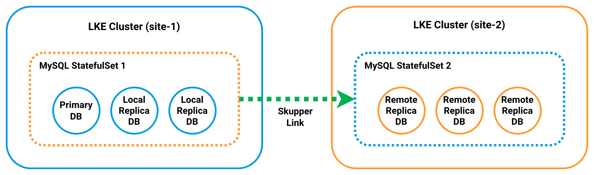

Cross-site replication is a database pattern where changes written to a primary database in one location are copied to one or more replica databases in another location. In MySQL, this is commonly used to maintain a remote read-only copy of production data for disaster recovery testing, reporting, analytics, or standby capacity.

This guide uses Skupper to provide cross-site connectivity across Linode Kubernetes Engine (LKE) clusters in different regions. Skupper creates a secure application network between Kubernetes clusters. It allows workloads in one cluster to reach selected services in another cluster without requiring direct Pod-to-Pod networking or a custom VPN. In this guide, Skupper exposes the writable MySQL primary in `site-1` to the MySQL Pods in `site-2` by using a shared service name.

This solves a specific problem for MySQL deployed across LKE regions. The source and destination databases live in separate Kubernetes clusters with separate internal networks. The approach in this guide combines Skupper for connectivity, the MySQL Clone plugin for initial seeding, and GTID-based replication for ongoing change streaming.

This guide shows how to create two LKE clusters in different regions and link them with Skupper. It then shows how to deploy MySQL in both clusters, clone the primary database from `site-1` into `site-2`, and enable replication so that writes made in `site-1` are received by the remote replicas in `site-2`.

## Architecture Overview

This guide builds a cross-site MySQL replication topology spanning two LKE clusters:



Each site runs a three-Pod MySQL StatefulSet behind a headless `mysql` Service. The Service provides stable DNS identities such as `mysql-0.mysql`. In site-1, the `mysql-0` Pod acts as the writable primary. In site-2, all Pods are configured as replicas after initialization.

Skupper connects the two clusters by exposing the primary database in site-1 as a shared service named `mysql-primary`. This allows the MySQL instances in site-2 to reach the primary by using standard MySQL client connections. It does not require direct network routing between clusters.

To initialize replication, each Pod in site-2 is first started in a writable bootstrap state. This allows it to install the MySQL Clone plugin and accept a full data copy from the primary. The Clone plugin is then used to seed each replica from `mysql-0` in site-1. This provides a consistent starting point.

After cloning is complete, the site-2 Pods are reconfigured as read-only replicas and connected back to the primary by using GTID-based replication. From that point forward, changes written to site-1 are streamed to all Pods in site-2 over the Skupper network.


This guide demonstrates a one-way replication setup from site-1 to site-2. It does not include automatic failover, bidirectional replication, or conflict handling.


## Before You Begin

1.  Follow our [Get Started](https://techdocs.akamai.com/cloud-computing/docs/getting-started) guide to create an Akamai Cloud account if you do not already have one.

1.  Follow our [Getting started with LKE guide](https://techdocs.akamai.com/cloud-computing/docs/getting-started-with-lke-linode-kubernetes-engine) to create two LKE clusters in different regions (each with three nodes), install `kubectl`, and download your `kubeconfig` files.

### Placeholders

This tutorial contains a number of placeholders that are intended to be replaced by values from your own environment. The table below lists these placeholders, what they represent, and the example values used in this guide:

| Placeholder | Description | Example |
| -- | -- | -- |
|  | The original `kubectl` context name associated with the site-1 kubeconfig before it is renamed to `site-1`. | `lke12345-ctx` |
|  | The original `kubectl` context name associated with the site-2 kubeconfig before it is renamed to `site-2`. | `lke12346-ctx` |
|  | The root password assigned to the MySQL containers in both StatefulSets. | `your-secure-root-password` |
|  | The password assigned to the MySQL replication user account. | `your-secure-replication-password` |
|  | The password assigned to the MySQL clone user account. | `your-secure-clone-password` |

Additionally, this guide uses the following fixed example values consistently throughout:

-   Primary LKE Cluster: `site-1`
-   Secondary LKE Cluster: `site-2`
-   Token File Path: `~/site1.token`
-   Replication User: `repl`
-   Clone User: `cloner`
-   Skupper Connector and Listener Name for the Primary Database: `mysql-primary`

### Configure `kubectl` Contexts

If you followed the guides linked above, you should have already installed `kubectl` and set up kubeconfig. For simplicity, rename these contexts to `site-1` and `site-2`, respectively.

1.  Use `kubectl` to list your context names:

    ```command
    kubectl config get-contexts
    ```

    ```output
    CURRENT   NAME            CLUSTER     AUTHINFO          NAMESPACE
    *         lke123456-ctx   lke123456   lke123456-admin   default
              lke123457-ctx   lke123457   lke123457-admin   default
    ```

1.  Rename the contexts to the name of your clusters (e.g., `site-1` and `site-2`):

    ```command
    kubectl config rename-context  site-1
    kubectl config rename-context  site-2
    ```

    ```output
    Context "lke123456-ctx" renamed to "site-1".
    Context "lke123457-ctx" renamed to "site-2".
    ```

1.  Confirm that both clusters are reachable:

    ```command
    kubectl --context site-1 get nodes
    kubectl --context site-2 get nodes
    ```

    ```output
    NAME                            STATUS   ROLES    AGE   VERSION
    lke123456-853376-080a23780000   Ready    <none>    4m   v1.35.1
    lke123456-853376-1278c3f50000   Ready    <none>    4m   v1.35.1
    lke123456-853376-57b539cd0000   Ready    <none>    4m   v1.35.1
    NAME                            STATUS   ROLES    AGE   VERSION
    lke123457-853377-12abbc550000   Ready    <none>    5m   v1.35.1
    lke123457-853377-196674610000   Ready    <none>    5m   v1.35.1
    lke123457-853377-2f3f3e510000   Ready    <none>    5m   v1.35.1
    ```

## Install Skupper

Install the Skupper CLI and deploy the Skupper controller in each Kubernetes cluster. The controller manages the secure service network that connects workloads across clusters.


This tutorial uses Skupper v2. The commands in this section are not compatible with the legacy Skupper v1 CLI.


1.  Download and install the Skupper CLI on your local workstation:

    ```command
    curl https://skupper.io/install.sh | sh
    ```

1.  Add Skupper to your PATH:

    ```command
    export PATH="$HOME/.local/bin:$PATH"
    ```

1.  Verify the Skupper installation:

    ```command
    skupper version
    ```

    ```output
    COMPONENT		VERSION
    router			3.4.2
    controller		2.1.3
    network-observer	2.1.3
    cli			2.1.3
    prometheus		v2.42.0
    origin-oauth-proxy	4.14.0
    ```

    
    You may see the following warning when verifying the Skupper installation:

    ```output
    Warning: Docker is not installed. Skipping image digests search.
    ```

    This warning is expected if Docker is not installed on your workstation. It does not affect the Skupper CLI commands used in this guide or the Kubernetes-based deployment workflow.
    

1.  Install the Skupper controller on both clusters:

    ```command
    kubectl --context site-1 apply -f https://skupper.io/install.yaml
    kubectl --context site-2 apply -f https://skupper.io/install.yaml
    ```

    ```output
    namespace/skupper created
    customresourcedefinition.apiextensions.k8s.io/accessgrants.skupper.io created
    customresourcedefinition.apiextensions.k8s.io/accesstokens.skupper.io created
    customresourcedefinition.apiextensions.k8s.io/attachedconnectorbindings.skupper.io created
    customresourcedefinition.apiextensions.k8s.io/attachedconnectors.skupper.io created
    customresourcedefinition.apiextensions.k8s.io/certificates.skupper.io created
    customresourcedefinition.apiextensions.k8s.io/connectors.skupper.io created
    customresourcedefinition.apiextensions.k8s.io/links.skupper.io created
    customresourcedefinition.apiextensions.k8s.io/listeners.skupper.io created
    customresourcedefinition.apiextensions.k8s.io/routeraccesses.skupper.io created
    customresourcedefinition.apiextensions.k8s.io/securedaccesses.skupper.io created
    customresourcedefinition.apiextensions.k8s.io/sites.skupper.io created
    serviceaccount/skupper-controller created
    clusterrole.rbac.authorization.k8s.io/skupper-controller created
    clusterrolebinding.rbac.authorization.k8s.io/skupper-controller created
    deployment.apps/skupper-controller created
    ```

1.  Create a Skupper site on both clusters:

    ```command
    skupper --context site-1 site create site-1 --enable-link-access
    skupper --context site-2 site create site-2
    ```

    ```output
    Waiting for status...
    Site "site-1" is ready.
    Waiting for status...
    Site "site-2" is ready.
    ```
### Link the Clusters

Skupper uses a token-based mechanism to securely link clusters. Generate a connection token from site-1 and redeem it on site-2 to establish the cross-cluster network.


If you are using a Cloud Firewall, ensure that site-1 allows inbound TCP port `9090` for token redemption and inbound TCP ports `55671` and `45671` for Skupper router traffic. Without these rules, token redemption and cross-cluster connectivity can fail.


1.  Generate a connection token from site-1:

    ```command
    skupper --context site-1 token issue ~/site1.token
    ```

    ```output
    Waiting for token status ...

    Grant "site-1-a4c9d2f3-7b81-4e6a-9d2f-3c7b8e1a6f40" is ready
    Token file ~/site1.token created

    Transfer this file to a remote site. At the remote site,
    create a link to this site using the "skupper token redeem" command:

        skupper token redeem <file>

    The token expires after 1 use(s) or after 15m0s.
    ```

1.  Use the token generated on site-1 to create a link from site-2:

    ```command
    skupper --context site-2 token redeem ~/site1.token
    ```

    ```output
    Waiting for token status ...
    Token "site-1-a4c9d2f3-7b81-4e6a-9d2f-3c7b8e1a6f40" has been redeemed
    ```

1.  Before deploying the MySQL replication components, verify that the Skupper link between the clusters is active:

    ```command
    skupper --context site-2 link status
    ```

    A `STATUS` of `Ready` and `MESSAGE` of `OK` indicate that the clusters are successfully connected:

    ```output
    NAME                                          STATUS   COST   MESSAGE
    site-1-a4c9d2f3-7b81-4e6a-9d2f-3c7b8e1a6f40   Ready    1      OK
    ```

## Deploy MySQL Configuration

The MySQL configuration is stored in a Kubernetes ConfigMap so that both clusters use the same database settings. The configuration defines separate settings for the primary instance and the replica instances that participate in replication.

1.  Use a text editor such as `nano` to create a MySQL ConfigMap file in the YAML format (e.g., `mysql-configmap.yaml`):

    ```command
    nano mysql-configmap.yaml
    ```

    Give the file the following contents:

    ```file {title="mysql-configmap.yaml" lang="yaml"}
    apiVersion: v1
    kind: ConfigMap
    metadata:
      name: mysql
    data:
      primary.cnf: |
        [mysqld]
        log_bin=mysql-bin
        binlog_format=ROW
        gtid_mode=ON
        enforce_gtid_consistency=ON
        log_replica_updates=ON
        read_only=OFF
        super_read_only=OFF

      replica.cnf: |
        [mysqld]
        log_bin=mysql-bin
        relay_log=mysql-relay-bin
        binlog_format=ROW
        gtid_mode=ON
        enforce_gtid_consistency=ON
        log_replica_updates=ON
        read_only=ON
        super_read_only=ON
    ```

    The ConfigMap defines two configuration files: `primary.cnf` and `replica.cnf`. The primary configuration enables binary logging and write access so the database can accept changes. The replica configuration enables replication and sets the server to read-only mode so that replicas apply updates received from the primary.

    When done, press <kbd>CTRL</kbd>+<kbd>X</kbd>, followed by <kbd>Y</kbd> then <kbd>Enter</kbd> to save the file and exit `nano`.

1.  Apply the MySQL ConfigMap to the clusters deployed in both sites:

    ```command
    kubectl --context site-1 apply -f mysql-configmap.yaml
    kubectl --context site-2 apply -f mysql-configmap.yaml
    ```

    ```output
    configmap/mysql created
    configmap/mysql created
    ```

1.  Verify that the ConfigMap was created in both clusters:

    ```command
    kubectl --context site-1 get configmap mysql
    kubectl --context site-2 get configmap mysql
    ```

    ```output
    NAME    DATA   AGE
    mysql   2      26s
    NAME    DATA   AGE
    mysql   2      25s
    ```

## Deploy the MySQL Services

The MySQL Service provides the stable network identity required by the StatefulSets in each cluster. The headless `mysql` Service provides predictable DNS names for each Pod so that MySQL instances can communicate directly for replication and management tasks.

1.  Create a MySQL Service file in the YAML format (e.g., `mysql-services.yaml`):

    ```command
    nano mysql-services.yaml
    ```

    Give the file the following contents:

    ```file {title="mysql-services.yaml" lang="yaml"}
    apiVersion: v1
    kind: Service
    metadata:
      name: mysql
    spec:
      clusterIP: None
      selector:
        app: mysql
      ports:
      - port: 3306
        name: mysql
    ```

    The `mysql` Service is a headless Service that provides stable DNS names for the Pods created by the StatefulSet, such as `mysql-0.mysql`, `mysql-1.mysql`, and `mysql-2.mysql`. These DNS names allow MySQL instances to address one another directly within the cluster.

    When done, save and close the file.

1.  Apply the MySQL Services to the clusters deployed in both sites:

    ```command
    kubectl --context site-1 apply -f mysql-services.yaml
    kubectl --context site-2 apply -f mysql-services.yaml
    ```

    ```output
    service/mysql created
    service/mysql created
    ```

1.  Verify that the Services were created:

    ```command
    kubectl --context site-1 get svc
    kubectl --context site-2 get svc
    ```

    ```output
    NAME                   TYPE           CLUSTER-IP      EXTERNAL-IP      PORT(S)                           AGE
    kubernetes             ClusterIP      10.128.0.1      <none>           443/TCP                           112m
    mysql                  ClusterIP      None            <none>           3306/TCP                          13s
    skupper-router         LoadBalancer   10.128.214.60   172.234.12.227   55671:30292/TCP,45671:31255/TCP   29m
    skupper-router-local   ClusterIP      10.128.156.66   <none>           5671/TCP                          29m
    NAME                   TYPE        CLUSTER-IP       EXTERNAL-IP   PORT(S)    AGE
    kubernetes             ClusterIP   10.128.0.1       <none>        443/TCP    111m
    mysql                  ClusterIP   None             <none>        3306/TCP   13s
    skupper-router-local   ClusterIP   10.128.169.117   <none>        5671/TCP   29m
    ```

    At this point, both clusters have the same Service layout. The StatefulSets in the next steps use the headless `mysql` Service for stable Pod-to-Pod communication and replication traffic within each cluster.

## Deploy MySQL StatefulSet (site-1)

Deploy the MySQL StatefulSet in site-1 to create the primary MySQL cluster. In this cluster, `mysql-0` is configured as the writable primary, while `mysql-1` and `mysql-2` are configured as replica candidates. Replication is configured in a later section after the required MySQL users are created.

1.  Create a MySQL StatefulSet file for site-1 in the YAML format (e.g., `mysql-statefulset.yaml`):

    ```command
    nano mysql-statefulset.yaml
    ```

    Give the file the following contents:

    ```file {title="mysql-statefulset.yaml" lang="yaml"}
    apiVersion: apps/v1
    kind: StatefulSet
    metadata:
      name: mysql
    spec:
      serviceName: mysql
      replicas: 3
      selector:
        matchLabels:
          app: mysql
          app.kubernetes.io/name: mysql
      template:
        metadata:
          labels:
            app: mysql
            app.kubernetes.io/name: mysql
        spec:
          initContainers:
          - name: init-mysql
            image: mysql:8.4
            command:
            - bash
            - "-c"
            - |
              set -ex

              [[ $HOSTNAME =~ -([0-9]+)$ ]] || exit 1
              ordinal=${BASH_REMATCH[1]}

              echo "[mysqld]" > /mnt/conf.d/server-id.cnf
              echo "server-id=$((100 + ordinal))" >> /mnt/conf.d/server-id.cnf

              if [[ $ordinal -eq 0 ]]; then
                cp /mnt/config-map/primary.cnf /mnt/conf.d/
              else
                cp /mnt/config-map/replica.cnf /mnt/conf.d/
              fi
            volumeMounts:
            - name: conf
              mountPath: /mnt/conf.d
            - name: config-map
              mountPath: /mnt/config-map

          containers:
          - name: mysql
            image: mysql:8.4
            env:
            - name: MYSQL_ROOT_PASSWORD
              value: ""
            - name: MYSQL_ROOT_HOST
              value: "%"
            ports:
            - name: mysql
              containerPort: 3306
            volumeMounts:
            - name: mysql-data
              mountPath: /var/lib/mysql
            - name: conf
              mountPath: /etc/mysql/conf.d

          volumes:
          - name: conf
            emptyDir: {}
          - name: config-map
            configMap:
              name: mysql

      volumeClaimTemplates:
      - metadata:
          name: mysql-data
        spec:
          accessModes:
          - ReadWriteOnce
          resources:
            requests:
              storage: 10Gi
    ```

    This StatefulSet creates three MySQL Pods in site-1. Each Pod receives a unique MySQL server ID based on its ordinal index. The `init-mysql` init container applies the primary configuration to `mysql-0` and the replica configuration to the remaining Pods. Each Pod also receives its own persistent volume claim so that MySQL data persists across restarts. At this stage, the Pods are deployed and configured, but replication is not enabled until later steps in the guide.

    When done, save and close the file.

1.  Apply the MySQL StatefulSet to the cluster deployed in site-1:

    ```command
    kubectl --context site-1 apply -f mysql-statefulset.yaml
    ```

    ```output
    statefulset.apps/mysql created
    ```

1.  Wait for the primary MySQL Pod to be created and reach the `Running` state:

    ```command
    kubectl --context site-1 get pods
    ```

    ```output
    NAME                              READY   STATUS    RESTARTS      AGE
    mysql-0                           1/1     Running   0             3m9s
    mysql-1                           1/1     Running   1 (86s ago)   2m29s
    mysql-2                           1/1     Running   1 (46s ago)   102s
    skupper-router-7b56568444-p6686   2/2     Running   0             9m42s
    ```

## Create Replication and Clone Users

Before configuring replication between the clusters, create the MySQL accounts required for replication and cloning. This guide uses the account names `repl` and `cloner` throughout:

-   A replication user that replicas use to read binary logs from the primary.
-   A clone user used by the MySQL Clone plugin when seeding replicas.

These users are created on the primary database (`mysql-0`) in site-1.

1.  Create the replication user on the primary MySQL Pod:

    ```command
    kubectl --context site-1 exec -i mysql-0 -- mysql -uroot -p"" -e "
    CREATE USER IF NOT EXISTS 'repl'@'%' IDENTIFIED BY '';
    ALTER USER 'repl'@'%' IDENTIFIED BY '';
    GRANT REPLICATION SLAVE, REPLICATION CLIENT ON *.* TO 'repl'@'%';
    FLUSH PRIVILEGES;
    SHOW GRANTS FOR 'repl'@'%';
    "
    ```

    ```output
    Grants for repl@%
    GRANT REPLICATION SLAVE, REPLICATION CLIENT ON *.* TO `repl`@`%`
    ```

    
    You may see the following warning when running MySQL commands:

    ```output
    mysql: [Warning] Using a password on the command line interface can be insecure.
    ```

    For simplicity, this guide passes MySQL passwords directly on the command line using the `-p` flag. This approach is convenient for demonstration purposes, but it can expose credentials through shell history or process listings.

    In production environments, consider more secure alternatives such as using MySQL client configuration files (for example, `.my.cnf`), environment variables, or Kubernetes Secrets to manage credentials.
    

1.  Install the Clone plugin on the primary server:

    ```command
    kubectl --context site-1 exec -i mysql-0 -- mysql -uroot -p"" -e "
    INSTALL PLUGIN clone SONAME 'mysql_clone.so';
    "
    ```

1.  Verify that the Clone plugin is installed:

    ```command
    kubectl --context site-1 exec -i mysql-0 -- mysql -uroot -p"" -e "
    SELECT PLUGIN_NAME, PLUGIN_STATUS FROM INFORMATION_SCHEMA.PLUGINS WHERE PLUGIN_NAME='clone';
    "
    ```

    ```output
    PLUGIN_NAME	PLUGIN_STATUS
    clone	ACTIVE
    ```

1.  Create a MySQL user for the Clone plugin:

    ```command
    kubectl --context site-1 exec -i mysql-0 -- mysql -uroot -p"" -e "
    CREATE USER IF NOT EXISTS 'cloner'@'%' IDENTIFIED BY '';
    ALTER USER 'cloner'@'%' IDENTIFIED BY '';
    GRANT BACKUP_ADMIN ON *.* TO 'cloner'@'%';
    FLUSH PRIVILEGES;
    SHOW GRANTS FOR 'cloner'@'%';
    "
    ```

    ```output
    Grants for cloner@%
    GRANT USAGE ON *.* TO `cloner`@`%`
    GRANT BACKUP_ADMIN ON *.* TO `cloner`@`%`
    ```

1.  Confirm that both accounts were created successfully:

    ```command
    kubectl --context site-1 exec -i mysql-0 -- mysql -uroot -p"" -e "
    SELECT user, host FROM mysql.user WHERE user IN ('repl','cloner');
    "
    ```

    ```output
    user	host
    cloner	%
    repl	%
    ```

## Configure Clone Initialization (site-2)

The site-2 Pods rely on a MySQL initialization script to install the Clone plugin and configure cloning during first startup. Because MySQL initialization scripts only run when the data directory is first created, this ConfigMap must be created before deploying the site-2 StatefulSet.

This guide also uses the fixed listener name `mysql-primary` and the fixed clone user name `cloner` throughout the remaining sections.

1.  Create a ConfigMap containing the site-2 initialization SQL (e.g., `mysql-site2-init-configmap.yaml`):

    ```command
    nano mysql-site2-init-configmap.yaml
    ```

    Give the file the following contents:

    ```file {title="mysql-site2-init-configmap.yaml" lang="yaml"}
    apiVersion: v1
    kind: ConfigMap
    metadata:
      name: mysql-site2-init
    data:
      init-clone.sql: |
        SET GLOBAL super_read_only = OFF;
        SET GLOBAL read_only = OFF;

        INSTALL PLUGIN clone SONAME 'mysql_clone.so';

        CREATE USER IF NOT EXISTS 'cloner'@'%' IDENTIFIED BY '';
        ALTER USER 'cloner'@'%' IDENTIFIED BY '';
        GRANT CLONE_ADMIN ON *.* TO 'cloner'@'%';
        SET PERSIST clone_valid_donor_list = 'mysql-primary:3306';
        FLUSH PRIVILEGES;
    ```

1.  Apply the site-2 initialization ConfigMap:

    ```command
    kubectl --context site-2 apply -f mysql-site2-init-configmap.yaml
    ```

    ```output
    configmap/mysql-site2-init created
    ```

## Deploy MySQL StatefulSet (site-2)

Deploy the MySQL StatefulSet in site-2 to create the secondary MySQL cluster. In this cluster, all three Pods are configured as replica candidates. Each Pod starts with its MySQL configuration and persistent storage in place, but replication is configured after the replica data is seeded (covered later). This StatefulSet mounts the initialization ConfigMap so that each Pod is fully prepared for cloning upon first startup.

1.  Create a MySQL StatefulSet file for site-2 in the YAML format (e.g., `mysql-site2-statefulset.yaml`):

    ```command
    nano mysql-site2-statefulset.yaml
    ```

    Give the file the following contents:

    ```file {title="mysql-site2-statefulset.yaml" lang="yaml"}
    apiVersion: apps/v1
    kind: StatefulSet
    metadata:
      name: mysql
    spec:
      serviceName: mysql
      replicas: 3
      selector:
        matchLabels:
          app: mysql
          app.kubernetes.io/name: mysql
      template:
        metadata:
          labels:
            app: mysql
            app.kubernetes.io/name: mysql
        spec:
          initContainers:
          - name: init-mysql
            image: mysql:8.4
            command:
            - bash
            - "-c"
            - |
              set -ex

              [[ $HOSTNAME =~ -([0-9]+)$ ]] || exit 1
              ordinal=${BASH_REMATCH[1]}

              echo "[mysqld]" > /mnt/conf.d/server-id.cnf
              echo "server-id=$((200 + ordinal))" >> /mnt/conf.d/server-id.cnf
              cp /mnt/config-map/primary.cnf /mnt/conf.d/
            volumeMounts:
            - name: conf
              mountPath: /mnt/conf.d
            - name: config-map
              mountPath: /mnt/config-map

          containers:
          - name: mysql
            image: mysql:8.4
            env:
            - name: MYSQL_ROOT_PASSWORD
              value: ""
            - name: MYSQL_ROOT_HOST
              value: "%"
            ports:
            - name: mysql
              containerPort: 3306
            volumeMounts:
            - name: mysql-data
              mountPath: /var/lib/mysql
            - name: conf
              mountPath: /etc/mysql/conf.d
            - name: site2-init
              mountPath: /docker-entrypoint-initdb.d

          volumes:
          - name: conf
            emptyDir: {}
          - name: config-map
            configMap:
              name: mysql
          - name: site2-init
            configMap:
              name: mysql-site2-init

      volumeClaimTemplates:
      - metadata:
          name: mysql-data
        spec:
          accessModes:
          - ReadWriteOnce
          resources:
            requests:
              storage: 10Gi
    ```

    This StatefulSet creates three MySQL Pods in site-2. Each Pod receives a unique MySQL server ID based on its ordinal index. The `init-mysql` init container applies the writable configuration during first startup so that the initialization SQL can prepare each Pod for cloning. Each Pod also receives its own persistent volume claim so that MySQL data persists across restarts. At this stage, the Pods are deployed and prepared for cloning. However, they are not yet seeded from site-1, and cross-site replication is not enabled until later sections in the guide.

    When done, save and close the file.

1.  Apply the MySQL StatefulSet to the cluster deployed at site-2:

    ```command
    kubectl --context site-2 apply -f mysql-site2-statefulset.yaml
    ```

    ```output
    statefulset.apps/mysql created
    ```

1.  Verify that the StatefulSet Pods were created in site-2:

    ```command
    kubectl --context site-2 get pods
    ```

    ```output
    NAME                              READY   STATUS    RESTARTS   AGE
    mysql-0                           1/1     Running   0          11m
    mysql-1                           1/1     Running   0          10m
    mysql-2                           1/1     Running   0          9m49s
    skupper-router-7565975cb5-94x8b   2/2     Running   0          113m
    ```

## Seed Replicas Using Clone Plugin

The MySQL Clone plugin is used to seed the site-2 Pods with data from the primary MySQL instance in site-1. To avoid manual post-deployment configuration on site-2, a MySQL initialization script installs the Clone plugin, creates the recipient-side clone user, and sets the valid donor list the first time each site-2 Pod initializes its data directory.

1.  Expose the writable primary MySQL Pod in site-1 on the Skupper network:

    ```command
    skupper --context site-1 connector create mysql-primary 3306 --selector statefulset.kubernetes.io/pod-name=mysql-0
    skupper --context site-2 listener create mysql-primary 3306
    ```

    ```output
    Waiting for create to complete...
    Connector "mysql-primary" is configured.
    Waiting for create to complete...
    Listener "mysql-primary" is configured.
    ```

1.  Wait for the site-2 Pods to return to the `Running` state:

    ```command
    kubectl --context site-2 get pods
    ```

    ```output
    NAME                              READY   STATUS    RESTARTS   AGE
    mysql-0                           1/1     Running   0          18m
    mysql-1                           1/1     Running   0          17m
    mysql-2                           1/1     Running   0          16m
    skupper-router-7565975cb5-94x8b   2/2     Running   0          120m
    ```

1.  Run the clone operation on one Pod first (mysql-0):

    ```command
    kubectl --context site-2 exec -i mysql-0 -- mysql -u"cloner" -p"" -e "
    CLONE INSTANCE FROM 'cloner'@'mysql-primary':3306
    IDENTIFIED BY '';
    "
    ```

    
    When running the clone operation, you may see output similar to:

    ```output
    ERROR 3707 (HY000) at line 2: Restart server failed (mysqld is not managed by supervisor process).
    command terminated with exit code 1
    ```

    This is expected. The clone operation replaces the data directory and triggers a restart. In this environment, Kubernetes handles that restart instead of MySQL.
    

1.  Check if `mysql-0` restarted and wait for the Pod to return to the `Running` state:

    ```command
    kubectl --context site-2 get pods
    ```

    ```output
    NAME                              READY   STATUS    RESTARTS      AGE
    mysql-0                           1/1     Running   1 (40m ago)   60m
    mysql-1                           1/1     Running   0             59m
    mysql-2                           1/1     Running   0             59m
    skupper-router-7565975cb5-94x8b   2/2     Running   0             162m
    ```
1.  Verify that the clone completed successfully:

    ```command
    kubectl --context site-2 exec -i mysql-0 -- mysql -uroot -p"" -e "
    SELECT STATE, ERROR_NO, BINLOG_FILE, BINLOG_POSITION, GTID_EXECUTED, BEGIN_TIME, END_TIME
    FROM performance_schema.clone_status\G
    SELECT user, host FROM mysql.user WHERE user IN ('repl','cloner');
    "
    ```

    ```output
    *************************** 1. row ***************************
              STATE: Completed
           ERROR_NO: 0
        BINLOG_FILE: mysql-bin.000003
    BINLOG_POSITION: 2270
      GTID_EXECUTED: 77a0ed51-26fe-11f1-b19c-16978697c802:1-13
         BEGIN_TIME: 2026-03-23 23:17:46.604
           END_TIME: 2026-03-23 23:17:54.435
    user	host
    cloner	%
    repl	%
    ```

1.  Run the clone operation on `mysql-1`:

    ```command
    kubectl --context site-2 exec -i mysql-1 -- mysql -u"cloner" -p"" -e "
    CLONE INSTANCE FROM 'cloner'@'mysql-primary':3306
    IDENTIFIED BY '';
    "
    ```

1.  Check if `mysql-1` restarted and wait for `mysql-1` to return to the `Running` state.

    ```command
    kubectl --context site-2 get pods
    ```

1.  Verify that the clone completed successfully:

    ```command
    kubectl --context site-2 exec -i mysql-1 -- mysql -uroot -p"" -e "
    SELECT STATE, ERROR_NO, BINLOG_FILE, BINLOG_POSITION, GTID_EXECUTED, BEGIN_TIME, END_TIME
    FROM performance_schema.clone_status\G
    SELECT user, host FROM mysql.user WHERE user IN ('repl','cloner');
    "
    ```

1.  Run the clone operation on `mysql-2`:

    ```command
    kubectl --context site-2 exec -i mysql-2 -- mysql -u"cloner" -p"" -e "
    CLONE INSTANCE FROM 'cloner'@'mysql-primary':3306
    IDENTIFIED BY '';
    "
    ```

1.  Check if `mysql-2` restarted and wait for `mysql-2` to return to the `Running` state:

    ```command
    kubectl --context site-2 get pods
    ```

1.  Verify that the clone completed successfully:

    ```command
    kubectl --context site-2 exec -i mysql-2 -- mysql -uroot -p"" -e "
    SELECT STATE, ERROR_NO, BINLOG_FILE, BINLOG_POSITION, GTID_EXECUTED, BEGIN_TIME, END_TIME
    FROM performance_schema.clone_status\G
    SELECT user, host FROM mysql.user WHERE user IN ('repl','cloner');
    "
    ```

Only after `mysql-0`, `mysql-1`, and `mysql-2` have each been cloned and individually verified with `performance_schema.clone_status` should you proceed to the replication section.

## Enable Cross-Site Replication

After cloning the site-2 Pods from the primary in site-1, configure each site-2 Pod to connect back to the primary over the Skupper network. Before enabling replication, update the site-2 StatefulSet so future Pod restarts use the replica configuration instead of the writable bootstrap configuration.

1.  Update the site-2 StatefulSet to use the replica configuration after cloning:

    ```command
    nano mysql-site2-statefulset.yaml
    ```

    Locate the `init-mysql` command block and replace `primary.cnf` with `replica.cnf`:

    ```file {title="mysql-site2-statefulset.yaml" lang="yaml" linenostart="17" hl_lines="16"}
    spec:
          initContainers:
          - name: init-mysql
            image: mysql:8.4
            command:
            - bash
            - "-c"
            - |
              set -ex

              [[ $HOSTNAME =~ -([0-9]+)$ ]] || exit 1
              ordinal=${BASH_REMATCH[1]}

              echo "[mysqld]" > /mnt/conf.d/server-id.cnf
              echo "server-id=$((200 + ordinal))" >> /mnt/conf.d/server-id.cnf
              cp /mnt/config-map/replica.cnf /mnt/conf.d/
            volumeMounts:
            - name: conf
              mountPath: /mnt/conf.d
            - name: config-map
              mountPath: /mnt/config-map
    ```

    Save and close the file when done.

1.  Apply the updated StatefulSet definition:

    ```command
    kubectl --context site-2 apply -f mysql-site2-statefulset.yaml
    ```

    ```output
    statefulset.apps/mysql configured
    ```

1.  Wait for the site-2 Pods to pick up the updated StatefulSet definition and return to the `Running` state:

    ```command
    kubectl --context site-2 get pods
    ```

    ```output
    NAME      READY   STATUS    RESTARTS   AGE
    mysql-0   1/1     Running   0          <minutes>
    mysql-1   1/1     Running   0          <minutes>
    mysql-2   1/1     Running   0          <minutes>
    ```

    Depending on how Kubernetes rolls out the updated StatefulSet, one or more Pods may restart automatically. Confirm that all three Pods have returned to the `Running` state before configuring replication.

1.  Configure replication on `mysql-0` in site-2:

    ```command
    kubectl --context site-2 exec -i mysql-0 -- mysql -uroot -p"" -e "
    CHANGE REPLICATION SOURCE TO
      SOURCE_HOST='mysql-primary',
      SOURCE_USER='repl',
      SOURCE_PASSWORD='',
      SOURCE_AUTO_POSITION=1,
      SOURCE_CONNECT_RETRY=10,
      GET_SOURCE_PUBLIC_KEY=1;
    START REPLICA;
    "
    ```

1.  Verify that replication started successfully on `mysql-0`:

    ```command
    kubectl --context site-2 exec -i mysql-0 -- mysql -uroot -p"" -e "SHOW REPLICA STATUS\G"
    ```

    Confirm that the Pod reports the following values:

    ```output
    *************************** 1. row ***************************
                 Replica_IO_State: Waiting for source to send event
                      Source_Host: mysql-primary
                      Source_User: repl
    ...
                    Last_IO_Errno: 0
                    Last_IO_Error:
                   Last_SQL_Errno: 0
                   Last_SQL_Error:
    ...
    ```

1.  Configure replication on `mysql-1` in site-2:

    ```command
    kubectl --context site-2 exec -i mysql-1 -- mysql -uroot -p"" -e "
    CHANGE REPLICATION SOURCE TO
      SOURCE_HOST='mysql-primary',
      SOURCE_USER='repl',
      SOURCE_PASSWORD='',
      SOURCE_AUTO_POSITION=1,
      SOURCE_CONNECT_RETRY=10,
      GET_SOURCE_PUBLIC_KEY=1;
    START REPLICA;
    "
    ```

1.  Confirm the same values shown for `mysql-0`:

    ```command
    kubectl --context site-2 exec -i mysql-1 -- mysql -uroot -p"" -e "SHOW REPLICA STATUS\G"
    ```

1.  Configure replication on `mysql-2` in site-2:

    ```command
    kubectl --context site-2 exec -i mysql-2 -- mysql -uroot -p"" -e "
    CHANGE REPLICATION SOURCE TO
      SOURCE_HOST='mysql-primary',
      SOURCE_USER='repl',
      SOURCE_PASSWORD='',
      SOURCE_AUTO_POSITION=1,
      SOURCE_CONNECT_RETRY=10,
      GET_SOURCE_PUBLIC_KEY=1;
    START REPLICA;
    "
    ```

1.  Confirm the same values shown for `mysql-0`:

    ```command
    kubectl --context site-2 exec -i mysql-2 -- mysql -uroot -p"" -e "SHOW REPLICA STATUS\G"
    ```

At this point, all three Pods in site-2 should be connected to the primary database in site-1 and actively receiving updates over the Skupper network.

## Verify Replication

After cross-site replication is enabled, verify that each site-2 Pod is actively replicating from the primary in site-1 and that new changes made on the primary are received in site-2.

1.  Verify from site-1 that the site-2 replicas are attached to the primary:

    ```command
    kubectl --context site-1 exec -i mysql-0 -- mysql -uroot -p"" -e "SHOW REPLICAS;"
    ```

    ```output
    Server_Id	Host	Port	Source_Id	Replica_UUID
    202		    3306	100	    11da6a2e-270c-11f1-984d-5a8c68140dd6
    201		    3306	100	    fc258ddf-270b-11f1-8cc5-1a122ea3d965
    200		    3306	100	    e603a9da-270b-11f1-a0f4-76730864de28
    ```

1.  Create a test database and table on the primary in site-1, then insert a row:

    ```command
    kubectl --context site-1 exec -i mysql-0 -- mysql -uroot -p"" -e "
    CREATE DATABASE IF NOT EXISTS test_repl;
    CREATE TABLE IF NOT EXISTS test_repl.replication_check (
      id INT PRIMARY KEY,
      message VARCHAR(255)
    );
    REPLACE INTO test_repl.replication_check (id, message) VALUES (1, 'replication works');
    "
    ```

1.  Confirm that the test row appears on a replica in site-2:

    ```command
    kubectl --context site-2 exec -i mysql-0 -- mysql -uroot -p"" -e "SELECT * FROM test_repl.replication_check;"
    ```

    ```output
    id   message
    1	 replication works
    ```

If site-1 reports all three replicas and the test row appears on site-2, cross-site replication is working successfully.