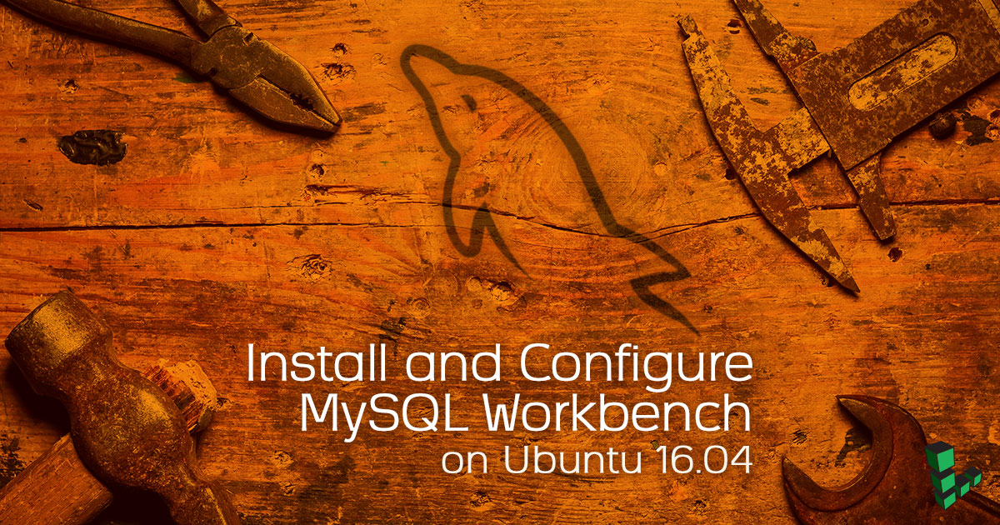
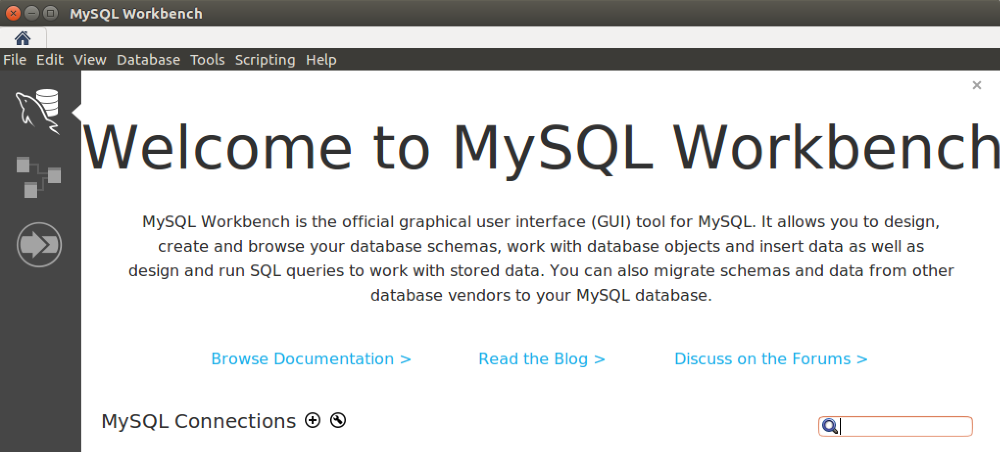
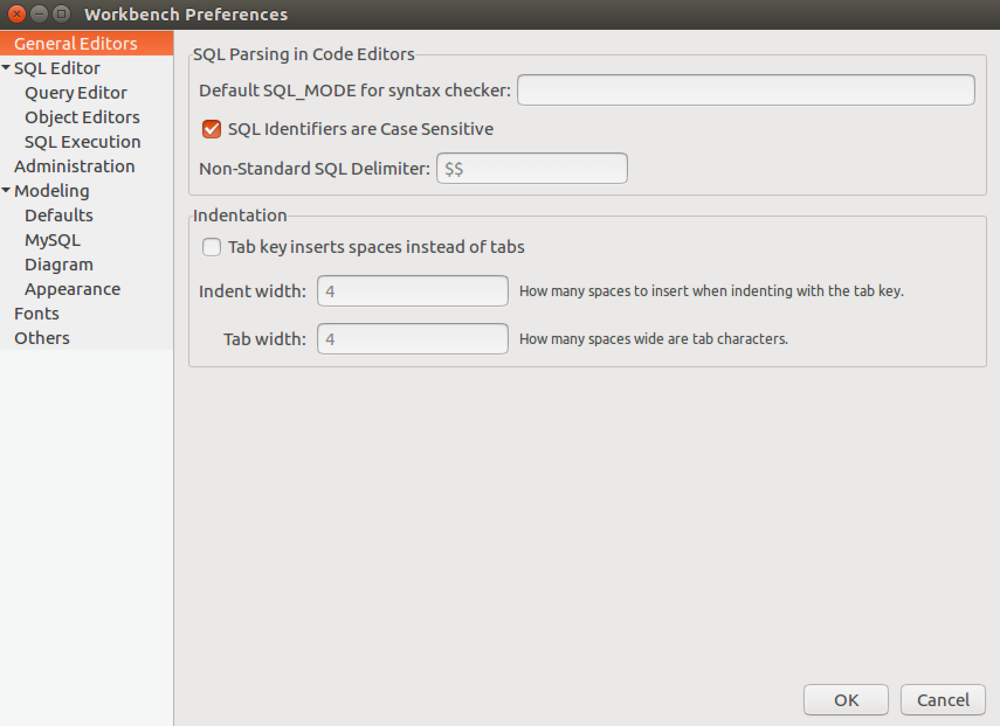
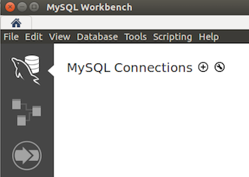
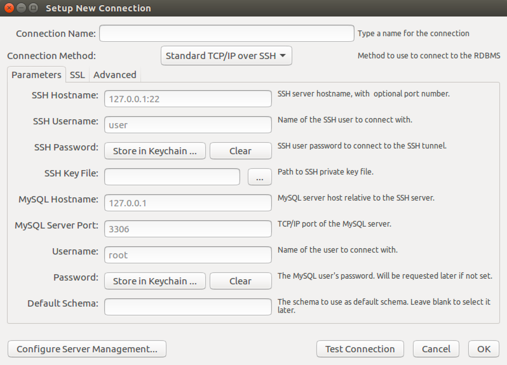
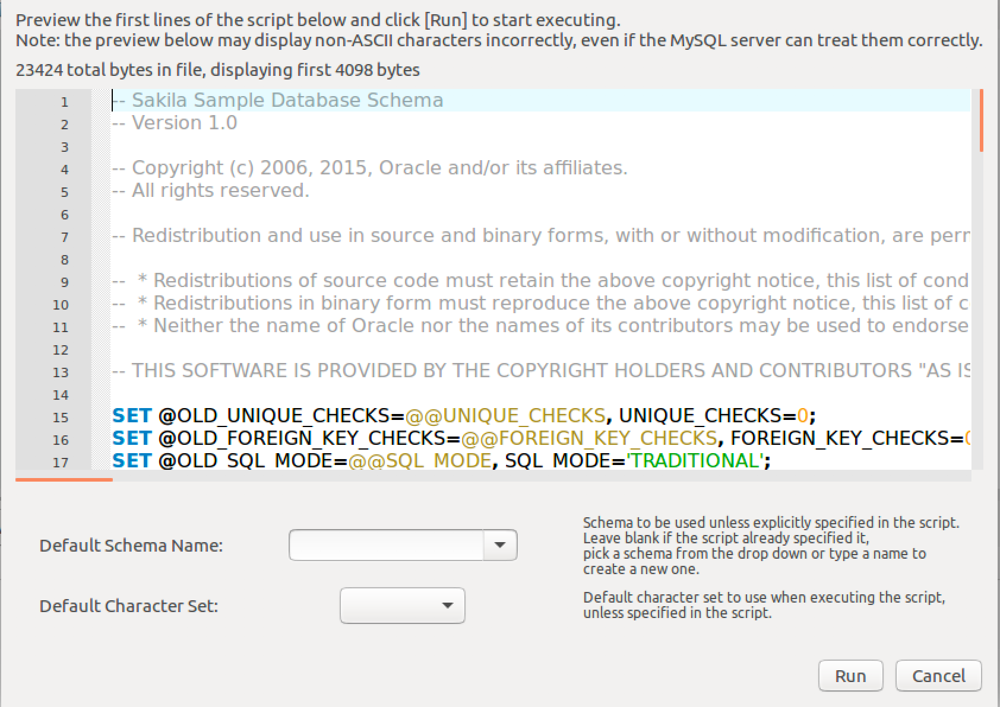
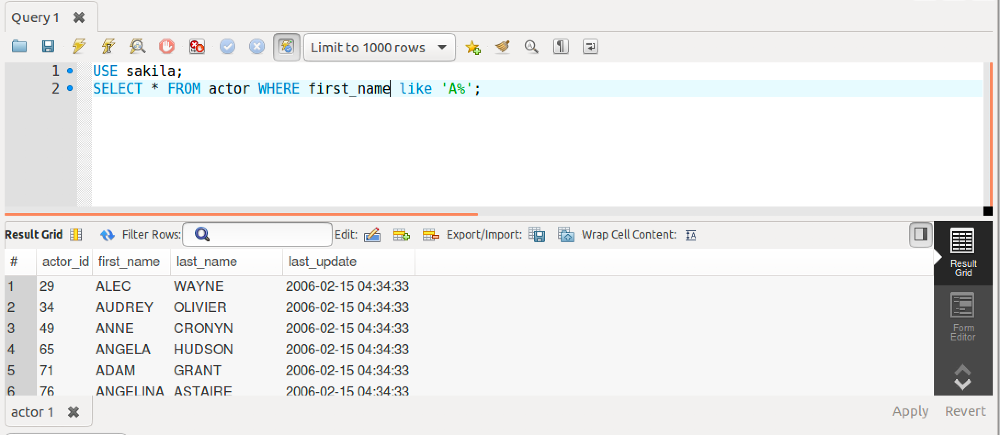

MySQL Workbench is a feature-rich graphical tool used to model data, build SQL queries, manage MySQL servers, and more. This guide will show you how to install Workbench using the Ubuntu package manager.

## Before You Begin

1.  Familiarize yourself with our [Getting Started](/docs/products/platform/get-started/) guide and complete the steps for setting your Linode's hostname and timezone.

2.  This guide will use `sudo` wherever possible. Complete the sections of our [Securing Your Server](/docs/products/compute/compute-instances/guides/set-up-and-secure/) to create a standard user account, harden SSH access and remove unnecessary network services.

3.  [Install VNC on Ubuntu](/docs/guides/install-vnc-on-ubuntu-18-04/) and connect to VNC from your desktop.

4.  Update your system:

        sudo apt-get update && sudo apt-get upgrade

## Install MySQL Workbench

Install MySQL Workbench using the APT package manager:

    sudo apt install mysql-workbench

## Run MySQL Workbench

Launch MySQL Workbench from the terminal:

    mysql-workbench

To view more launch options from the command line interface, use the `--help` option:

    /usr/bin/mysql-workbench --help

MySQL Workbench shows this welcome screen on first run:

## Configure MySQL Workbench

Use the built-in Workbench Preferences to adjust settings such as targeted MySQL server version, font color, code completion, and others.

To open the preferences, click on `Edit`, then `Preferences` in the main menu:

## Optional: Load a Sample Database into MySQL Server

See the guide on how to [Install a MySQL server on Ubuntu 14.04](/docs/guides/install-mysql-on-ubuntu-14-04/) or [Debian 8](/docs/guides/how-to-install-mysql-on-debian-8/) for more information on creating or logging into a MySQL server.

1.  Access the MySQL server on your Linode [via SSH](/docs/products/compute/compute-instances/guides/set-up-and-secure/#connect-to-the-instance) and download the sample [Sakila database provided in the MySQL documentation](http://downloads.mysql.com/docs/sakila-db.tar.gz):

        wget http://downloads.mysql.com/docs/sakila-db.tar.gz

2.  Decompress the `tar.gz` file:

        tar -xzvf sakila-db.tar.gz

3.  Open MySQL Workbench on your local machine and click `+` to create a new connection:

    

4.  Create a **Connection Name**. Click the **Connection Method** dropdown menu and select `Standard TCP/IP over SSH`. Complete the credentials for SSH and MySQL user login:

    

    
The MySQL server default port should be `3306` on `l27.0.0.1`. If you wish to connect to another server with a different port, update the inputs accordingly. See [Deploy MySQL Workbench for Database Administration](/docs/guides/deploy-mysql-workbench-for-database-administration/) for more information.


5.  Under **File**, select **Run SQL Script...**. Select `sakila-schema.sql` then click **Run**:

    

6.  Repeat Step 5 for `sakila-data.sql`.

7.  Under the `Query1` tab, use the sample query below to see a **Result Grid** of selected data:

        USE sakila;
        SELECT * FROM actors WHERE first_name LIKE 'A%';

    

The sample database provides a sandbox in which to test configurations and show how to integrate them into your workflow. MySQL Workbench offers a graphical interface to view database models in addition to building queries. While there are plenty of features, free and commercial, lightweight alternatives are available, depending on needs of the user. MySQL Workbench remains a great choice for most database administration tasks.
