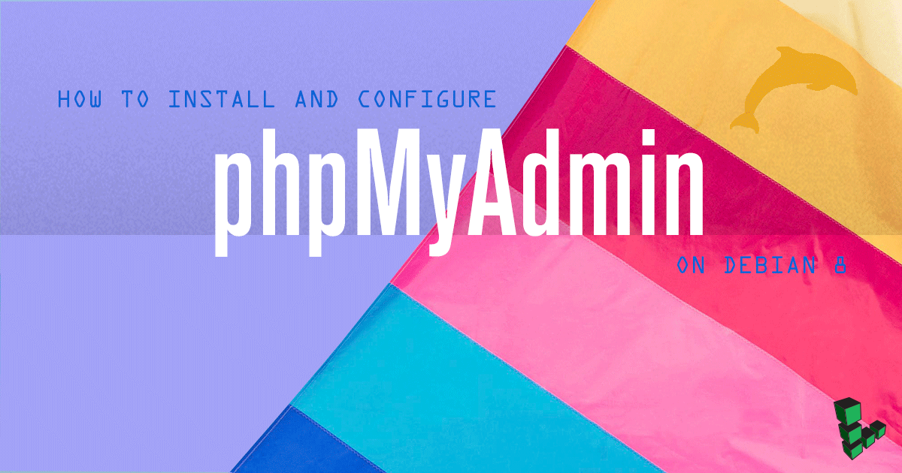

phpMyAdmin is a web application that provides a GUI to aid in MySQL database administration. It supports multiple MySQL servers and is a robust and easy alternative to using the MySQL command line client.


This guide is written for a non-root user. Commands that require elevated privileges are prefixed with `sudo`. If you're not familiar with the `sudo` command, you can check our [Users and Groups](/docs/guides/linux-users-and-groups/) guide.


## Before You Begin

1.  Ensure that you have followed the [Getting Started](/docs/products/platform/get-started/) and [Securing Your Server](/docs/products/compute/compute-instances/guides/set-up-and-secure/) guides and the Linode's [hostname is set](/docs/products/platform/get-started/#setting-the-hostname).

    To check your hostname run:

        hostname
        hostname -f

    The first command should show your short hostname, and the second should show your fully qualified domain name (FQDN).

2.  Update your system:

        sudo apt-get update && sudo apt-get upgrade -y

3.  Set up a working LAMP stack. Please see the [LAMP on Debian 8](/docs/guides/lamp-on-debian-8-jessie/) guide if needed.

    
If you have installed the `php-suhosin` package, there are some known issues when using phpMyAdmin. Please visit the [Suhosin phpMyAdmin Compatibility Issues page](http://www.hardened-php.net/hphp/troubleshooting.html) for more information about tuning and workarounds.


4.  Set up Apache with SSL, so your passwords will not be sent over plain text. To do so, go through the [SSL Certificates with Apache on Debian & Ubuntu](/docs/guides/ssl-apache2-debian-ubuntu/) guide.

5.  Install the `mcrypt` PHP module:

        sudo apt-get install mcrypt

6.  Restart Apache:

        sudo systemctl restart apache2

## Setting Up phpMyAdmin

1.  Install the current version of phpMyAdmin:

        sudo apt-get install phpmyadmin

    You will be asked which server to automatically configure phpMyAdmin for. Select "apache2." When asked to configure database for phpmyadmin with dbconfig-common, select yes.

2.  For each virtual host that you would like to give access to your PHPMyAdmin installation, create a symbolic link from the document root to the phpMyAdmin installation location (`/usr/share/phpmyadmin`):

        cd /var/www/html/example.org/public_html
        sudo ln -s /usr/share/phpmyadmin

    This will create a symbolic link named `phpmyadmin` in your document root.

## Securing phpMyAdmin

### .htaccess File

Secure your phpMyAdmin directory using an `.htaccess file` that only allows specified IP addresses to access it. You can do this by creating an `.htaccess` file in your `phpmyadmin` directory. Substitute the proper paths and **IP addresses** for your particular configuration:


order allow,deny
allow from 12.34.56.78



### Force SSL

You can force phpMyAdmin to use SSL in the phpMyAdmin configuration file `/etc/phpmyadmin/config.inc.php` by adding the following lines under the `Server(s) configuration` section:


$cfg['ForceSSL'] = 'true';



## Testing Your phpMyAdmin Installation

To test phpMyAdmin, open your favorite browser and navigate to `https://example.com/phpmyadmin`. You will be prompted for a username and password. Use the username "root" and the password you specified when you installed MySQL. Alternatively, you can log in using any MySQL user and retain their permissions.

If you can successfully log in, phpMyAdmin has been installed properly.
