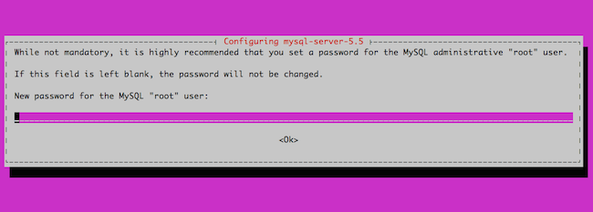

MySQL is a popular database management system used for web and server applications. This guide will introduce how to install, configure and manage MySQL on a Linode running Ubuntu 14.04 LTS (Trusty Tahr).

We recommend using a [High Memory Linode](https://www.linode.com/pricing/) with this guide.


This guide is written for a non-root user. Commands that require elevated privileges are prefixed with `sudo`. If you're not familiar with the `sudo` command, you can check our [Users and Groups](/docs/tools-reference/linux-users-and-groups/) guide.


## Before You Begin

1.  If you have not already done so, create a Linode account and Compute Instance. See our [Getting Started with Linode](/docs/guides/getting-started/) and [Creating a Compute Instance](/docs/guides/creating-a-compute-instance/) guides.

1.  Follow our [Setting Up and Securing a Compute Instance](/docs/guides/set-up-and-secure/) guide to update your system and configure your hostname. You may also wish to set the timezone, create a limited user account, and harden SSH access.

    To check your hostname run:

        hostname
        hostname -f

    The first command should show your short hostname, and the second should show your fully qualified domain name (FQDN) if you have one assigned.

## Install MySQL

    sudo apt-get install mysql-server

During the installation process, you will be prompted to set a password for the MySQL root user as shown below. Choose a strong password and keep it in a safe place for future reference.

MySQL will bind to localhost (127.0.0.1) by default. Please reference our [MySQL remote access guide](/docs/databases/mysql/create-an-ssh-tunnel-for-mysql-remote-access/) for information on connecting to your databases using SSH.


Allowing unrestricted access to MySQL on a public IP is not advised, but you may change the address it listens on by modifying the `bind-address` parameter in `/etc/my.cnf`. If you decide to bind MySQL to your public IP, you should implement firewall rules that only allow connections from specific IP addresses.


## Harden MySQL Server

Run the mysql_secure_installation script to address several security concerns in a default MySQL installation:

    sudo mysql_secure_installation

You will be given the choice to change the MySQL root password, remove anonymous user accounts, disable root logins outside of localhost, and remove test databases. It is recommended that you answer yes to these options. You can read more about the script in the [MySQL Reference Manual](https://dev.mysql.com/doc/refman/5.5/en/mysql-secure-installation.html).

## Use MySQL

The standard tool for interacting with MySQL is the `mysql` client, which installs with the `mysql-server` package. The MySQL client is accessed through a terminal.

### Root Login

1.  To log in to MySQL as the root user:

        mysql -u root -p

2.  When prompted, enter the root password you assigned when the `mysql_secure_installation` script was run.

    You'll then be presented with the MySQL monitor prompt:

        Welcome to the MySQL monitor.  Commands end with ; or \g.
        Your MySQL connection id is 1
        Server version: 5.0.45 Source distribution

        Type 'help;' or '\h' for help. Type '\c' to clear the buffer.

        mysql>

3.  To generate a list of commands for the MySQL prompt, enter `\h`. You'll then see:

        List of all MySQL commands:
        Note that all text commands must be first on line and end with ';'
        ?         (\?) Synonym for `help'.
        clear     (\c) Clear command.
        connect   (\r) Reconnect to the server. Optional arguments are db and host.
        delimiter (\d) Set statement delimiter. NOTE: Takes the rest of the line as new delimiter.
        edit      (\e) Edit command with $EDITOR.
        ego       (\G) Send command to mysql server, display result vertically.
        exit      (\q) Exit mysql. Same as quit.
        go        (\g) Send command to mysql server.
        help      (\h) Display this help.
        nopager   (\n) Disable pager, print to stdout.
        notee     (\t) Don't write into outfile.
        pager     (\P) Set PAGER [to_pager]. Print the query results via PAGER.
        print     (\p) Print current command.
        prompt    (\R) Change your mysql prompt.
        quit      (\q) Quit mysql.
        rehash    (\#) Rebuild completion hash.
        source    (\.) Execute an SQL script file. Takes a file name as an argument.
        status    (\s) Get status information from the server.
        system    (\!) Execute a system shell command.
        tee       (\T) Set outfile [to_outfile]. Append everything into given outfile.
        use       (\u) Use another database. Takes database name as argument.
        charset   (\C) Switch to another charset. Might be needed for processing binlog with multi-byte charsets.
        warnings  (\W) Show warnings after every statement.
        nowarning (\w) Don't show warnings after every statement.

        For server side help, type 'help contents'

        mysql>

### Create a New MySQL User and Database
1.  In the example below, `testdb` is the name of the database, `testuser` is the user, and `password` is the user's password.

    
create database testdb;
create user 'testuser'@'localhost' identified by 'password';
grant all on testdb.* to 'testuser';


    You can shorten this process by creating the user *while* assigning database permissions:

    
create database testdb;
grant all on testdb.* to 'testuser' identified by 'password';


2.  Exit MySQL.

        exit

### Create a Sample Table

1.  Log back in as `testuser`.

        mysql -u testuser -p

2.  Create a sample table called `customers`. This creates a table with a customer ID field of the type `INT` for integer (auto-incremented for new records, used as the primary key), as well as two fields for storing the customer's name.

    
use testdb;
create table customers (customer_id INT NOT NULL AUTO_INCREMENT PRIMARY KEY, first_name TEXT, last_name TEXT);


3.  Then exit MySQL.

        exit

## Reset the MySQL Root Password

If you forget your MySQL root password, it can be reset.

1.  Stop the current MySQL server instance:

        sudo service mysql stop

2.  Use dpkg to re-run the configuration process that MySQL goes through on first installation. You will again be asked to set a root password.

        sudo dpkg-reconfigure mysql-server-5.5

3.  Then start MySQL:

        sudo service mysql start

You'll now be able to log in again using `mysql -u root -p`.

## Tune MySQL

[MySQL Tuner](https://github.com/major/MySQLTuner-perl) is a Perl script that connects to a running instance of MySQL and provides configuration recommendations based on workload. Ideally, the MySQL instance should have been operating for at least 24 hours before running the tuner. The longer the instance has been running, the better advice MySQL Tuner will give.

1.  Install MySQL Tuner from Ubuntu's repositories:

        sudo apt-get install mysqltuner

2.  To run it:

        mysqltuner

    You will be asked for the MySQL root user's name and password. The output will show two areas of interest: General recommendations and Variables to adjust.

MySQL Tuner is an excellent starting point to optimize a MySQL server, but it would be prudent to perform additional research for configurations tailored to the application(s) utilizing MySQL on your Linode.
