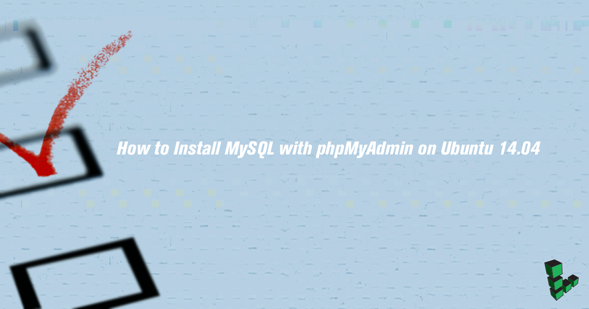

phpMyAdmin is a web application that provides a GUI to aid in MySQL database administration. It supports multiple MySQL servers and is a robust and easy alternative to using the MySQL command line client.


This guide is written for a non-root user. Commands that require elevated privileges are prefixed with `sudo`. If you're not familiar with the `sudo` command, you can check our [Users and Groups](/docs/guides/linux-users-and-groups/) guide.


## Before You Begin

1.  If you have not already done so, create a Linode account and Compute Instance. See our [Getting Started with Linode](/docs/products/platform/get-started/) and [Creating a Compute Instance](/docs/products/compute/compute-instances/guides/create/) guides.

1.  Follow our [Setting Up and Securing a Compute Instance](/docs/products/compute/compute-instances/guides/set-up-and-secure/) guide to update your system and configure your hostname. You may also wish to set the timezone, create a limited user account, and harden SSH access.

    To check your hostname run:

        hostname
        hostname -f

    The first command should show your short hostname, and the second should show your fully qualified domain name (FQDN) if you have one assigned.

3.  Set up a working LAMP stack. Please see the [LAMP on Ubuntu 14.04](/docs/guides/lamp-on-ubuntu-14-04/) guide if needed.

    
If you have installed the `php-suhosin` package, there are some known issues when using phpMyAdmin. Please visit the [Suhosin phpMyAdmin Compatibility Issues page](http://www.hardened-php.net/hphp/troubleshooting.html) for more information about tuning and workarounds.


4.  Set up Apache with SSL, so your passwords will not be sent over plain text. To do so, go trough the [SSL Certificates with Apache on Debian & Ubuntu](/docs/guides/ssl-apache2-debian-ubuntu/) guide.

5.  Install the `mcrypt` PHP module:

        sudo apt-get install mcrypt

6.  Restart Apache:

        sudo service apache2 restart

## Setting Up phpMyAdmin

1.  Install the current version of phpMyAdmin:

        sudo apt-get install phpmyadmin

    You will be asked which server to automatically configure phpMyAdmin for. Select the web server that you have installed. If you have more than one web server installed, select the best option for your deployment. Follow through the rest of the guided installer to set passwords.

2.  For each virtual host that you would like to give access to your PHPMyAdmin installation, create a symbolic link from the document root to the phpMyAdmin installation location (`/usr/share/phpmyadmin`):

        cd /var/www/html/example.com/public_html
        sudo ln -s /usr/share/phpmyadmin

    This will create a symbolic link named `phpmyadmin` in your document root.

## Securing phpMyAdmin

### .htaccess File

Secure your phpMyAdmin directory using an `.htaccess file` that only allows specified IP addresses to access it. You can do this by creating an `.htaccess` file in your `phpmyadmin` directory. Substitute the proper paths and **IP addresses** for your particular configuration:


order allow,deny
allow from 12.34.56.78



### Force SSL

You can force phpMyAdmin to use SSL in the phpMyAdmin configuration file `/etc/phpmyadmin/config.inc.php` by adding the following lines under the `Server(s) configuration` section:


$cfg['ForceSSL'] = 'true';



## Testing Your phpMyAdmin Installation

To test phpMyAdmin, open your favorite browser and navigate to `https://example.com/phpmyadmin`. You will be prompted for a username and password. Use the username "root" and the password you specified when you installed MySQL. Alternatively, you can log in using any MySQL user and retain their permissions.

If you can successfully log in, phpMyAdmin has been installed properly.
