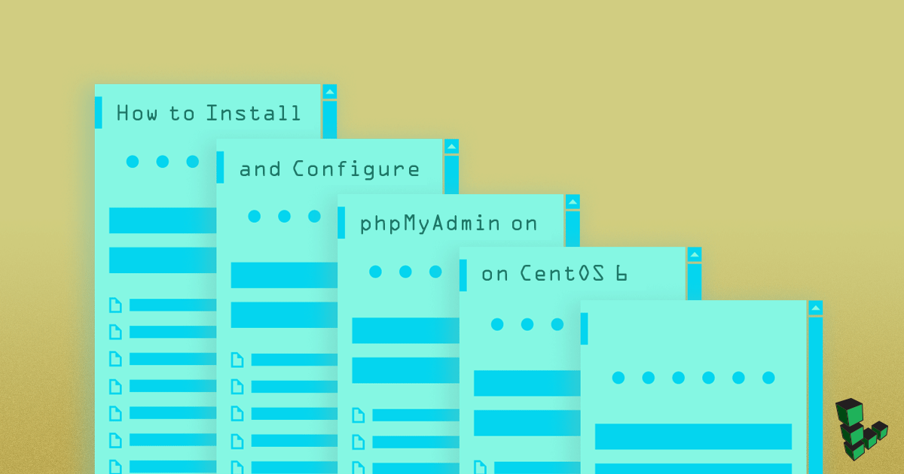

phpMyAdmin is a web application that provides a GUI to aid in MySQL database administration. It supports multiple MySQL servers and is a robust and easy alternative to using the MySQL command line client.


This guide is written for a non-root user. Commands that require elevated privileges are prefixed with `sudo`. If you're not familiar with the `sudo` command, you can check our [Users and Groups](/docs/guides/linux-users-and-groups/) guide.


## Before You Begin

1.  If you have not already done so, create a Linode account and Compute Instance. See our [Getting Started with Linode](/docs/products/platform/get-started/) and [Creating a Compute Instance](/docs/products/compute/compute-instances/guides/create/) guides.

1.  Follow our [Setting Up and Securing a Compute Instance](/docs/products/compute/compute-instances/guides/set-up-and-secure/) guide to update your system and configure your hostname. You may also wish to set the timezone, create a limited user account, and harden SSH access.

    To check your hostname run:

        hostname
        hostname -f

    The first command should show your short hostname, and the second should show your fully qualified domain name (FQDN) if you have one assigned.

1.  Set up a working LAMP stack. Please see the [LAMP on CentOS 6](/docs/guides/lamp-on-centos-6/) guide if needed.

    
If you have installed the `php-suhosin` package, there are some known issues when using phpMyAdmin. Please visit the [Suhosin phpMyAdmin Compatibility Issues page](http://www.hardened-php.net/hphp/troubleshooting.html) for more information about tuning and workarounds.


1.  Enable the EPEL Repository:

        cd ~
        wget http://download.fedoraproject.org/pub/epel/6/x86_64/epel-release-6-8.noarch.rpm
        sudo rpm -ivh epel-release*

1.  Set up Apache with SSL, so your passwords will not be sent over plain text. To do so, go through the [SSL Certificates with Apache on CentOS](/docs/guides/ssl-apache2-centos/) guide.

1.  Install the `mycrypt` PHP module:

        sudo yum install php-mcrypt

1.  Restart Apache:

        sudo service httpd restart

## Installing phpMyAdmin

1.  Install phpMyAdmin:

        sudo yum install phpmyadmin

2.  For each virtual host that you would like to give access to your PHPMyAdmin installation, you must create a symbolic link from the document root to the phpMyAdmin installation location (`/usr/share/phpmyadmin`):

        cd /var/www/example.com/public_html
        sudo ln -s /usr/share/phpmyadmin

    This will create a symbolic link named `phpmyadmin` in your document root.

## Configuring phpMyAdmin

By default, phpMyAdmin is configured to only permit access from the localhost (127.0.0.1). You will want to add the IP address of your computer in order to access it.

1.  Make note of the external IP address being used by your home or work computer. This can be found by visiting the following website:

        http://www.whatismyip.com

2.  Edit the configuration file located at `/etc/httpd/conf.d/phpMyAdmin.conf`, replacing the four instances of `127.0.0.1` with the IP address of your home or work computer.

### Force SSL

Since you are required to enter your MySQL credentials when using phpMyAdmin, we recommend that you use SSL to secure HTTP traffic to your phpMyAdmin installation. For more information on using SSL with your websites, please consult the guides that address [SSL certificates](/docs/security/ssl//).

1.  Force phpMyAdmin to use SSL in the phpMyAdmin configuration file `/etc/phpmyadmin/config.inc.php` by adding the following lines under the `Server(s) configuration` section:

    
$cfg['ForceSSL'] = 'true';



2.  Restart Apache:

        sudo service httpd restart

## Testing Your phpMyAdmin Installation

To test phpMyAdmin, open your favorite browser and navigate to `https://example.com/phpmyadmin`. You will be prompted for a username and password. Use the username "root" and the password you specified when you installed MySQL. Alternatively, you can log in using any MySQL user and retain their permissions.

If you can successfully log in, phpMyAdmin has been installed properly.
