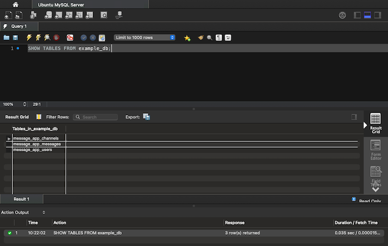

Wondering how to get a list of tables in you MySQL or MariaDB database? Learn how in this guide. This guide gives you the command-line commands and MySQL Workbench instructions for quickly and easily getting a list of tables.

## Before You Begin

1. Familiarize yourself with our [Getting Started with Linode](/docs/getting-started/) guide, and complete the steps for setting your Linode's hostname and timezone.

1. This guide uses `sudo` wherever possible. Complete the sections of our [How to Secure Your Server](/docs/security/securing-your-server/) guide to create a standard user account, harden SSH access, and remove unnecessary network services.

1. Install MySQL or MariaDB on your server. You can follow our guide on [How to Install MySQL](/docs/guides/how-to-install-mysql-on-debian-8/) or on [How to Install MariaDB](/docs/guides/how-to-install-mariadb-on-debian-9/). Use the **Distribution** drop down at the top of each guide to select the Linux distribution you want to install on.


This guide is written for a non-root user. Commands that require elevated privileges are prefixed with `sudo`. If you’re not familiar with the `sudo` command, see the [Users and Groups](/docs/tools-reference/linux-users-and-groups/) guide.


## How to Connect to the Database Remotely

Check out our guide [How to Remotely Connect to MySQL and MariaDB](/docs/guides/mysql-remote-connection/) for steps to establish a remote connection to your database via the MySQL command line, or CLI, tool.

Refer to our [Install MySQL Workbench for Database Administration](/docs/guides/deploy-mysql-workbench-for-database-administration/) guide for steps to install MySQL Workbench and use it to remotely connect to your database.

## How to List Tables in MySQL or MariaDB

To give something concrete to work with, the rest of this guide uses an example database, remote user, and three tables. You can set these up yourself by logging into your MySQL or MariaDB server and issuing the following commands. Replace `192.0.2.0` with the IP address for your local machine and `password` with an actual password for the user:

    CREATE DATABASE example_db;
    CREATE user 'example_user'@'192.0.2.0' IDENTIFIED BY 'password';
    GRANT SELECT,INSERT,UPDATE,DELETE ON example_db.* TO 'example_user' IDENTIFIED BY 'password';
    USE example_db;
    CREATE TABLE message_app_users (user_id INT NOT NULL AUTO_INCREMENT PRIMARY KEY, user_name TEXT);
    CREATE TABLE message_app_channels (channel_id INT NOT NULL AUTO_INCREMENT PRIMARY KEY, channel_name TEXT);
    CREATE TABLE message_app_messages (message_id INT NOT NULL AUTO_INCREMENT PRIMARY KEY, channel_id INT, user_id INT, message_body TEXT, FOREIGN KEY (channel_id) REFERENCES message_app_channels(channel_id), FOREIGN KEY (user_id) REFERENCES message_app_users(user_id));

### List tables in MySQL or MariaDB from the Linux Shell

You have two main options from the command line to get a list of tables in a particular database.

- You can use a single command like the one below if all you want to do with the particular database is get the list of tables:

        SHOW TABLES FROM example_db;

- You may, however, intend to do more work with the database after getting the list. In that case, it is probably more useful to first set the current database and then query for the list:

        USE example_db;
        SHOW TABLES;

Both options output a list of tables:


+----------------------+
| Tables_in_example_db |
+----------------------+
| message_app_channels |
| message_app_messages |
| message_app_users    |
+----------------------+


You can also use a single command-line command to connect to the database, fetch the list of tables, and disconnect again. This can be useful if you only want a quick list of tables and do not need to connect to the database otherwise.

To do this, just add the `-e` option to your usual database connection command and follow the option with the MySQL command you want executed.

The example below connects to the database as `example_user` and uses the MySQL command from above to fetch the list of tables in the `example_db` database. Replace `198.51.100.0` with the IP address of your database server:

    mysql -u example_user -p -h 198.51.100.0 -e 'SHOW TABLES FROM example_db;'

### List Tables in MySQL or MariaDB Using the MySQL Tool

1. Open the MySQL Workbench, and select the connection you set up for the database.

    If you have not set up the database connection yet, follow the steps in the guide linked in the [How to Connect to the Database Remotely](/docs/guides/mysql-list-tables/#how-to-connect-to-the-database-remotely) section above.

1. In the query field, enter the following MySQL command:

        SHOW TABLES FROM example_db;

    You can, alternatively, set the current database first and then fetch the tables, as in:

        USE example_db;
        SHOW TABLES;

1. Select the plain lightning icon above the query field, or select **Execute (All or Selection)** from the **Query** menu.

1. The **Result Grid** shows the output from the command, the desired list of tables:

    

## Conclusion

Are you looking to learn even more about working with MySQL/MariaDB? Take a look through our extensive [list of MySQL guides](/docs/guides/databases/mysql/?q=mysql). You can find plenty of resources there to remedy common problems, hone your skills, and become all around more proficient with your database.
