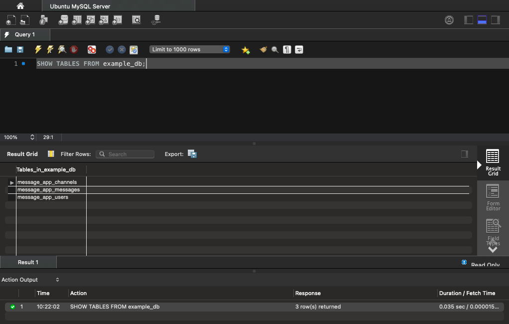

This guide provides the commands you can use to list tables in MySQL and MariaDB. It also includes instructions on how to list tables using MySQL Workbench.

## Before You Begin

1.  If you have not already done so, create a Linode account and Compute Instance. See our [Getting Started with Linode](/docs/guides/getting-started/) and [Creating a Compute Instance](/docs/guides/creating-a-compute-instance/) guides.

1.  Follow our [Setting Up and Securing a Compute Instance](/docs/guides/set-up-and-secure/) guide to update your system. You may also wish to set the timezone, configure your hostname, create a limited user account, and harden SSH access.

1. Install MySQL or MariaDB on your server. You can follow our guide on [How to Install MySQL](/docs/guides/how-to-install-mysql-on-debian-8/) or on [How to Install MariaDB](/docs/guides/how-to-install-mariadb-on-debian-9/). Use the **Distribution** drop down at the top of each guide to select the Linux distribution you want to install on.


The steps in this guide are written for non-root users. Commands that require elevated privileges are prefixed with `sudo`. If you’re not familiar with the `sudo` command, see the [Linux Users and Groups](/docs/guides/linux-users-and-groups/) guide.


## How to Connect to a Remote Database

 - Check out our guide [How to Connect to a MySQL or MariaDB Database](/docs/guides/mysql-command-line-client/) for the steps to establish a remote connection to your database via the MySQL command line, or CLI tool.

- Refer to our [Install MySQL Workbench for Database Administration](/docs/guides/deploy-mysql-workbench-for-database-administration/) guide for the steps to install MySQL Workbench and use it to connect to your remote database.

## How to List Tables in MySQL or MariaDB

The rest of this guide uses an example database, remote user, and three tables. To follow along, you can set these up yourself by logging into your MySQL or MariaDB server and issuing the commands below. Replace `192.0.2.0` with the IP address of your local machine and `password` with your own password.

    CREATE DATABASE example_db;
    CREATE user 'example_user'@'192.0.2.0' IDENTIFIED BY 'password';
    GRANT SELECT,INSERT,UPDATE,DELETE ON example_db.* TO 'example_user' IDENTIFIED BY 'password';
    USE example_db;
    CREATE TABLE message_app_users (user_id INT NOT NULL AUTO_INCREMENT PRIMARY KEY, user_name TEXT);
    CREATE TABLE message_app_channels (channel_id INT NOT NULL AUTO_INCREMENT PRIMARY KEY, channel_name TEXT);
    CREATE TABLE message_app_messages (message_id INT NOT NULL AUTO_INCREMENT PRIMARY KEY, channel_id INT, user_id INT, message_body TEXT, FOREIGN KEY (channel_id) REFERENCES message_app_channels(channel_id), FOREIGN KEY (user_id) REFERENCES message_app_users(user_id));

### List tables in MySQL or MariaDB from the Linux Shell

There are two ways to get a particular database's list of tables from the command line. They are as follows:

- Use the command like the one below if all you want to do with the database is get its list of tables.

        SHOW TABLES FROM example_db;

- If, instead, you want to continue to work with the database after listing its tables, use the command below. This command sets the current database and then queries it for the list.

        USE example_db;
        SHOW TABLES;

Both options output a list of tables:


+----------------------+
| Tables_in_example_db |
+----------------------+
| message_app_channels |
| message_app_messages |
| message_app_users    |
+----------------------+


You can also use a single command to connect to the database, fetch the list of tables, and disconnect again. This can be useful if you only want a quick list of tables and do not need to connect to the database otherwise.

To do this, add the `-e` option to your usual database connection command and follow the option with the MySQL command you want to be executed.

The example below connects to the database as `example_user` and uses the MySQL command from above to fetch the list of tables in the `example_db` database. Replace `198.51.100.0` with the IP address of your database server:

    mysql -u example_user -p -h 198.51.100.0 -e 'SHOW TABLES FROM example_db;'

### List Tables in MySQL or MariaDB Using the MySQL Tool

1. Open the MySQL Workbench, and select the connection you set up for the database.

    If you have not set up the database connection yet, follow the steps in the [How to Connect to a Remote Database](/docs/guides/list-tables-in-mysql-and-mariadb/#how-to-connect-to-a-remote-database) guide first.

1. In the query field, enter the following MySQL command:

        SHOW TABLES FROM example_db;

    Alternatively, you can set the current database first, and then fetch the tables, as in:

        USE example_db;
        SHOW TABLES;

1. Select the plain lightning icon above the query field, or select **Execute (All or Selection)** from the **Query** menu.

1. The **Result Grid** shows the output from the command, the desired list of tables:

    

## Conclusion

To learn more about working with MySQL/MariaDB, take a look through our extensive [list of MySQL guides](/docs/guides/databases/mysql/). You can find plenty of resources there to solve common database related issues, sharpen your skills, and become more proficient with managing your database.
