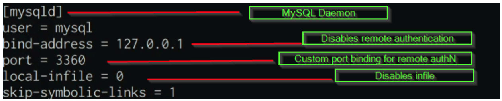
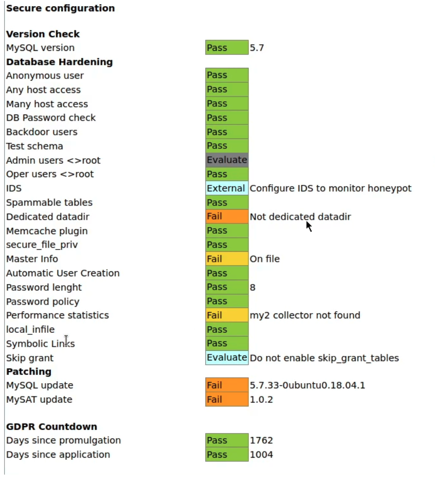

## MySQL

MySQL is an open-source relational database management system. This guide will show you how to secure and audit a MySQL server. The name is a combination of "My", the name of co-founder Michael Widenius's daughter, and "SQL", the abbreviation for Structured Query Language.

## Before You Begin

1.  Ensure that you have followed the [Getting Started](/docs/products/platform/get-started/) and [Securing Your Server](/docs/products/compute/compute-instances/guides/set-up-and-secure/) guides. Ensure that the Linode's [hostname is set](/docs/products/platform/get-started/#set-the-hostname).

    Check your Linode's hostname. The first command should show your short hostname and the second should show your fully qualified domain name (FQDN).

        hostname
        hostname -f

     If you have a registered domain name for your website, then [add the domain](/docs/products/networking/dns-manager/guides/create-domain/) to the Linode server on which you plan to install the LAMP stack. If you do not have a registered domain name, then replace `example.com` with the IP address of the Linode server in the following instructions.

1.  Update your system:

        sudo yum update

    
This guide is written for a non-root user. Commands that require elevated privileges are prefixed with `sudo`. If you're not familiar with the `sudo` command, you can check our [Users and Groups](/docs/guides/linux-users-and-groups/) guide.
    

1. In order to secure and audit  MySQL, you need to have a Linux server with the `MySQL Server` services running. For information about installing MySQL please see [Install MySQL ](/docs/guides/install-mysql-on-ubuntu-14-04)

    The instructions in this guide are based on Ubuntu 18.04, though all the steps are distribution agnostic with the exception of package names and package managers.

## Using The Secure MySQL Installer

The mysql-server package comes pre configured with a utility called `mysql_secure_installation` that is used to set up a secure starting point for MySQL server, by deleting anonymous users and allowing you to specify the desired password strength policy.

`mysql_secure_installation` is a shell script available on Unix systems, and enables you to secure the MySQL installation by enabling you to:

- set a password for root accounts
- remove root accounts that are accessible from outside the local host
- remove anonymous-user accounts
- remove the test database, which by default can be accessed by anonymous users

Begin the security process by running this utility immediately after installing mysql-server.

1. Invoke the utility by running the following command:

        sudo mysql_secure_installation

1. The setup process begins and the utility prompts you to specify whether you want to enable the validate password plugin that is used to test passwords and improve security. It is recommended to enable this feature.

Securing the MySQL server deployment.

Connecting to MySQL using a blank password.

VALIDATE PASSWORD PLUGIN can be used to test passwords
and improve security. It checks the strength of password
and allows the users to set only those passwords which are
secure enough. Would you like to setup VALIDATE PASSWORD plugin?

Press y|Y for Yes, any other key for No: y


1. After you enable the password plugin, specify your password validation policy based on the level of the strength of the desired passwords.

There are three levels of password validation policy:

LOW    Length >= 8
MEDIUM Length >= 8, numeric, mixed case, and special characters
STRONG Length >= 8, numeric, mixed case, special characters and dictionary                  file

Please enter 0 = LOW, 1 = MEDIUM and 2 = STRONG: 2
Please set the password for root here.

New password:

Re-enter new password:

Estimated strength of the password: 100
Do you wish to continue with the password provided?(Press y|Y for Yes, any other key for No) : y


1. Remove anonymous users. This is an important security option as attackers can leverage anonymous users to gain access to the database server.

By default, a MySQL installation has an anonymous user,
allowing anyone to log into MySQL without having to have
a user account created for them. This is intended only for
testing, and to make the installation go a bit smoother.
You should remove them before moving into a production
environment.

Remove anonymous users? (Press y|Y for Yes, any other key for No) : y


1. Disable root login remotely, this is an extremely important security configuration as it prevents attackers from remotely authenticating to the MySQL server as root or performing password brute-force attacks. Remote authentication can also be disabled completely, we will take a look at how to do that in the next section.

Normally, root should only be allowed to connect from
'localhost'. This ensures that someone cannot guess at
the root password from the network.

Disallow root login remotely? (Press y|Y for Yes, any other key for No) : y


1. Delete the test database created during the mysql-server installation process, this database is created for testing purposes, as a good practice, it is recommended to delete this database.

By default, MySQL comes with a database named 'test' that
anyone can access. This is also intended only for testing,
and should be removed before moving into a production
environment.

Remove test database and access to it? (Press y|Y for Yes, any other key for No) : y


1. Reload the privilege tables to ensure that all changes are applied and are in effect.

Reloading the privilege tables will ensure that all changes
made so far will take effect immediately.

Reload privilege tables now? (Press y|Y for Yes, any other key for No) : y
Success.

All done!
 
You now have a secure base to work with, in the next section, find the instructions to change the default *root* username and password.

## Modifying The “root” user

By default, MySQL server comes predefined with a `superuser/admin` account that has access to all privileges and functionality of the databases and database users. Given this unparalleled control and access, it is important to lock down and secure the root account as attackers usually target the root account on a MySQL server because it has the potential to provide complete access over the databases and database users.

The first step in securing the “root” user is to change the username from `root` to something more unyielding, the objective is to make the root username as hard to guess or to brute-force for attackers. After which, it is also recommended to change the `root` account password regularly as a good practice.

1. Login to the MySQL server with the following command:

        sudo mysql -u root

1. Change the “root” account username by running the following query:

        rename user 'root'@'localhost' to '<new-username>'@'localhost';

1. Change the `root` account password to something strong and hard to guess, it is recommended to use a password generator. If you enabled the verify password plugin during the secure installation process, you need to provide a password that meets the policy requirements in terms of strength.

        ALTER USER 'example_username'@'localhost' IDENTIFIED BY '<new-password>';

1. Reload the privilege table to ensure that all changes are saved and activated by running the following command:

        flush privileges;

1. To confirm whether the `root` username and password are changed, run the following query:

        use mysql;
        select user,host,authentication_string from mysql.user;

  This displays the user tables stored under the mysql database and should reflect the changes made.
  
+------------------+-----------+-------------------------------------------+
| user             | host      | authentication_string                     |
+------------------+-----------+-------------------------------------------+
| example_user     | localhost | *A2550B00C6DF81DACE33551E8293462F6CAE33DA |
| mysql.session    | localhost | *THISISNOTAVALIDPASSWORDTHATCANBEUSEDHERE |
| mysql.sys        | localhost | *THISISNOTAVALIDPASSWORDTHATCANBEUSEDHERE |
| debian-sys-maint | localhost | *241DC5A20F017D55EE82E46E7996784ED4A5CD8A |
+------------------+-----------+-------------------------------------------+
4 rows in set (0.00 sec)
  

## Creating A New User

A good security practice is the concept of segregation by duties or role. This means that for every database or application that uses the database, create a new user that has CRUD permissions for that particular database. This ensures that at any time, only one user has access to one database at a time and users cannot access other databases.

1. Create a `Test` database, by running the following query within MYSQL:

        create database Test;

1. Create the user responsible for managing this Test database:

        CREATE USER '<username>'@'localhost' IDENTIFIED BY '<password>';

1. Assign the appropriate CRUD permissions to the user for the `Test` database:

        GRANT SELECT,UPDATE,DELETE ON Test.* TO '<username>'@'localhost';

1. It is important to note that these privileges are applicable only to the `Test` database, if you are creating a user for an application such as `phpMyAdmin`, you need to provide the user with `root` permissions.

1. If you decide to delete a particular user, run the following query:

        drop user '<username>'@'localhost';

1. Reload the privilege table to ensure the changes made are applied and activated by running the following query:

        flush privileges;

## Custom MySQL Configuration

You can now setup a secure custom configuration for MySQL that provides additional security configuration options.

1. The global MySQL configuration file is located in `/etc/mysql/my.cnf`, all custom global configurations are to be set up in the configuration file.

1. The custom configuration needs to be specified for the mysqld (MySQL daemon), the options displayed in the image are custom security configurations.

    

1. After adding the custom configurations, you need to restart the `mysql` service to ensure all changes are applied.

        systemctl restart mysql

## Auditing MySQL Security

You can now audit the security of the MySQL server by using a tool called MySAT. MySAT performs several tests to analyze database configurations and security policies. MySAT helps to assess and therefore to increase MySQL database security.
MySAT is a simple SQL script, it is easy to understand and easy to maintain. MySAT results are output in HTML format.

1. Clone the MySAT Github repository, by running the following command:

        git clone https://github.com/meob/MySAT.git

1. After cloning the directory, navigate into the MySAT directory, where the `mysat.sql` file is located and it is used in conjunction with the MySQL server to output the results into a `MySAT.htm` file.

1. Audit the security by running the following command:

        mysql --user=<root-user> -p<password> --skip-column-names -f < mysat.sql > MySAT.htm

1. As indicated, MySAT requires root access to MySQL to run the required tests, after running the command, the MySAT.htm file is generated, copy the MySAT.htm file and the `mysat.css` file to an Apache or NGINX server, or download them locally with `scp`, so that you can analyze the results of the audit.

      

1. The results are formatted in a simple to read and understand format, where configurations are checked and results are color coded based on their current configuration and how it affects the security of the mysql server. For example, a failed configuration check is color coded in orange and a passed check is color coded in green.

1. The audit report reveals what configurations need to be changed or modified and presents you with a top level picture of the overall security of the MySQL server.
