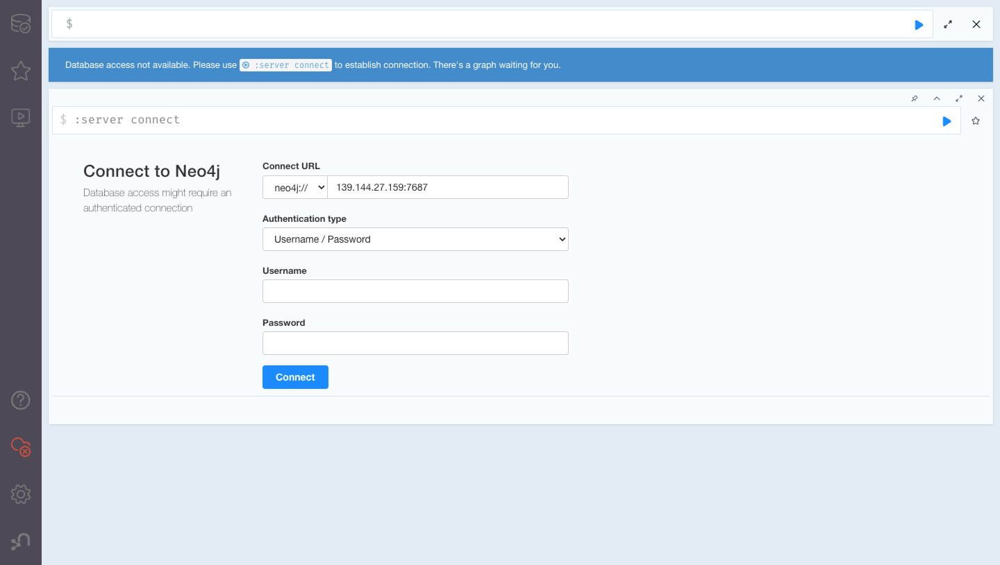
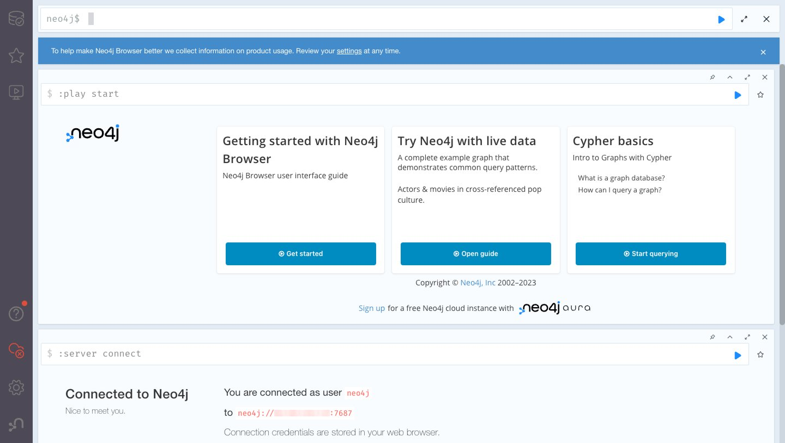
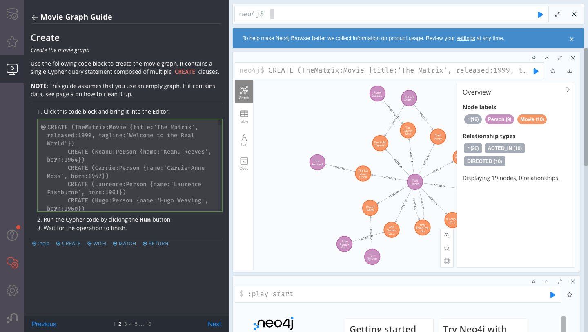

Ubuntu users have a choice between several reliable Database Management Systems. While Relational Database Management Systems enjoy longstanding market leadership positions, Graph Database Management Systems are greatly increasing in popularity. Neo4j is the leader among these, and this guide covers everything you need to install, configure, and begin using it on Ubuntu 22.04 LTS.

## What Is Neo4j?

Neoj4 is the [world's most popular graph database](https://db-engines.com/en/ranking/graph+dbms). Available under an [open source license](https://neo4j.com/licensing/), you can freely install Neo4j on Akamai cloud compute instances. Once in place, you can create high-performance database applications that emphasize the management of, and searches for, connected data. For example, which people have been co-workers of other people, or which documents share semantic content with other documents. Learn the key benefits of Neo4j in our [Introduction to Neo4j](/docs/guides/an-introduction-to-neo4j/) guide.

## Before You Begin

1.  If you have not already done so, create an Akamai account and Compute Instance. See our [Getting Started](/docs/guides/getting-started/) and [Creating a Compute Instance](/docs/guides/creating-a-compute-instance/) guides. You need two Ubuntu 22.04 LTS instances in the same datacenter. While it's possible to experiment with Neo4j on a single-core instance backed by one gigabyte of RAM, practical Neo4j applications generally occupy at least four cores and eight or more gigabytes of RAM. Also be sure to add a private IP address.

1.  Follow our [Setting Up and Securing a Compute Instance](/docs/guides/set-up-and-secure/) guide to update your system. You may also wish to set the timezone, configure your hostname, create a limited user account, and harden SSH access.


This guide is written for a non-root user. Commands that require elevated privileges are prefixed with `sudo`. If you’re not familiar with the `sudo` command, see the [Users and Groups](/docs/tools-reference/linux-users-and-groups/) guide.


The commands, file contents, and other instructions provided throughout this guide may include placeholders. These are typically domain names, IP addresses, usernames, passwords, and other values that are unique to you. The table below identifies these placeholder values and explains what to replace them with:

| Placeholders: | Replace With: |
| -- | -- |
| `INSTANCE_1_PUBLIC_IP` | The Neo4j instance's public IP address. |
| `INSTANCE_1_PRIVATE_IP`| The Neo4j instance's private IP address. |
| `YOUR_IP_ADDRESS` | The public IP address of your local machine. |
| `NEO4J_PASSWORD` | The password of the administrative `neo4j` user. |
| `LOCAL_NETWORK_ADDRESS/SUBNET` | The local network address and subnet for the Instacne's private IPv4 addresses. |

## Install Neo4j

Follow the steps below on both Ubuntu 22.04 LTS cloud compute instances.

1.  Install Neo4j's missing dependencies:

    ```command {title="Instance 1 & 2"}
    sudo apt install apt-transport-https gnupg2 unzip
    ```

1.  Install the official Neo4j package repository's GPG key:

    ```command {title="Instance 1 & 2"}
    curl -fsSL https://debian.neo4j.com/neotechnology.gpg.key | sudo gpg --dearmor -o /etc/apt/trusted.gpg.d/neo4j.gpg
    ```

1.  Make the official Neo4j package repository available to your Ubuntu cloud compute instance:

    ```command {title="Instance 1 & 2"}
    echo 'deb https://debian.neo4j.com stable latest' | sudo tee -a /etc/apt/sources.list.d/neo4j.list
    ```

1.  Update your package manager:

    ```command {title="Instance 1 & 2"}
    sudo apt update
    ```

1.  Install the Neo4j package:

    ```command {title="Instance 1 & 2"}
    sudo apt install neo4j
    ```

    Enter <kbd>Y</kbd> and press <kbd>Enter</kbd> when prompted.

Neo4j is now installed on your instances.

## Activate Neo4j

Only follow the steps below on the first instance.

1.  Start the Neo4j service:

    ```command {title="Instance 1"}
    sudo systemctl start neo4j
    ```

1.  Enable Neo4j as a system service so that it launches at boot:

    ```command {title="Instance 1"}
    sudo systemctl enable neo4j
    ```

1.  Verify the correct installation of Neo4j:

    ```command {title="Instance 1"}
    sudo systemctl status neo4j
    ```

    Look for `active (running)` in the output:

    ```output
    ● neo4j.service - Neo4j Graph Database
         Loaded: loaded (/lib/systemd/system/neo4j.service; enabled; vendor preset: enabled)
         Active: active (running) since Fri 2023-09-29 19:36:26 EDT; 3s ago
    ```

    When done, press the <kbd>Q</kbd> key to close the output and return to the terminal prompt.

Neo4j is now active on your first instance.

## First Login

With Neo4j installed and running, it's time to log in to the `cypher-shell` for the first time.

1.  Launch Neo4j's `cypher-shell` interactive interpreter:

    ```command {title="Instance 1"}
    cypher-shell
    ```

1.  `cypher-shell` requests a `username` and `password` each time it's run this way. On a new installation, use the built-in default of `neo4j` as both the `username` and `password`. `cypher-shell` immediately requires a password update for the `neo4j` account when first run. Choose a new password for the administrative `neo4j` account and store it somewhere safe for later reference.

    Once logged in with an updated password, the `cypher-shell` prompt appears:

    ```output
    neo4j@neo4j>
    ```

1.  Leave a `cypher-shell` session with:

    ```command {title="Instance 1"}
    :exit
    ```

The [Managing users page](https://neo4j.com/docs/cypher-manual/current/access-control/manage-users/) of the official Neo4j documentation provides more information about account names and passwords.

## Using Cypher-Shell

Now that you can login and logout, follow along with the steps below to learn how to enter and retrieve Neo4j data.

1.  Log in again using the newly created password for the administrative `neo4j` account:

    ```command {title="Instance 1"}
    cypher-shell
    ```

1.  The `:help` command provides a list of available commands:

    ```command {title="Instance 1"}
    :help
    ```

    ```output
    Available commands:
      :begin       Open a transaction
      :commit      Commit the currently open transaction
      :connect     Connects to a database
      :disconnect  Disconnects from database
      :exit        Exit the logger
      :help        Show this help message
      :history     Statement history
      :impersonate Impersonate user
      :param       Set the value of a query parameter
      :rollback    Rollback the currently open transaction
      :source      Executes Cypher statements from a file
      :sysinfo     Neo4j system information
      :use         Set the active database

    For help on a specific command type:
        :help command

    Keyboard shortcuts:
        Up and down arrows to access statement history.
        Tab for autocompletion of commands, hit twice to select suggestion from list using arrow keys.

    For help on cypher please visit:
        https://neo4j.com/docs/cypher-manual/current/
    ```

1.  Continue by entering some sample data. For example, imagine you're involved in a neighborhood "Welcome" organization. First, create a *node* for the organization:

    ```command {title="Instance 1"}
    CREATE (:Welcome);
    ```

    ```output
    0 rows
    ready to start consuming query after 64 ms, results consumed after another 0 ms
    Added 1 nodes, Added 1 labels
    ```

1.  Now add a *record* for one of its members:

    ```command {title="Instance 1"}
    CREATE (:Welcome {name: 'Mary Jones'});
    ```

    ```output
    0 rows
    ready to start consuming query after 32 ms, results consumed after another 0 ms
    Added 1 nodes, Set 1 properties, Added 1 labels
    ```

1.  Confirm that Neo4j stored this new data by retrieving it:

    ```command {title="Instance 1"}
    Match (node) Return node;
    ```

    ```output
    +---------------------------------+
    | node                            |
    +---------------------------------+
    | (:Welcome)                      |
    | (:Welcome {name: "Mary Jones"}) |
    +---------------------------------+

    2 rows
    ready to start consuming query after 25 ms, results consumed after another 5 ms
    ```

1.  When done, exit the `cypher-shell` prompt:

    ```command {title="Instance 1"}
    :exit
    ```

Neo4j's Cypher language is capable of much more. The [Getting Started with Cypher](https://neo4j.com/docs/getting-started/cypher-intro/#_getting_started_with_cypher) page on the official Neo4j documentation site is a good place to discover its capabilities.

## Neo4j Configuration Essentials

Neo4j is an enterprise-class database manager whose typical installations measure in the terabytes. Neo4j configuration is a deep subject that the [Neo4j Operations Manual v5](https://neo4j.com/docs/operations-manual/current/) only begins to reveal. However, everyone who works with Ubuntu 22.04 LTS installations needs to be familiar with the basic configuration procedure.

1.  Open Neo4j's installation configuration file, located by default at `/etc/neo4j/neo4j.conf` in Ubuntu 22.04 LTS:

    ```command {title="Instance 1"}
    sudo nano /etc/neo4j/neo4j.conf
    ```

    When done editing, press <kbd>CTRL</kbd>+<kbd>X</kbd>, followed by <kbd>Y</kbd> then <kbd>Enter</kbd> to save the file and exit `nano`.

1.  Make any changes to this configuration file effective using the following command:

    ```command {title="Instance 1"}
    sudo systemctl restart neo4j
    ```

Neo4j's default configuration is solid, with few reasons to alter it. To configure your Neo4j server in more advanced ways, reference the [official Neo4j documentation site](https://neo4j.com/docs/) as your starting point.

### Accept Local Network Connections

Below are the essential updates your first Ubuntu instance needs to enable local network connections.

1.  Open `neo4j.conf` in a text editor with root permissions:

    ```command {title="Instance 1"}
    sudo nano /etc/neo4j/neo4j.conf
    ```

    Locate the `#server.default_listen_address=0.0.0.0` line and remove its comment character (`#`) so that it appears as shown below:

    ```file {title="/etc/neo4j/neo4j.conf" lang="aconf" hl_lines="8"}
    ...
    #*****************************************************************
    # Network connector configuration
    #*****************************************************************

    # With default configuration Neo4j only accepts local connections.
    # To accept non-local connections, uncomment this line:
    server.default_listen_address=0.0.0.0
    ...
    ```

    Enabling this line (by removing the comment) alerts Neo4j to listen to all IPv4 network interfaces.

    Restriction to specific IPv4 ports, and extension to IPv6, are other possibilities for advanced practitioners. For the moment, activation of `default_listen` is the only update you need to make to Neo4j itself.

    When done, press <kbd>CTRL</kbd>+<kbd>X</kbd>, followed by <kbd>Y</kbd> then <kbd>Enter</kbd> to save the file and exit `nano`.

1.  In order for the changes to take effect, restart Neo4j:

    ```command {title="Instance 1"}
    sudo systemctl restart neo4j
    ```

1.  Use the following command to update the default firewall settings to allow access from the entire local network:

    ```command {title="Instance 1"}
    sudo ufw allow from LOCAL_NETWORK_ADDRESS/SUBNET to any port 7687 proto tcp
    ```

    
    If you're connecting to your Akamai compute instance via SSH, make sure to open port `22` before enabling UFW. Otherwise, your connection might be lost, leaving the LISH Console as the only way to log back in to your instance.

    Use the following command to open the SSH port (`22`):

    ```command {title="Instance 1"}
    sudo ufw allow 22/tcp
    ```
    

1.  Enable the system firewall:

    ```command {title="Instance 1"}
    sudo ufw enable
    ```

    When prompted, press <kbd>y</kbd> to continue.

    ```output
    Firewall is active and enabled on system startup
    ```

1.  Verify the firewall configuration:

    ```command {title="Instance 1"}
    sudo ufw status
    ```

    ```output
    Status: active

    To                         Action      From
    --                         ------      ----
    7687/tcp                   ALLOW       192.168.128.0/17
    22/tcp                     ALLOW       Anywhere
    22/tcp (v6)                ALLOW       Anywhere (v6)
    ```

1.  Use the following command on the second instance in the same datacenter to reach your server through the local network:

    ```command {title="Instance 2"}
    cypher-shell -a neo4j://INSTANCE_1_PRIVATE_IP:7687 -u neo4j -p NEO4J_PASSWORD
    ```

    Use the `neo4j` account along with the password you previously chose, just as you did earlier for a local connection. This places you back in the interactive `cypher-shell` practiced in the previous section.

1.  Re-run the `MATCH` command from the previous section:

    ```command {title="Instance 1"}
    Match (node) Return node;
    ```

    You should be presented with the same data as before:

    ```output
    +---------------------------------+
    | node                            |
    +---------------------------------+
    | (:Welcome)                      |
    | (:Welcome {name: "Mary Jones"}) |
    +---------------------------------+

    2 rows
    ready to start consuming query after 25 ms, results consumed after another 5 ms
    ```

1.  When done, exit the `cypher-shell` prompt:

    ```command {title="Instance 1"}
    :exit
    ```

This demonstrates management of Neo4j data through a local network connection.

### Accept a Remote Connection

Below are the essential updates your Ubuntu instance needs to enable a remote connection to your local desktop for use with the Neo4j Browser.

1.  Return to instance one and update the default firewall settings to allow access from a single remote machine (e.g. your desktop):

    ```command {title="Instance 1"}
    sudo ufw allow from YOUR_IP_ADDRESS to any port 7687,7474 proto tcp
    ```

1.  Reload the system firewall for changes to take effect:

    ```command {title="Instance 1"}
    sudo ufw reload
    ```

1.  Verify the firewall configuration:

    ```command {title="Instance 1"}
    sudo ufw status
    ```

    ```output
    Status: active

    To                         Action      From
    --                         ------      ----
    7687/tcp                   ALLOW       192.168.128.0/17
    22/tcp                     ALLOW       Anywhere
    7474,7687/tcp              ALLOW       01.234.567.89
    22/tcp (v6)                ALLOW       Anywhere (v6)
    ```

You should now be able to access your Neo4j instance from a web browser on your local desktop, which is explained in the next section.

Neo4j is a general-purpose platform, so each of these exercises provides but one example of typical usage. You can adapt these instructions to your own situation. For example, your architecture might call for connections from exactly one external network endpoint which hosts a special-purpose application server. Alternatively, you might use Neo4j as an authoritative data store accessed by hundreds or even thousands of distinct client applications and their connections.

## Using the Neo4j Browser

The previous sections cover the command-line `cypher-shell` as it is the most basic tool for those new to Neo4j data management. While most developers and administrators should learn `cypher-shell`, it's also possible to instead start with the Neo4j Browser, and *never* use `cypher-shell`.

1.  Open a web browser on your local desktop and navigate to the following URL: `http://INSTANCE_1_PUBLIC_IP:7474`.

    

1.  Enter `neo4j` for `user` and your chosen password for `password` just as you did earlier through the command-line interface.

1.  You should now see a set of quick links to the help topics **Getting started with Neo4j Browser**, **Try Neo4j with live data**, and **Cypher basics**:

    

1.  In particular, select **Open guide** under **Try Neo4j with live data** and follow the directions there.

    The tutorial is *acting on your Neo4j installation*. You're creating, updating, and finding data in the same Neo4j instance created in previous sections.

    

    After running the first command (step two), switch back to a cloud compute instance and open `cypher-shell` using one of the instructions above.

1.  Use the following command to retrieve some of this new data:

    ```command {title="Instance 1 or 2"}
    MATCH (tom:Person {name: "Tom Hanks"}) RETURN tom;
    ```

    You should receive data about Tom Hanks from *your* graph database hosted on the first instance:

    ```output
    +-------------------------------------------+
    | tom                                       |
    +-------------------------------------------+
    | (:Person {name: "Tom Hanks", born: 1956}) |
    +-------------------------------------------+

    1 row
    ready to start consuming query after 2 ms, results consumed after another 0 ms
    ```

One of the many strengths of the Neo4j Browser is that it builds in [rich visualization capabilities](https://neo4j.com/developer/graph-visualization/). For instance, you can work entirely through the API and take advantage of the Neo4j Browser to make quick diagrams about your data.

## Conclusion

You should now be able to install a Neo4j graph database on an Ubuntu 22.04 LTS Akamai cloud compute instance. You should also know the basics of Neo4j configuration, as well as how to open access across a local network or to a remote machine. Neo4j data can be entered and accessed using the `cyper-shell` command-line tool or via the graphical Neo4j Browser.