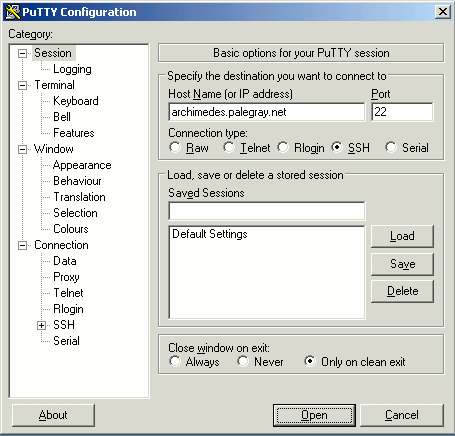

Server administrators may wish to use local administration tools to connect to remote Oracle XE home pages. This guide shows you how to do so in a secure manner using an SSH tunnel. It is assumed that you have Oracle XE up and running on your Linode, and that it is configured to listen on `localhost` (127.0.0.1). After following these instructions, you'll be able to connect to `localhost` on your workstation using your favorite browser. The connection will be securely forwarded to your Linode over the Internet.

## Create a Tunnel with PuTTY on Windows

### Connecting to your Linode

You can obtain PuTTY from the [PuTTY download page](http://www.chiark.greenend.org.uk/~sgtatham/putty/download.html). For Microsoft Windows users, PuTTY is compatible with Windows 95 or greater (practically any modern Windows computer can run it). Simply save the program to your desktop and double-click it to begin. You'll be presented with this screen:

Enter the hostname or IP address of the system you'd like to log into and click "Open" to start an SSH session. If you haven't logged into this system with PuTTY before, you will receive a warning similar to the following:

In this case, PuTTY is asking you to verify that the server you're logging into is who it says it is. This is due to the possibility that someone could be eavesdropping on your connection and posing as the server you are trying to log into. You need some "out of band" method of comparing the key fingerprint presented to PuTTY with the fingerprint of the public key on the server you wish to log into. You may do so by logging into your Linode via the Lish console (see the "Console" tab in the Linode Manager) and executing the following command:

    ssh-keygen -l -f /etc/ssh/ssh_host_rsa_key.pub

The key fingerprints should match; click "Yes" to accept the warning and cache this host key in the registry. You won't receive further warnings unless the key presented to PuTTY changes for some reason. Typically, this should only happen if you reinstall the remote server's operating system. If you should receive this warning again from a system you already have the host key cached on, you should not trust the connection and investigate matters further.

### Setting up the Tunnel

Visit the "Connection -\> SSH -\> Tunnels" screen in PuTTY. Enter "8080" for the "Source port" field and "127.0.0.1:8080" for the "Destination" field.

Once you've connected to the remote server with this tunnel configuration, you'll be able to direct your local browser to `localhost:8080/apex`. Your connection to the remote Oracle XE home page will be encrypted through SSH, allowing you to access your databases without running your Oracle XE home page on a public IP.

## Create a Tunnel with oracle-tunnel on Mac OS X or Linux

Save the following Perl script to your local home directory as `oracle-tunnel.pl`:


#!/usr/bin/perl

# Oracle XE Homepage Tunnel Tool for MacOS X and Linux
# Copyright (c) 2009 Linode, LLC
# Author: Philip C. Paradis <pparadis@linode.com>
# Editor: Brett Kaplan <bkaplan@linode.com>
# Usage: oracle-tunnel.pl [start|stop]
# Access an Oracle XE Homepage via an SSH tunnel.

$local_ip    = "127.0.0.1";
$local_port  = "8080";
$remote_ip   = "127.0.0.1";
$remote_port = "8080";
$remote_user = "username";
$remote_host = "hostname.example.com";

$a = shift;
$a =~ s/^\s+//;
$a =~ s/\s+$//;

$pid=`ps ax|grep ssh|grep $local_port|grep $remote_port`;
$pid =~ s/^\s+//;
@pids = split(/\n/,$pid);
foreach $pid (@pids)
{
 if ($pid =~ /ps ax/) { next; }
 split(/ /,$pid);
}

if (lc($a) eq "start")
{
 if ($_[0]) { print "Tunnel already running.\n"; exit 1; }
 else
 {
  system "ssh -f -L $local_ip:$local_port:$remote_ip:$remote_port $remote_user\@$remote_host -N";
  exit 0;
 }
}
elsif (lc($a) eq "stop")
{
 if ($_[0]) { kill 9,$_[0]; exit 0; }
 else { exit 1; }
}
else
{
 print "Usage: oracle-tunnel.pl [start|stop]\n";
 exit 1;
}


Modify the variables "\$remote\_user" and "\$remote\_host" to reflect your remote user account and server name. Make the script executable by issuing the following command in a terminal window:

    chmod +x oracle-tunnel.pl

To start the tunnel, issue the following command:

    ./oracle-tunnel.pl start

When you're done with the tunnel, you may stop it with this command:

    ./oracle-tunnel.pl stop

Once you've connected to the remote server with this tunnel configuration, you'll be able to direct your local browser to `localhost:8080/apex`. Your connection to the remote Oracle XE home page will be encrypted through SSH, allowing you to access your databases without running Oracle XE on a public IP.
