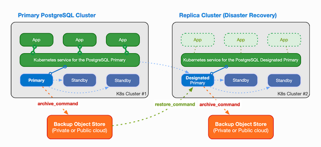
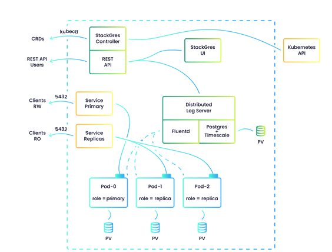
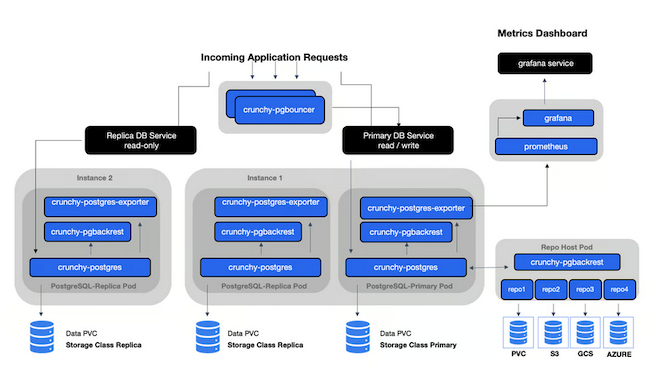

[Kubernetes](https://kubernetes.io/) is the leading technology for container orchestration and automated software deployment. Because it is designed to manage stateless applications, Kubernetes has not traditionally been widely used for databases. However, new Kubernetes operators for [PostgreSQL](https://www.postgresql.org/) and other databases have made Kubernetes a more viable option in this area. This guide explains how a Kubernetes PostgreSQL operator works and how to use it. It also lists the leading PostgreSQL Kubernetes operator alternatives.

## Why Host a Database on Kubernetes?

The best reason to host PostgreSQL on Kubernetes is to take advantage of the many benefits of Kubernetes. This is especially advantageous if other network elements, such as web servers, are also hosted on Kubernetes. In these cases, existing Kubernetes knowledge, scripts, and infrastructure can be extended to include PostgreSQL. Each Kubernetes cluster must include a *master* node to manage the containers. If this infrastructure is already in place, no additional components are required.

Kubernetes orchestrates applications using containers, which are similar to virtual machines. It automates container configuration, deployment, management, and monitoring. Kubernetes relies upon a container runtime, such as Docker, to operate the applications. A typical Kubernetes cluster includes one master node and a number of *worker nodes*. The worker nodes are usually virtual machines, but they can also be physical servers. Each node contains a number of pods, which serve as a wrapper for the containers. The container includes all the resources required to run a containerized application image, such as the PostgreSQL application.

Due to its efficiency and ease of use, Kubernetes has become one of the most important *infrastructure as code* (IaC) applications. It is widely used in organizations of various sizes. Some of the main advantages of Kubernetes are as follows:

- It is a free open-source technology.
- It is less time-consuming to deploy software using Kubernetes compared to a manual process.
- Kubernetes uses a declarative format. Users specify the final configuration, but not how to accomplish it. Users do not have to learn the details of the configuration process.
- Kubernetes facilitates automation tasks. When integrated into a CI/CD pipeline, Kubernetes can configure a large number of identical network elements. This reduces errors and guarantees consistency.
- It is more efficient. Kubernetes manages resources for maximum utilization and to reduce unnecessary CPU and memory usage.
- Kubernetes is automatically able to horizontally scale applications, adding additional containers as required. It can then remove these nodes when the burst of activity has ended. Network administrators do not have to pre-provision nodes in anticipation of a busy period.
- Kubernetes is highly scalable. It can deploy, update, or upgrade a large number of nodes at one time.
- Kubernetes makes it easier to deploy high availability networks. It can detect and restore failed instances of an application. It can also handle load balancing between multiple redundant instances.
- Kubernetes scripts are portable across different operating systems, Linux distributions, and cloud providers. Configuration files can easily be shared and reused across different networks.

One potential downside of deploying a database using Kubernetes is the complexity of the configuration layers. This is most notable when first developing the infrastructure. A reasonable amount of technical knowledge is required and it can be difficult to debug a failed deployment. For these reasons, Kubernetes is more strongly recommended for larger organizations possessing technical expertise, especially those with automation requirements. Kubernetes generally works better when it is used to orchestrate the entire network than it does in a hybrid approach.

Kubernetes is a large and powerful application with many advanced features and additional components. To learn more about Kubernetes, review the multi-part [Beginners Guide to Kubernetes series](/docs/guides/beginners-guide-to-kubernetes/).

## What is a Kubernetes Operator?

It has traditionally been difficult to host databases on Kubernetes due to their internal complexity. Kubernetes cannot manage PostgreSQL by itself because it is designed to manage relatively straightforward network elements, such as web servers and network settings. It does not excel at maintaining state information, managing clusters, and integrating a number of complicated components. A database, especially when part of a high availability network, requires additional domain knowledge.

Dedicated Kubernetes database operators provide a solution to this problem. An Kubernetes operator can be thought of as the functional equivalent of a human operator with extensive application experience. It helps Kubernetes manage a particular application, providing additional capabilities that Kubernetes lacks. Kubernetes operators are often used in the areas of database management, resource monitoring, security, and web services.

Working in conjunction with the PostgreSQL API, a Kubernetes PostgreSQL operator functions as a single point of access for database configuration and management. It is able to monitor a set of PostgreSQL instances, respond to failures, and make operational adjustments. Many operators can also handle database back-ups, enable redundancy, and execute a high availability failover. A good Kubernetes database operator can significantly simplify database administration.

The operators use a declarative model and work similarly to Kubernetes. Kubernetes operators differ in their capabilities and feature sets, but they all work in much the same manner. A Kubernetes operator includes a set of resources and controllers, known as *Custom Resource Definitions* (CRD). The CRDs supply the necessary logic required to deploy and configure an application and provide operational oversight.

Using CRDs, an operator stores a record of the application state and variables, adding, deleting, or modifying the resources as necessary. It monitors the state of the managed resources and takes action upon a change in status. Most operators include a public API and interact with Kubernetes using a YAML file. The operator typically uses the `kubectl` component to apply the configuration. However, many operators permit hybrid environments and can be managed using either `kubectl` or the operator interface.

To take best advantage of a Kubernetes PostgreSQL operator, design the database configuration and architecture from the ground up. Resist the temptation to "lift and shift" a database from another environment into Kubernetes. If an organization lacks Kubernetes expertise, investing in outside consultations is a good idea. It is sometimes difficult to change a Kubernetes solution after it is deployed, so it is best to take additional time in the planning stage.

## Other Alternatives for Running PostgreSQL on the Cloud

Kubernetes PostgreSQL operators are useful in integrating PostgreSQL into Kubernetes and simplifying cloud database management, so they are widely used in distributed computing. However, there are several alternatives for running PostgreSQL in the cloud.

### Running PostgreSQL on a Virtual Server

The most economical and straightforward way to operate PostgreSQL is to install it manually on a virtual server. In this architecture, PostgreSQL works like any other server application. The software can be installed using `apt` or another software package manager. Users are solely responsible for configuration, security, and creating roles, databases, users, and tables. However, they retain full control over the deployment, versioning, and network architecture, including any extensions, add-ons, and upgrades. This approach is useful for seasoned professionals who want to continue using well-established processes.

Virtual servers can be provisioned more efficiently via *Infrastructure as Code* (IoC) solutions such as Ansible or Terraform. Some administrators use Docker or similar applications to deploy PostgreSQL in a containerized manner. These applications help install PostgreSQL and optionally configure initial settings, but they do not monitor or manage the application thereafter. Users are responsible for performing these functions.

To simplify PostgreSQL installation and configuration, Akamai offers the [Akamai Marketplace PostgreSQL cluster application](/docs/products/tools/marketplace/guides/postgresql-cluster/). This application installs PostgreSQL on multiple nodes and automatically sets up redundancy. It is a hybrid approach between self-management and a Database-as-a-Service (DBaaS) approach. This method provides less flexibility in terms of configuration options, but users can still monitor the application and make some adjustments.

### Running PostgreSQL as a Database as a Service (DBaaS) Application

*Database as a Service* (DBaaS) applications, such as [Big Animal](https://www.enterprisedb.com/products/biganimal-cloud-postgresql) from EDB, allow users to take a more hands-off approach. Using the DBaaS model, PostgreSQL is managed as a cloud-based database, eliminating the need for virtual servers. Databases are maintained in the cloud, and users do not typically have any visibility of the underlying network. The *cloud database operator* (CDO) provides a service guarantee in terms of availability, throughput, and response time. Most DBaaS services handle application monitoring, configuration, backups, failure recovery, and software upgrades. Users only have to provide the database schema, table definitions, and data.

In many cases, DBaaS services are integrated into a larger application stack. The web server, database, and supporting applications can be deployed as a single package. Some advantages of a DBaaS are as follows:

- Automatic provisioning and configuration of the database.
- Upgrade management.
- Cloud access from any internet-connected computer or device.
- Increased flexibility, including easy scaling.
- Service monitoring capabilities.
- Efficient use of resources.
- Most services provide intuitive user interfaces for managing the database, including point-and-click schema and table definitions.

On the negative side, using a DBaaS service results in some loss of control and insight into the configuration. Businesses might unknowingly provision a more complicated and costly solution than necessary. Some DBaaS services can lock customers into their proprietary system. Because the DBaaS provider handles upgrades, users often find themselves suddenly using a new release of the software without warning.

## An Overview of the Major Kubernetes Operators

There are several competing PostgreSQL Kubernetes operators. These applications are all designed to integrate PostgreSQL with Kubernetes and operate in a similar manner. Most small-to-medium organizations could reliably use any of these options. However, they differ somewhat in their feature set, ease of use, and relative strengths.

These applications must be provisioned alongside Kubernetes itself. Akamai customers can either deploy Kubernetes manually or use the [Linode Kubernetes Engine](/docs/products/compute/kubernetes/get-started/) (LKE).

### CloudNativePG

The [CloudNativePG](https://cloudnative-pg.io/) open-source Kubernetes operator supports high availability, including a primary/standby architecture with streaming replication. CloudNativePG was originally developed by EDB, the same vendor responsible for PostgreSQL. The two applications are therefore more thoroughly integrated than the other alternatives.

CloudNativePG is designed to work with Kubernetes and the Kubernetes API using a declarative file format. It uses a proprietary method to manage persistent volumes and data replication, rather than relying on a replication manager or third-party failover tool. The following diagram indicates how CloudNativePG might construct a redundant Kubernetes cluster.

CloudNativePG is installed using a YAML manifest. It contains a number of CRD objects, including `Cluster`, `Pooler`, and `Backup`, and specializes in redundancy and failover management. CloudNativePG normally creates a high availability cluster for each database. The `Cluster` attribute represents a PostgreSQL *high availability* (HA) cluster, consisting of a primary node and at least one backup replica node. The *instance manager* monitors each pod, interacting with the Kubernetes API as required. It is responsible for detecting failures and restarting the database on the pod. Users should run multiple pods for the best performance.

Additional features and advantages of CloudNativePG include the following:

- Databases can be copied using either `Barman` or`pg_basebackup`. CloudNativePG can also restore a cluster from a backup node, including point-in-time recovery.
- Support for cluster replication to a different network.
- Applications within the same Kubernetes cluster can access the database using a service object without specifying the active node.
- Post-failure cluster and node restoration.
- Support for synchronous or asynchronous replication.
- Scheduled backups and recovery points.
- A wide variety of data points are displayed, including the cluster status. CloudNativePG can manage roles, restart clusters or nodes, define custom metrics, and generate reports.
- Status monitoring and alerts.
- Support for local persistent volumes. The application can detect persistent data records and use them for data restoration. Otherwise, it deploys a new instance based on data copied from the primary database.
- Additional configuration options, including node toleration, affinity settings, and read-only/read-write access definitions for individual nodes.

Overall, CloudNativePG is a robust and highly capable PostgreSQL operator. It contains a rich set of features and is relatively easy to use and configure. For more information on CloudNativePG, see the [user documentation](https://cloudnative-pg.io/docs/).

### StackGres

[StackGres](https://stackgres.io/) is a relatively new open-source PostgreSQL Kubernetes operator, built on existing technologies such as Patroni and PgBouncer. It includes a controller component, along with a REST API and a GUI. The following diagram, taken from the StackGres site, illustrates the architecture of a typical deployment.

StackGres offers several resources for defining clusters and specifying the database configuration settings. It is a lightweight tool that is easy to understand and use. StackGres is designed to be user-friendly for users with a variety of expertise levels. It pre-configures sensible default options and includes a carefully curated set of extensions. StackGres is able to minimize disruptions to users under a variety of operational conditions. It provides a number of pathways for configuration and validates user specifications for correctness and best practices.

Some of the main advantages of StackGres include the following:

- Support for custom configuration settings.
- Ability to define the size of the Postgres instance.
- A graphical web console for configuration and operational status.
- Support for replication and high availability through the Patroni component, along with connection pooling. StackGres supports advanced replication modes including group and cascading replication.
- It does not require advanced PostgreSQL expertise.
- Log collection and database monitoring tools.
- A backup aggregation system.
- Functionality to create and manage backup snapshots.
- Unwanted or unused containers can be disabled.
- Inclusion of the Timescale extension for enhanced analytics. StackGres also features integrated Citrus support for billing and customer service.
- The Envoy extension can proxy for PostgreSQL traffic, allowing it to detect errors and tune performance.
- It can be integrated with Prometheus/Grafana for metrics collection.
- Users can run Supabase for additional authentication support.
- The documentation is clear and comprehensive.

As a drawback, customization support is fairly limited compared to some of the other options. As a result, it is not the best option for those users who require complex configurations. However, it is a good choice for users who have a straightforward network and do not want to deal with a complicated operator. For more information, see the [StackGres documentation](https://stackgres.io/doc/latest/intro/).

### PostgreSQL Operator from Crunchy Data (PGO)

The [Crunchy Data PostgreSQL Operator](https://access.crunchydata.com/documentation/postgres-operator/latest) is a well-established PostgreSQL operator for Kubernetes. It uses the `pgo` tool to manage the database at a high level and generate custom resources. The CRD collection allows users to allocate resources, manage backups, configure high availability, and monitor the nodes. It also defines how and where the cluster is deployed, including support for toleration, affinities, and topology constraints. Based on the database characteristics, the Crunchy Data operator instructs Kubernetes to create an appropriate number of pods and containers.

Crunchy Data integrates the PostgreSQL operator into the rest of its suite, including other PostgreSQL containers and tools. It also includes built-in support for other components, including pgMonitor and Grafana. The monitor component tracks the health of the cluster and sends alerts when necessary. The Crunchy Data PostgreSQL Operator has native support for high availability and is designed for resiliency and efficiency.

The Crunchy Data PostgreSQL Operator consists of a single container. The operator architecture resembles the following diagram.

Some of the most significant features and advantages of the Crunchy Data PostgreSQL Operator include the following:

- Optimization for quick and easy deployment.
- Persistent storage through dynamic storage classes.
- Support for high availability clusters. The Crunchy Data PostgreSQL operator ensures the health of all clusters.
- Backup management and disaster recovery.
- High scalability with support for horizontal scaling.
- Performance and health monitoring tools.
- Users can clone PostgreSQL HA clusters.
- Numerous extensions to enhance database functionality.
- The feature set includes user and authentication management tools. The Crunchy Data PostgreSQL operator secures inter-component transactions using *Transport Layer Security* (TLS).
- Support for custom configurations and node affinity deployments.

Consult the [Crunchy Data PostgreSQL Operator documentation](https://access.crunchydata.com/documentation/postgres-operator/latest) for more information and detailed instructions.

### Other Alternatives

Additionally, there are a few other PostgreSQL Kubernetes operators worth considering.

- **KubeDB:** The [KubeDB](https://kubedb.com/) Kubernetes operator is well-respected, with a comprehensive feature set and an efficient design. It include a unique feature to protect users from misconfiguration and accidental data deletion. It manages high availability through proprietary tools. Users can manage their database configuration through a single `ConfigMap` option and a `kubectl` plug-in, but KubeDB lacks customization. Additionally, some features are only available in the commercial Enterprise edition.

- **Zalando:** [Zalando](https://github.com/zalando/postgres-operator) is developed by the same team behind the PostgreSQL replication manager Patroni. The Zalando PostgreSQL Kubernetes operator integrates Patroni, along with additional tools for management, backups, and connection pools. Zalando is highly customizable and is similar to the Crunchy Data Operator in design. It is a relatively new product and is still filling out its complete roadmap.

- **Stolon:** The [Stolon](https://github.com/sorintlab/stolon) Kubernetes operator has been around a long time, but has a relatively low profile. It includes most popular PostgreSQL features, such as backups and resiliency, but it does not support custom resources. Instead, it deploys resources using a Helm chart and user parameters. This makes using the application more complex. However, it is a good choice for experienced Helm users.

## Conclusion

New PostgreSQL Kubernetes operators have made it possible to host databases on Kubernetes, which was previously difficult to do. Using Kubernetes with PostgreSQL allows users to take advantage of the rich Kubernetes feature set, including flexibility and ease of deployment. Some of the most common PostgreSQL operators include CloudNativePG, StackGres, and the PostgreSQL Operator from Crunchy Data. These operators are able to configure and manage a high availability PostgreSQL cluster, monitor individual nodes, and take action to resolve failures. For more information on the individual PostgreSQL Kubernetes operations, see the documentation pages for [StackGres](https://stackgres.io/doc/latest/intro/), [the Crunchy Data Postgres Operator](https://access.crunchydata.com/documentation/postgres-operator/latest), and [CloudNativePG](https://cloudnative-pg.io/docs/).