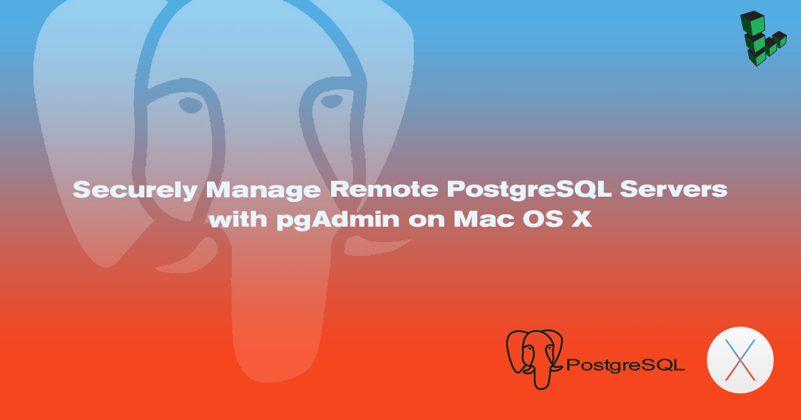
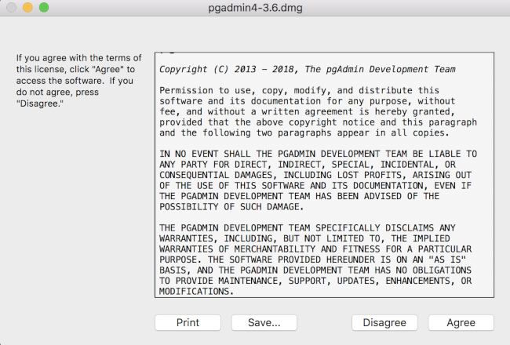
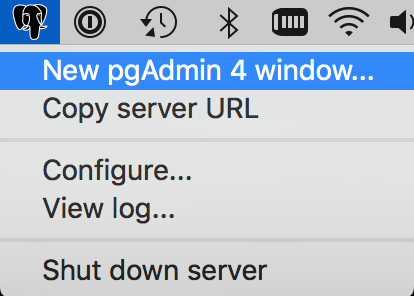
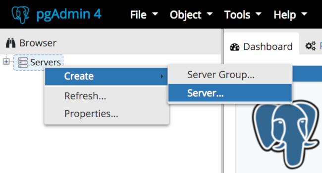
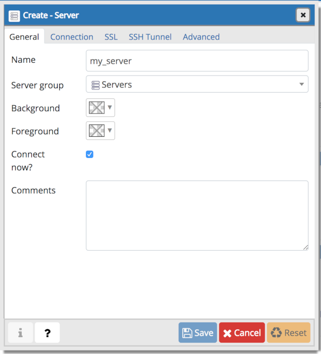
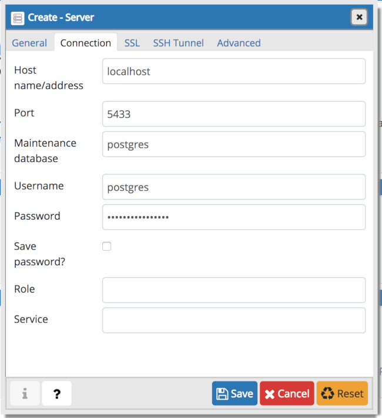
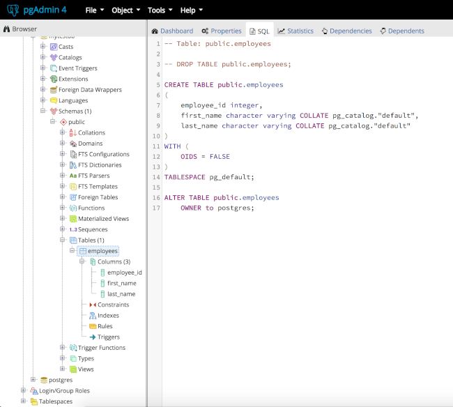

pgAdmin is a free, open-source PostgreSQL database administration GUI for Microsoft Windows, Apple Mac OS X and Linux systems. It offers excellent capabilities with regard to database server information retrieval, development, testing, and ongoing maintenance. This guide will help you get up and running with pgAdmin on Mac OS X, providing secure access to remote PostgreSQL databases. It is assumed that you have already installed PostgreSQL on your Linode in accordance with our [PostgreSQL installation guides](/docs/databases/postgresql/).

## Install pgAdmin

1.  Visit the [pgAdmin download page](https://www.pgadmin.org/download/pgadmin-4-macos/) to obtain the most recent version of the program. Save the installer to your desktop and launch it. Read the license agreement and click the "Agree" button to continue.

    

2.  After the program has uncompressed itself, you'll see a pgAdmin icon in a Finder window. You may drag this to your Applications folder or your dock.

1.  After starting pgAdmin, open a new pgAdmin window by selecting the pgAdmin logo in the menu bar and selecting "New pgAdmin 4 window..."

    

    A new window will be displayed in your web browser with the pgAdmin interface.

## Configure SSH Tunnel

While PostgreSQL supports SSL connections, it is not advisable to instruct it to listen on public IP addresses unless absolutely necessary. For this reason, you'll be using the following command to create an SSH tunnel to your database server, replacing `username` with your Linux username and `remote-host` with your Linode's hostname or IP address:

    ssh -f -L 5433:127.0.0.1:5432 username@remote-host -N

Although PostgreSQL uses port 5432 for TCP connections, we're using the local port 5433 in case you decide to install PostgreSQL locally later on.

## Use pgAdmin

1.  Launch pgAdmin and you'll be presented with a default view containing no servers. Right click "Servers" and then navigate to "Create > Server".

    

2.  If you're having problems connecting, you may need to check PostgreSQL's configuration to ensure it accepts connections. Modify the following lines in `/etc/postgresql/9.5/main/postgresql.conf` if necessary:

    
listen_addresses = 'localhost'

port = 5432



    Restart PostgreSQL to activate these changes. This command may vary among different distributions:

        sudo systemctl restart postgresql

3.  In the "Create-Server" dialog that appears, enter a name for your server.

    

4.  In the "Connections" tab enter "localhost" for the "Host name/address" field, as you'll be connecting via your SSH tunnel, and set the port to 5433. In the username and password fields, enter the credentials you specified when setting up PostgreSQL.

    For greater security, uncheck the "Save password" box. Click "Save" to connect to your server.

    

5.  You will be presented with a full view of the databases that your user account has access to:

    

Congratulations! You've securely connected to your remote PostgreSQL server with pgAdmin 4.
