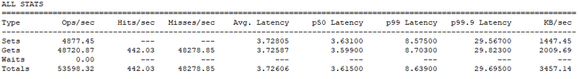
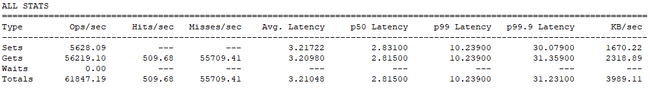
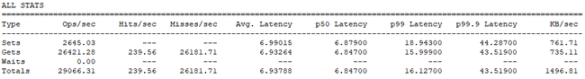
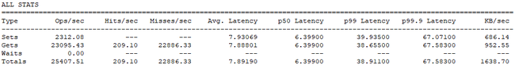
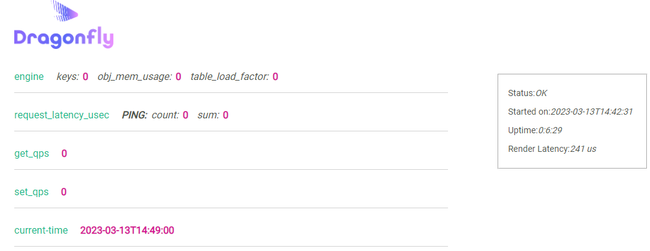
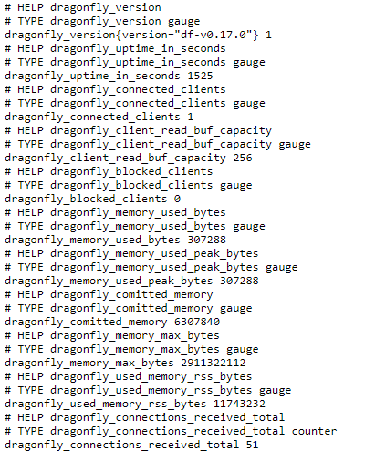

DragonflyDB is an in-memory database similar to Redis, Memcached, and KeyDB. It relies on advanced algorithms and data structures on top of a multi-threaded, shared-nothing architecture. This provides outstanding performance with fewer setup and maintenance issues than its competitors. DragonflyDB hides complexities that other products do not. The DragonflyDB Application Programming Interface (API) is fully compatible with both Redis and Memcached, and provides other features to aid development. This guide compares DragonflyDB to similar products and discusses its benefits and disadvantages.

## What Is DragonflyDB?

An in-memory database is also called a Main Memory Database (MMDB), also a system (or memory) resident database. These rely mainly on memory to store data, rather than using disk storage as is usual for Relational Database Management Systems (RDBMS) and NoSQL setups. Developers often choose in-memory databases where speed is the main concern. A product like DragonflyDB makes full use of the underlying hardware without a lot of additional setup and tuning.

As with most Redis competitors, DragonflyDB is compatible with Redis API 5.0. In addition, its utilities can use the same command line options as Redis, which helps when moving to DragonflyDB.

To take full advantage of DragonflyDB, you need to use the added functionality it provides. For example, you can configure a special administrator port, or decide on the maximum number of returned keys in the `keys` command.

Overall, DragonflyDB focuses on maximizing CPU usage (e.g. engaging all cores) and enhanced data storage that relies on hashing.

## Speed Comparison vs. Redis, Memcached, and KeyDB

In speed tests, DragonflyDB and Redis advertise similar results. The best way to test database speed is to apply your own software and system configurations to gather real-world ideas about their performance. With that said, the following benchmark results are from a single Dedicated, 4 GB, 2-core, Ubuntu 22.04 LTS Linode. The tests use the free version of each product, don’t include any special addons, and use the vendor-suggested installation technique. In addition, each test was performed on a clean and updated installation to prevent any problems with old software.

The test relies on the [Redis memtier_benchmark](https://github.com/RedisLabs/memtier_benchmark), which must be installed separately.

Run the following command to install the benchmark using Docker and display help information on its usage:

```command
sudo docker run --rm redislabs/memtier_benchmark:latest --help
```


You might need to use a specific server address when performing the test. If that is the case, use the following command, substituting your IP address where necessary:

```command
docker run --rm redislabs/memtier_benchmark:latest --server=EXAMPLE_IP --distinct-client-seed -d 256.
```

The use of `--distinct-client-seed` ensures that each of the databases are tested using the same data. Otherwise, no optimization is used.


The results output for DragonflyDB appears in the figure below:

[](DragonflyDB-Results.png)

Compare it with the results for [Redis 7.0](https://redis.io/download/):

[](Redis-Results.png)

Here are the Memcached results:


When performing the this test on Memcached, use the `--protocol=memcache_text` command line switch.


[](Memcached-Results.png)

Finally, the results from KeyDB:

[](KeyDB-Results.png)

As shown in the figures above, DragonflyDB and Redis are generally faster than Memcached and KeyDB using these configurations. When it comes to these products, tweaks, environment, and usage matter, so in local comparisons be sure to consider the requirements of your own workload.

## DragonflyDB Compared to Redis

DragonflyDB is drop-in compatible with Redis 5.0. However the latest versions of Redis contain numerous features, such as key-based permissions, that don’t appear in this older version. In fact, [Redis 7.0 has received numerous speed and memory upgrades](https://www.phoronix.com/news/Redis-7.0-rc1) that likely account for the similar performance in the above benchmark results. However, the test system only had 2 cores, and more cores would equate to a significant speed advantage for DragonflyDB.

Redis also requires more setup and optimization than DragonflyDB. Users may experience configuration errors without a clear indication of how to fix them. DragonflyDB has working default configurations, and with small tweaks, can obtain the desired results.

Many of the compatibility breaking changes in Redis 7.0 improve security. If you require a more secure in-memory database, then Redis might be a better choice

## DragonflyDB Compared to Memcached and KeyDB?

As with Redis, both Memcached and KeyDB required minor configuration changes to work properly. The KeyDB installation was less complicated, but not as straightforward as DragonflyDB. However, both products worked on the first try.

Memcached is not based on Redis and requires a different understanding. This made the installation more involved, though the product is documented well.

## Why Should You Use DragonflyDB?

Speed and ease of installation are the primary advantages of DragonflyDB. Of the products tested, DragonflyDB is the easiest to install. Even though it runs slightly slower than Redis on the test configuration, DragonflyDB is still a fast database. Optimizing DragonflyDB for your environment and workload can provide significant speed improvements.

## Before You Begin

1.  If you have not already done so, create a Linode account and an Ubuntu 22.04 LTS Compute Instance. See our [Getting Started with Linode](/docs/guides/getting-started/) and [Creating a Compute Instance](/docs/guides/creating-a-compute-instance/) guides.

1.  Follow our [Setting Up and Securing a Compute Instance](/docs/guides/set-up-and-secure/) guide to update your system. You may also wish to set the timezone, configure your hostname, create a limited user account, and harden SSH access.


This guide is written for a non-root user. Commands that require elevated privileges are prefixed with `sudo`. If you’re not familiar with the `sudo` command, see the [Users and Groups](/docs/tools-reference/linux-users-and-groups/) guide.


The commands, file contents, and other instructions provided throughout this guide may include placeholders. These are typically domain names, IP addresses, usernames, passwords, and other values that are unique to you. The table below identifies these placeholder values and explains what to replace them with:

| Placeholder: | Replace With: |
| -- | -- |
| `EXAMPLE_IP` | Your system's public IP address. |
| `EXAMPLE_USER` | The username of the current user on your local machine. |

## Installing Docker

DragonflyDB relies on Docker as a framework, so you need to install Docker before you can install DragonflyDB. This section provides a quick installation method:

1.  Ensure your system is up-to-date:

    ```command {title="Linode Terminal"}
    sudo apt update
    ```

    You may see a number of updates that can be performed on your system.

1.  If so, perform any required package upgrades:

    ```command {title="Linode Terminal"}
    sudo apt -y upgrade
    ```

1.  Install the required Docker support:

    ```command {title="Linode Terminal"}
    sudo apt -y install apt-transport-https ca-certificates curl gnupg lsb-release
    ```

1.  Install the Docker GNU Privacy Guard (GPG) key:

    ```command {title="Linode Terminal #1"}
    curl -fsSL https://download.docker.com/linux/ubuntu/gpg | sudo gpg --dearmor -o /usr/share/keyrings/docker-archive-keyring.gpg
    ```

1.  Add the stable Docker repository:

    ```command {title="Linode Terminal"}
    echo "deb [arch=amd64 signed-by=/usr/share/keyrings/docker-archive-keyring.gpg] https://download.docker.com/linux/ubuntu $(lsb_release -cs) stable" | sudo tee /etc/apt/sources.list.d/docker.list > /dev/null
    ```

1.  Update the package list prior to Docker installation:

    ```command {title="Linode Terminal"}
    sudo apt update
    ```

1.  Install Docker:

    ```command {title="Linode Terminal"}
    sudo apt install -y docker-ce docker-ce-cli containerd.io
    ```

1.  Ensure Docker is running:

    ```command {title="Linode Terminal"}
    sudo systemctl start docker
    ```

1.  Enter the following two commands to allow Docker to start automatically whenever the system reboots:

    ```command {title="Linode Terminal"}
    sudo systemctl enable docker
    sudo systemctl enable containerd
    ```

    ```output
    Synchronizing state of docker.service with SysV service script with /lib/systemd/systemd-sysv-install.
    Executing: /lib/systemd/systemd-sysv-install enable docker
    ```

1.  Verify that Docker is working:

    ```command {title="Linode Terminal"}
    sudo docker run hello-world
    ```

    A "Hello from Docker!" output message should appear if Docker is running correctly:

    ```output
    Unable to find image 'hello-world:latest' locally
    latest: Pulling from library/hello-world
    719385e32844: Pull complete
    Digest: sha256:dcba6daec718f547568c562956fa47e1b03673dd010fe6ee58ca806767031d1c
    Status: Downloaded newer image for hello-world:latest

    Hello from Docker!
    This message shows that your installation appears to be working correctly.

    To generate this message, Docker took the following steps:
     1. The Docker client contacted the Docker daemon.
     2. The Docker daemon pulled the "hello-world" image from the Docker Hub.
    (amd64)
     3. The Docker daemon created a new container from that image which runs the
    executable that produces the output you are currently reading.
     4. The Docker daemon streamed that output to the Docker client, which sent it
    to your terminal.

    To try something more ambitious, you can run an Ubuntu container with:
     $ docker run -it ubuntu bash

    Share images, automate workflows, and more with a free Docker ID:
     https://hub.docker.com/

    For more examples and ideas, visit:
     https://docs.docker.com/get-started/
    ```

## Installing DragonflyDB

If all you need is a basic DragonflyDB setup, the following instructions explain how to perform such an installation. Note that you can’t install DragonflyDB and Redis together because DragonflyDB is a drop-in replacement for Redis. To work with DragonflyDB in a multi-container environment, install Docker Compose (as described in the next section) and use the provided Docker installation.

### Perform the Installation

To install DragonflyDB using a standard Docker setup, enter the following `docker run` command:

```command
sudo docker run --network=host --ulimit memlock=-1 docker.dragonflydb.io/dragonflydb/dragonfly
```

```output
Unable to find image 'docker.dragonflydb.io/dragonflydb/dragonfly:latest' locally
latest: Pulling from dragonflydb/dragonfly
edaedc954fb5: Pull complete
d5d93e86ae17: Pull complete
dbcbab6ce18a: Pull complete
d14c160bf2b6: Pull complete
4f4fb700ef54: Pull complete
27e60f37f528: Pull complete
3cca23c9d5be: Pull complete
14a50fd65771: Pull complete
e3fe35eed737: Pull complete
Digest: sha256:900006dc02fad735757b42333bc4ea5056e9c13d0620118ce468a59e5328fb5f
Status: Downloaded newer image for docker.dragonflydb.io/dragonflydb/dragonfly:latest
I20230822 15:34:30.966816     1 init.cc:69] dragonfly running in opt mode.
I20230822 15:34:30.966915     1 dfly_main.cc:666] Starting dragonfly df-v1.8.0-7c99d2d1111e2636556ad8c2afad43c396906d01
W20230822 15:34:30.967028     1 dfly_main.cc:703] SWAP is enabled. Consider disabling it when running Dragonfly.
I20230822 15:34:30.967048     1 dfly_main.cc:708] maxmemory has not been specified. Deciding myself....
I20230822 15:34:30.967054     1 dfly_main.cc:712] Found 3.82GiB available memory. Setting maxmemory to 3.06GiB
* Logs will be written to the first available of the following paths:
/tmp/dragonfly.*
./dragonfly.*
* For the available flags type dragonfly [--help | --helpfull]
* Documentation can be found at: https://www.dragonflydb.io/docs
I20230822 15:34:30.967959     9 uring_proactor.cc:158] IORing with 1024 entries, allocated 102720 bytes, cq_entries is 2048
I20230822 15:34:30.971239     1 proactor_pool.cc:147] Running 2 io threads
I20230822 15:34:30.975591     1 server_family.cc:171] Data directory is "/data"
I20230822 15:34:30.977092    10 listener_interface.cc:97] sock[7] AcceptServer - listening on port 6379
```

Docker displays that it can’t find the DragonflyDB image locally and needs to download it. This installation process can take a while, especially on a shared CPU Linode. Once the command completes, DragonflyDB is running.

### Test DragonflyDB Using Redis

1.  With DragonflyDB running in one terminal, open a second terminal and install redis-tools:

    ```command {title="Linode Terminal #2"}
    sudo apt install -y redis-tools
    ```

1.  Initialize `redis-cli` and follow the remaining steps to test your installation:

    ```command {title="Linode Terminal #2"}
    redis-cli
    ```

    While the prompt changes to a Redis client prompt, you’re actually using DragonflyDB:

    ```output
    127.0.0.1:6379>
    ```

1.  Add a key/value pair into the database:

    ```command {title="redis-cli"}
    set MyKey MyValue
    ```

    ```output
    OK
    ```

1.  View the key you just added:

    ```command {title="redis-cli"}
    keys *
    ```

    ```output
    1) "MyKey"
    ```

1.  View the key value of `MyValue`:

    ```command {title="redis-cli"}
    get MyKey
    ```

    ```output
    "MyValue"
    ```

1.  Now, remove the previously added key:

    ```command {title="redis-cli"}
    del MyKey
    ```

    You see an output value of `1`:

    ```output
    (integer) 1
    ```

1.  When done, use the `exit` command to leave the redis-cli, then close the second terminal:

    ```command {title="redis-cli"}
    exit
    ```

### Test DragonflyDB Using HTTP

You can also use your browser to access DragonflyDB, which is something the other in-memory databases do not offer by default.

1.  To access DragonflyDB, navigate to `http://EXAMPLE_IP:6379`, substituting `EXAMPLE_IP` with your Linode's actual IP address. The DragonflyDB status information should appear:

    [](DragonflyDB-Web-Browser.png)

1.  Access the metrics folder by appending `/metrics` to the URL, like so `http://EXAMPLE_IP:6379/metrics`. This shows a list of DragonflyDB metrics:

    [](DragonflyDB-Web-Browser-Metrics.png)

    You cannot modify the database using the browser-based interface. For now, it only provides status information.

1.  When done, return to the first terminal and press <kbd>CTRL</kbd>>+<kbd>C</kbd> to shut down the Dragonfly Docker instance.

## Install Docker Compose on an Ubuntu Linux Linode

Docker Compose lets you define and run multi-container Docker applications when you need a more complex application environment than standard Docker supports. For more on Docker Compose, read our [How to Use Docker Compose](https://www.linode.com/docs/guides/how-to-use-docker-compose/) guide. Following the steps below to install Docker Compose.

1.  First, download Docker Compose:

    ```command {title="Linode Terminal"}
    sudo curl -L https://github.com/docker/compose/releases/download/v2.1.1/docker-compose-`uname -s`-`uname -m` -o /usr/local/bin/docker-compose
    ```

1.  Allow execution permissions on the `docker-compose` directory:

    ```command {title="Linode Terminal"}
    sudo chmod +x /usr/local/bin/docker-compose
    ```

1.  Test your installation by checking the docker version:

    ```command {title="Linode Terminal"}
    docker compose version
    ```

    The output should be similar to the following:

    ```output
    Docker Compose version v2.20.2
    ```

## Use DragonflyDB with Docker-Compose

With Docker and Docker Compose installed, use the following steps to install DragonflyDB in the Docker Compose environment.

1.  First, download the DragonflyDB files:

    ```command {title="Linode Terminal"}
    wget https://raw.githubusercontent.com/dragonflydb/dragonfly/main/contrib/docker/docker-compose.yml
    ```

    ```output
    --2023-08-22 15:55:10--  https://raw.githubusercontent.com/dragonflydb/dragonfly/main/contrib/docker/docker-compose.yml
    Resolving raw.githubusercontent.com (raw.githubusercontent.com)... 2606:50c0:8002::154, 2606:50c0:8001::154, 2606:50c0:8000::154, ...
    Connecting to raw.githubusercontent.com (raw.githubusercontent.com)|2606:50c0:8002::154|:443... connected.
    HTTP request sent, awaiting response... 200 OK
    Length: 478 [text/plain]
    Saving to: ‘docker-compose.yml’

    docker-compose.yml  100%[===================>]     478  --.-KB/s    in 0s

    2023-08-22 15:55:10 (38.0 MB/s) - ‘docker-compose.yml’ saved [478/478]
    ```

1.  To install DragonflyDB, bring the container up:

    ```command {title="Linode Terminal"}
    sudo docker-compose up -d
    ```

    ```output
    [+] Running 3/3
     ⠿ Network EXAMPLE_USER_default         Created                                  0.1s
     ⠿ Volume "EXAMPLE_USER_dragonflydata"  Creat...                                 0.0s
     ⠿ Container EXAMPLE_USER-dragonfly-1   Starte...                                0.3s
    ```

1.  List the running containers to validate that the installation is setup correctly:

    ```command {title="Linode Terminal"}
    sudo docker ps | grep dragonfly
    ```

    You should see output that provides application statistics:

    ```output
    b250f23b18ec   docker.dragonflydb.io/dragonflydb/dragonfly   "entrypoint.sh drago…"   About a minute ago   Up About a minute (healthy)   0.0.0.0:6379->6379/tcp, :::6379->6379/tcp   EXAMPLE_USER-dragonfly-1
    ```

1.  Test your installation using the same techniques as in the [Test DragonflyDB Using Redis](/docs/guides/getting-started-with-dragonflydb/#test-dragonflydb-using-redis) and [Test DragonflyDB Using HTTP](/docs/guides/getting-started-with-dragonflydb/#test-dragonflydb-using-http) sections.

## Conclusion

DragonflyDB is a drop-in replacement for Redis 5.0 with some additional functionality and an emphasis on simplicity. DragonflyDB provides almost the same speed benefits as Redis 7.0 with a lower learning curve. The main benefit it holds over its competition is that it provides a free environment. DragonflyDB also scales well and its features fill the needs of most small- and medium-sized organizations.