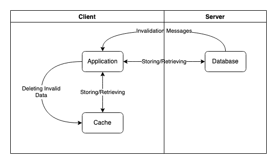

Redis is an open-source in-memory database with a reputation for working exceptionally well for caching web application data. Redis's fast transactions and low latency help to increase application performance while its server-assisted caching feature makes client-side caching more efficient.

This tutorial explains the concepts behind Redis's server-assisted client-side caching, including how client-side caching and server assistance work. The guide then breaks down how to set up your Redis server to get the most out of client-side caching in your web applications.

## Before You Begin

1. Familiarize yourself with our [Getting Started with Linode](/docs/products/platform/get-started/) guide and complete the steps for setting your Linode's hostname and timezone.

1. This guide uses `sudo` wherever possible. Complete the sections of our [Securing Your Server](/docs/products/compute/compute-instances/guides/set-up-and-secure/) guide to create a standard user account, harden SSH access, and remove unnecessary network services.

1. Update your system.

    -   On **Debian** and **Ubuntu**, use the following command:

            sudo apt update && sudo apt upgrade

    -   On **AlmaLinux**, **CentOS** (8 or later), or **Fedora**, use the following command:

            sudo dnf upgrade

1. Follow the instructions in our [How to Install and Configure Redis](/docs/guides/install-redis-ubuntu/) guide to installing a Redis server and command-line interface (CLI). Be sure to use the drop-down menu at the top of that page to select your Linux distribution and get the appropriate steps.


The steps in this guide is written for non-root users. Commands that require elevated privileges are prefixed with `sudo`. If you’re not familiar with the `sudo` command, see the [Linux Users and Groups](/docs/guides/linux-users-and-groups/) guide.


## What Is Client-Side Caching?

To improve performance, many modern web applications utilize the browser's ability to store some data locally. Doing so is called *client-side caching*, and serves the purpose, mainly, of improving performance.

Rather than making call to the server every time some data is needed, an application can first check the local cache. If the data is there, the application does not need to call the server for it. If the data is not there yet, the application can fetch the data and store it in the cache for later.

Browser cookies are an example of client-side storage. They allow an application to store data like user login and site preferences. But modern browsers also support other means of storage, making client-side caching more versatile and capable.

### Benefits of Client-Side Caching

The main perk to client-side caching is performance. Web applications that use client-side caching avoid repetitive calls to the server, improving the speed of data retrieval and reducing their overall network loads.

However, the client-side caches suffer when it comes to keeping cached data up to date. The use of a local cache introduces the possibility of having stored data become outdated and out of sync with the data on the server.

This may not be an issue for some use cases. For instance, you may have reasonable certainty about how often data changes or how time-sensitive the data is. In such cases, you can mark the cached data with an invalidation timestamp, after which the application fetches fresh data from the server.

But this limitation can be prohibitive for applications where data changes frequently and is more time-sensitive. In those cases, web applications often have to implement some other means of expiring local caches.

## What Is Server-Assisted Client-Side Caching?

To address the issue of updating or invalidating cached data, Redis implements a server-assisted model.

In this model, the Redis server tracks the data used by each connected client. When some tracked data gets altered on the server, Redis sends out notifications to the relevant clients to invalidate the old data.

Redis's model allows an application to get the performance benefits of caching while ensuring that the local data can be kept up to date.

To elaborate, an application using Redis for server-assisted caching should use the following layers:

- An *application layer* that fetches data either from the cache or, if the necessary data is not there, from the database server. Any data received from the database gets stored in the cache.

- A *cache layer* that holds data fetched from the database server by the application. To prevent the data from becoming outdated, the application must remove or otherwise update cached data whenever that data changes.

- A *database layer* that responds to requests for data from the application. Additionally, this layer provides invalidation notifications to the application when previously fetched data gets altered, helping the application to keep its cache up to date.

## How to Set Up Redis for Client-Side Caching

Configuring server-assisted caching in Redis is done on a client-by-client basis. The next section walks you through the precise steps you need to get your Redis clients running with tracked caches.

Further on, you can find some additional options for Redis's client tracking. This includes a broadcast mode, for tracking set of keys, and some parameters for more finely controlled cache tracking.

The examples in the sections below assume a Redis database with some existing keys. You can use the following commands to create the keys used in these examples:

    SET cat_one:key_one "Anaphora"
    SET cat_one:key_two "Bathos"
    SET cat_one:key_three "Catharsis"

### Configuring Redis Clients for Server-Assisted Caching

The latest versions of Redis have two options for handling invalidation notifications:

- Using a separate, dedicated client for monitoring notifications
- Receiving invalidation notifications directly on the tracking client via the *RESP3 protocol*

Each option has its use cases, although the latter is only available on Redis version 6 onward.

Below, you can see the steps used for setting up your clients with each of these options.

#### Dedicated Client for Monitoring Notifications

1.  Create a Redis client by making an authenticated connection to the Redis server. See our guide on [How to Connect to Redis and Use The Redis Database](/docs/guides/redis-getting-started/) for instructions on doing so.

1.  Determine the client's ID using the following command. This ID is used in setting up client tracking in one of the subsequent steps, so keep note of it. This and subsequent examples use `15` for the notification client's ID.

        CLIENT ID

    
(integer) 15
    

1.  Have the client subscribe to the invalidation message channel. Doing so sets the client into listening mode, meaning that it cannot issue commands but receives all messages on the subscribed channel.

        SUBSCIRBE __redis__:invalidate

    
1) "subscribe"
2) "__redis__:invalidate"
3) (integer) 1
    

1.  Create another client, making another authenticated connection to the Redis server.

1.  Turn on client tracking on the new client. Use the `REDIRECT` option to have the client's invalidation messages sent to the first client's ID.

        CLIENT TRACKING on REDIRECT 15

    The second client, and any subsequent clients that you set up in a similar way, are now being tracked for server-assisted caching. The server keeps note of any data that these tracked clients fetch. Then, the server sends invalidation messages to the listening client whenever any of that data changes.

1.  Verify that the second client is being tracker for server-assisted caching by issuing the following commands to the second client:

        GET cat_one:key_one

    
"Anaphora"
    

        SET cat_one:key_one "Anapest"

    
OK
    

    Now, on the first client, you should see a notification like the following:

    
1) "message"
2) "__redis__:invalidate"
3) 1) "cat_one:key_one"
    

#### Using the RESP3 Protocol

Redis 6 introduced the RESP3 protocol to provide more capabilities for Redis clients.

Among these is the ability to receive messages from an active client. Previously (under the RESP2 protocol), a Redis client could only receive messages by subscribing to a channel. This left the client in listening mode, unable to issue commands.

RESP3 makes it possible for a client to be simultaneously open for issuing commands and set to listen for incoming messages, like invalidation notices.

By default, Redis clients start in the RESP2 protocol. Below, you can see steps for enabling RESP3 and using it for receiving invalidation messages on a Redis client.


Redis clients must be version 6 or later to use RESP3. Check your Redis version before proceeding:

    redis-cli --version

For Redis versions less than 6, see the previous section for [creating a dedicated client for invalidation messages](#dedicated-client-for-monitoring-notifications).


1.  Create a Redis client by making an authenticated connection to the Redis server. See our guide on [How to Connect to Redis and Use The Redis Database](/docs/guides/redis-getting-started/) for instructions on doing so.

1.  Switch the client to RESP3 using the following command:

        HELLO 3

    
1# "server" => "redis"
2# "version" => "6.2.6"
3# "proto" => (integer) 3
4# "id" => (integer) 15
5# "mode" => "standalone"
6# "role" => "master"
7# "modules" => (empty array)
    

1.  Turn on client tracking for the client using the following command:

        CLIENT TRACKING on

    The client now has tracking enabled. Any data the client fetches get monitored by the server. When that data changes, the client receives a notification to invalidate its cached data.

1.  Verify that your client tracking is enabled by fetching a piece of data and making a change to it later.

        GET cat_one:key_three

    
"Catharsis"
    

        SET cat_one:key_three "Cliche"

    
-> invalidate: 'cat_one:key_three'
OK
    

    
Redis command-line clients (using the Redis CLI) using RESP3 only receive notifications after another command has been issued by the client.

So, for instance, a client tracking `cat_one:key_three` does not immediately receive a notification if another client changes that key. It only receives the invalidation notification whenever it attempts a command.

Here is a breakdown of what this could look like:

1. Client 1: `CLIENT TRACKING on`

1. Client 1: `GET cat_one:key_three`

1. Client 2: `SET cat_one:key_three "Climax"`

1. Client 1: (Does not receive an immediate notification)

1. Client 1: `GET cat_one:key_one`

    
-> invalidate: 'cat_one:key_three'
"Anapest"
    



### Using Redis's Broadcast Mode

In its default mode, shown above, Redis's client tracking follows each key fetched by each client. If a client has not yet fetched a particular key, that client does not receive an invalidation notice when the key changes.

But Redis's client tracking also has a broadcast mode. In this mode, a client can subscribe to a given key prefix — like `cat_one:` in the examples above. The client would then receive an invalidation notification for a change to any key with that prefix.

Here is an example where the client turns on broadcast-mode tracking for the `cat_one:` prefix. The example uses a separate client (ID `15`) for receiving invalidation notices.

    CLIENT TRACKING on BCAST PREFIX cat_one: REDIRECT 15

Now, when any key with that prefix changes, an invalidation message gets sent:

    SET cat_one:key_three "Catharsis"


1) "message"
2) "__redis__:invalidate"
3) 1) "cat_one:key_three"


The broadcast mode also supports multiple prefixes. The example below adds prefixes that modify the previous example:

    CLIENT TRACKING on BCAST PREFIX cat_one: PREFIX cat_two: PREFIX cat_three: REDIRECT 15

### Redis Client Tracking Settings

Redis's client tracking comes with some additional parameters that let you fine-tune how the server tracks clients and sends notifications. The following sections explain what these parameters are and how you can use them.

#### Opt-in and Opt-Out Caching

The `OPTIN` and `OPTOUT` options let you control client tracking, by opting in or opting out, respectively, on a per-key basis.

-   Using `OPTIN`, Redis only tracks keys fetched immediately after a `CLIENT CACHING yes` command. In the example below, the `cat_one:key_one` key is not tracked but the `cat_one:key_two` key is.

        CLIENT TRACKING on OPTIN REDIRECT 15
        GET cat_one:key_one
        CLIENT CACHING yes
        GET cat_one:key_two

-   Using `OPTOUT`, Redis tracks as usual but allows you to use the `CLIENT CACHING no` command to exclude any key fetched immediately after from being tracked. The example below tracks `cat_one:key_one` but not `cat_one:key_two`.

        CLIENT TRACKING on OPTOUT REDIRECT 15
        GET cat_one:key_one
        CLIENT CACHING no
        GET cat_one:key_two

#### No-Loop

Some examples in the sections above demonstrated invalidation notifications for changes made by the tracked client itself. You can disable this behavior using the `NOLOOP` option for the `CLIENT TRACKING` command.

With this option, invalidation notifications are only provided when a different client makes a change to a tracked key.

In the example below, Redis would not provide an invalidation notice to the client.

    CLIENT TRACKING on NOLOOP REDIRECT 15
    GET cat_one:key_three
    SET cat_one:key_three "Cameo"

However, the client would receive an invalidation notice if another client executed the same `SET` command shown above.

## Conclusion

This tutorial has covered what you need to know to get started using Redis for server-assisted client-side caching. You learned everything from setting up client tracking to customizing it to behave the way your web application needs.

You can continue to learn about Redis and how to get the most out of your Redis databases through our other guides in this series. These guides cover everything from [connecting to a remote Redis server](/docs/guides/redis-getting-started/) to working with the [hash data type in Redis](/docs/guides/hashes-in-redis-databases/).
