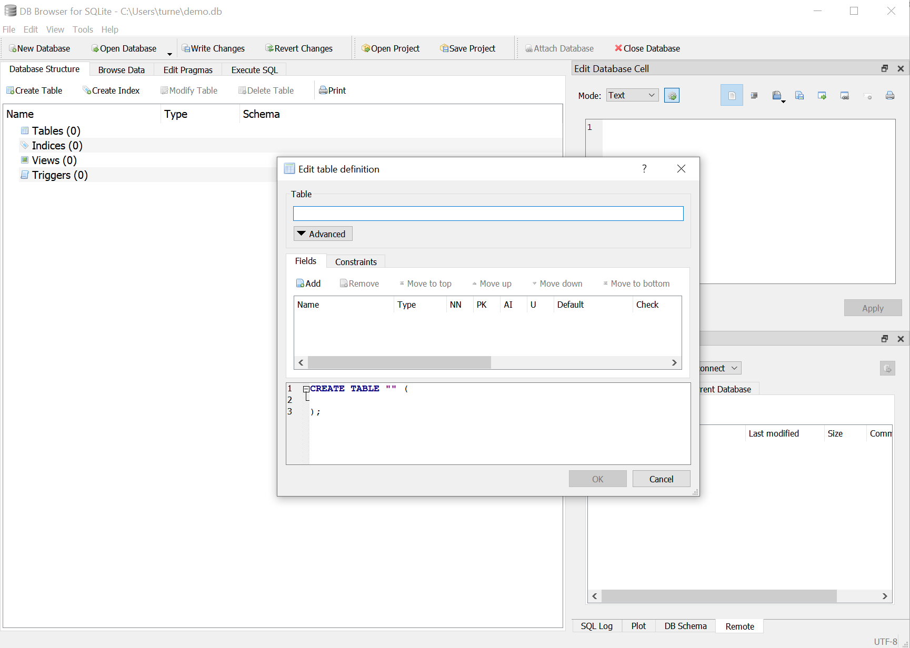

There are two major types of databases: client/server relational databases (such as [MySQL](/docs/guides/databases/mysql/) or [PostgreSQL](/docs/guides/databases/postgresql/)), and NoSQL databases (like [MongoDB](/docs/guides/databases/mongodb/) or [CouchDB](/docs/guides/databases/couchdb/)). There is, however, a third option that straddles the gap, *serverless SQL databases*. This type of database offers relational SQL capabilities without the need to set up and maintain a database server.

[SQLite](https://www.sqlite.org/index.html) is the most popular of the serverless SQL databases. Part of its success lies in the large number of operating systems and languages with which it is compatible.

The major difference between SQLite and a traditional SQL database is that there is no database server required. The database is maintained in files to which the application has direct access. The heavy lifting of processing SQL requests is done inside the application rather than by a separate server process.

## The Advantages of SQLite

SQLite can run on its own, and requires no setup before use. An application can be shipped with an existing SQLite database, or the application can create one from scratch when first started. This makes it ideal for embedded and mobile applications where connectivity may be intermittent or non-existent. It also means that there is no need to make sure that a database server is running before starting an application.

Since SQLite's underlying database file format is common across languages and platforms, you can move your database files around without out concern over compatibility. SQLite is compatible across languages and operating systems, because they all use a common library to access the database.

## The Disadvantages of SQLite

If a database is stored locally, multiple machines are not able to access the stored data to read or update it. On the other hand, SQLite does support concurrent reads and writes to a database on from multiple processes on the same machine. When a writes occurs, it locks the entire database until the write completes.

Since your application does all the heavy lifting, its responsiveness can slow down when running complex queries.

SQLite supports many advanced SQL capabilities, but not all of them. There are no stored procedures; and data types may be more limited than those of traditional server-based SQL databases.

Keep in mind, as well, that because the database is maintained inside the same process as the application, a compromised application could gain access to all the data stored in the SQLite database. An abrupt termination of the application might also cause the database to be left in an inconsistent state.

## What Are the Right Use Cases?

SQLite is a great choice when you need to deliver relational data to applications that can be accessed in offline environments. For example, a mobile application that needs to search for dealer locations when a phone is off the network could package a SQLite database with the application. Then the database can be updated with periodic downloads that replace the entire file.

Another great use case is for data that only needs to be stored locally, or data that is cached for later transmission to a remote system. A game could use a local SQLite database to store state information about a current player's progress.

Sometimes SQLite can be the right choice for a utility web service that doesn't need to scale. A developer can write an application or web service that uses a SQLite database without having to worry about standing up a separate database server and managing the credentials to access it.

## Creating a SQLite Database

With SQLite, you don't have to connect to a database server from a client to create your database. Instead, most applications using SQLite create their database inside the application itself. There are stand-alone programs that allow a user to create a SQLite database file using a traditional GUI. The most popular of these is [DB Browser for SQLite](https://sqlitebrowser.org/).

## Using SQLite in Applications

From a developer standpoint, using SQLite as a persistence layer is largely the same as with any other SQL database. Drivers exist for [Java](https://github.com/xerial/sqlite-jdbc) and libraries are available for [Swift](https://github.com/stephencelis/SQLite.swift), [C++](https://github.com/SRombauts/SQLiteCpp), and [Python](https://docs.python.org/3/library/sqlite3.html). The typical workflow for a SQLite-based application is to check for an existing database, if a database is not present, the application creates one. Then, your application code can create, read, update, and delete data, as needed.
