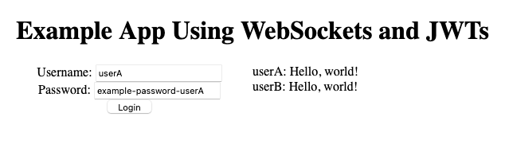

WebSockets allow you to add real-time communications to your web application. It is the technology frequently behind instant messaging, collaboration, and multiplayer gaming over the web. Any time you want to facilitate real-time communication between clients and servers, the WebSockets API is likely one of your best options.

However you use WebSockets, you likely want to limit connections to authorized users only. By default, WebSockets lack authentication, but you can effectively add your own using JSON Web Tokens (JWTs). These are lightweight and secure tokens that can provide an easy and reliable authentication solution.

This guide reviews the concepts behind WebSockets and JWTs and then walks you through an example application using JWTs to authenticate WebSocket connections.

## Before You Begin

1. Familiarize yourself with our [Getting Started with Linode](/docs/getting-started/) guide and complete the steps for setting your Linode's hostname and timezone.

1. This guide uses `sudo` wherever possible. Complete the sections of our [How to Secure Your Server](/docs/security/securing-your-server/) guide to create a standard user account, harden SSH access, and remove unnecessary network services.

1. Update your system.

    - On Debian and Ubuntu, use the following command:

            sudo apt update && sudo apt upgrade

    - On CentOS, use the following command:

            sudo yum update


The steps in this guide are written for a non-root user. Commands that require elevated privileges are prefixed with `sudo`. If you are not familiar with the `sudo` command, see the [Linux Users and Groups](/docs/tools-reference/linux-users-and-groups/) guide.


## What Are WebSockets?

The WebSocket Protocol is an open standard ([RFC 6455](https://tools.ietf.org/html/rfc6455)) for real-time communications. It allows for full-duplex, bidirectional communication between clients and servers on the web.

WebSockets can be useful in numerous contexts where real-time information transmission is key. A typical example is an instant messenger or chat application, but WebSockets can also handle things like collaborative document editing and online multiplayer games.

To learn more about WebSockets, take a look at our [Introduction to WebSockets](/docs/guides/introduction-to-websockets/) guide.

## What Are JSON Web Tokens?

JSON Web Token (JWT) is likewise an open standard ([RCF 7519](https://tools.ietf.org/html/rfc7519)). It defines a compact and secure way to transmit information via JSON. These tokens are significantly smaller than the ones generated by similar standards, such as the Security Assertion Markup Language (SAML) tokens. At the same time, JWTs are typically secured by a signing algorithm, ensuring their integrity from end to end.

Decoded JWTs are formatted as JSON, as opposed to the XML format often used in similar token standards. This tends to make them more approachable for web development, and also opens up JSON's extensive web development tooling.

For more on JWTs, check out our [How to Authenticate with JSON Web Tokens (JWTs)](/docs/guides/how-to-authenticate-using-jwt/) guide.

## Using WebSockets and JWTs Together

On their own, WebSockets do not include any authentication. However, WebSocket connections can be resource expensive, so it is typically a good idea to limit whom you allow connecting. Beyond that, most WebSocket applications can benefit from requiring a user authentication. It lets you limit who can see users' communications and potentially sensitive information.

JWTs provide a good authentication option. They are lightweight and secure and fit comfortably into a wide range of web applications. WebSocket connections are frequently authenticated via URL parameters, and JWTs' small size and security make them exceptional for that purpose.

Here is a model as an example of how you might use WebSockets and JWTs in tandem. A host of other approaches are possible, but this provides a strong framework to start from.

- Create an HTTP/HTTPS server with two endpoints:
  - One that generates a JWT provided a set of valid credentials
  - One that establishes a WebSocket connection provided a valid JWT
- Create a WebSocket server that:
  - Broadcasts messages to the client pool
  - Periodically notifies and removes clients with expired JWTs
- Create a front end that:
  - Accepts login credentials
  - Fetches a JWT from the server when credentials are submitted
  - Initiates a WebSocket connection when it receives a JWT

In the next section, you can follow along to build a chat application applying the above model.

## Build an Example Application

In this section, you can see how to implement a WebSocket server and how to use JWTs to authenticate its connections. It uses the example model shown in the previous section. The result is a simple instant messaging application with user login and authentication handling.

### Install Node.js

This example uses Node.js and the [Express JS](https://expressjs.com/) application framework. Express JS makes putting a server together quick and straightforward, and its tools make it easier here to focus on the WebSocket and JWT implementation.

1. Install Node.js.

    On Debian and Ubuntu distributions, use these commands:

        curl -fsSL https://deb.nodesource.com/setup_15.x | sudo -E bash -
        sudo apt install nodejs

    On CentOS, use the following command:

        curl -fsSL https://rpm.nodesource.com/setup_15.x | sudo -E bash -
        sudo yum install nodejs

1. Set NPM to use the latest version of Node.js.

        sudo npm install npm@latest -g

### Set Up the Project

1. Create a directory for the project. In this example, `ws-jwt-example` is used as the project and directory name. The example project here lives in the current user's home directory.

        mkdir ~/ws-jwt-example

1. Change into the project directory. For the remaining steps in this example, the guide assumes you are in `ws-jwt-example` directory.

        cd ~/ws-jwt-example

1. Create a `public` directory to be used to serve static files for the application's front end.

        mkdir public

1. Initialize the Node.js project.

        npm init

    You are prompted to enter information related to your project. You can simply press **Enter** for each prompt to use the default values.

1. Install Express JS, the JSON Web Token package, and the WebSocket package for your project.

        npm install express --save
        npm install jsonwebtoken --save
        npm install ws --save

### Create the Server

1. Create a JavaScript file called `server.js`. Add the contents shown in [this example file](example-server.js). This creates an Express JS server with an endpoint for providing JWTs for authentication and an endpoint for making WebSocket connections. It also serves static files for the application's front end.

    
This example stores credentials in the application code for the sake of convenience. However, in a production scenario, you should not store credentials in application code, and ideally, passwords should be stored encrypted.

Additionally, the example uses a simple secret. But in production, you should use a secret that conforms to the standards for the signing algorithm you are using. For instance, the HMAC SHA256 algorithm in this example should be given a 256-bit secret. You can create one with a random 64-character hex string or a random 44-character Base64 string.
    

    What follows is a breakdown of some of the key points in the `server.js` file. These focus on the parts that provide authentication tokens and those that set up the WebSocket server.

    - The Express JS server provides an endpoint for authentication. It takes in a username and password and attempts to match them to stored credentials. If it finds a match, it serves a JWT in its response.

        
// [...]

// Create an endpoint for authentication.
app.get('/auth', (req, res) => {
    res.send(fetchUserToken(req));
});

// Check request credentials, and create a JWT if there is a match.
const fetchUserToken = (req) => {
    for (i=0; i<userCredentials.length; i++) {
        if (userCredentials[i].username == req.query.username
            && userCredentials[i].password == req.query.password) {
            return jwt.sign(
                {
                    "sub": userCredentials[i].userId,
                    "username": req.query.username
                },
                jwtSecret,
                { expiresIn: 900 } // Expire the token after 15 minutes.
            );
        }
    }

    return "Error: No matching user credentials found.";
}

// [...]
        

    - The WebSocket server mounts to the Express JS server's `/ws` route. When a connection attempt is made, the WebSocket server reads a token from the URL. If it can verify the JWT, then it allows the connection and adds the user to the client pool.

        When the server receives a message from one of the clients, it broadcasts it to everyone in the client pool. Before it broadcasts, the WebSocket server checks for and handles any clients with expired tokens.

        
// [...]

// Define the WebSocket server. Here, the server mounts to the `/ws`
// route of the Express JS server.
const wss = new WebSocket.Server({ server: expressServer, path: '/ws' });

// Create an empty list that can be used to store WebSocket clients.
var wsClients = [];

// Handle the WebSocket `connection` event. This checks the request URL
// for a JWT. If the JWT can be verified, the client's connection is added;
// otherwise, the connection is closed.
wss.on('connection', (ws, req) => {
    var token = url.parse(req.url, true).query.token;

    var wsUsername = "";

    jwt.verify(token, jwtSecret, (err, decoded) => {
        if (err) {
            ws.close();
        } else {
            wsClients[token] = ws;
            wsUsername = decoded.username;
        }
    });

    // Handle the WebSocket `message` event. If any of the clients has a token
    // that is no longer valid, send an error message and close the client's
    // connection.
    ws.on('message', (data) => {
        for (const [token, client] of Object.entries(wsClients)) {
            jwt.verify(token, jwtSecret, (err, decoded) => {
                if (err) {
                    client.send("Error: Your token is no longer valid. Please reauthenticate.");
                    client.close();
                } else {
                    client.send(wsUsername + ": " + data);
                }
            });
        }
    });
});
        

### Create the Client

1. Create a JavaScript file called `main.js` in the `public` directory. Add the contents shown in [this example file](example-main.js). This file fetches the JWT whenever login credentials are provided, makes the WebSocket connection, and displays any messages received.

    As with the server file above, here is a breakdown of some of the key points in the client-side JavaScript.

    - This function attempts to authenticate the user whenever a username and password are provided. If it gets back a token, it calls another function to open the WebSocket connection.

        
// [...]

// Take the entered username and password and attempt to authenticate them. If the
// response indicates an error, provide the error message.
const getJwtAuth = () => {
    var username = document.querySelector("#username").value;
    var password = document.querySelector("#password").value;

    fetch("http://localhost:3000/auth?username=" + username + "&password=" + password)
        .then(response => response.text())
        .then((response) => {
            if (response.includes("Error")) {
                errorMessageSpan.innerHTML = response;
            } else {
                errorMessageSpan.innerHTML = "";
                openWsConnection(response);
            }
        })
        .catch(err => console.log(err));
}

// [...]
        

    - This function attempts to open a WebSocket connection using the JWT provided by the server. It first makes sure to close any existing WebSocket connection (e.g., from a previous login). Whenever it opens a new connection, it sends a message over the WebSocket. And anytime a message gets received, it displays it.

        
// [...]

// Open the WebSocket connection using the JWT.
const openWsConnection = (jwtAuth) => {
    // If a connection already exists, close it.
    if (ws) {
        ws.close();
    }

    ws = new WebSocket("ws://localhost:3000/ws?token=" + jwtAuth);

    // Send a message whenever the WebSocket connection opens.
    ws.onopen = (event) => {
        console.log("WebSocket connection established.");
        ws.send("Hello, world!");
    }

    // Display any new messages received in the `messageDiv`.
    ws.onmessage = (event) => {
        console.log("WebSocket message received: ", event.data);

        newMessageDiv = document.createElement("div");
        newMessageDiv.textContent = event.data;

        messageDiv.appendChild(newMessageDiv);
    }

    ws.onerror = (event) => {
        console.log("WebSocket error received: ", event);
    }

    ws.onclose = (event) => {
        console.log("WebSocket connection closed.");
    }
}

// [...]
        

    - This function sends a user-entered message. Before doing so, it ensures that the user is logged in and that the message is not empty.

        
// Send the message entered by the user. First, however, ensure that the user is logged
// in and that the message field is not empty.
const sendWsMessage = () => {
    var messageContent = document.querySelector("#messageContent").value;

    if (ws) {
        if (messageContent != "") {
            ws.send(messageContent);
        } else {
            errorMessageSpan.innerHTML = "Error: Message content cannot be empty."
        }
    } else {
        errorMessageSpan.innerHTML = "Error: You must log in to send a message."
    }
}
        

1. Complete the front end by creating an `index.html` file in the `public` directory. Add the following content (which you can also find [here](example-index.html)).

    
<!doctype html>

<html>
<head>
    <meta charset="utf-8">
    <meta name="viewport" content="width=device-width, initial-scale=1">
    <title>Example App Using WebSockets and JWTs</title>
    
</head>
<body>
    <h1>Example App Using WebSockets and JWTs</h1>
    

        

            
            <form>
                <label for="username">Username: </label>
                <input type="text" id="username"/> 
                <label for="password">Password: </label>
                <input type="text" id="password"/> 
                <input type="button" id="login" value="Login" onclick="getJwtAuth()"/>
            </form>
            <form>
                <label for="messageContent">Message: </label>
                <textarea id="messageContent"></textarea>
                <input type="button" id="send" value="Send" onclick="sendWsMessage()"/>
            </form>
        

        

    

    
</body>
</html>
    

### Run the Example

The example application is ready for a test run. Follow the steps below to try it out.

1. Start the Express JS server.

        node server.js

    Express serves the application on `localhost:3000`. To visit the application remotely, you can use an SSH tunnel.

    - On Windows, you can use the PuTTY tool to set up your SSH tunnel. Follow the appropriate section of the [Using SSH on Windows](/docs/guides/using-ssh-on-windows/#ssh-tunnelingport-forwarding) guide, replacing the example port number there with `3000`.
    - On OS X or Linux, use the following command to set up the SSH tunnel. Replace `example-user` with your username on the application server and `198.51.100.0` with the server's IP address.

            ssh -L3000:localhost:3000 example-user@198.51.100.0

1. Navigate to `localhost:3000` in your browser. There, enter credentials for one of the users you set up in the `server.js` file. Here, "userA" from the example above is used.

    

1. Click **Login**. You should see a "Hello, world!" message from the user you logged in as.

    You can open a new browser window or tab and login as a different user. You should see a message from that new user also display on the window/tab where the first user is logged in.

    Enter messages using the **Message** field, and you can see them appearing for the other logged-in user as well.

    Verify that after 15 minutes of being logged in, you get an error message if you try to submit any more messages without reauthenticating.
