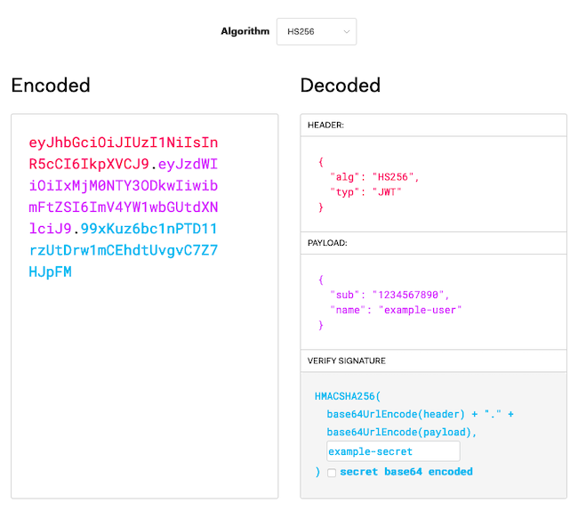

JSON Web Token (JWT) is a compact and self-contained standard for sending information in JSON format. JWTs are designed with efficiency and security in mind, making them especially useful for managing authentication over the web.

In this guide, you can learn more about the core concepts behind JWTs and how to begin implementing an authentication process with them yourself.

## Before You Begin

1. Familiarize yourself with our [Getting Started with Linode](/docs/getting-started/) guide and complete the steps for setting your Linode's hostname and timezone.

1. This guide uses `sudo` wherever possible. Complete the sections of our [How to Secure Your Server](/docs/security/securing-your-server/) guide to create a standard user account, harden SSH access, and remove unnecessary network services.

1. Update your system.

    - On Debian and Ubuntu, use the following command:

            sudo apt update && sudo apt upgrade

    - On CentOS, use the following command:

            sudo yum update


The steps in this guide are written for a non-root user. Commands that require elevated privileges are prefixed with `sudo`. If you’re not familiar with the `sudo` command, see the [Linux Users and Groups](/docs/tools-reference/linux-users-and-groups/) guide.


## What Are JSON Web Tokens?

JSON Web Token is an open standard ([RCF 7519](https://tools.ietf.org/html/rfc7519)) for the compact and secure transmission of information via JSON.

Compared to the tokens resulting from similar standards, like Security Assertion Markup Language (SAML) tokens, encoded JWTs are small. This makes them easier to work within HTTP transmissions, where they fit well in URLs and HTTP headers. Further, because JWT uses JSON instead of XML, tokens' decoded contents tend to be more easily readable. Given the prevalence of JSON on the web, JWTs can also be more approachable to use for web and mobile applications.

The JWT standard allows you to secure your tokens in two ways. First, JWTs can be and typically are, signed using a secure signing algorithm, like HMAC, or RSA. This helps to assure the integrity of information, greatly reducing the risk of your tokens being tampered with while in transit. Second, JWTs can be encrypted. Encrypting a JWT helps to prevent unintended recipients from seeing the token's contents, keeping your information private.

### JWT Structure

JWTs have three parts. In the resulting encoded JWT, each part is encoded using the **Base64Url** encoding and separated by periods, as in `{header}.{payload}.{signature}`.

- The header—has two parts: an identifier for the signing algorithm (`alg`) and an identifier for the token type (`typ`), which is always `JWT`. Following is an example of an un-encoded JWT header using the HMAC SHA256 signing algorithm.

        {
            "alg": "HS256",
            "typ": "JWT"
        }

- The payload—can come in numerous forms, but are categorized as one of three types:

  - Registered, which uses a predefined claim type, listed in the [IANA JSON Web Token specifications](https://tools.ietf.org/html/rfc7519#section-4.1).
  - Public, which uses a claim type defined for the situation and either existing in the [IANA JSON Web Token Register](https://www.iana.org/assignments/jwt/jwt.xhtml) or using a URI that avoids collision with registered claim types.
  - Private, which uses a claim type that is neither registered nor public.

    Following is an example of a registered payload using the "subject" type, which is useful for most authentication situations.

            {
                "sub": "1234567890",
                "username": "example-user",
            }

- The signature—consists of the encoded header and the encoded payload, separated by a period, and signed with the given algorithm — HMAC SHA256 in the header above.

To see this in action, you can use the [JWT.IO debugger](https://jwt.io/#debugger-io). This lets you define JWT contents and see the signed and encoded result.

## Example JWT Authentication

In this section, you can follow along to implement your own authentication process using JWTs. Many popular programming languages for web development have libraries to make handing JWTs easy. Here, Node.js is used, together with Express JS, which gives us tools to get a server up, and running quickly, and easily. If you want to learn more about Express JS, check out our [Express JS Tutorial: Get Started Building a Website](/docs/guides/express-js-tutorial/) guide.

The JWTs encoded in this example provide a lightweight and secure means of authenticating users. Be aware, though, that the JWTs are not encrypted here, so they should not be used to transmit sensitive information like passwords.

### Install Node.js

1. Install Node.js.

    On Debian and Ubuntu distributions, use the following command:

        curl -fsSL https://deb.nodesource.com/setup_15.x | sudo -E bash -
        sudo apt install nodejs

    On CentOS, use the following command:

        curl -fsSL https://rpm.nodesource.com/setup_15.x | sudo -E bash -
        sudo yum install nodejs

1. Set NPM to use the latest version of Node.js.

        sudo npm install npm@latest -g

### Set Up the Express JS Server

1. Create a directory for the project. In this example, `jwt-example` is used as the project and directory name. The example project here lives in the current user's home directory.

        mkdir ~/jwt-example

1. Change into the project directory. For the remaining steps in this example, the guide assumes you are in `jwt-example` directory.

        cd ~/jwt-example

1. Create the following JavaScript file called `server.js`. This contains the skeleton for your Express JS server.

    
In a production scenario, you should not store credentials in application code, and ideally, passwords should be stored encrypted. Additionally, use a secret that conforms to the standards for the signing algorithm you are using. For instance, the HMAC SHA256 algorithm in this example should be given a 256-bit secret. You can achieve this with a random 64-character hex string or a random 44-character Base64 string.
    

    
// Import the NPM packages to be used.
const express = require('express');
const jwt = require('jsonwebtoken');

// Initialize the Express JS application and configure its port number.
const app = express();
const port = 3000;

// Create a secret to be used for signing the JWTs.
const jwtSecret = "example-secret";

// Create an array with user login credentials and information.
// Typically, you would likely store this information in a database,
// and ideally the passwords would be stored encrypted.
const userCredentials = [
    {
        "username": "userA",
        "password": "example-password-userA",
        "userId": 1,
        "userInfo": "I am userA."
    },
    {
        "username": "userB",
        "password": "example-password-userB",
        "userId": 2,
        "userInfo": "I am userB."
    },
    {
        "username": "userC",
        "password": "example-password-userC",
        "userId": 3,
        "userInfo": "I am userC."
    }
];

// Have the Express JS application begin listening for requests.
app.listen(port, () => {
    console.log(`Server listening at http://localhost:${port}`);
})
    

1. Initialize the Node.js project.

        npm init

    You are prompted to enter information related to your project. You can simply press **Enter** for each prompt to use the default values.

1. Install Express JS and the JSON Web Token package for your project.

        npm install express --save
        npm install jsonwebtoken --save

### Encode with JWT

The server needs to have an endpoint to accept user credentials and provide a JWT in response. The resulting JWT can then be passed back to the server to authenticate subsequent requests.

Add the following to the `server.js` file.


// [...]

// Add an endpoint for incoming authentication requests.
app.get('/auth', (req, res) => {
    res.send(fetchUserToken(req));
});

// Check request credentials, and create a JWT if there is a match.
const fetchUserToken = (req) => {
    for (i=0; i<userCredentials.length; i++) {
        if (userCredentials[i].username == req.query.username
            && userCredentials[i].password == req.query.password) {
            return jwt.sign(
                {
                    "sub": userCredentials[i].userId,
                    "username": req.query.username
                },
                jwtSecret,
                {expiresIn: 120}
            );
        }
    }

    return "Error: No matching user credentials found.";
}

// [...]


### Decode with JWT

The server now needs to have an endpoint to provide user information upon receiving an appropriate JWT. In this case, the user's ID has been included in the JWT, so the application can use that to identify the appropriate user's information to fetch.

Add the following to the `server.js` file:


// [...]

// Add an endpoint for user information requests. The endpoint first
// verifies the JWT. If it is valid, it makes the call to fetch the
// user's information.
app.get('/userInfo', (req, res) => {
    jwt.verify(req.query.token, jwtSecret, (err, decodedToken) => {
        if (err) {
            res.send(err);
        } else {
            res.send(fetchUserInfo(decodedToken.sub));
        }
    });
});

// Fetch the user information matching the user ID in the request.
const fetchUserInfo = (userId) => {
    for (i=0; i<userCredentials.length; i++) {
        if (userCredentials[i].userId == userId) {
            return userCredentials[i].userInfo;
        }
    }

    return "Error: Unable to fulfill the request.";
}

// [...]


### In Action

Now the example application is ready. You can see the entirety of the resulting JavaScript file [here](server.js).

Follow the steps below to see the JWT process in action.

1. Start up the Express JS server.

        node server.js

    Express serves the application on `localhost:3000`. To visit the application remotely, you can use an SSH tunnel.

    - On Windows, you can use the PuTTY tool to set up your SSH tunnel. Follow the appropriate section of the [Using SSH on Windows](/docs/guides/using-ssh-on-windows/#ssh-tunnelingport-forwarding) guide, replacing the example port number there with `3000`.
    - On OS X or Linux, use the following command to set up the SSH tunnel. Replace `example-user` with your username on the application server and `198.51.100.0` with the server's IP address.

            ssh -L3000:localhost:3000 example-user@198.51.100.0

1. To start, fetch a JWT for "userA" by navigating to the following URL and copying the output.

        localhost:3000/auth?username=userA&password=example-password-userA

    Based on the expiry time configured in `server.js`, that token should be valid for two minutes after it is generated.

1. Navigate to the following URL to fetch userA's information. Replace `{header}.{payload}.{signature}` with the token you copied.

        localhost:3000/userInfo?token={header}.{payload}.{signature}

    You should see the message "I am userA" in your browser.

## Conclusion

You are all set to start working with JWTs and taking advantage of them for lean and secure authentication processes. Take a look at the resources below to continue the journey and learn more about JWT concepts.

You may also be interested in our guide on [Authenticating Over WebSockets with JSON Web Tokens (JWTs)](/docs/guides/authenticating-over-websockets-jwt). That guide goes a bit more in-depth and low level on JWTs and shows you how to use them with WebSockets.
