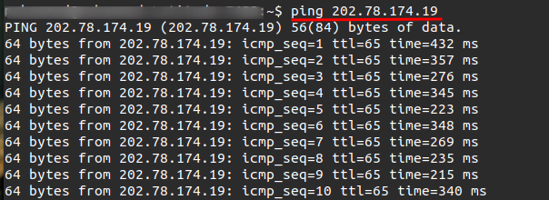
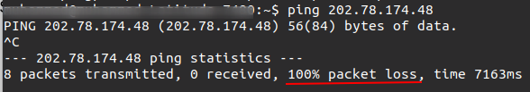
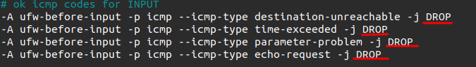

Would you like to learn more about the ping command and how to block it when needed?

If the question above has come to your mind, then you are in the right place. Some people like to allow ping requests on their servers because it helps with verifying IP address connectivity, but it comes at a cost. Hence, you may need to block it.

In this article, you will learn what ping is, its usefulness, how to use the command, and how to block it when it’s necessary.

### Prerequisites

- Linux Virtual Machine

## What is `ping`?

`ping` is a server utility that enables you to check the availability of an IP address. For example, if you have a random IP address, `202.78.174.220`, there’s no way to confirm if it’s live or not, hence, `ping`.

The process of pinging involves sending an **[ICMP](https://en.wikipedia.org/wiki/Internet_Control_Message_Protocol) echo request** to a particular host or IP address and receiving an **ICMP echo response**. Given that ping is not blocked on the target server. If the IP address or host is live, you will receive some constant response showing that the IP address is live.

The `ping` command in Windows utilizes a 32-byte request and by default only transmits four pings. Ping packets are added with an 8-byte timestamp by the machine that receives them before sending them back to the sender. The network's round-trip delays are determined using the timestamp.

The ping command on Linux utilizes a 64-byte request and, by default, keeps sending requests until it receives a stop command. Each request is given a sequence number, and the system notifies the user when the request has been answered. It's not necessary for the response to be received in the same sequence as the request.

## Reasons for Blocking `ping` Responses

1. Guards the machine against Distributed Denial-of-Service (DDoS) attacks.
2. Prevent expensive ICMP requests from your server.
3. To prevent [ping flood](https://en.wikipedia.org/wiki/Ping_flood) on your virtual machine.

## How to `ping` a Server

You can ping a server by running the command below. Replace `202.78.174.19` with the IP address of your virtual machine.

    ping 202.78.174.19

After running the command above, you should see something like the image below, showing that the server is active.

# How to Block `ping` Response

There are different ways to block ping responses for your server, but in this article, you will learn two, which can be applied in all use cases. The methods you will be trying out here are using the `sysctl` command and **uncomplicated firewall** (**UFW**). This will be done on the virtual machine, so you need to [SSH into it](https://gcorelabs.com/support/articles/360012635517/) before going further into the article.

## Using the `sysctl` command

The `sysctl` command can be used to read/write system parameters in the `/proc/sys` directory. You can use this command to write (`-w`) to `net.ipv4.icmp_echo_ignore_all` and set it to `1`, which means the server should ignore all ICMP requests.

You can accomplish this by running the following command on your virtual machine:

    sudo sysctl -w net.ipv4.icmp_echo_ignore_all=1

Now, if you try to ping the virtual machine, you will not be able to ping it.

You can reactivate pinging by setting `net.ipv4.icmp_echo_ignore_all=0`.

## Using UFW

As the name suggests, Uncomplicated Firewall (UFW) provides a simple way to set up a firewall for your server. You can use UFW to block `ping` requests by turning off ICMP input. You can turn off ICMP input by following the steps below:

1. UFW comes with Ubuntu by default, but its activity is disabled. You can enable UFW on your server by running the following command:

    sudo ufw enable

1. Now allow SSH, so you can continue to access the server with SSH. You can do this by running the following command:

    sudo ufw allow ssh

1. UFW has settings for ICMP stored in `/etc/ufw/before.rules`, you can edit that file by running the following command.

    sudo nano /etc/ufw/before.rules

1. Scroll down to where you have `# ok icmp codes for INPUT` and replace the word “**ACCEPT**” with “**DROP**” as you see in the image below. Then type Ctrl+x and follow the prompts to save the changes.

   
1. Now you have to reload UFW for the changes to take effect. You can do this by running the following command:

        sudo ufw reload

  When you try pinging the IP address, you will notice that it won’t go through. You can reverse this effect by changing the “DROP” parameters to “ACCEPT” in `# ok icmp codes for INPUT`.