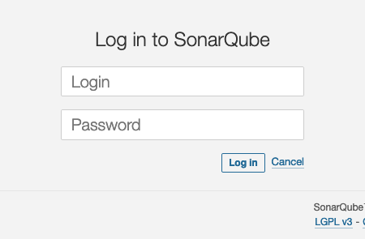
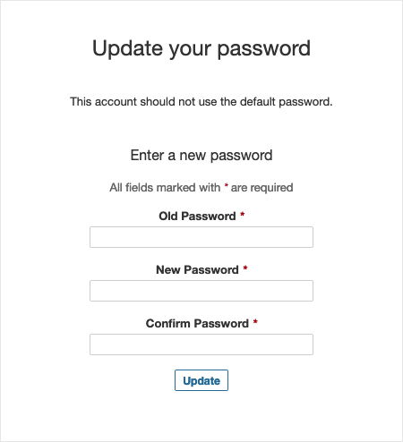
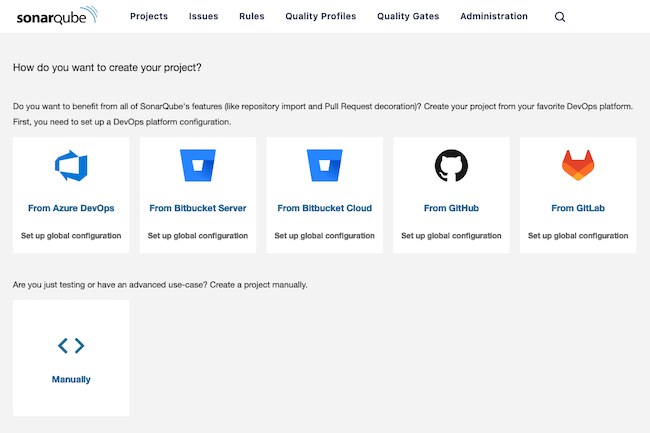
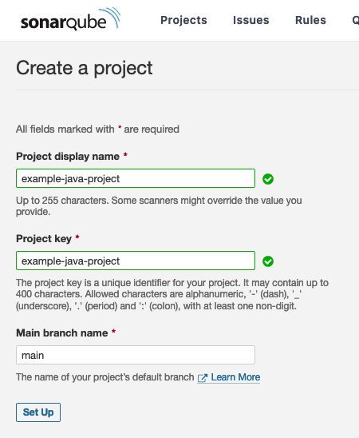
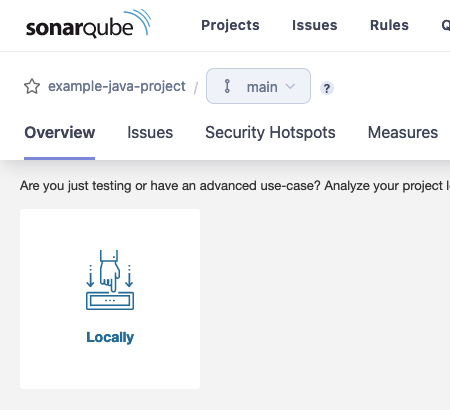
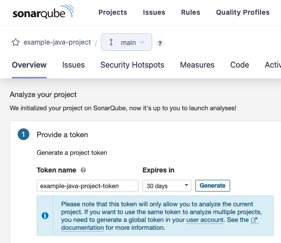
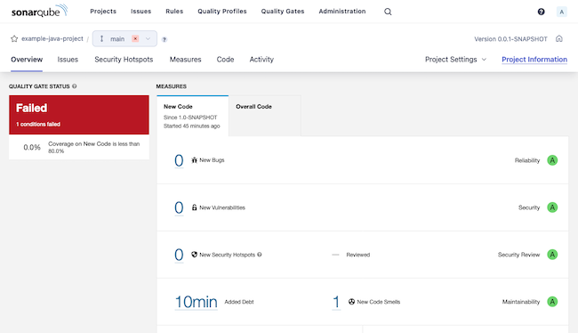
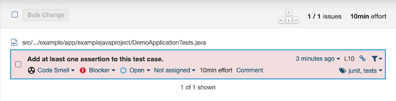
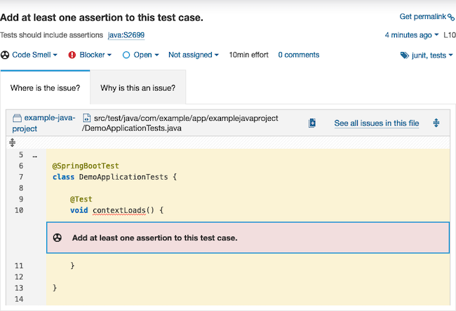

SonarQube gives you a tool for automating and managing static code analyses, with a host of features like issue reports and customized quality gates. SonarQube stands out further by integrating with a range of other tools, from project frameworks like Maven to CI/CD pipelines like Jenkins.

In this guide, learn everything you need to get started using SonarQube. The guide walks you through setting up your own SonarQube server. And it demonstrates how to integrate SonarQube with your projects by using it with an example Maven project.

## Before You Begin

1. If you have not already done so, create a Linode account and Compute Instance. See our [Getting Started with Linode](/docs/guides/getting-started/) and [Creating a Compute Instance](/docs/guides/creating-a-compute-instance/) guides.

1. Follow our [Setting Up and Securing a Compute Instance](/docs/guides/set-up-and-secure/) guide to update your system. You may also wish to set the timezone, configure your hostname, create a limited user account, and harden SSH access.


The steps in this guide are written for non-root users. Commands that require elevated privileges are prefixed with `sudo`. If you’re not familiar with the `sudo` command, see the [Linux Users and Groups](/docs/guides/linux-users-and-groups/) guide.


## What Is Static Code Analysis?

Static code analysis reviews code for issues, bugs, and standards violations. On the one hand, static code analysis goes deeper and wider in its review than the grammar and error checking done by compilers and interpreters. On the other hand, static code analysis automates code review and can often catch issues that a human code review may miss.

Tools for static code analysis can prevent potential issues from reaching production environments, and they can also enforce coding standards and legibility in your codebase.

You can learn more about static code analysis and what it has to offer in our [What is Static Code Analysis?](/docs/guides/what-is-static-code-analysis/) guide.

### Why SonarQube?

[SonarQube](https://www.sonarsource.com/products/sonarqube/) is a tool that automates static code reviews by integrating with your projects. SonarQube covers a wide range of programming languages, with useful code standards built in. At the same time, SonarQube is capable of integrating with several project frameworks, from Maven to .NET, or using its CLI tool.

SonarQube emphasizes integration with CI/CD and DevOps platforms. There, working as part of your GitHub workflows or Jenkins pipelines, SonarQube can automatically enforce quality gates and reporting.

## How to Install SonarQube

SonarQube runs as a self-hosted server. Projects can then add the SonarScanner plugin or CLI, together with a token generated in your SonarQube instance, to request code analyses from the server.

So, to start, you need to install SonarQube and start running the SonarQube server. This tutorial does so using Docker Compose, which lets you manage the SonarQube server and database implementation from one source.

### Install Docker and Docker Compose

These next steps show you how to install Docker with the Docker Compose plugin on Debian and Ubuntu and CentOS and Fedora systems. For other operating systems and distributions, refer to the [official instructions](https://docs.docker.com/engine/install/#server) for installing Docker Engine along with the Docker Compose plugin.

#### On Debian and Ubuntu

1. Remove any existing Docker installations.

    ```command
    sudo apt remove docker docker-engine docker.io containerd runc
    ```

1. Install the prerequisite packages for adding the Docker repository to the APT package manager.

    ```command
    sudo apt install ca-certificates curl gnupg lsb-release
    ```

1. Add the GPG key for the Docker repository to the APT package manager. Replace `debian` in the URL in this command with `ubuntu` if you are on an Ubuntu distribution.

    ```command
    sudo mkdir -m 0755 -p /etc/apt/keyrings
    curl -fsSL https://download.docker.com/linux/debian/gpg | sudo gpg --dearmor -o /etc/apt/keyrings/docker.gpg
    ```

1. Add the Docker repository to the APT package manager. Again, replace `debian` in the command's URL with `ubuntu` if you are on an Ubuntu distribution.

    ```command
    echo "deb [arch=$(dpkg --print-architecture) signed-by=/etc/apt/keyrings/docker.gpg] https://download.docker.com/linux/debian $(lsb_release -cs) stable" | sudo tee /etc/apt/sources.list.d/docker.list > /dev/null
    ```

1. Update the APT indices, and install the Docker Engine along with the Docker Compose plugin.

    ```command
    sudo apt update
    sudo apt install docker-ce docker-ce-cli containerd.io docker-buildx-plugin docker-compose-plugin
    ```

#### CentOS and Fedora

1. Remove any existing Docker installations.

    ```command
    sudo dnf remove docker docker-client docker-client-latest docker-common docker-latest docker-latest-logrotate docker-logrotate docker-selinux docker-engine-selinux docker-engine
    ```

1. Install the core plugins for the DNF package manager. These give you access to tools for managing DNF repositories.

    ```command
    sudo dnf -y install dnf-plugins-core
    ```

1. Add the Docker repository to the DNF package manager. Replace `centos` in the URL in this command with `fedora` if you are on a Fedora distribution.

    ```command
    sudo dnf config-manager --add-repo https://download.docker.com/linux/centos/docker-ce.repo
    ```

1. Install the Docker Engine along with the Docker Compose plugin.

    ```command
    sudo dnf install docker-ce docker-ce-cli containerd.io docker-buildx-plugin docker-compose-plugin
    ```

    You may be prompted to verify the GPG key, and you should see the following key listed.

    ```output
    060A 61C5 1B55 8A7F 742B 77AA C52F EB6B 621E 9F35
    ```

#### Completing the Installation

Following either installation path, you can ensure that the Docker daemon is running with the command here.

```command
sudo systemctl status docker
```

```output
● docker.service - Docker Application Container Engine
   Loaded: loaded (/usr/lib/systemd/system/docker.service; enabled; vendor preset: disabled)
   Active: active (running) since Thu 2023-02-16 20:38:07 UTC; 1s ago
     Docs: https://docs.docker.com
```

If it is not running (`active`), enable and start the Docker daemon with these commands.

```command
sudo systemctl enable docker
sudo systemctl start docker
```

Finally, you should add your limited user to the Docker user group. Otherwise, you would need to run Docker commands as root, or with `sudo`. Replace `example-user` with the username for your limited user.

```command
sudo usermod -aG docker example-user
```

For this last change to take effect, you have to restart your shell session, which you can do by exiting and reentering it.

### Prepare the System

SonarQube requires you to make certain adjustments to system settings. This includes opening the port that SonarQube runs on, and also includes changing limits for map count, files, and threads.

1. Open the port for SonarQube in your system's firewall. By default, SonarQube uses port `9000`, and you can use the commands here to open that port.

    - On **Debian** and **Ubuntu**:

        ```command
        sudo ufw allow 9000/tcp
        ```

    - On **CentOS** and **Fedora**:

        ```command
        sudo firewall-cmd --zone=public --add-port=9000/tcp --permanent
        sudo firwall-cmd --reload
        ```

1. SonarQube requires the limits for map counts, files, and threads to be set at least to certain values, shown here. These commands create dedicated files for the configurations, making the settings persistent.

    ```command
    sudo tee /etc/sysctl.d/99-sonarqube.conf > /dev/null <<EOF
    vm.max_map_count=524288
    fs.file-max=131072
    ulimit -n 131072
    ulimit -u 8192
    EOF
    ```

    ```command
    sudo tee /etc/security/limits.d/99-sonarqube.conf > /dev/null <<EOF
    sonarqube   -   nofile   131072
    sonarqube   -   nproc   8192
    EOF
    ```

1. Reboot the system for the changed limits to take effect.

    ```command
    sudo reboot
    ```

### Install and Start Running SonarQube

Now your system is ready to host a SonarQube server. Since this setup uses Docker Compose, the actual installation process entails creating a Compose definition file and running it.

If you are, instead, interested in a more traditional installation for your SonarQube instance, you can see the steps outlined in the [official installation documentation](https://docs.sonarqube.org/latest/setup-and-upgrade/install-the-server/).

1. Create and change into a new directory for the Docker Compose setup.

    ```command
    mkdir ~/sonarqube-compose
    cd ~/sonarqube-compose
    ```

1. Within that directory, create a `docker-compose.yml` file. Give that file the contents here.

    ```file {title="docker-compose.yml" lang="yaml"}
    version: "3"

    services:
      sonarqube:
        image: sonarqube:community
        depends_on:
          - db
        environment:
          SONAR_JDBC_URL: jdbc:postgresql://db:5432/sonar
          SONAR_JDBC_USERNAME: sonar
          SONAR_JDBC_PASSWORD: sonar
        volumes:
          - sonarqube_data:/opt/sonarqube/data
          - sonarqube_extensions:/opt/sonarqube/extensions
          - sonarqube_logs:/opt/sonarqube/logs
        ports:
          - "9000:9000"
      db:
        image: postgres:12
        environment:
          POSTGRES_USER: sonar
          POSTGRES_PASSWORD: sonar
        volumes:
          - postgresql:/var/lib/postgresql
          - postgresql_data:/var/lib/postgresql/data

    volumes:
      sonarqube_data:
      sonarqube_extensions:
      sonarqube_logs:
      postgresql:
      postgresql_data:
    ```

    This defines a basic SonarQube setup. The definition includes the community edition of the `sonarqube` Docker image, running it with the required volumes. And there is a definition for a PostgreSQL database server as well, which the SonarQube server uses to persist data.

1. Start running the Docker Compose setup for SonarQube by executing the following command within the directory with the `docker-compose.yml` file.

    ```command
    docker compose up -d
    ```

    Docker Compose downloads and prepares the necessary resources and starts up the PostgreSQL and SonarQube servers. From here, you can control the servers using Docker Compose commands.

    
Avoid using the `-v` option with the `docker compose down` command, or using the `docker volume prune` or `docker system prune` commands. Doing so may remove your otherwise persistent data.
    

### Access the Interface

With `docker compose up`, your SonarQube server should be running and available to start using. To get started, you should log in, both to set a password for your administrator user and to get familiar with the interface.

1. In a web browser, navigate to port `9000` on your SonarQube server's public IP address, or domain name if you have one set up. This takes you to the SonarQube login page.

    

1. Log into your SonarQube server with the credentials here.

    - Username: `admin`

    - Password: `admin`

    SonarQube prompts you immediately to change the password for this `admin` user.

    

After creating a new password for the administrator user, SonarQube directs you to the dashboard for your server. This dashboard gives you access to the tools you need to start analyzing your code and the reports for your analyses.

[](sonarqube-initial-dashboard.png)

The dashboard starts with a prompt to create a new project, and the guide picks up with that further on in the next section.

## How to Analyze Code with SonarQube

With a SonarQube server established, your next step is enabling SonarQube code analyses for one of your projects. To show you how, this section of the guide walks you through creating a simple example project with Maven and Spring Boot. The example shows you how to add the SonarScanner plugin for a Maven project and how to start scanning.

Additionally, the example shows how to enable projects and review analysis reports from within the SonarQube interface. These steps apply to a wide range of project types. And, moreover, going through them can give you a clearer idea of what SonarQube can do and how to make the most of it.

### Setting Up an Example Project

SonarQube uses the SonarScanner to scan and analyze a project's code. The SonarScanner itself can be either a plugin for your project framework, or the CLI tool for any unsupported projects types.

You can see a list of SonarScanner options in the [SonarQube documentation](https://docs.sonarqube.org/latest/analyzing-source-code/overview/).

The example project for this guide uses Maven, for which there is a SonarScanner plugin that can readily fit into the project. Follow along here to create the project and see how to add the SonarScanner plugin to it.

#### Installing Maven

Since this project uses the [Maven](https://maven.apache.org/) framework to create a base Java web application, you need to have Maven itself installed.

1. Navigate to the [Maven download page](https://maven.apache.org/download.cgi), and identify the URL for the latest Maven version.

1. Download the package with the latest Maven binary, and move the binary directory to a centralized directory on your system. Replace the download URL and filename below with what you found in the previous step.

    ```command
    cd ~/
    wget https://dlcdn.apache.org/maven/maven-3/3.9.1/binaries/apache-maven-3.9.1-bin.tar.gz
    tar xzvf apache-maven-3.9.1-bin.tar.gz
    sudo mv apache-maven-3.9.1 /usr/local/maven
    ```

1. Create a shell script as part of your shell profile. This adds two necessary environment variables — for the locations of Java and Maven — and adds the Maven binary directory to your shell path.

    ```command
    sudo tee "/etc/profile.d/maven.sh" > /dev/null <<'EOF'
    export JAVA_HOME=/usr/lib/jvm/jre-openjdk
    export MAVEN_HOME=/usr/local/maven
    export PATH=${PATH}:/usr/local/maven/bin
    EOF
    sudo chmod +x /etc/profile.d/maven.sh
    ```

1. Either exit and reopen the shell or use the command below to load the new script above to the current shell profile.

    ```command
    source /etc/profile.d/maven.sh
    ```

1. Verify that the Maven binary is installed and accessible.

    ```command
    mvn --version
    ```

    ```output
    Apache Maven 3.9.1 (2e178502fcdbffc201671fb2537d0cb4b4cc58f8)
    Maven home: /usr/local/maven
    Java version: 17.0.6-ea, vendor: Red Hat, Inc., runtime: /usr/lib/jvm/java-17-openjdk-17.0.6.0.9-0.3.ea.el8.x86_64
    Default locale: en_US, platform encoding: UTF-8
    OS name: "linux", version: "4.18.0-483.el8.x86_64", arch: "amd64", family: "unix"
    ```

1. Open the Maven global settings file, at `/usr/local/maven/conf/settings.xml` in this case, and make the following changes to it:

    - Within the `<pluginGroups>` block, add the `<pluginGroup>` line here to enable the SonarScanner plugin.

        ```file {title="settings.xml" lang="xml"}
        [...]
        <pluginGroups>
          <pluginGroup>org.sonarsource.scanner.maven</pluginGroup>
        </pluginGroups>
        [...]
        ```

    - Within the `<profiles>` block, add the `<profile>` block shown below for the SonarScanner plugin. Replace `SONARQUBE_URL` in this example with the actual URL for your SonarQube server. Alternatively, remove the `<sonar.host.url>` block if you want to use `localhost`.

        ```file {title="settings.xml" lang="xml"}
        [...]
        <profiles>
        [...]

          <profile>
            <id>sonar</id>
            <activation>
              <activeByDefault>true</activeByDefault>
            </activation>
            <properties>
              <sonar.host.url>
                http://SONARQUBE_URL:9000
              </sonar.host.url>
            </properties>
          </profile>
       </profiles>
       ```

#### Creating a Spring Boot Project

You can now use Maven to create your base project. To start with a useful base for a web application, this guide leverages the Spring Boot framework. The guide also relies on the Spring Boot CLI to initialize the project, saving you from having to create the necessary files and directories manually.

1. Install the Spring Boot CLI. Visit the [documentation for installing the Spring Boot CLI](https://docs.spring.io/spring-boot/docs/current/reference/html/getting-started.html#getting-started.installing.cli.manual-installation) to find the URL for the latest stable version, and replace the URL in the command below with that.

    ```command
    wget https://repo.maven.apache.org/maven2/org/springframework/boot/spring-boot-cli/3.0.5/spring-boot-cli-3.0.5-bin.tar.gz
    tar xzvf spring-boot-cli-3.0.5-bin.tar.gz
    sudo mv spring-3.0.5 /usr/local/spring
    ```

1. As with the Maven installation, create a shell script for your shell profile, adding the Spring CLI binary to the shell path.

    ```command
    sudo tee "/etc/profile.d/spring.sh" > /dev/null <<'EOF'
    export SPRING_HOME=/usr/local/spring
    export PATH=${PATH}:/usr/local/spring/bin
    EOF
    sudo chmod +x /etc/profile.d/spring.sh
    ```

1. Either exit and reopen the shell or run the command here for the changes to the shell path to take effect.

    ```command
    source /etc/profile.d/spring.sh
    ```

    You can then verify the installation by checking the `spring` version.

    ```command
    spring --version
    ```

    ```output
    Spring CLI v3.0.5
    ```

1. Create a Spring Boot project. This example command creates a new directory for the project, then names the project `example-java-project`. The command additionally defines the group for the project, `com.example.app`. Lastly, the resulting zip file is extracted, creating the project subdirectories.

    ```command
    mkdir ~/example-java-project
    cd ~/example-java-project
    spring init --group-id=com.example.app \
    --artifact-id=example-java-project \
    --build=maven --language=java \
    --java-version=17
    unzip example-java-project.zip
    rm example-java-project.zip
    ```

1. Open the `pom.xml` file, and add the `<plugin>` block shown below at the end of the `<plugins>` block that should already be in the file. You should also first identify the latest version of the plugin to use [here](https://central.sonatype.com/artifact/org.sonarsource.scanner.maven/sonar-maven-plugin/).

    ```file {title="pom.xml" lang="xml"}
    [...]
            <plugin>
              <groupId>org.sonarsource.scanner.maven</groupId>
              <artifactId>sonar-maven-plugin</artifactId>
              <version>3.9.1.2184</version>
            </plugin>
          </plugins>
        </pluginManagement>
      </build>
    ```

#### Adding the Project to SonarQube

The last step for setting up your project with SonarQube is to create a project item within the SonarQube server interface. Doing so gives you a token to use with the Maven project, allowing you to trigger scans from there.

1. Open the SonarQube interface again, and select the **Manually** option from the list of options for creating a project.

1. Enter a name and a key for the project. This guide uses the name from the Maven project, `example-java-project`, for both of these fields.

    

1. Choose **Locally** for the prompt on how SonarQube should analyze the project.

    

1. Generate a token on the resulting page, giving the token a name and choosing an expiration period for it. Keep track of this token for use within your Maven project in the next section.

    

### Running and Reviewing the Analysis

All that remains to test out SonarQube's code analysis is to run the SonarScanner against the example project. At this point, everything is set up to run a scan manually with the Maven project manager.

1. Run the command here to set up your Maven project with its dependencies and to execute the initial code scan. Replace `SONARQUBE_PROJECT_TOKEN` with the project token you generated for the project within the SonarQube interface.

    ```command
    mvn clean verify sonar:sonar -Dsonar.projectKey=example-java-project   -Dsonar.projectName='example-java-project' -Dsonar.token=SONARQUBE_PROJECT_TOKEN
    ```

    On subsequent runs, you can shorten the command like you see below, assuming you have not made any changes to the project's dependencies.

    ```command
    mvn sonar:sonar -Dsonar.projectKey=example-java-project   -Dsonar.projectName='example-java-project' -Dsonar.token=SONARQUBE_PROJECT_TOKEN
    ```

1. Navigate to the project page within the SonarQube server interface, and see SonarQube's analysis results.

    [](sonarqube-analysis-overview.png)

The Spring Boot base project fails SonarQube's analysis. To understand why, navigate to the **Issues** tab, where you can find a description for the issue.

[](sonarqube-analysis-issue.png)

SonarQube found that a test case within the project does not have any assertions, which it flags as an error. You can use this interface to manage the error, redefining it, for instance, or giving this instance a pass, or closing the issue as resolved.

You can get more details still by selecting the issue. There, you can see the offending code snippet as well as an explanation as to why SonarQube marks this as an error.

[](sonarqube-analysis-issue-details.png)

## Conclusion

You now have an operating SonarQube server, and an example Maven project to start building off of for your own projects. SonarQube integrates with a wide range of project frameworks, and you can see more on those from the link further above.

One of the other benefits of SonarQube is its integration with CI/CD pipelines, like Jenkins. And you can start getting an idea for what that might look like through our [Jenkins CI/CD on Linode to Any Hyperscaler](/docs/reference-architecture/jenkins-ci-cd-on-linode-to-any-hyperscaler/) reference architecture. The architecture gives a robust CI/CD system and includes a code analysis step.

To keep learning what SonarQube is capable of, be sure to look over the official SonarQube documentation linked below. There, you can see more of what the tool is capable of and how to get the most out of it.
