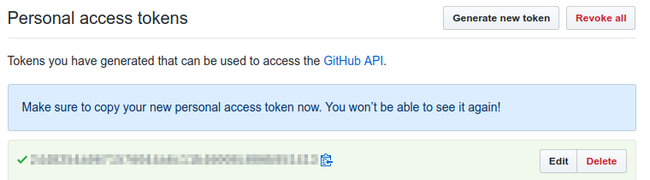

[Jenkins](https://jenkins.io) is an open-source automation server that allows you to build pipelines to automate the process of building, testing, and deploying applications. In this guide, you will implement a basic workflow to speed up your Continuous Integration and Continuous Delivery (CI/CD) process.

## Before You Begin

1.  If you have not already done so, create a Linode account and Compute Instance. See our [Getting Started with Linode](/docs/products/platform/get-started/) and [Creating a Compute Instance](/docs/products/compute/compute-instances/guides/create/) guides.

1.  Follow our [Setting Up and Securing a Compute Instance](/docs/products/compute/compute-instances/guides/set-up-and-secure/) guide to update your system. You may also wish to set the timezone, configure your hostname, create a limited user account, and harden SSH access.


This guide is written for a non-root user. Commands that require elevated privileges are prefixed with `sudo`. If you’re not familiar with the `sudo` command, see the [Users and Groups](/docs/guides/linux-users-and-groups/) guide.


## Preliminary Assumptions

This guide is oriented toward DevOps professionals and thus presumes:

1.  A local workstation will be used for development and testing.

2.  A Linode will be used for the remote Jenkins server.

3.  Both will use Ubuntu 16.04.

4.  Jenkins will be used mainly through the newer [Blue Ocean](https://jenkins.io/projects/blueocean/) web interface.

5.  The workstation and remote Linode will each need Docker installed beforehand. See our guide on [how to install docker images](/docs/guides/installing-and-using-docker-on-ubuntu-and-debian/) for detailed instructions.

6.  For the purpose of this guide, only a Jenkins master server will be used.

7.  You will need a GitHub account already created, or similar procedures can be used for Bitbucket and GitLab.

8.  You will also need a Docker Hub or similar registry account.

## Understanding How Jenkins Works

Before automating your workflow, it's necessary to understand the basic CI/CD process. The following image illustrates it:

The most basic process consist of three phases: build, test, deploy. Each time you make changes on your distributed version control system, you trigger an automation cycle on the Jenkins server. The entire set of instructions for running the process is in the `Jenkinsfile` located at the root of your source repository. That single file tells the server what to do, when to do it and how you want those tasks to be performed.

## Write an Example Node.js Application

As mentioned in the previous section, the automation process starts by making a commit to a version control system.

Create a new repository in GitHub. This guide will use a simple Node.js application to showcase how the Jenkins Pipelines works. Select your `.gitignore` accordingly and don't forget to initialize it with a `README`:

Clone the new repository to your local workstation:

     git clone git@github.com:<GITHUB_USERNAME>/jenkins-guide.git

Open your favorite text editor and create the file `app.js` at the root of your repository. Add the following content:


'use strict';

const express = require('express');
const app = express();

// Server connection
const PORT = 9000;
const HOST = '0.0.0.0';

// Application content
const os = ['Windows','macOS','Linux']

// Web Server
app.get('/',function(req,res) {
  res.json(os);
});

// Console output
app.listen(PORT, HOST);
console.log(`Running on http://${HOST}:${PORT}`);


This application uses the [Express](https://expressjs.com/) web server to deliver a single JSON output to the browser on port 9000. Next, save `test.js` to the same location at the root of your repository.


var supertest = require("supertest");
var should = require("should");

var server = supertest.agent("http://nodeapp-dev:9000");

// Unit Test

describe("Webapp Status",function(){

  // Test 1 - HTTP status
  it("Expect HTTP status 200",function(done){
    server
    .get("/")
    .expect("Content-type",/text/)
    .expect(200)
    .end(function(err,res){
      res.status.should.equal(200);
      done();
    });
  });

  // Test 2 - Control Tests
  it("Mocha Control Test",function(done){
      (1).should.be.exactly(1).and.be.a.Number();
        done();
  });

});


This is a simplified test suite that uses `supertest` and `should`. It only has two tests: The first checks the HTTP status, which it expects to be 200. The second is not a real test but a control that always passes.

This example will use two Docker containers, one to serve `app.js` using Express and the other exclusively for the test suite using Mocha. Each image will have its own folder containing the respective `Dockerfile` and `package.json`.

1.  Create a directory for each image:

        mkdir express-image test-image

2.  Create the `Dockerfile` and `package.json` for the `express-image`.

    
FROM node:6-alpine

# Create a server directory
RUN mkdir -p /home/node/app
WORKDIR /home/node/app

# Install server dependencies
COPY /express-image/package.json /home/node/app
RUN npm install

# Copy node Application
COPY app.js /home/node/app

# Open port
EXPOSE 9000

CMD ["npm", "start"]


    This image runs `app.js` by default when launched. You can think of it as the "dockerized" version of the web application.

3.  The Dockerfile copies a `package.json` file from the root of your project directory into the new image:

    
{
  "name": "express-image",
  "version": "1.0.0",
  "description": "Example Node Application",
  "author": "Your name",
  "repository": {
    "type": "git",
    "url": "git+https://github.com/<YOUR_USERNAME>/<REPOSITORY_NAME>.git"
  },
  "license": "ISC",
  "scripts": {
    "start": "node app.js"
  },
  "dependencies": {
    "express": "^4.13.3"
  }
}


4.  Create the `Dockerfile` for the `test-image`:

    
FROM node:6-alpine

# Create feports directory
RUN mkdir -p /JUnit

# Create a server directory
RUN mkdir -p /home/node/tests
WORKDIR /home/node/tests

# Install app dependencies
COPY /test-image/package.json /home/node/tests
RUN npm install

# Copy test source
COPY test.js /home/node/tests

EXPOSE 9000

CMD ["npm", "test"]


    This image creates a *report* folder and installs dependencies from `package.json`. On start, it executes the Mocha tests.

5.  Add a `package.json` file for your testing image:

    
{
  "name": "test-image",
  "version": "1.0.0",
  "description": "This is a Mocha Test Server",
  "scripts": {
    "mocha": "mocha --reporter spec test.js",
    "test": "mocha --reporter mocha-junit-reporter --reporter-options mochaFile=/JUnit/reports.xml test.js"
  },
  "repository": {
    "type": "git",
    "url": "git+https://github.com/<YOUR_USERNAME>/<YOUR_REPOSITORY>.git"
  },
  "author": "Your name",
  "license": "ISC",
  "bugs": {
    "url": "https://github.com/<YOUR_USERNAME>/<YOUR_REPOSITORY>/issues"
  },
  "homepage": "https://github.com/<YOUR_USERNAME>/<YOUR_REPOSITORY>#readme",
    "dependencies": {
    "mocha": "^4.0.1",
    "mocha-junit-reporter": "^1.15.0",
    "should": "^13.1.3",
    "supertest": "^3.0.0"
  }
}


    This JSON file contains all the necessary dependencies, including `mocha-junit-reporter` that will be needed by Jenkins for tests storage. Notice that the test script is configured with the `mochaFile` option which uses the image's report folder specified in the `Dockerfile`.

    Your final project distribution will be similar to this:

    

    
The approach of the folder structure and the implementation of two Docker containers is unusual, but used for pedagogical reasons to showcase Jenkins Pipeline features.


### Run Your Application Manually

Before starting the real automation process, you first need to understand what to automate.

1.  Assuming you are at the root of your repository, start by building your images:

        sudo docker build -f express-image/Dockerfile -t nodeapp-dev:trunk .
        sudo docker build -f test-image/Dockerfile -t test-image:latest .

2.  You will need to start your `nodeapp-dev` container first. Notice that port 9000 is opened and  `-d` flag is used to run it in detached mode. Once started you can open your browser and enter the address: `http://localhost:9000` to check it.

        sudo docker run --name nodeapp-dev -d -p 9000:9000 nodeapp-dev:trunk

    

3.  Next, start the `test-image` container. It's important to use the same network, along with the `--link` flag, in order to communicate with `nodeapp-dev`. You will notice the container's report folder `JUnit` will be mounted at the current repository root. This is necessary to write the `reports.xml` on the host machine. Run it in interactive mode using the `-it` flag to output the results to `stdout`.

        sudo docker run --name test-image -v $PWD:/JUnit --link=nodeapp-dev -it -p 9001:9000 test-image:latest npm run mocha

    

4.  Remove the container (you may need `sudo -i`) and run it again in detached mode to test the `JUnit` output. The `reports.xml` file should be saved afterwards.

        sudo docker rm -f test-image
        sudo docker run --name test-image -v $PWD:/JUnit --link=nodeapp-dev -d -p 9001:9000 test-image:latest

5.  After testing your application you can publish it in a public registry. First change its tag to something more appropriate.

        sudo docker tag nodeapp-dev:trunk <YOUR_DOCKERHUB_USERNAME>/nodeapp-prod:latest

6.  Assuming you are already logged in to Docker Hub, push your image to the registry.

        sudo docker push <YOUR_DOCKERHUB_USERNAME>/nodeapp-prod:latest

7.  Alternatively, you could save your compressed image for further distribution.

        sudo docker save <YOUR_DOCKERHUB_USERNAME>/nodeapp-prod:latest | gzip > nodeapp-prod-golden.tar.gz

8.  Do some clean-up. Stop both containers, using `sudo -i` if necessary.

        sudo docker stop test-image nodeapp-dev

9.  And finally, prune your system.

        sudo docker system prune -f

You just finished the entire *build, test, and deploy* process for this fictional web application. Now it's time to automate it.

## Install Jenkins and Blue Ocean

Jenkins offers many installation options:

*  You can download the self-executable `jenkins.war` from project's site. This is a quick and effective solution to work with Jenkins with few pre-requisites, but harder to maintain and update.
*  You can pull the [official Docker image](https://hub.docker.com/r/jenkins/jenkins/) and run Jenkins from there. This method requires extra configuration, especially for *Docker in Docker* functionality.
*  Finally, you can use the project-maintained package. This offers the benefit of easier upgrading. This is the method used by this guide.

### Install Jenkins

Using the package maintained by the Jenkins project allows you to use a more recent version than the one included in your distribution's package manager.

1.  Download and add the repository key for the current stable version of Jenkins:

        wget -q -O - https://pkg.jenkins.io/debian-stable/jenkins.io.key | sudo apt-key add -

2.  Add the new repository to your `sources.list`:

        sudo sh -c 'echo deb http://pkg.jenkins.io/debian-stable binary/ > /etc/apt/sources.list.d/jenkins.list'

3.  Update your system and install Jenkins:

        sudo apt update
        sudo apt install jenkins

4.  Now that you have Jenkins installed, you will need to give its user permission to run Docker commands:

        sudo usermod -aG docker jenkins

5.  Controlling your daemon is straightforward using: `sudo service jenkins` with the options `start`, `stop`, `restart`, or `status`. Start your service to check the installation:

        sudo service jenkins start

6.  If everything works as expected then enable the service on start-up.

        sudo systemctl enable jenkins

7.  Use the Linode Manager to reboot your server to apply these changes.

    
It's out of the scope of this guide to establish security parameters for Jenkins remote installation. However, be aware of these critical points that need to be addressed in a production environment:

-  When you add `jenkins` user to the Docker group you are technically giving it `root` permissions.
-  You must enforce firewall policies for Jenkins connections.
-  It's extremely important to secure the connection between your local workstation and your remote Linode running Jenkins. You can achieve this using SSL and a reverse proxy (like Apache or NGINX), or by using a VPN.


## Set up Jenkins

1.  Use your browser to navigate to default server address:

        http://<LINODE_IP_OR_HOSTNAME>:8080

    The first screen you should see would be similar to this:

    

1.  Copy the temporary administrator password and use it to log in:

        sudo cat /var/lib/jenkins/secrets/initialAdminPassword

1.  Choose **Install suggested plugins** to start downloading the standard plugins:

    

    

1.  When the plugin installation finishes, you will be asked to create a new administrative user:

    

1.  If successful, you will see:

    

1.  Click on **Start using Jenkins** to display the application dashboard:

    

1.  As mentioned earlier, this guide will use the new Blue Ocean interface, so you will need to click the **Manage Jenkins** link on the sidebar:

    

1.  A new menu will appear. Click on **Manage Plugins**:

    

1.  Click on the **Available** tab and filter the results searching for Blue Ocean.

    

1.  Check the box corresponding to Blue Ocean plugin and then click the button **Install without restart**.

    

1.  You should see the installation progress. Once it's finished click the **Go back to the top page** link, then click the **Open Blue Ocean** link in the sidebar.

    

1.  You'll then see the new Blue Ocean dashboard:

    

## Scripted vs. Declarative Pipeline Syntax

Jenkins offers two different choices for the `Jenkinsfile` syntax:

*  The legacy Scripted Pipeline syntax.
*  The newer Declarative Pipeline syntax.

Both have support for continuous delivery and Jenkins plugins. Scripted syntax is based on the Groovy programming environment so is more complete. On the other hand, Declarative syntax "was created to offer a simpler and more opinionated syntax for authoring Jenkins Pipeline", and thus is intended for everyday automation builds. You can learn more about syntax comparison in the [Jenkins documentation](https://jenkins.io/doc/book/pipeline/syntax/#compare).

This guide will use the Declarative syntax to illustrate Jenkins processes because it's designed to be easier to implement and understand.

## Jenkinsfile Structure

Declarative Pipeline syntax is very intuitive. The most basic layout would be similar to the one shown below:

* `pipeline`: All files should start with this declaration at the top. It indicates the start of the new Pipeline.
* `agent`: Defines the working environment, usually a Docker image. The `any` statement indicates the pipeline can use any available agent.
* `stages`: This block is a collection of `stage` directives.
* `stage`: Groups one or more `steps`. You can use as many stages as needed, this is useful when you are working in complex models that need detailed debugging "per stage".
* `steps`: Here you define your actions. A stage can group many steps, and each step is usually linked to one specific task/command.

Code blocks are delimited by curly brackets (`{` and `}`) and no semicolons are used. Each statement has to be in its own line, and the heart of the `Jenkinsfile` are the steps you perform. Some common steps are:

* Run scripts or code commands.
* Compile code.
* Run tests.
* Push or pull from your source control.
* Transfer archives.
* Create Docker images, dockerize applications, pull images.
* Almost any action you can think of is possible through steps.

All these actions can be executed inside your `agent` or you can also instruct Jenkins to remotely perform any of them via SSH. As you can see there are endless automation possibilities. In a simple scenario, only one pipeline executing its stages sequentially is enough to achieve the desired final state, but you can define pipelines to run in parallel if needed. For detailed information about Jenkins Declarative Pipeline Syntax, see the [official documentation](https://jenkins.io/doc/book/pipeline/syntax/).

## Start Working with Pipelines

1.  Create your first `Jenkinsfile` in the `jenkins-guide` directory on your workstation. This is only a template, but it contains all the necessary code to start your Pipeline:

    
pipeline {
    agent any
        stages {
            stage('Build') {
                steps {
                    echo 'This is the Build Stage'
                }
            }
            stage('Test') {
                steps {
                    echo 'This is the Testing Stage'
                }
            }
            stage('Deploy') {
                steps {
                    echo 'This is the Deploy Stage'
                }
            }
        }
    }


1.  Push your commit to GitHub:

        git add . && git commit -m "Jenkinsfile template" && git push origin master

1.  Return to the Blue Ocean Dashboard and click **Create a new Pipeline**:

    

1.  Select GitHub as your CVS:

    

1.  You will be asked to connect with your GitHub account by means of an access key. Click on the link to create that key.

    

1.  Next you will need to login to your GitHub account, give a description to the token and generate it. You will be presented with a screen similar to this:

    

1.  Copy the token value and then paste it into the field on the Blue Ocean tab. Then click the **Connect** button:

    

1.  If you have multiple organization accounts along with your personal account, then you will need to choose which organization contains your repository:

    

1.  After choosing your repository location, click **Create Pipeline**. That will trigger your first build automatically.

    

1.  Click on the build to see your detailed Pipeline.

    

From here you can obtain valuable information regarding: 1) your build number, 2) the console output for each step, 3) selecting stages for further analysis, 4) browsing through tabs with information about commit changes, tests results, and artifacts stored, 5) replaying your build, 6) editing your pipeline visually, and 7) go to your pipeline settings.

### Automate Your Entire Process with Jenkins

The `Jenkinsfile` template uses a very basic pipeline structure with only three stages. You can customize it to accommodate as many stages as needed. The final pipeline structure is dictated by the project complexity and the development guidelines you must follow. Since you've already walked through the Node.js example, you know how to design a pipeline that automates each stage. For the purpose of this guide, the resulting pipeline should:

* Build Stage
    - Create both images and abort any further testing or deployment if an error is encountered.
    - Inform the appropriate department in case of failure.
* Test Stage
    - Perform the automatic Mocha test suite.
    - Publish the `nodeapp-dev` image for easier distribution and manual quality tests.
    - Inform the appropriate department depending on the outcome of the automatic tests: success, unstable (failure of any automatic test), or total failure of the stage.
* Deploy Stage
    - Will run only if the commit is performed on the `master` branch and test stage completed successfully.
    - Changes the image tag before publish.
    - Deploys the dockerized application to Docker Hub.
    - Save a compressed 'golden' image for further distribution.
* Reports Stage
    - Saves the `JUnit` file and `reports.xml` for detailed analysis.
    - Saves the `nodeapp-prod-golden.tar.gz` compressed image to a persistent location.
* Clean-up Stage
    - Stop all containers.
    - Prune the system.
    - Cleans the Jenkins workspace.

### Commit Changes to Your Pipeline

Start by editing your Jenkinsfile and pasting the following pipeline. Replace `<DockerHub Username>` with your own information.


pipeline {
    environment {
      DOCKER = credentials('docker-hub')
    }
  agent any
  stages {
// Building your Test Images
    stage('BUILD') {
      parallel {
        stage('Express Image') {
          steps {
            sh 'docker build -f express-image/Dockerfile \
            -t nodeapp-dev:trunk .'
          }
        }
        stage('Test-Unit Image') {
          steps {
            sh 'docker build -f test-image/Dockerfile \
            -t test-image:latest .'
          }
        }
      }
      post {
        failure {
            echo 'This build has failed. See logs for details.'
        }
      }
    }
// Performing Software Tests
    stage('TEST') {
      parallel {
        stage('Mocha Tests') {
          steps {
            sh 'docker run --name nodeapp-dev -d \
            -p 9000:9000 nodeapp-dev:trunk'
            sh 'docker run --name test-image -v $PWD:/JUnit \
            --link=nodeapp-dev -d -p 9001:9000 \
            test-image:latest'
          }
        }
        stage('Quality Tests') {
          steps {
            sh 'docker login --username $DOCKER_USR --password $DOCKER_PSW'
            sh 'docker tag nodeapp-dev:trunk <DockerHub Username>/nodeapp-dev:latest'
            sh 'docker push <DockerHub Username>/nodeapp-dev:latest'
          }
        }
      }
      post {
        success {
            echo 'Build succeeded.'
        }
        unstable {
            echo 'This build returned an unstable status.'
        }
        failure {
            echo 'This build has failed. See logs for details.'
        }
      }
    }
// Deploying your Software
    stage('DEPLOY') {
          when {
           branch 'master'  //only run these steps on the master branch
          }
            steps {
                    retry(3) {
                        timeout(time:10, unit: 'MINUTES') {
                            sh 'docker tag nodeapp-dev:trunk <DockerHub Username>/nodeapp-prod:latest'
                            sh 'docker push <DockerHub Username>/nodeapp-prod:latest'
                            sh 'docker save <DockerHub Username>/nodeapp-prod:latest | gzip > nodeapp-prod-golden.tar.gz'
                        }
                    }

            }
            post {
                failure {
                    sh 'docker stop nodeapp-dev test-image'
                    sh 'docker system prune -f'
                    deleteDir()
                }
            }
    }
// JUnit reports and artifacts saving
    stage('REPORTS') {
      steps {
        junit 'reports.xml'
        archiveArtifacts(artifacts: 'reports.xml', allowEmptyArchive: true)
        archiveArtifacts(artifacts: 'nodeapp-prod-golden.tar.gz', allowEmptyArchive: true)
      }
    }
// Doing containers clean-up to avoid conflicts in future builds
    stage('CLEAN-UP') {
      steps {
        sh 'docker stop nodeapp-dev test-image'
        sh 'docker system prune -f'
        deleteDir()
      }
    }
  }
}


This complete Jenkinsfile is written using declarative syntax. If you read it carefully, you will notice that it describes the same procedure used during the application deployment in a previous section. This section will analyze the Jenkinsfile in more detail.

### Agent and Environmental Variables

The first block defines a globally available environmental variable called `DOCKER`. You can tell it applies globally because is inside the pipeline block but outside the stages block. Next comes the `agent`, a statement that means Jenkins can use any (server) agent.


pipeline {
    environment {
      DOCKER = credentials('docker-hub')
    }
  agent any


The `DOCKER` definition is done through the *credentials* feature. This allows you to use confidential login information without including it in the Jenkinsfile. To configure this key pair:

1.  Click on the gear icon (Pipeline Settings).

2.  You will see the project's settings page, click the **Credentials** link at the bottom of the sidebar menu.

    

3.  In the next screen you can choose the scope of the credentials you want to configure. This can be limited to the current project or can be defined as global. In this case you want Docker Hub login information to be global. Click **Add Credentials** in the left sidebar.

    

4.  You will be redirected to a screen similar to the screenshot below. There you need to enter your Docker Hub username, password and enter a unique identifier (ID) for this credential. The chosen one for this example was `docker-hub`. Once you save your credentials you can use them anywhere in the Pipeline.

    

In the example pipeline, `DOCKER = credentials('docker-hub')` creates two environmental variables, `DOCKER_USER` and `DOCKER_PWD` that can be used to log in your Docker Hub account.

### Build Stage

The first thing you will notice about the `parallel` code block is that it's self-explanatory-it will run sub-stages in parallel. This is useful for building two Docker images at the same with the same shell commands you used before. Each image is declared in its own step which is also part of an independent stage.


// Building your Test Images
    stage('BUILD') {
      parallel {
        stage('Express Image') {
          steps {
            sh 'docker build -f express-image/Dockerfile \
            -t nodeapp-dev:trunk .'
          }
        }
        stage('Test-Unit Image') {
          steps {
            sh 'docker build -f test-image/Dockerfile \
            -t test-image:latest .'
          }
        }
      }
      post {
        failure {
            echo 'This build has failed. See logs for details.'
        }
      }
    }


After closing the parallel stage you encounter the `post` conditionals. `Post` means the definitions applies to the whole `BUILD` stage. In this case only the `failure` condition is set, so it will only run if any part of the `BUILD` stage fails. Configuring the different tools that Jenkins provides for communications is beyond the scope of this guide.

### Test Stage

The testing stage also uses parallel execution:


// Performing Software Tests
    stage('TEST') {
      parallel {
        stage('Mocha Tests') {
          steps {
            sh 'docker run --name nodeapp-dev -d \
            -p 9000:9000 nodeapp-dev:trunk'
            sh 'docker run --name test-image -v $PWD:/JUnit \
            --link=nodeapp-dev -d -p 9001:9000 \
            test-image:latest'
          }
        }
        stage('Quality Tests') {
          steps {
            sh 'docker login --username $DOCKER_USR --password $DOCKER_PSW'
            sh 'docker tag nodeapp-dev:trunk <DockerHub Username>/nodeapp-dev:latest'
            sh 'docker push <DockerHub Username>/nodeapp-dev:latest'
          }
        }
      }
      post {
        success {
            echo 'Build succeeded.'

        }
        unstable {
            echo 'This build returned an unstable status.'
        }
        failure {
            echo 'This build has failed. See logs for details.'
        }
      }
    }


The `Mocha Tests` stage starts the two images and performs the automatic tests, resulting in a `reports.xml` file saved into Jenkins workspace. On the other hand, the `Quality Tests` stage publishes the `trunk` version of your application to Docker Hub. It first issues the Docker login command (using the pre-defined credentials), then changes the image tag, and pushes it.

Once again, you have the `post` code block but this time it has notifications for successful completion, unstable and failure. Keep in mind you can use any code here, not just notifications.

### Deploy Stage

This stage introduces a different type of block: `when`. As the name implies, this clause executes only if a certain condition is met. In the case of this example, the code only runs if changes to the master branch are detected. Commits to other branches won't trigger this step of the pipeline.

Inside the steps you can optionally configure the `retry` and `timeout` arguments. Our above example shows a nested usage where the image build process has a timeout of 10 minutes and a total of three retries in case the timer expires.

The `post` block has been designed to run a cleanup in case of failure. No notifications are set for this stage.

### Reports and Cleanup Stages

The final two stages of your pipeline are comparatively simple. The `junit` statement allows Jenkins to use the `reports.xml` file generated by your Mocha image, and the `archiveArtifacts` command saves the report and application file to a persistent location. By default, that location is `JENKINS_HOME/var/lib/jenkins/jobs/<REPOSITORY>/branches/master/builds/lastStableBuild`. You can configure a custom location in Jenkins' General Settings if needed.

### Working with Branches

It's time to commit the complete Jenkinsfile to your Jenkins server and trigger a run of the new pipeline. In order to test the `when` block discussed earlier, the changes will be pushed to  a different branch.

1.  Create a new branch on your local repository:

        git checkout -b trunk

2.  Stage, commit, and push the files to the Jenkins Server:

        git add . && git commit -m "Jenkinsfile complete Pipeline" && git push origin trunk

3.  Click on the gear icon (Pipeline settings) on your Blue Ocean Dashboard and then click **Scan Repository Now**:

    

4.  Return to your Pipeline view to watch your stages run in parallel:

    

5.  Once finished, you will see your entire Pipeline. Notice that this commit was submitted as branch, and because of that, the `DEPLOY` stage was skipped, which is expected.

    

6.  If you navigate through the menu tabs, you can check the test results and the artifacts stored:

    

### Configure Automatic Triggers

You can set Jenkins to scan your repository periodically. To do so just click again on the gear icon on the Pipeline view and then click **Configure**. There are many options available. Find **Scan Repository Triggers** and check the box **Periodically if not otherwise run**. You can choose any amount of time and for this example, one minute will be selected.

### Failing Tests (Unstable Pipeline)

Up to this point, everything should work as expected without error. But what happens when an error is encountered?

1.  Edit `app.js` in your local workstation. On the server, change the root address `/` with `/ERROR`. This will cause an error 404 on the `express` server (page not found) so the test will fail.


// Web Server
app.get('/ERROR',function(req,res) {
  res.json(os);
});


2.  Commit your changes to Jenkins:

        git add . && git commit -m "404 error" && git push origin trunk

3.  There is no need to manually scan your repository because you already setup Jenkins to do it automatically every minute. Wait for the trigger. After running you should see something similar to this:

    

4.  Navigate to the **Tests** tab and click on the chevron for a complete console output:

    

5.  Close your view (upper right "X") and you will return to the Repository view.

6.  Fix the `app.js` file and save.

### Failing Stages

Now, induce an error on the `BUILD` stage.

1.  Edit your `express-image/package.json`. Change the Express package name to `express-ERROR` to simulate a mistyping.

    
"dependencies": {
    "express-ERROR": "^4.13.3"
  }


2.  Push your changes to Jenkins:

        git add . && git commit -m "express-image Build error" && git push origin trunk

3.  In the pipeline view click on `BUILD` stage and the on **Shell Script** to see the console output:

    

4.  Scroll down and check the error:

    

5.  Fix the error in `express-image/package.json`.

### Merging Pull Requests

Merge the `trunk` branch into `master`. This will trigger a run of the full pipeline, including the deploy stage:

    git checkout master
    git merge trunk
    git push origin master

## Outside Blue Ocean Dashboard

Blue Ocean interface is still under development, which means that many aspects of Jenkins are not managed by the new interface. Below are some of the most common screens.

1.  Click on the gear icon to enter at your repository menu. Once there, click **Status** in the left sidebar. You will see your branches and some general information:

    

2.  If you click on the `master` branch you will see a more detailed dashboard:

    

    From this view you can review a lot of useful information like logs, artifacts, changes, trends of test results, and much more.

## The Road Ahead

This guide has covered the basic automation workflow with Jenkins and Blue Ocean, but there is a lot more you can do. Just to mention a few possibilities:

* The JUnit plugin has the ability to publish XML formatted test reports (generated by test tools) and integrate those trends and reports into Blue Ocean for analysis.
* Besides the Jenkins GUI and new Blue Ocean GUI you can work with Jenkins CLI if that suits you best.
* Pipelines have support for custom functions which can be used for complex data validation, testing, monitoring, and more.
* Parallel pipelines can be executed to accelerate certain processes as well as triggering the pipeline to run only if a specific branch is checked.
* The `post` (or any other section) can benefit from useful built-in functions like email, Slack, or HipChat notifications. As usual, you decide what triggers notifications, whether a successful build, a build failure, a change, or a custom condition.
* You can also use a different `agent` for specific `stages`, for example one for database tasks, one for compiling code, one for webapp updating, etc.
