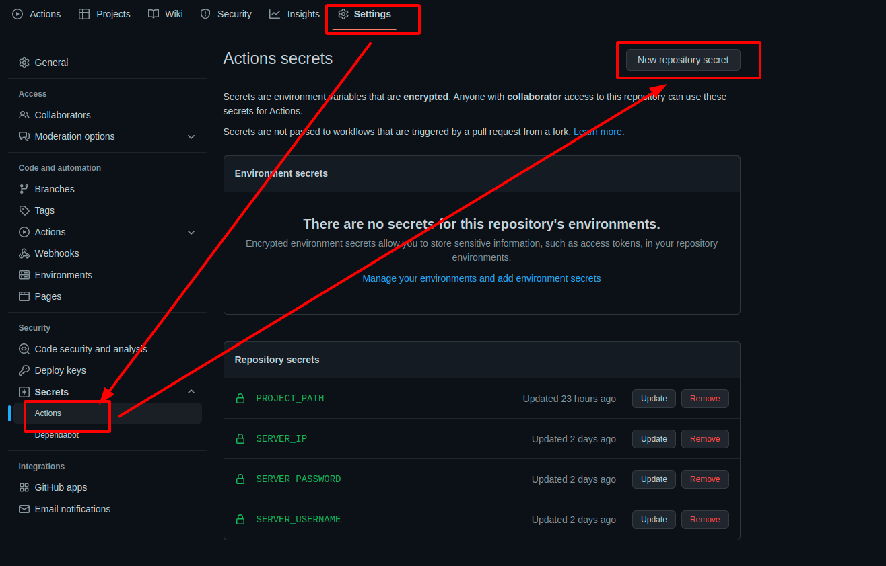
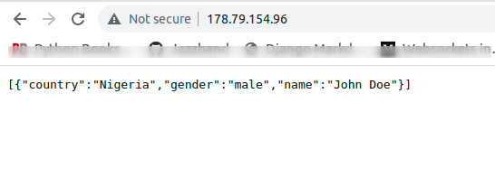

## Before You Begin

1.  If you have not already done so, create a Linode account and Compute Instance. See our [Getting Started with Linode](/docs/guides/getting-started/) and [Creating a Compute Instance](/docs/guides/creating-a-compute-instance/) guides.

1.  Follow our [Setting Up and Securing a Compute Instance](/docs/guides/set-up-and-secure/) guide to update your system. You may also wish to set the timezone, configure your hostname, create a limited user account, and harden SSH access.


The steps in this guide require root privileges. Be sure to run the steps below as `root` or with the `sudo` prefix. For more information on privileges, see our [Users and Groups](/docs/tools-reference/linux-users-and-groups/) guide.


*Continuous Integration and Continuous Delivery ([CI/CD](https://en.wikipedia.org/wiki/CI/CD))* is the process of automating the testing and integration of changes, and also the automation of deployment.

"CI" in CI/CD always refers to continuous integration, which encapsulates the whole process of automating test runs, builds, and other checks. In this guide, you will use CI to run the test that you will write for the application.

While “CD” in this case refers to Continuous Delivery, which refers to the automation of the deployment process. Here, you will set the automation in a way that when there is an error in the CI portion, then the changes will not be deployed by GitHub. But if all checks pass, then the changes can now be deployed via GitHub.

In this guide, you will first build a simple Python API, write unit tests for the API, write the GitHub Actions workflow, then push it to GitHub. If tests passes, the new changes will be pulled by your remote server.



This guide assumes you are familiar with the following concepts and skills:

* The [Python programming language](https://docs.python.org/3/tutorial/index.html)
* Using a local and remote version control system, like [Git and GitHub](/docs/quick-answers/linux/how-to-use-git/).



## **Prerequisites**

To follow along, be sure you have the following:

- A **[GitHub](https://github.com/)** account and **[GitHub repository](https://docs.github.com/en/get-started/quickstart/create-a-repo)** that is already set up.
- Python 3.8+ and **[pip](https://pypi.org/project/pip/)** installed.

## Building the Application Locally

In this section, you will go through the building a Flask API that outputs some JSON. After building you will write a unit test for the API. You will use this as the **CI** check.

To get started, create a new directory that will contain all the parts of your application. You can do this from the terminal by running the following command:

    mkdir flask-GA-linode && cd flask-GA-linode

1. Since you will be using Flask for this application, go ahead and install it. You will need Pytest running the unit tests locally, so install that as well.

        pip install flask pytest

2. Using your preferred text editor, create a new file with the name `main.py` and paste the following content into the file. It is an API that outputs a description of me.

      
from flask import Flask, jsonify
app = Flask(__name__) #create an instance of the Flask class you just imported

description = [
    { 'name': 'Muhammed Ali', 'country': "Nigeria", "gender":"male"}
]

@app.route('/')
def main():
    return jsonify(description) # output description dictionary in JSON format

if __name__ == "__main__":
    app.run(host="0.0.0.0", port=5000)
    

3. Using your preferred text editor, create a new file with the name `test_main.py` and paste the following content into the file. The code below asserts that the status code of the page('/') is `200` and that my country is Nigeria.


from main import app
from flask import json

def test_main():
    response = app.test_client().get('/') # Creates a test client for this application.

    assert response.status_code == 200 # assert the status code of the page('/') is 200
    json_object = json.loads(response.data)
    assert (json_object[0]["country"]) == "Nigeria"  # assert the country returns Nigeria



When working with Pytest, all test files must begin with `test_` if not, Pytest will not find the file.


4. Create a text file with name `requirements.txt` to document your dependencies. The GitHub Actions workflow will need this when trying to run your workflow and it will also be needed in deployment.

Flask==2.0.3
pytest==6.2.5


5. Finally, run the following commands on your project’s root to **`commit`** and **`push`** the code to your GitHub repository.

       git add . # adds changes to staging area
       git commit -m "initial commit" # commits your changes
       git push # Push to GitHub

## Set up the Linux Server


We will use Ubuntu distro as our Linux server in this guide.


Linode has a guide on how to [deploy Flask application to Ubuntu](https://www.linode.com/docs/guides/flask-and-gunicorn-on-ubuntu/) server so you can learn more about this process there. This section will first move the code that you have locally to your remote server, then go through how to set up a SSH connection between your server and GitHub so that the repository update can be pulled. Finally, we will set up the application to run on the server.

### Copy the App From your Local Machine

1. On your remote server, create a new directory that will contain all the parts of your application. You can do this from the terminal by running the following command:

        mkdir flask-GA-linode

2. From the local machine, secure copy (`scp`) of the project into the `/flask-GA-linode` directory of the remote server. Replace the IP address (`178.79.154.96`) with the IP address of your remote server and `root` with the name of the root directory of your remote server.
    
        scp -r /home/path/to/flask-GA-linode root@178.79.154.96:/root/flask-GA-linode
    
3. Once the app is done copying, navigate to the `/flask-GA-linode` directory of the Linode and view the contents of the directory that you copied:
    
        ls

    An output similar to the following appears:
    
    
        main.py  README.md  requirements.txt  test_main.py
    

### Set SSH for GitHub and Remote Server

Here, we will connect our remote server to GitHub so that the server can pull changes from the repository with no authentication problem.


You should run all the commands in this section on the remote server.*


1. On your remote server, generate SSH by running the following command and press the “Enter” key at every prompt. Replace `your_email@gmail.com` with your own email.

        ssh-keygen -t rsa -b 4096 -C "your_email@gmail.com"

2. Display and copy the SSH key:

        cd .ssh  && cat id_rsa.pub

   An output similar to the following appears, copy everything you see:


ssh-rsa AAAAB3NzaC1yc2EAAAADAQABAAACAQDHZklJk4o7qtbwG+yOYpjjuFQR9HT3UpDjDgDBfk+PzTlt119m6fIPeOuxD2bT71Bl207S6dPvM3aaEc4gdq8F7AkZ/vnL69z0JN/+1yy0tvRYxqRsx5t+hpLWVitHQ7ZaUu0t6LmLvEp0vVW3btJ0Z99i1C
EYQg2r0Jx+rTmQyEYT4E/kKFsBKQtnP6MrecIW1OMuNJMhRG3tS05T4bdG3hR9StbamOwplzJ5Yy2G33pZ5mH47VaApvWYou2YxTtDgLHzN3mtDhTNU1kM8gCU38Ogi84T7wXYc1b+JndxgHTaOnvLNGjWYFKcRhhCznuSX1+kFlWoMYJSHzg9rd16NFvz111zQ
Or2d8L+zgsA4Z4BBhUK+hAY4H9d/gaLSNIJlTWOIfi4FTXKKeYtLgMkUrQdadlFdFTslmdS6JS/bQ8R7XhmpfbArb5z/9nf+3gtYhd5M22XUdO/Qnn3WWq8jb5QtJOjYG1bujQWsNGFfiXMGh+SpAaBW1ODkIHSKqk0EJ/XyArbsAsBr...
2jegiJybUc+xKV4lNiF5K3pfc/EUClY+ciQ7DIki7bWMVeGuS5MpcsfwynQKZaOsYzVGwhuszrxjAWURnOuNkxZxoYrqZSGRXKznyxXdRPwUQ== muhamzyali@gmail.com


3. Go to your [GitHub profile key settings](https://github.com/settings/keys) and click the “**New SSH Key**” button. Give the SSH key a “Title” the paste the SSH key you copied from your remote server in the “Key” box.

4. Finalize the connection process by running the following command to authenticate the connection.

        ssh -T git@github.com

An output similar to the following appears:


Hi github_username! You've successfully authenticated, but GitHub does not provide shell access.


### Set up the Application to Run on the Server

In this section, you will need NGINX for reverse proxy, that is pass our listen for the application running then pass it to our remote IP address. You need Gunicorn to run the application instead of the normal Flask server, because it is more production friendly.

1. Install NGINX and Gunicorn:

        sudo apt-get install gunicorn nginx

2. The NGINX installation creates a default configuration file, remove it so that we can write our own.

        rm /etc/nginx/sites-enabled/default

3. Create and open a new NGINX configuration by running `nano /etc/nginx/sites-enabled/flask-app`. Paste the code you have below in the opened file and save. The code below will pass `[http://localhost:8000](http://localhost:8000)` to your IP address. We are using `http://localhost:8000` here because that is the port Gunicorn runs at.

 
server{
listen 80;
server_name 178.79.154.96;

location / {
        proxy_pass http://localhost:8000;
        include /etc/nginx/proxy_params;
        proxy_redirect off;
        }
}
    

4. Install app requirements:

        pip install -r requirements.txt

5. Run the application with Gunicorn by running the command below. `main` in the command below represents the name of the app file, while `app` is the variable the Flask application runs from. `--reload` flag reads the server when there is a file change.

        gunicorn -w 3 main:app --reload

Now open your IP address on a browser, and you will see an output like below:


[{"country":"Nigeria","gender":"male","name":"Muhammed Ali"}]


## Build the GitHub Actions Workflow

With [GitHub Actions](https://docs.github.com/en/actions), you can automate, customize, and execute your software development and deployment workflows using a YAML file in your repository.
To get GitHub Actions working on your project, follow the following steps:
1. Go to the project repository on GitHub, navigate to the root of your project and create a folder named `.github`, in there, create `workflows/main.yml`, this is where you will write the GitHub Actions workflow. The path should look like `.github/workflows/main.yml`.
2. Paste the code below and commit the changes:

name: test_and_deploy_app
on: [pull_request, push] # activates the workflow when there is a push or pull request in the repo
jobs:
  test_project:
    runs-on: ubuntu-latest # operating system
    steps:
      - uses: actions/checkout@v2
      - uses: actions/setup-python@v2
      - run: pip install -r requirements.txt
      - run: pytest . # run pytest test, If this fails then the workflow stops and nothing is pushed to server

      - name: Push to server
        uses: appleboy/ssh-action@master
        with:
          host: ${{ secrets.SERVER_IP }}
          username: ${{ secrets.SERVER_USERNAME }}
          password: ${{ secrets.SERVER_PASSWORD }}
          script: cd ${{ secrets.PROJECT_PATH }} && git pull # navigate to the folder of your project and pull changes
      


3. Add the required secrets (`SERVER_IP`, `SERVER_USERNAME`, `SERVER_PASSWORD`, `PROJECT_PATH`)  to Actions secrets like you see in the image below. This is required so that GitHub can log into your server and run commands.
    
    
    

## Testing the Workflow

To see the workflow at work, we need to make some changes to the code. Replace the description dictionary on `main.py` with `{ 'name': 'John Doe', 'country': "Ghana", "gender":"male"}` and `push` your changes. Since we changed the country, the test will fail and you will notice that the update to the name will not be deployed to the server.

However, if you change the country back to “Nigeria”, the test will run smoothly and when you open you remote IP address on the browser you will see your changes.


You can see the progress of the workflow run process by clicking on the "**Actions**" tab on the project page on GitHub.


## Conclusion

In this guide, you have taken up some DevOps initiatives and gone through how to automate your Python tests run and deployment with GitHub Actions using the CI/CD methodology. You can add linting checks to your workflow to enhance your continuous deployment, if that is what you are interested in.
