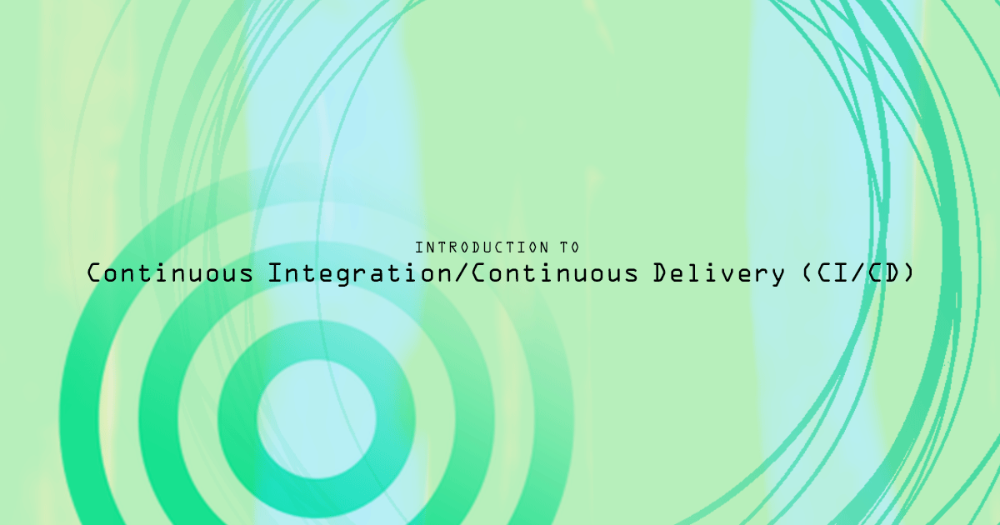
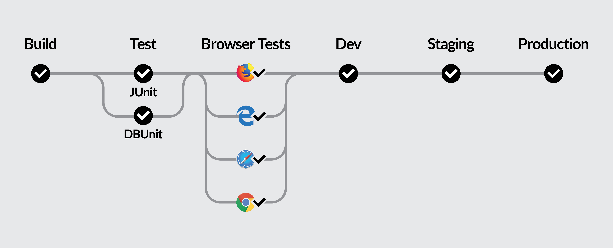

## What is Continuous Integration?

In software development, **integration** is the process of incorporating changes like refactored code, new features, or bug fixes into the existing codebase.

Traditionally, integration is performed in preparation of the deployment of a new release. This approach can lead to problems, as integrating multiple or large changes in one go may result in last-minute conflicts and bugs. Several strategies have emerged to mitigate these problems. Continuous Integration (CI) is one such solution: it creates a workflow where every commit made to the codebase is tested and built, and each developer on the project is expected to commit code at least once per day. Usually, both testing and building are automated, so that every commit to the central repository triggers an automatic build. If the build is successful, it triggers a run of the test suite. This way, conflicts or bugs are discovered quickly over the course of development, making the release process smoother and less painful.

## What is Continuous Delivery?

Continuous Delivery (CD) takes the principle of CI one step further: the automated build and test process is extended to every component of the application, including configuration files, database schemas, and environments. Whenever changes are made to any of these components, the build and test procedure is performed (ideally through an automated pipeline) so that the resulting build can be easily deployed. The resulting build does not always have to be released to production, but it should at least be deployed to an environment (such as staging) that is as close to production as possible. Product owners can therefore be confident that any build that makes it through this pipeline is releasable to the public. This approach offers several advantages:

  - New features and bug fixes can move from concept to deployment faster.
  - Because the difference between each release is small, the risk of an individual deployment breaking is reduced.
  - For the same reason, it is easier and safer to revert to a previous version in the event of an issue.
  - As with continuous integration, continually building and testing environments and configuration parameters means that problems are discovered earlier in the development process.

## Principles of CI/CD

These principles are taken from the book [Continuous Delivery](http://www.informit.com/store/continuous-delivery-reliable-software-releases-through-9780321601919) by Jez Humble and David Farley.

1.  **Create a repeatable, reliable process for deploying software**: If deploying and releasing software is easy and low-cost, it can be done more often and with greater confidence.
2.  **Automate almost everything** through the use of build and deploy scripts.
3.  **Keep everything in version control**: This makes it simple to revert to earlier versions, and provides a way to trigger the deployment pipeline as needed.
4.  **Bring the pain forward**: The most painful and time-consuming aspects of development, which for most products includes testing, integration, and deployment, should be done more frequently and earlier in the process.
5.  **Build quality in**: By fixing bugs and resolving problems earlier in the process, quality is built in continuously, rather than creating a broken product that requires time-consuming mitigation right before deployment.
6.  **Done means released**: Since every increment in continuous delivery should be releasable (even if it is not actually released), no feature or task can be considered complete unless it can be released to users with the press of a button. In practice, since deployment is easy and cheap, many teams may consider a feature to be done only when it has been released to production.
7.  **Everyone is responsible**: Every time a change is committed to version control, whoever commits the change is responsible for ensuring that the build completes and tests pass. In this way, members of all teams are responsible for keeping the project in a releasable state and preparing it for release.
8.  **Continuous improvement**: Most of the work involved in a product will take place after the initial release, through maintenance, bug fixes, and added features.

## Pipelines

*Pipelines* are an important concept in CI/CD. A pipeline is a sequence of steps that will be run whenever a change is made to a project (source code, database schemas, environments, or configuration). Pipelines can include steps executed in series or in parallel, and often multiple pipelines are used to handle different situations when working on a project.

This example illustrates a continuous delivery pipeline. When code is committed to the `staging` branch, it is built and tested on the CI server as before. This time, tests are run on different browsers for a more production-ready test environment. The environments are also dockerized, which helps guarantee that all developers will be working in identical environments and makes differences between production, staging, and test environments explicit. If these steps complete successfully, the build is then deployed to the staging branch.

## Host a CI/CD Server on Linode

Usually, the integration pipeline runs on an external server rather than on developers' local computers. When developers commit code to the source repository, [Git hooks](https://git-scm.com/docs/githooks) are used to trigger the CI pipeline on a remote server, which then pulls the new code changes, builds the new version, and runs all of the tests against the new build. A Linode can be used as the remote server in this configuration, allowing you to set up whatever pipeline suits your projects's needs. See the links in the More Info section below for information on how to set up a CI server on your Linode.
