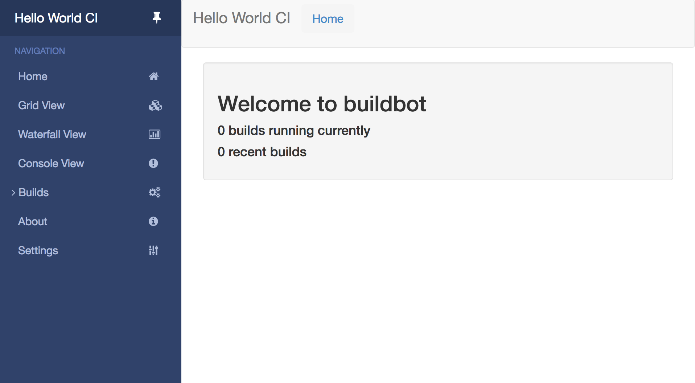
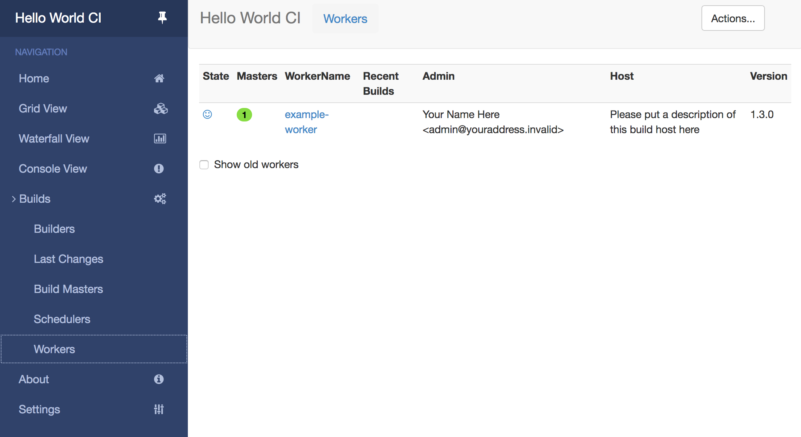
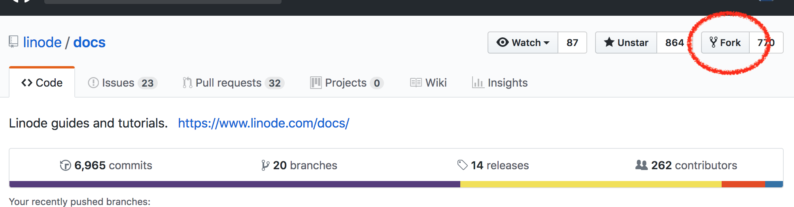
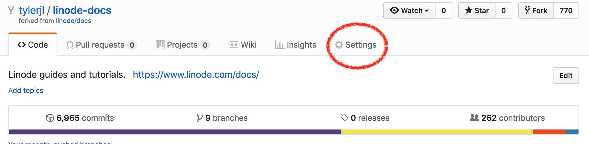
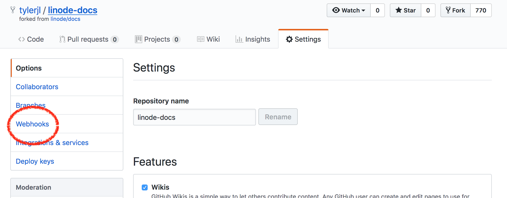
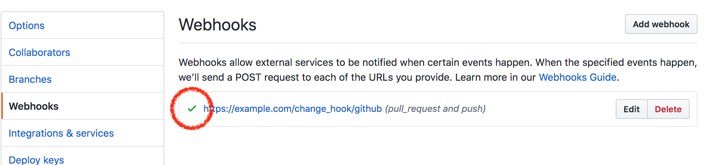
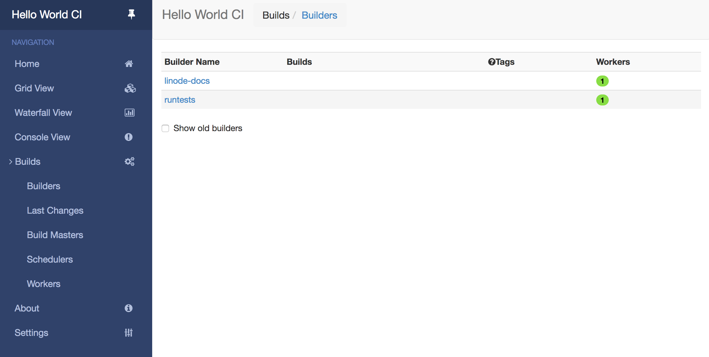
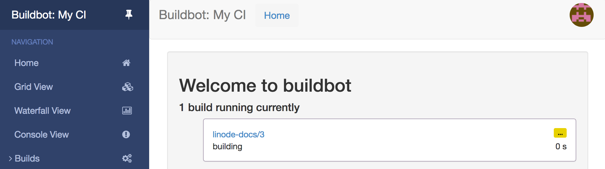
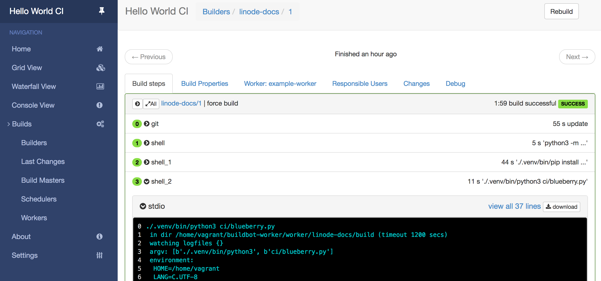

[Buildbot](https://buildbot.net/) is an open source system for testing software projects. In this guide, you will set up a Linode as a Buildbot server to use as a continuous integration platform to test code. Similarly to hosted solutions like Travis CI, Buildbot is an automated testing platform that can watch for code changes, test a project's code, and send notifications regarding build failures.

## Before you Begin

1.  If you have not already done so, create a Linode account and Compute Instance. See our [Getting Started with Linode](/docs/products/platform/get-started/) and [Creating a Compute Instance](/docs/products/compute/compute-instances/guides/create/) guides.

1.  Follow our [Setting Up and Securing a Compute Instance](/docs/products/compute/compute-instances/guides/set-up-and-secure/) guide to update your system. You may also wish to set the timezone, configure your hostname, create a limited user account, and harden SSH access.

3.  Complete the [Add DNS Records](/docs/guides/set-up-web-server-host-website/#add-dns-records) steps to register a domain name that will point to your Linode instance hosting Buildbot.

    
Replace each instance of `example.com` in this guide with your Buildbot site's domain name.


1.  Your Buildbot site will serve its content over HTTPS, so you will need to obtain an SSL/TLS certificate. Use [Certbot](/docs/guides/secure-http-traffic-certbot/#use-certbot-on-ubuntu) to request and download a free certificate from [Let's Encrypt](https://letsencrypt.org/).

        sudo apt install software-properties-common
        sudo add-apt-repository ppa:certbot/certbot
        sudo apt update
        sudo apt install certbot
        sudo certbot certonly --standalone -d example.com

    These commands will download a certificate to `/etc/letsencrypt/live/example.com/` on your Linode.

    
  The steps to install NGINX will be covered in the [Set up the Buildbot Master Web Interface](/docs/guides/use-buildbot-for-software-testing-on-ubuntu/#configure-buildbot-master#setup-buildbot-master-web-interface) section of the guide.
    

## Install Buildbot

### Install the Buildbot Master

Since Buildbot is provided as an Ubuntu package, install the software from the official Ubuntu repositories.

1.  Install the `buildbot` package along with `pip3`, which will be used to install additional python packages:

        sudo apt-get install -y buildbot python3-pip

1.  Install the required Buildbot Python packages:

        sudo pip3 install buildbot-www buildbot-waterfall-view buildbot-console-view buildbot-grid-view

1.  The `buildbot` package sets up several file paths and services to run persistently on your host. In order to create a new configuration for a Buildbot master, enter the directory for Buildbot master configurations and create a new master called `ci` (for "continuous integration").

        cd /var/lib/buildbot/masters
        sudo -u buildbot -- buildbot create-master ci

    The generated master configuration file's location is `/var/lib/buildbot/masters/ci/master.cfg.sample`.

1.  Make a copy of the default configuration to the path that Buildbot expects for its configuration file:

        sudo cp ci/master.cfg.sample ci/master.cfg

1. Change the permissions for this configuration file so that the `buildbot` user has rights for the configuration file:

        sudo chown buildbot:buildbot ci/master.cfg

### Configure the Buildbot Master

In order to secure and customize Buildbot, you will change a few settings in the master configuration file before using the application. The master configuration file's location is `/var/lib/buildbot/masters/ci/master.cfg`.

Buildbot has a number of concepts that are represented in the master build configuration file. Open this file in your preferred text editor and browse the Buildbot configuration. The Buildbot configuration is written in Python instead of a markup language like Yaml.

1.  Generate a random string to serve as the password that workers will use to authenticate against the Buildbot master. This is accomplished by using `openssl` to create a random sequence of characters.

        openssl rand -hex 16
        <a random string>

1.  Update the following line in the `master.cfg` file and replace `pass` with the randomly-generated password:

    
...
# The 'workers' list defines the set of recognized workers. Each element is
# a Worker object, specifying a unique worker name and password.  The same
# worker name and password must be configured on the worker.
c['workers'] = [worker.Worker("example-worker", "pass")]
...
    

1.  Uncomment the `c[title]` and the `c[titleURL]` lines. If desired, change the name of the Buildbot installation by updating the value of ``c[title]``. Replace the `c[titleURL]` value with the URL of your Buildbot instance. In the example, the URL value is replaced with `example.com`.

    
...
c['title'] = "My CI"
c['titleURL'] = "https://example.com"
...
    

1.  Uncomment the `c['buildbotURL']` line and replace the URL value with the your Buildbot instance's URL:

    
...
c['buildbotURL'] = "https://example.com/"
...
    

    These options assume that you will use a custom domain secured with Let's Encrypt certificates from `certbot` as outlined in the [Before You Begin](/docs/guides/use-buildbot-for-software-testing-on-ubuntu/#before-you-begin) section of this guide.

1.  Uncomment the web interface configuration lines and keep the default options:

    
...
c['www'] = dict(port=8010,
                plugins=dict(waterfall_view={}, console_view={}, grid_view={}))
...
    

1.  By default, Buildbot does not require people to authenticate in order to access control features in the web UI. To secure Buildbot, you will need to configure an authentication plugin.

    Configure users for the Buildbot master web interface. Add the following lines below the web interface configuration lines and replace the `myusername` and `password` values with the ones you would like to use.

    
...
c['www'] = dict(port=8010,
                plugins=dict(waterfall_view={}, console_view={}, grid_view={}))

# user configurations
c['www']['authz'] = util.Authz(
        allowRules = [
            util.AnyEndpointMatcher(role="admins")
        ],
        roleMatchers = [
            util.RolesFromUsername(roles=['admins'], usernames=['myusername'])
        ]
)
c['www']['auth'] = util.UserPasswordAuth([('myusername','password')])
...
    

1.  Buildbot supports building repositories based on GitHub activity. This is done with a GitHub webhook. Generate a random string to serve as a webhook secret token to validate payloads.

        openssl rand -hex 16
        <a random string>

1.  Configure Buildbot to recognize GitHub webhooks as a change source. Add the following snippet to the end of the `master.cfg` file and replace `webhook secret` with the random string generated in the previous step.

    
c['www']['change_hook_dialects'] = {
    'github': {
        'secret': 'webhook_secret',
    }
}
    

1.  Finally, start the Buildbot master. This command will start the Buildbot process and persist it across reboots.

        sudo systemctl enable --now buildmaster@ci.service

### Set up the Buildbot Master Web Interface

Buildbot is now running and listening on HTTP without encryption. To secure the connection, install NGINX to terminate SSL and reverse proxy traffic to the Buildbot master process.



Now that NGINX is installed, configure NGINX to talk to the local Buildbot port. NGINX will listen for SSL traffic using the Let's Encrypt certificate for your domain.

1.  Create your site's NGINX configuration file. Ensure that you replace the configuration file's name `example.com.conf` with your domain name. Replace all instances of `example.com` with your Buildbot instance's URL.

    
server {
  # Enable SSL and http2
  listen 443 ssl http2 default_server;

  server_name example.com;

  root html;
  index index.html index.htm;

  ssl_certificate /etc/letsencrypt/live/example.com/fullchain.pem;
  ssl_certificate_key /etc/letsencrypt/live/example.com/privkey.pem;

  # put a one day session timeout for websockets to stay longer
  ssl_session_cache      shared:SSL:10m;
  ssl_session_timeout  1440m;

  ssl_protocols TLSv1.2 TLSv1.3;
  ssl_ciphers ECDHE-RSA-AES256-GCM-SHA512:DHE-RSA-AES256-GCM-SHA512:ECDHE-RSA-AES256-GCM-SHA384:DHE-RSA-AES256-GCM-SHA384:ECDHE-RSA-AES256-SHA384;
  ssl_prefer_server_ciphers   on;

  # force https
  add_header Strict-Transport-Security "max-age=31536000; includeSubdomains;";
  spdy_headers_comp 5;

  proxy_set_header HOST $host;
  proxy_set_header X-Real-IP $remote_addr;
  proxy_set_header X-Forwarded-For $proxy_add_x_forwarded_for;
  proxy_set_header X-Forwarded-Proto  $scheme;
  proxy_set_header X-Forwarded-Server  $host;
  proxy_set_header X-Forwarded-Host  $host;

  location / {
      proxy_pass http://127.0.0.1:8010/;
  }
  location /sse/ {
      # proxy buffering will prevent sse to work
      proxy_buffering off;
      proxy_pass http://127.0.0.1:8010/sse/;
  }
  location /ws {
      proxy_http_version 1.1;
      proxy_set_header Upgrade $http_upgrade;
      proxy_set_header Connection "upgrade";
      proxy_pass http://127.0.0.1:8010/ws;
      # raise the proxy timeout for the websocket
      proxy_read_timeout 6000s;
  }
}


1. Disable NGINX's default configuration file:

        mv /etc/nginx/conf.d/default.conf /etc/nginx/conf.d/default.conf.disabled

1.  Restart NGINX to apply the Buildbot reverse proxy configuration:

        sudo systemctl restart nginx

1.  Navigate to your Buildbot instance's URL over HTTPS. You will see the Buildbot homepage:

    

    Your continuous integration test server is now up and running.

1. Ensure that you can log into your Buildbot instance with the admin credentials you created in the [Configure Buildbot Master](/docs/guides/use-buildbot-for-software-testing-on-ubuntu/#configure-buildbot-master) section. Click on the top right hand dropdown menu entitled **Anonymous** and then, click on **Login**. A *Sign In* modal will appear. Enter your credentials to log in to Buildbot as the admin user.

### Install the Buildbot Worker

In order for Buildbot to execute test builds, the Buildbot master will require a worker. The following steps will setup a worker on the same host as the master.

1.  Install the `buildbot-worker` using pip:

        pip install buildbot-worker

1.  Navigate to the directory which will store the Buildbot worker configurations:

        cd /var/lib/buildbot/workers

1.  Create the configuration directory for the Buildbot worker. Replace `example-worker` and `my-worker-password` with the values used for the `c[worker]` configuration in the `master.cfg` file.

        sudo -u buildbot -- buildbot-worker create-worker default localhost example-worker my-worker-password

1.  The Buildbot worker is ready to connect to the Buildbot master. Enable the worker process.

        sudo systemctl enable --now buildbot-worker@default.service

    Confirm that the worker has connected by going to your Buildbot site and navigating to **Builds** -> **Workers** in the sidebar menu:

    

## Configuring Builds

Now that Buildbot is installed, you can configure it to run builds. In this tutorial, we will use a forked GitHub repository for the [Linode Guides and Tutorials repository](https://github.com/linode/docs) to illustrate how to use Buildbot as a system to run tests against a repository.

### Configuring GitHub

Before creating the build configuration, fork the `linode/docs` repository into your GitHub account. This is the repository that will be used to run tests against. The repository will also require webhooks to be configured to send push or PR events to Buildbot.


The actions you take to fork, add webhook, and push changes to your fork of `linode/docs` will not affect the parent (or upstream), so you can safely experiment with it. Any changes you make to branches of your fork will remain separate until you submit a pull request to the original `linode/docs` repository.


#### Forking and Configuring the Repository

1.  Log in to your GitHub account and navigate to https://github.com/linode/docs. Click the **Fork** button:

    

1.  Choose the account to fork the repository into (typically just your username). GitHub will bring you to the page for your own fork of the `linode/docs` repository.

    Select **Settings** to browse your fork's settings:

    

    Then, select **Webhooks** from the sidebar:

    

1.  Click on the **Add webhook** button. There are several fields to populate:

    * Under *Payload URL* enter the domain name for your Buildbot server with the change hook URL path appended to it: `https://example.com/change_hook/github`.
    * Leave the default value for *Content type*: `application/x-www-form-urlencoded`.
    * Under the *Secret* field, enter the `secret` value for the `c['www']['change_hook_dialects']` option you configure in the `master.cfg` file.
    * Leave *Enable SSL Verification* selected.
    * For the *Which events would you like to trigger this webhook?*, select *Let me select individual events* and ensure that only the following boxes are checked:
      * *Pull requests*
      * *Pushes*
    * Leave *Active* selected to indicate that GitHub should be configured to send webhooks to Buildbot.

1.  Click on the **Add webhook** button to save your settings.

    GitHub will return your browser to the list of webhooks for your repository. After configuring a new webhook, GitHub will send a test webhook to the configured payload URL. To indicate whether GitHub was able to send a webhook without errors, it adds a checkmark to the webhook item:

    

    Github will now send any new pushes made to your fork to your instance of Buildbot for testing.

### Build Prerequisites

This guide runs builds as a simple process on the Buildbot worker, however, it is possible to execute builds within a Docker container, if desired. Consult the official [Buildbot documentation](http://docs.buildbot.net/current/manual/cfg-workers-docker.html) for more information on configuring a Docker set up.

Most software projects will define several prerequisites and tests for a project build. The Linode Guides and Tutorials repository defines several different tests to run for each build. This example will use one test defined in a python script named `blueberry.py`. This test checks for broken links, missing images, and more. This test's dependencies can be installed via `pip` in a virtualenv.

On your Linode, install the packages necessary to permit the worker to use a Python virtualenv to create a sandbox during the build.

    sudo apt-get install -y build-essential python3-dev python3-venv

### Writing Builds

The `/var/lib/buildbot/masters/ci/master.cfg` file contains options to configure builds. The specific sections in the file that include these configurations are the following:

* `WORKERS`, define the worker executors the master will connect to in order to run builds.
* `SCHEDULERS`, specify how to react to incoming changes.
* `BUILDERS`, outline the steps and build tests to run.

Because the worker has already been configured and connected to the Buildbot master, the only settings necessary to define a custom build are the `SCHEDULERS` and `BUILDERS`.

1. Add the following lines to the end of the `/var/lib/buildbot/masters/ci/master.cfg` file to define the custom build. Ensure you replace `my-username` and `my-git-repo-name` with the values for your own GitHub fork of the `linode/docs` repository and `example-worker` with the name of your Buildbot instance's worker:

    
docs_blueberry_test = util.BuildFactory()
# Clone the repository
docs_blueberry_test.addStep(
    steps.Git(
        repourl='git://github.com/my-username/my-git-repo-name.git',
        mode='incremental'))
# Create virtualenv
docs_blueberry_test.addStep(
    steps.ShellCommand(
        command=["python3", "-m", "venv", ".venv"]))
# Install test dependencies
docs_blueberry_test.addStep(
    steps.ShellCommand(
        command=["./.venv/bin/pip", "install", "-r", "ci/requirements.txt"]))
# Run tests
docs_blueberry_test.addStep(
    steps.ShellCommand(
        command=["./.venv/bin/python3", "ci/blueberry.py"]))
# Add the BuildFactory configuration to the master
c['builders'].append(
    util.BuilderConfig(name="linode-docs",
      workernames=["example-worker"],
      factory=docs_blueberry_test))
    

    The configuration code does the following:

    * A new Build Factory is instantiated. Build Factories define how builds are run.
    * Then, instructions are added to the Build Factory. The Build Factory clones the GitHub fork of the `linode/docs` repository.
    * Next, a Python virtualenv is setup. This ensures that the dependencies and libraries used for testing are kept separate, in a dedicated sandbox, from the Python libraries on the worker machine.
    * The necessary Python packages used in testing are then installed into the build's virtualenv.
    * Finally, the `blueberry.py` testing script is run using the `python3` executable from the virtualenv sandbox.
    * The defined Build Factory is then added to the configuration for the master.

1.  Define a simple scheduler to build any branch that is pushed to the GitHub repository. Add the following lines to the end of the `master.cfg` file:

    
    ...
c['schedulers'].append(schedulers.AnyBranchScheduler(
    name="build-docs",
    builderNames=["linode-docs"]))
    

    This code instructs the Buildbot master to create a scheduler that builds any branch for the `linode-docs` builder. This scheduler will be invoked by the change hook defined for GitHub, which is triggered by the GitHub webhook configured in the GitHub interface.

1. Restart the Buildbot master now that the custom scheduler and builder have been defined:

        sudo systemctl restart buildmaster@ci.service

### Running Builds

Navigate to your Buildbot site to view the Builder and Scheduler created in the previous section. In the sidebar click on **Build** -> **Builders**. You will see `linode-docs` listed under the *Builder Name* heading:

A new build can be started for the `linode-docs` builder. Recall that the GitHub webhook configuration for your fork of `linode/docs` is set to call Buildbot upon any push or pull request event. To demonstrate how this works:

1.  Clone your fork of the `linode/docs` repository on your local machine (do not run the following commands on your Buildbot server) and navigate into the cloned repository. Replace `username` and `repository` with your own fork's values:

        git clone https://github.com/username/repository.git
        cd repository

1.  Like many git repositories, the `linode-docs` repository changes often. To ensure that the remaining instructions work as expected, start at a specific revision in the code that is in a known state. Check out revision `76cd31a5271b41ff5a80dee2137dcb5e76296b93`:

        git checkout 76cd31a5271b41ff5a80dee2137dcb5e76296b93

1. Create a branch starting at this revision, which is where you will create dummy commits to test your Buildbot master:

        git checkout -b linode-tutorial-demo

1. Create an empty commit so that you have something to push to your fork:

        git commit --allow-empty -m 'Buildbot test'

1. Push your branch to your forked remote GitHub repository:

        git push --set-upstream origin linode-tutorial-demo

1. Navigate to your Buildbot site and go to your running builds. The **Home** button on the sidebar displays currently executing builds.

    

1. Click on the running build to view more details. The build will display each step along with logging output:

    

    Each step of the build process can be followed as the build progresses. While the build is running, click on a step to view standard output logs. A successful build will complete each step with an exit code of `0`.

    Your Buildbot host will now actively build pushes to any branch or any pull requests to your repository.

## Features to Explore

Now that you have a simple build configuration for your Buildbot instance, you can continue to add features to your CI server. Some useful functions that Buildbot supports include:

* [Reporters](http://docs.buildbot.net/current/manual/cfg-reporters.html), which can notify you about build failures over IRC, GitHub comments, or email.
* [Workers](http://docs.buildbot.net/current/manual/cfg-workers.html) that execute builds in Docker containers or in temporary cloud instances instead of static hosts.
* [Web server features](http://docs.buildbot.net/current/manual/cfg-www.html), including the ability to generate badges for your repository indicating the current build status of the project.
