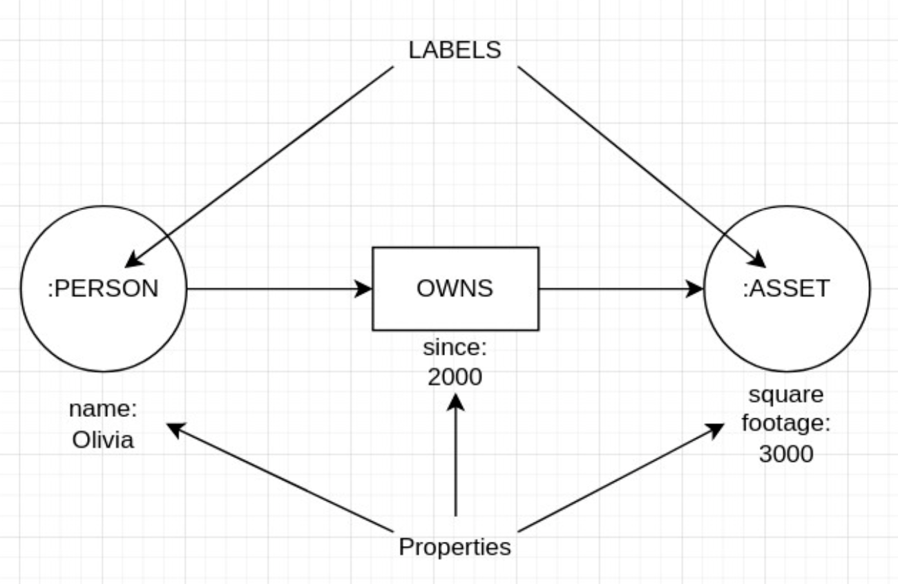
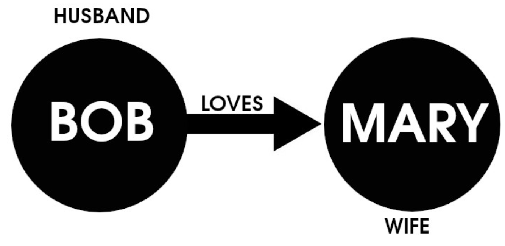

Nearly every business depends on data. Data powers websites, desktops and mobile apps, predicts trends, collects information about clients and customers and keeps tabs on products and people. However, not all databases are created equal. Some databases, such as SQLite, are best suited for embedded devices or small collections of information. Others, like MongoDB, are better suited for enterprises dealing with massive amounts of data.

The relational database is the primary data storage solution for most use-cases. But there's an emerging type of database making headway for several use-cases; the graph database.

Both relational and graph databases focus on relationships between data, but they approach those relationships quite differently. That difference is key in helping you choose the right type of database for your needs.

## What is a Graph Database?

A graph database (abbreviated as *GDB*) is a single-purpose, specialized data platform that creates and manipulates graphs. A graph consists of nodes (think of this as a container with data), edges (think of this as a line that connects one node to another), and properties (think of this as the details for both nodes and edges) that are used to store and represent data. These databases are great for analyzing interconnections and use-cases that involve highly complex relationships and dynamic schema.

The graph database is an ideal match for applications that must connect very complex relationships between data. This is because graph databases allow users to perform traversal queries that are based on connections and are used to find patterns, paths, communities, and various links between subjects and objects.

To make graph databases even more appealing, data retrieval and query speed are considerably faster than a relational database. In fact, execution times of graph databases are exponentially faster, especially as your queries go deeper into the data. For example, Neo4j makes the [following claims](https://neo4j.com/news/how-much-faster-is-a-graph-database-really/) about execution times (in comparison to MySQL):


|Depth | Execution Time – MySQL | Execution Time –Neo4j |
| -- | -- | -- |
| 2 | 0.016 | 0.010 |
| 3 | 30.267 | 0.168 |
| 4 | 1,543.505 | 1.359 |
| 5 | Not Finished in 1 Hour | 2.132 |


There are two different types of graph databases, both of which focus on graph data modeling, which set a new standard for visualization of data models that are based on the property graph approach. A property graph is a data graph model that consists of nodes and relationships with properties that can reside within either nodes or relationships.

Think of a data model as what you might draw on a whiteboard. Instead of using a formalized logic for the flow of information, these focus on a more user-centric logic. Common use-cases for graph databases include:

- Analytics
- Big data
- Data Science
- Fraud detection
- Recommendation engines
- Network/operations mapping
- AI Knowledge graphs
- Social networks
- Supply chain mapping

### RDF Graph Database

An RDF (Resource Description Framework) graph database is also known as a triple store because it stores data in the format of subject-predicate-object. RDF graph databases use a special index that stores information about nodes, edges, and the relationship between them in what's called a *triple*. Triples are also referred to as *assertions* and have three primary fields:

- **Subject**: (nodes) a resource or node in the graph
- **Predicate**: (edges) the relationship between subject and object
- **Object:** (nodes) another node or literal value

Each of these fields is represented with a Unique Resource Identifier (URI). Following are the six examples of triples:

- `Olivia - worksfor - Linode`
- `Olivia - marriedto - Nathan`
- `Olivia - jobtitle - programmer`
- `Nathan - worksfor - Google`
- `Nathan - marriedto - Olivia`
- `Nathan - jobtitle - UXDesigner`

Each triple is a row, so anyone programming for a graph database can know which rows to search. What makes the RDF graph database so powerful and fast is the ability to index combinations of triples. For example, if you're developing an app that has a feature that links spouses, you only need to focus on the predicate `:marriedTo`.

If you search the predicate `:marriedTo` in rows 1-6, it returns `Olivia` is married to `Nathan` and `Nathan` is married to `Olivia`.

### Property Graph Database

The next type of graph database is the Property Graph Database, which stores data in a logical mode, which is a data model of a specific problem expressed independently of a particular database management system.

Property GDBs consist of the following components:

- **Node:** A node, also called a vertex, is the main data element used to construct a graph
- **Relationship:** A relationship, also called an edge, is a link between two nodes. Relationships have both a direction and a type
- **Label:** A label defines a node category
- **Property:** A property expands on the information stored in a node or relationship

In a labeled property graph, vertices are called nodes and include a uniquely identifiable ID and property values to characterize them. To visualize how labels and properties function within a graph database, see the graphic below:

The figure above illustrates the relationship between nodes (`:PERSON` and `:ASSET`) along with their respective properties (`Olivia`, `since 2000`, and `square footage 3000`).

## How Is a Graph Database Different from a Relational Database?

Relational databases are set up in relational tables (consisting of columns and rows) with rows and columns. Each row is a distinct data entity and uses a primary key to define the uniqueness of the row. The primary key is used such that a row can be linked to rows in other tables.

For example, we might have a relational table that represents customer information (containing things like customer ID, name, email address, phone number, email address, and home address), and another table that represents order information (containing things like item number, price, shipping and billing information, and stock).

There are several key differences between graph and relational databases. One of the biggest is how data is stored. With relational databases, all data is contained within structured tables, each consisting of columns and rows.
For example, a customer information table might look like:

| CustomerID | FirstName | LastName | Address |
| -- | -- | -- |-- |
| C001 | Bob | Jones | 456 Main St |
| C002 | Mary | Jane | 456 Main St |

As for a graph database, data is unstructured, where nodes can be tagged with labels and hold any number of key-value pairs (aka properties). To visualize this concept, consider the simplified example depicted in the image below:

The figure above illustrates the relationship between two nodes (`Bob` and `Mary`) and the edge (`loves`) that connect them.

Other important factors to consider about Graph databases include:

- Graph databases store entities and relationships as nodes and edges, whereas relational databases store data in tables as rows and columns.
- Graph databases are schema-free and unstructured, whereas relational databases use a rigid schema.
- Graph databases are primarily used for uncovering hidden insights between entities, whereas a relational database is used for both operational and analytical purposes.
- Graph databases are exceptionally fast and do not lose speed based on the amount of data stored, whereas relational databases are considerably slower.
- Graph databases are easy to maintain (because of their unstructured nature), whereas relational databases are more complicated (because minor changes to a table could affect the entire database).

## Graph Database vs. Relational Database Performance

Graph databases are built to handle very large amounts of related data, so they are considerably faster than relational databases for this task. Even with a massive database, queries are lightning-fast on a graph database. And because graph databases are less strict about their structure, they handle changes more quickly.

It's important to understand the speed factors for both relational and graph databases. With a graph database, relationships are stored on an individual record level, whereas a relational database uses predefined structures (tables). Because of this, relational databases are actually faster when handling huge numbers of records, simply because the structure of the data is known in advance. On the contrary, a graph database is significantly faster when the relationships between data are constantly changing (such as in a social networking site or a recommendation engine).

Another reason why graph databases are so much faster is that they represent data as it is found in reality, which is a collection of individual objects that are linked by relationships. Graph databases don't rely on an index, and every element is linked together by an edge, so records can be accessed far faster than tables found in relational databases. That lack of structure makes a big difference in performance.

## When to Use A Graph Database vs. A Relational Database: Use Cases

There are a few metrics to consider when you decide which type of database to use:

- If your data is better represented by many-to-many relationships (such as a class enrollment database that includes tables for Students, Enrollment, and Classes and the relationships between those tables are predefined and dependent on one another) you should use a relational database.
- If the relationships between data change often (such as with a recommendation engine where data is constantly changing) you should use a graph database.
- If data has an unstructured relationship (such as fraud detection, where data must be highly connected and flexible) you should use a graph database.

If you answer yes to the above, consider a graph database. If the answer is no, then a relational database might be best suited for your use case. It's all about the complexity of the relationships and how often those relationships change.

## Examples of Popular Graph Databases

Here are five examples of graph databases:

- [Neo4j](https://neo4j.com/) is the most popular graph database. Neo4j is open-source and uses the property graph model (nodes, relationships, properties, and labels). Neo4j is supported for Linux, macOS, Solaris, and Windows.

- [JanusGraph](https://janusgraph.org/) is another open-source graph database that is optimized for storing and querying graphs that contain hundreds of billions of vertices and edges that are distributed across a cluster of machines. JanusGraph is written in Java and is limited to Clojure, Java, and Python.

- [Amazon Neptune](https://aws.amazon.com/neptune/) is a fully managed graph database service that empowers developers to build and run applications that depend on highly connected datasets with very complicated relations. Neptune is highly available, supports read replicas and point-in-time recovery.

- [TigerGraph](https://www.tigergraph.com/) is a native parallel graph database that was built for loading terabytes of data and is capable of analyzing as many as ten or more relationship hops in real-time. TigerGraph is a closed-source option but can be installed on the Linux platform.

- [ArangoDB](https://www.arangodb.com/) is one of the most scalable open-source graph databases on the market. ArangoDB combines the graphs with JSON documents so developers can access and combine data models with a single declarative query language.

## Examples of Popular Relational Databases

Here are five examples of popular relational databases:

- [MySQL](https://www.mysql.com/) is the most popular open-source relational database on the market and is used to power many applications, like WordPress. MySQL is supported on Linux, macOS, and Windows.

- [MariaDB](https://mariadb.org/) is a fork of MySQL and is equally as popular. This open-source relational database places much higher importance on frequent releases and security. MariaDB can be installed on Linux, macOS, and Windows.

- [PostgreSQL](https://www.postgresql.org/) isn't as popular as MySQL but is an outstanding option for large amounts of relational data and performs data backup and restoration functions with a single command. PostgreSQL is often considered more secure than MySQL but isn't nearly as fast at query execution.

- [ MS SQL Server](https://www.microsoft.com/en-us/sql-server/sql-server-2019) is Microsoft's relational database and offers one of the best user interfaces on the market. SQL queries are very fast and it seamlessly integrates with other Microsoft tools.

- [Oracle Database](https://www.oracle.com/database/) is the most widely-used relational database on the market. Oracle was one of the original pioneers of relational databases and that experience shows. For those looking to use one of the most secure and reliable relational databases available, Oracle is hard to beat.

## Conclusion

Graph databases are here to stay. When you have highly complex relationships between data, this is the type of database you should consider. They are outstanding options for fraud detection, 360-degree customer views, recommendation engines, network/operations mapping, AI knowledge graphs, social networking, and supply chain mapping. Any use case where data relationships are constantly changing is an ideal place for graph databases.

To find out how you can work with various databases on Linode, check out the[ list of supported databases](/docs/guides/list-of-databases/), which includes links on how to install them.
