With the right data structures, programmers are able to store and operate on data efficiently. Binary tree structures, like the heap data structure in particular, have proven effective for sorting values.

So, what is a heap data structure, and how does it work?

This tutorial explains heaps and explores the ideas behind them. Along the way, it provides illustrations and concrete examples in the form of code.

By the end, you should know what heaps are and how to start working with them.

## What Is a Heap Data Structure?

A heap is a *complete binary tree* data structure in which all elements satisfy one of two kinds of heap properties. These properties allow heaps to return the lowest or highest value in an array.

This is the usefulness of a heap structure. It provides a very efficient means of sorting arrays.

Binary trees themselves are data structures consisting of an expanding set of nodes, each with up to two child nodes attached to it. In a complete binary tree, like a heap, every node has two children except for the nodes at the bottom of the tree. Child nodes are populated from the top layer down and from left to right in each layer.


A heap uses the properties of this structure to sort the values of an array. Each value in the array gets added to the tree as a node. Step by step, each is arranged to ensure that parent nodes are always either less than or greater than their children. Which one depends on the kind of heap property used.

Here are the typical steps involved in a heap algorithm:

1.  Start with an array.

1.  Take the first value in the array, and make it the starting node.

1.  Create a child node using the next value in the array.

1.  Compare the new child node's value with the value of its parent.

1.  If the parent and child do not fulfill the tree's heap property, switch their positions.

1.  Repeat steps 4 and 5 for the new parent node if nodes were switched.

    This works back up the tree until reaching a node that already fulfills the heap property or until reaching the first node on the tree.

1.  Repeat steps 3–5 for each value in the array.

The next two sections show this in action with full visualizations. Each section dedicated to one of the two types of heaps: the min-heap and the max-heap.

## What Is the Min-Heap Data Structure?

In a min-heap, each node in the tree is equal to or less than its child nodes. This is the min-heap's heap property. Thus, using the algorithm described in the previous section, nodes would switch so that the lowest value is always the parent node.

Take an array like this one for example: `[90, 15, 68, 42, 18, 9, 45]`. The steps that follow walk through applying the algorithm to the array. Visualizations are provided for each time the position of nodes are swapped, and again for the completed heap tree.

1.  Create a node for the first value in the array, `90`.

1.  Create a child node with the next value in the array, `15`, and compare it to its parent.

    Since the child has the lower value, switch its place with the parent.

    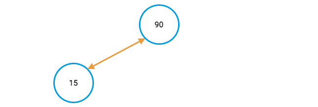

    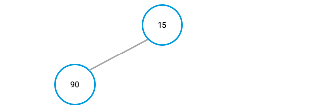

1.  Repeat the previous step for each value in the array.

    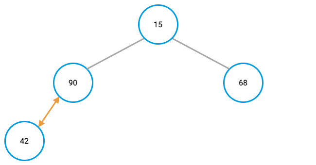

    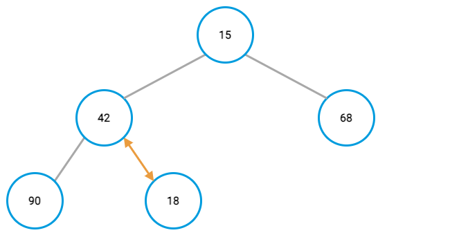

    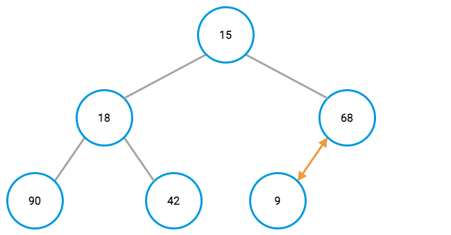

     Remember, you need to do the comparison again for the new parent value and its parent after switching node positions. In this case, that results in another positing swapping up the tree.

    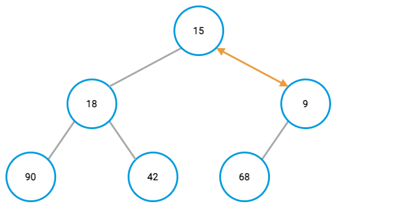

    Normally, you would keep doing that until either reaching a parent that already had a lower value or reaching the top of the tree.

1.  At the end, you should have a complete binary tree with its lowest value in the top-most node.

    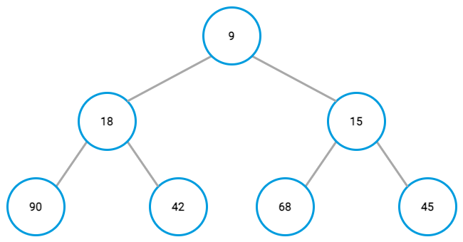

### Code Examples

The above helps to understand min-heap in principle, but what does it look like in code?

This guide cannot cover every approach, but here are two that can be useful: a min-heap in Python and another in C/C++.

Each example comes with numerous inline comments. These are meant to help break down the various parts and make the role each part plays in putting the heap together clearer.

First, the Python example:

```code {lang="python"}
# Function to apply the min-heap algorithm. The function takes an array and
# a current root as arguments.
def heapify(array_to_heap, array_root):
    # Start with the array's root as the smallest value.
    smallest = array_root

    # Define the locations of the left and right child nodes.
    left_child_node = 2 * array_root + 1
    right_child_node = 2 * array_root + 2

    # Check if the left child node is smaller than the root, and make
    # it the new smallest node if so.
    if left_child_node < len(array_to_heap) and array_to_heap[left_child_node] < array_to_heap[smallest]:
        smallest = left_child_node

    # Do the same as above for the right child node.
    if right_child_node < len(array_to_heap) and array_to_heap[right_child_node] < array_to_heap[smallest]:
        smallest = right_child_node

    # Switch nodes if necessary, and apply the min-heap algorithm again
    # with the new smallest node as the root.
    if smallest != array_root:
        array_to_heap[array_root], array_to_heap[smallest] = array_to_heap[smallest], array_to_heap[array_root]
        heapify(array_to_heap, smallest)

# Function for applying heap.
def apply_heap(array_to_heap):
    # Walk through the elements in that array, applying min-heap.
    for i in range(len(array_to_heap), -1, -1):
        heapify(array_to_heap, i)

# Function for inserting a new value into an array and applying heap.
def heap_insert(array_to_heap, value_to_insert):
    array_to_heap.append(value_to_insert)
    apply_heap(array_to_heap)

# Create an array to heap.
an_array = [90, 15, 68, 42, 18, 9, 45]

# Apply heap.
apply_heap(an_array)

# Print out the elements of the heaped array. The first should be
# the smallest.
print(an_array)

# Insert a value and apply heap.
heap_insert(an_array, 4)

# Print out the result.
print(an_array)
```

```output
[9, 15, 45, 42, 18, 68, 90]
[4, 9, 45, 15, 18, 68, 90, 42]
```

Now here's an example in C/C++:

```code {lang="c++"}
#include <iostream>
using namespace std;

// Use this next line instead of the above if you are using C, rather
// than C++.
//#include <stdio.h>

// Function to swap the values of two elements in an array
void swap(int *first_item, int *second_item) {
    int temp_item = *second_item;
    *second_item = *first_item;
    *first_item = temp_item;
}

// Function to apply the min-heap algorithm. The function takes an
// array to heap, the size of the array, and the root node as arguments.
void heapify(int array_to_heap[], int array_size, int array_root) {
    // Start with the array's root as the smallest value.
    int smallest = array_root;

    // Define the locations of the left and right child nodes.
    int left_child_node = 2 * array_root + 1;
    int right_child_node = 2 * array_root + 2;

    // Check if the left child node is smaller than the root, and make
    // it the new smallest node if so.
    if (left_child_node < array_size && array_to_heap[left_child_node] < array_to_heap[smallest]) {
        smallest = left_child_node;
    }

    // Do the same as above for the right child node.
    if (right_child_node < array_size && array_to_heap[right_child_node] < array_to_heap[smallest]) {
        smallest = right_child_node;
    }

    // Switch nodes if necessary, and apply the min-heap algorithm again
    // with the new smallest node as the root.
    if (smallest != array_root) {
        swap(&array_to_heap[array_root], &array_to_heap[smallest]);
        heapify(array_to_heap, array_size, smallest);
    }
}

// Function for applying heap.
void apply_heap(int array_to_heap[], int array_size) {
      // Walk through the elements in that array, applying min-heap.
    for (int i = array_size / 2 - 1; i >= 0; i--) {
        heapify(array_to_heap, array_size, i);
    }
}

// Function for inserting a new value into an array and applying heap.
void heap_insert(int array_to_heap[], int array_size, int value_to_insert) {
    array_to_heap[array_size] = value_to_insert;
    array_size += 1;
    apply_heap(array_to_heap, array_size);
}

int main() {
    // Create an array to heap.
    int an_array[] = {90, 15, 68, 42, 18, 9, 45};

    apply_heap(an_array, 7);

    // Print out the elements of the heaped array. The first should be
    // the smallest.
    for (int i = 0; i < 7; i++) {
        printf("%d ", an_array[i]);
    }

    printf("\n");

    // Insert a value and apply heap.
    heap_insert(an_array, 7, 4);

    // Print out the result.
    for (int i = 0; i < 8; i++) {
        printf("%d ", an_array[i]);
    }

    printf("\n");
}
```

```output
9 15 45 42 18 68 90
4 9 45 15 18 68 90 42
```

## What Is the Max-Heap Data Structure?

In a max-heap, each node in the tree is equal to or greater than its child nodes. That is considered its heap property. Using the heap algorithm described above, nodes would switch to ensure that the parent always has a higher value than its child nodes.

For example, start with an array like this one: `[39, 111, 4, 98, 247, 62, 14]`. The steps that follow walk through applying the algorithm to the array. Visualizations are provided each time a nodes' position is swapped, and again for the completed heap tree.

1.  Create a node for the first value in the array, `39`.

1.  Create a child node with the next value in the array, `111`, and compare it to its parent.

    Since the child has the higher value, switch its place with the parent.

    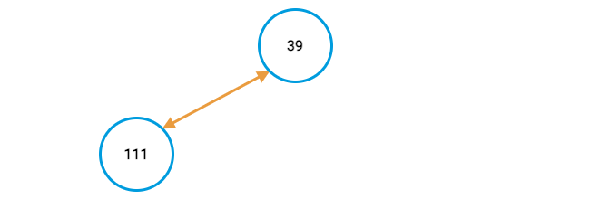

    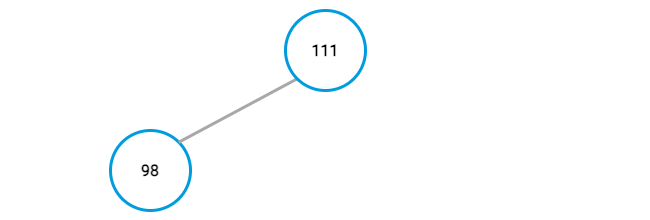

1.  Repeat the previous step for each value in the array.

    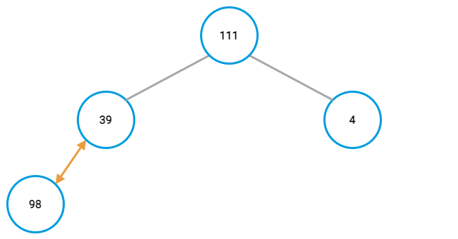

    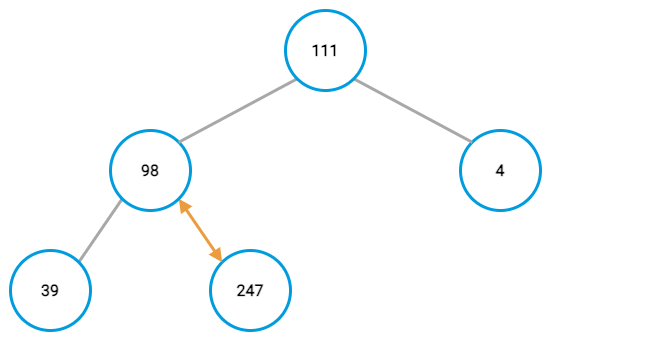

    Remember, you need to do the comparison again for the new parent value and its parent after switching node positions. In this case, that results in another positing swapping up the tree.

    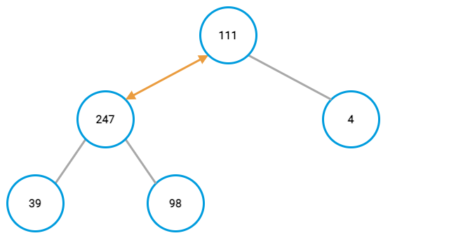

    This continues until either reaching a parent that already had a lower value or reaching the top of the tree.

    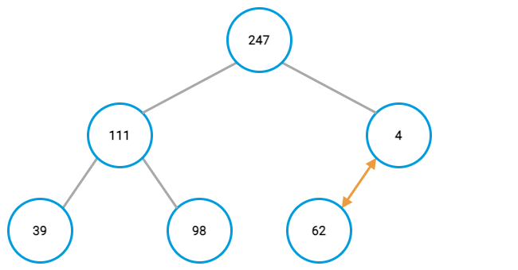

1.  At the end, you should have a complete binary tree with its largest value in the top-most node:

    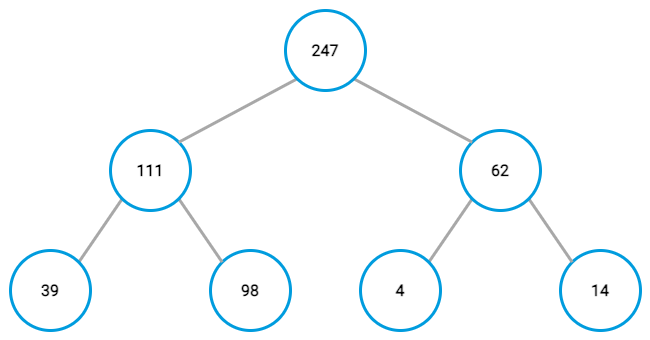

### Code Examples

With an explanation of max-heap in principle, take a look at what it looks like in code.

While this guide cannot cover every approach, it provides two examples that can be useful: one in Python and another in C/C++.

Each example comes with numerous inline comments. These are meant to help break down the various parts and make the role each part plays in putting the heap together clearer.

First, the Python example:

```code {lang="python"}
# Function to apply the max-heap algorithm. The function takes an array and
# a current root as arguments.
def heapify(array_to_heap, array_root):
    # Start with the array's root as the largest value.
    largest = array_root

    # Define the locations of the left and right child nodes.
    left_child_node = 2 * array_root + 1
    right_child_node = 2 * array_root + 2

    # Check if the left child node is smaller than the root, and make
    # it the new smallest node if so.
    if left_child_node < len(array_to_heap) and array_to_heap[left_child_node] > array_to_heap[largest]:
        largest = left_child_node

    # Do the same as above for the right child node.
    if right_child_node < len(array_to_heap) and array_to_heap[right_child_node] > array_to_heap[largest]:
        largest = right_child_node

    # Switch nodes if necessary, and apply the max-heap algorithm again
    # with the new largest node as the root.
    if largest != array_root:
        array_to_heap[array_root], array_to_heap[largest] = array_to_heap[largest], array_to_heap[array_root]
        heapify(array_to_heap, largest)

# Function for applying heap.
def apply_heap(array_to_heap):
    # Walk through the elements in that array, applying max-heap.
    for i in range(len(array_to_heap), -1, -1):
        heapify(array_to_heap, i)

# Function for inserting a new value into an array and applying heap.
def heap_insert(array_to_heap, value_to_insert):
    array_to_heap.append(value_to_insert)
    apply_heap(array_to_heap)

# Create an array to heap.
an_array = [39, 111, 4, 98, 247, 62, 14]

# Apply heap.
apply_heap(an_array)

# Print out the elements of the heaped array. The first should be
# the smallest.
print(an_array)

# Insert a value and apply heap.
heap_insert(an_array, 491)

# Print out the result.
print(an_array)
```

```output
[247, 111, 62, 98, 39, 4, 14]
[491, 247, 62, 111, 39, 4, 14, 98]
```

Now here's an example in C/C++:

```code {lang="c++"}
#include <iostream>
using namespace std;

// Use this next line instead of the above if you are using C, rather
// than C++.
//#include <stdio.h>

// Function to swap the values of two elements in an array
void swap(int *first_item, int *second_item) {
    int temp_item = *second_item;
    *second_item = *first_item;
    *first_item = temp_item;
}

// Function to apply the max-heap algorithm. The function takes an
// array to heap, the size of the array, and the root node as arguments.
void heapify(int array_to_heap[], int array_size, int array_root) {
    // Start with the array's root as the largest value.
    int largest = array_root;

    // Define the locations of the left and right child nodes.
    int left_child_node = 2 * array_root + 1;
    int right_child_node = 2 * array_root + 2;

    // Check if the left child node is larger than the root, and make
    // it the new larger node if so.
    if (left_child_node < array_size && array_to_heap[left_child_node] > array_to_heap[largest]) {
        largest = left_child_node;
    }

    // Do the same as above for the right child node.
    if (right_child_node < array_size && array_to_heap[right_child_node] > array_to_heap[largest]) {
        largest = right_child_node;
    }

    // Switch nodes if necessary, and apply the max-heap algorithm again
    // with the new largest node as the root.
    if (largest != array_root) {
        swap(&array_to_heap[array_root], &array_to_heap[largest]);
        heapify(array_to_heap, array_size, largest);
    }
}

// Function for applying heap.
void apply_heap(int array_to_heap[], int array_size) {
      // Walk through the elements in that array, applying max-heap.
    for (int i = array_size / 2 - 1; i >= 0; i--) {
        heapify(array_to_heap, array_size, i);
    }
}

// Function for inserting a new value into an array and applying heap.
void heap_insert(int array_to_heap[], int array_size, int value_to_insert) {
    array_to_heap[array_size] = value_to_insert;
    array_size += 1;
    apply_heap(array_to_heap, array_size);
}

int main() {
    // Create an array to heap.
    int an_array[] = {39, 111, 4, 98, 247, 62, 14};

    apply_heap(an_array, 7);

    // Print out the elements of the heaped array. The first should be
    // the smallest.
    for (int i = 0; i < 7; i++) {
        printf("%d ", an_array[i]);
    }

    printf("\n");

    // Insert a value and apply heap.
    heap_insert(an_array, 7, 491);

    // Print out the result.
    for (int i = 0; i < 8; i++) {
        printf("%d ", an_array[i]);
    }

    printf("\n");
}
```

```output
247 111 62 98 39 4 14
491 247 62 111 39 4 14 98
```

## Conclusion

This covers the heap data structure. While the abstract principles can be difficult to grasp, this guide makes it clearer through illustrations and application in code.

Be sure to browse our collections of tutorials on programming concepts, and keep an eye out for more on the way.