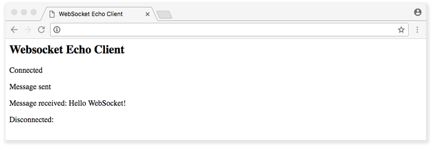

## What are WebSockets?

The [WebSocket Protocol](https://tools.ietf.org/html/rfc6455) is a widely supported open standard for developing real-time applications. Previous methods for simulating [full-duplex](https://medium.com/@fiberstoreorenda/introduction-to-simplex-half-duplex-and-full-duplex-fbda8d591e3a) connections were based on *polling*, a synchronous method wherein the client makes a request to the server to see if there is any information available. The client receives a response from the server even if there is no information available.

Polling works well for cases where the exact interval of message availability is known. However, in most real-time applications, message frequency is often unpredictable. In addition, polling requires the client to open and close many unnecessary connections.

*Long polling* (also known as *Comet*) is another popular communication method in which the client opens a connection with the server for a set duration. If the server does not have any information, it holds the request open until it has any information for the client, or until it reaches the end of a designated time limit (timeout). Essentially, Comet delays the completion of the HTTP response until the server has something to send to the client, a technique often called a *hanging-GET* or *pending-POST*.

The fact that the client has to constantly reconnect to the server for new information makes long polling a bad choice for many real-time applications.

The WebSocket Protocol is included in the Connectivity section of the HTML5 specification. It allows the creation of full-duplex, bidirectional connections between a client and a server over the web. It provides a way to create persistent, low latency connections that support transactions handled by either the client or the server.
Using WebSockets, you can create truly real-time applications such as chat, collaborative document editing, stock trading applications, and multiplayer online games.

## WebSocket API

### Handshake

When creating a WebSocket connection, the first step is a handshake over TCP in which the client and server agree to use the WebSocket Protocol.

The handshake from the client looks like this:

    GET /chat HTTP/1.1
    Host: server.example.com
    Upgrade: websocket
    Connection: Upgrade
    Sec-WebSocket-Key: dGhlIHNhbXBsZSBub25jZQ==
    Origin: http://example.com
    Sec-WebSocket-Protocol: chat, superchat
    Sec-WebSocket-Version: 13

The handshake from the server:

    HTTP/1.1 101 Switching Protocols
    Upgrade: websocket
    Connection: Upgrade
    Sec-WebSocket-Accept: s3pPLMBiTxaQ9kYGzzhZRbK+xOo=
    Sec-WebSocket-Protocol: chat

The WebSocket API enables your applications to control the WebSocket protocol and respond to events triggered by the server. Since the API is purely event driven, once the full-duplex connection is established, when the server has data to send to the client, or if resources that the application is monitoring change their state, it automatically sends the data or notifications. With an event-driven API, there is no need to poll the server for the most updated status of the targeted resource.

### Create a WebSocket Connection

To connect to a remote host, create a new WebSocket object instance and provide the new object with the URL of the target endpoint.

A WebSocket connection is established by upgrading from the HTTP protocol to the WebSocket Protocol during the initial handshake between the client and the server, over the same underlying TCP connection. An `Upgrade` header is included in this request that informs the server that the client wishes to establish a WebSocket connection. Once established, WebSocket messages can be sent back and forth using the methods defined by the WebSocket interface.

To create a connection, call Javascript's WebSocket constructor, which returns the connection instance object. You can then listen for events on that object. These events are triggered when the connection opens or closes, messages arrive, or errors occur. You can interact with the WebSocket instance to send messages or close the connection.

The WebSocket constructor takes one required argument: the URL to which we want to connect. There is one optional argument that specifies a protocol:


// Connecting to the server with a protocol called myProtocol
var ws = new WebSocket("ws://echo.websocket.org", "myProtocol");


### WebSocket Events

The asynchronous nature of WebSockets means that as long as a WebSocket connection is open, an application can listen for events. To start listening for events, add callback functions to the WebSocket object or use the `addEventListener()` DOM method to add event listeners to the WebSocket objects.

A WebSocket object dispatches four different events:

* **Open**: The server responds to the WebSocket connection request. It indicates that the handshake has taken place and the connection is established. The callback to the open event is called `onopen`.

    
// Event handler for the WebSocket connection opening
ws.onopen = function(e) {
   console.log("Connection established");
};


* **Message**: The client receives data from the server. WebSocket messages contain the data from the server. The callback for the message event is `onmessage`.

    
// Event handler for receiving text messages
ws.onmessage = function(e) {
      console.log("Message received", e, e.data);
};


* **Error**: There is any error in communication. The corresponding callback to the error event is `onerror`.

    
// Event handler for errors in the WebSocket object
ws.onerror = function(e) {
   console.log("WebSocket Error: " , e);
   //Custom function for handling errors
   handleErrors(e);
};


    
Errors also cause WebSocket connections to close.


* **Close**: The connection is closed. The corresponding callback to the close event is `onclose`.

    
// Event handler for closed connections
ws.onclose = function(e) {
   console.log("Connection closed", e);
};


### WebSocket Methods

Websocket provides two methods:

* **send()**: The `socket.send(data)` method transmits data using the connection. If for some reasons the connection is not available or the connection is closed, it throws an exception about the invalid connection state.

    
// Send a text message
ws.send("This is a message using WebSockets.");


* **close()**: The `socket.close()` method is used to terminate any existing connection. If the connection is already closed, then the method has no effect. The `close()` method has two optional arguments: `code` (a numerical status code) and `reason` (a text string).

    
// Close the WebSocket connection
ws.close(1000, "Closing Connection Normally");


### WebSocket Object Attributes

A WebSocket connection object also has the following attributes:

* **readyState**: A read-only attribute. It represents the state of the connection. It can have the following values:
    * **0**: Connection is in progress and has not yet been established.
    * **1**: Connection is established and messages can be sent between the client and the server.
    * **2**: Connection is going through the closing handshake.
    * **3**: Connection has been closed or could not be opened.

* **bufferedAmount**: A read-only attribute. It represents the number of bytes of UTF-8 text that have been queued using the `send()` method. The following example demonstrates using this attribute to make sure that messages are sent only when the buffer is not full:

    
// 6400 max buffer size.
var THRESHOLD = 6400;

// Create a New WebSocket connection
var ws = new WebSocket("ws://echo.websocket.org");

// Listen for the opening event
ws.onopen = function () {
   // Attempt to send update every second.
   setInterval( function() {
      // Send only if the buffer is not full
      if (ws.bufferedAmount < THRESHOLD) {
         ws.send(getApplicationState());
      }
   }, 1000);
};


* **protocol**: Lets the server know which protocol the client understands and can use over WebSocket:

    
// Connecting to the server with multiple protocol choices

var ws = new WebSocket("ws://echo.websocket.org", [ "protocol", "another protocol"])

echoSocket.onopen = function(e) {
   // Check the protocol chosen by the server
   console.log( ws.protocol);
}


## WebSocket Client

Combine the examples from the previous sections to create a simple, working WebSocket client application.

1. Create an `index.html` file and add the following:

    
<!DOCTYPE html>
<title>WebSocket Echo Client</title>
<h2>Websocket Echo Client</h2>



2.  Open `index.html` in a web browser. You should see output similar to the following:

## WebSocket Server

Often, a reverse proxy such as an HTTP server is used to detect WebSocket handshakes, process them, and send those clients to a real WebSocket server. The upside of this is that you can excuse your server from the clutter of handling cookies and authentication handlers.
A WebSocket server can be built using many libraries across programming languages:

* **Javascript**:
    * [Socket.io](https://socket.io/)
    * [ws](https://github.com/websockets/ws)
    * [WebSocket-Node](https://github.com/theturtle32/WebSocket-Node)

* **Ruby**:
    * [EventMachine](https://github.com/igrigorik/em-websocket)
    * [Faye](https://faye.jcoglan.com/)

* **Python**:
    * [pyWebSocket](https://github.com/google/pywebsocket)
    * [tornado](https://github.com/tornadoweb/tornado)

* **C++**:
    * [uWebSockets](https://github.com/uNetworking/uWebSockets)

* **C#**:
    * [Fleck](https://github.com/statianzo/Fleck)

* **Java**:
    * [Jetty](http://www.eclipse.org/jetty/)

* **.NET**:
    * [SuperWebSocket](http://superwebsocket.codeplex.com/)

* **GoLang**:
    * [Gorilla](https://github.com/gorilla/websocket)

Below is an example of a simple Node.js WebSocket server using the `ws` module:


const WebSocket = require('ws');

const wss = new WebSocket.Server({ port: 8080 });

wss.on('connection', function connection(ws) {
  ws.on('message', function incoming(message) {
    console.log('received: %s', message);
  });

  ws.send('something');
});

