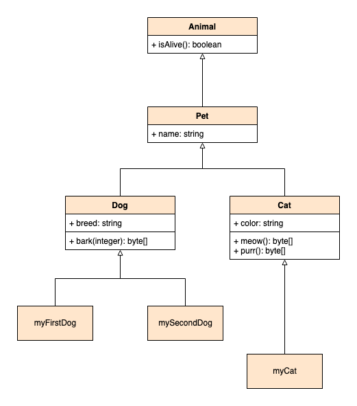

Object-oriented programming is a programming paradigm centered on reusable objects. Its use is widespread, with its features making it a compelling choice in an array of fields.

But what makes a program object oriented, and what are the paradigm's core features. And how can you start using object-oriented programming in your applications?

This tutorial defines object-oriented programming, discusses the parts that make it up, and walks you through use cases where it excels. Here, you can also find a list of some of the most popular object-oriented programming languages.

## What is Object Oriented Programming (OOP)?

Object-oriented programming (OOP) is a set of principles that centers program structures around objects that can inherit properties and behaviors.

Such sets of principles are called *programming paradigms*, and OOP is one of the most widely used paradigms. You can contrast OOP with a paradigm like *functional programming*, which is centered on functions and, therefore, program logic.

Object-oriented programming, on the other hand, structures programs around reusable and self-contained units called classes and objects. Objects can take action and interact with other objects, and they can inherit characteristics from classes.

### Parts of an OOP Program

OOP code tends to be divided into four parts, making up the structure and defining the capabilities of OOP programs. The descriptions here are a bit abstract, but keep going and you can find an actual example and diagram to help make things clearer:

- *Classes*. These act as blueprints for objects. They define underlying properties and behaviors which can be inherited by other classes and by objects. Your OOP program's collection of classes creates a structure off of which the rest of the program gets built.

- *Objects*. These derive from classes and populate the abstract of their classes properties with concrete values. They are the things built from the blueprints provided by classes. Objects also tend to be where the behaviors defined on classes get executed, bringing your application to life.

- *Attributes*. These are fields (or properties) defined on classes and which represent the state of a particular object. A class might, for instance, define an `attribute_one` as a `string` type. An object derived from that class can then use that attribute, assigning it `attribute_one = "string_one"`, for example.

- *Methods*. These are functions defined on classes, and they provide objects with behaviors. Methods typically act on the values held by an object's attributes, allowing each object to act in a self-contained way.

### Example of Object-oriented Structure

To make the concepts above clearer, take a look at the diagram below, called a *Class Diagram*. It shows several classes and several objects deriving from those classes.

Here, follow along for a breakdown of the diagram, showing how each of its parts works with the others:

- `Animal`, `Pet`, `Dog`, and `Cat` are all classes. They define blueprints that you can then make objects out of. Some of these classes also act as starting blocks for other classes — `Pet` is a type of `Animal` and `Dog` and `Cat` are categories of pets. This also means that `Dog` and `Cat` are types of `Animal`, too.

- The objects `myFirstDog`, `mySecondDog`, and `myCat` are all created off of these blueprint classes. Each one of these objects has its own state. This means that while all of them have the `name` attribute, they are each likely to have a different value for it. For example:

        myFirstDog.name = "Fido"
        mySecondDog.name = "Dino"
        myCat.name = "Tiger"

- Each object also inherits behaviors. All of the objects in this example have the `isAlive` method. But only `myFirstDog` and `mySecondDog` have the `bark` method. Neither `myFirstDog` nor `mySecondDog` has the `meow` method granted to `myCat`, however.

- Many class behaviors are determined by private attributes which may only be accessible by objects deriving from the class or from within the class itself. For instance, the `isAlive` method may get its value from a `breathing` attribute that only the `Animal` class and objects inheriting from it can modify.

## Why OOP?

There are a few reasons to use the object-oriented programming paradigm for your application. The following reasons are just a few that highlight where OOP excels:

- Large applications can benefit from OOP's inheritance and reusability. The fact that classes can be created as consistent blueprints between objects makes code more modular, reusable, and manageable at scale.

- These applications can also take advantage of OOP when it comes to managing upgrades to the code. Because classes are self-contained modules, you can often apply changes to them to upgrade portions of your application's design without affecting others.

- Applications that focus on manipulating objects and concepts tend to make great fits for OOP. These include things like user interfaces and many business-oriented applications, which fundamentally operate with objects in mind already.

- Most professional programming today uses OOP. Getting a better understanding of OOP and its principles can help you to more effectively collaborate and contribute to the vast array of teams using OOP.

### Use Cases for Object-oriented Programming

Object-oriented programming is ideal for user interfaces, especially graphical interfaces or GUIs. In fact, the vast majority of GUIs you encounter today use OOP.

Interfaces can be thought of as collections of objects, each with its own state and behaviors. Often, objects can be categorized into groups, like buttons, text boxes, etc., which are easily defined by classes.

Object-oriented design also excels in many business settings. Concepts like "customer" and "product" can be programmed as objects. Approaching business applications in this way is especially helpful in large and interconnected applications. OOP's modularity helps to keep these applications manageable.

## Examples of Object Oriented Programming Languages

The programming languages Simula and Smalltalk tend to be credit as starting the OOP paradigm.

But today many other programming languages make use of object-oriented design. In fact, most popular programming languages now support object-oriented programming principles.

For instance, these programming languages have extensive support for object-oriented design and are commonly used for object-oriented programming:

- Java

- C++

- Ruby

- Scala

Each of these languages actually supports multiple paradigms. In fact, Scala gets frequently used to demonstrate principles of the functional programming paradigm. Nevertheless, each one has OOP designed into its fundamentals.

These next languages are multi-paradigm, and their use for object-oriented programming is not as widespread as the languages above. Nevertheless, these languages fully support object-oriented design, allowing you to take advantage of all object-oriented programming has to offer:

- JavaScript

- Python

- C#

As a bonus, here are a couple of programming languages that are primarily in the functional paradigm but that come with support for OOP principles:

- F#

- OCaml

## OOP Principles

Object-oriented programming as it has evolved today has four key principles:

- *Encapsulation*. Objects are self-contained and limit what of their state and behavior they expose. Doing so can make OOP applications easier to upgrade and easier for collaboration. An engineer working on one object would thus be less likely to cause breaking changes to an object someone else is working on.

- *Inheritance*. Classes and objects inherit their state and behavior (that is, attributes and methods) from other classes. This gives OOP code a high degree of reusability.

    In the diagram above, you can see this with the relationship between the `Pet` class and the `Dog` and `Cat` classes. The `name` attribute gets defined on `Pet`, and, because `Dog` and `Cat` inherit from `Pet`, the code does not have to define that attribute again for them.

    This may seem trivial with two inheriting classes. But imagine if you are creating a program with every kind of pet, not just dogs and cats, represented by a class. Suddenly, the attributes and methods defined on the `Pet` class could end up saving you an immense amount of work and code.

- *Abstraction*. Classes and objects can extend on the functionality of more abstract classes. This continues the reusability of inheritance, but means that derived classes and objects can also build on their inheritance.

- *Polymorphism*. Again continuing from the principle of inheritance, objects can access not only their parent classes' states and behaviors, but also the states and behaviors of their ancestors'.

    Above, you see that `Dog` and `Cat` have access to the `name` attribute of the `Pet` class. But they also have access to the `isAlive` method of the `Animal` class.

## Conclusion

You now have a basis you can use to start engaging with all that OOP has to offer. This tutorial has walked you through what OOP looks like, has given you examples of its use cases and languages, and explained its core principles.

Programming paradigms can sometimes be clearly in contrast with each other. To that end, you may be interested in checking out our guide [Functional Programming: What It Is and Key Concepts to Keep in Mind](/docs/guides/functional-programming/). Functional programming contrasts object-oriented programming remarkably, and it can be illuminating to study the two in comparison.

Have more questions or want some help getting started? Feel free to reach out to our [Support](https://www.linode.com/support/) team.
