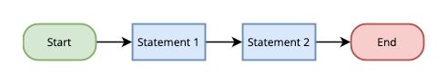
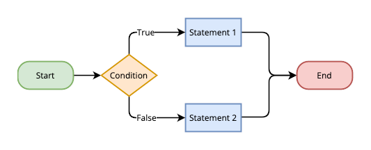
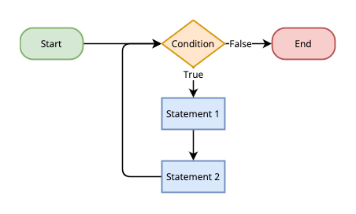

Programming languages and approaches can differ wildly. But there are some basic programming concepts you can learn that apply everywhere in the world of coding.

In this tutorial, learn about some of these key computer programming concepts alongside examples and illustrations that aim to make them more graspable.

## 6 Basic Programming Concepts to Get You Started

These next sections cover six of the most important concepts in programming. They are by no means the only basic concepts, but they are some of the most fundamental. This selection is designed to give you a solid footing in the world of programming theory and methodology.

### Variables and Constants

Variables are names or symbols that hold data for your program. Once a variable is assigned, the data it holds can be accessed through the variable name. This makes working with complex and changing data possible, which is why variables are one of the fundamental elements of programming.

Often, variables' values can be changed, or reassigned, in the course of a program. The exception are a kind of variable called *constants*. Constants are assigned once, and hold the same data for the rest of the program.

To create a variable, of either kind, you first need to *declare* it, which sets aside its name and type. Then, you can *assign* a value to the variable.

In many programming languages, a variable can be declared and assigned in a single statement, like this:

    variable_one = "data value one"

Some languages, like JavaScript, require that you begin a statement like the one above with a keyword. This clarifies for the program that you are declaring and assigning a new variable:

    var variable_two = "data value two"

In some languages, it is also possible to first declare a variable in one statement and then assign it in another, separate statement:

    var variable_three
    variable_three = "data value 3"

Still some others require that variables are declared with their specific data types. For examples of this, take a look at the next section, on data types.

### Data Types

Data types describe data, categorizing each piece of data into one of several kinds. Having data labeled in this way helps compilers and interpreters to know what can and cannot be done with any given piece of data.

And data types are important for programmers to know about for the same reason. All kinds of things can go wrong with code when data types get mixed up.

The available data types for your program depend on its programming language and other factors like imported libraries. However, there are some data types that occur almost everywhere. Here is a list to start with:

- *Boolean*. Contains only one of two values, **True** or **False**.

        boolean_variable = True

- *Integer*. Contains a whole number, either positive, negative, or zero.

        integer_variable = 11

- *Float* or *Real*. Contains a number with a decimal point.

        float_variable = 1.1

- *String*. Contains zero or more characters of text.

        string_variable = "data value"

- *Array*. Contains a series of values of the same data type, like a list of numbers or a list of strings.

        int_array_variable = [2, 4, 6, 8]

        string_array_variable = ["more", "data", "again"]

In many languages, like JavaScript and Python, you do not need to explicitly mention data types. They are essential to know about, but the compiler or interpreter figures out each variable's type automatically.

Some other languages, though, require you to explicitly declare a variable's type.

Take Java for example. Here, you need to begin your variable's declaration with a keyword indicating the variable's type:

```java
// Declares an integer variable.
int java_integer_variable = 5;

// Declares a string variable.
String java_string_variable = "text data";
```

### Statements and Expressions

A statement tells a program to perform an action, or else controls the flow of actions. You can learn more about control statements in the next section, but, for now, look at statements as doing something.

Some examples can be seen in the previous sections. It takes a statement both to declare and assign a variable. Additionally, a statement can result in altering the value of a variable:

    integer_variable = integer_variable + 2

Statements often include one or more *expressions*. Where statements perform some action, expressions get evaluated to some value. So, in the example just above, `integer_variable + 2` is an expression — it evaluates to `13` if `integer_value` is `11`.

These two, statements and expressions, get frequently confused, so it can be useful to distinguish them. To help with that, here are some succinct definitions to keep in mind:

- A statement does something in the program, like declaring or assigning variables, processing data, or controlling program flow.

- An expression evaluates to a value, whether the expression is an equation, a function that returns a value, or just a variable name.

One more example. This one uses a `print` function, like you find in the Python programming language. The function takes in some text value and outputs it to the terminal:

``` python
# Statement declaring and assigning a variable. The string value itself
# is an expression.
new_string_variable = "a string to remember"

# Statement calling for the print function to do something with a value.
# The variable `new_string_variable` is an expression, evaluating to a
# string for the `print` function to process.
print(new_string_variable)
```

### Control Structures

Control structures define how series of statements get executed in your program. Typically, statements run in order from top to bottom, but there are a few constructs that can alter this.

Understanding and making use of different control structures can make your programs come to life. These are what make programs capable of adapting to variable data. Working with control structures also lets you have a program complete repetitive tasks without having to write a statement for each and every one.

There are three different kinds of control structures you can encounter when programming.

#### Sequential

By default, a program executes statements in a sequential flow, one after the other, from top to bottom.



The declaration and assignment of variables you saw above is an example of a sequential control structure. Consider this example as well:

    new_variable = 4
    new_variable = 6
    new_variable = new_variable * 2

Because the statements follow a sequential order, you know that the last statement results in `new_variable` having a value of `12`.

#### Conditional

A conditional control structure executes statements based on whether or not a given set of conditions are met.



The most common conditional is the `if` statement. When this statement gets executed, the program determines whether its named conditions are met. If they are, the program performs the conditional actions.

Often the `if` statement is accompanied by an `else` statement. The actions for the `else` condition get executed when the conditions for the accompanying `if` statement are not met.

    if new_variable > 6:
        print("The variable is larger than six.")

    else:
        print("The variable is not larer than six.")


The variable is larger than six.


#### Iterative

An iterative control structure executes statements repeatedly until a given condition is met or until a given condition ceases to be true.



There are several kinds of iterative loops, but two in particular that you are likely to see frequently.

The first is a `while` loop. The statements in a `while` loop continue executing until the `while` condition is no longer true:

    while new_variable > 6:
        print(new_variable)
        new_variable = new_variable - 1


12
11
10
9
8
7


The second is a `for` loop. These loops usually iterate over an array, executing the statements in the loop until it has looped over each variable in the array:

    array_variable = [2, 4, 6, 8]

    for item in array_variable:
        print(item * 10)


20
40
60
80


### Functions

A function defines a behavior for your program to perform. Where a statement performs a given action, a function boxes up a set of actions, so to speak. You can then readily execute those actions at any point using the predefined function.

This makes functions quite powerful. They can abstract actions, making a series of statements executable at a single command.

Here is an example that defines a function for getting even numbers under 10:

    def get_little_even_numbers():
        little_even_numbers_array = []

        countdown_variable = 9

        while countdown_variable > 0:
            if (countdown_variable % 2 == 0):
                little_even_numbers_array.append(countdown_variable)

            countdown_variable = countdown_variable - 1

Now, calling the `get_little_even_numbers` function gives your program the numbers in a single expression.

Functions are more useful, however, when they work with input variables, called *arguments*. These make functions more useful because they let the functions' behaviors adapt to your program's needs.

Take this revised version of the function from the example above. The function now takes its countdown number from the `countdown_argument`:

    def get_even_numbers(countdown_argument):
        even_numbers_array = []

        while countdown_argument > 0:
            if (countdown_argument % 2 == 0):
                even_numbers_array.append(countdown_argument)

            countdown_argument = countdown_argument - 1

You can test the new function to see how its output varies based on the argument your program inputs:

    print(get_even_numbers(10))
    print(get_even_numbers(12))


[10, 8, 6, 4, 2]
[12, 10, 8, 6, 4, 2]


### Syntax

Like in natural language, syntax consists of the rules that govern the structure of programming languages. Syntax is about what symbols and their relations to one another mean in a programming language.

In fact, just as it is syntax that gives meaning to natural language, syntax enables code to be read by a compiler or interpreter. It is syntax that ultimately enables your code to be understood and executed.

Each programming language is defined by its particular syntax. This guide mentioned an example of such syntax differences earlier. For instance, you saw that some languages require you to explicitly state a variable's type and in others you do not.

To illustrate further, here is a function defined first in Python and then in JavaScript. You can see the syntax differences at work in the spacing, line breaks, and use of symbols. Both of these functions have the same results — they output the numbers from one to the number given as an argument:

First, Python:

```python
def new_function(argument_x):
    counter = 1

    while counter <= argument_x:
        print(counter)
```

Now the equivalent in JavaScript:

```javascript
function newFunction(argumentX) {
    for (var counter = 1; counter <= argumentX; counter++) {
        console.log(counter.toString());
    }
}
```

## Conclusion

After this tutorial, you should have a solid foundation for moving forward in programming. You have the basic concepts, and examples for them, to make the rest of this vast landscape clearer.

Looking to plunge further? Take a look at our other programming guides. This includes a guide introducing *object-oriented programming* and another introducing *functional programming*, two of the most prevalent programming paradigms.

Have more questions or want some help getting started? Feel free to reach out to our [Support](https://www.linode.com/support/) team.
