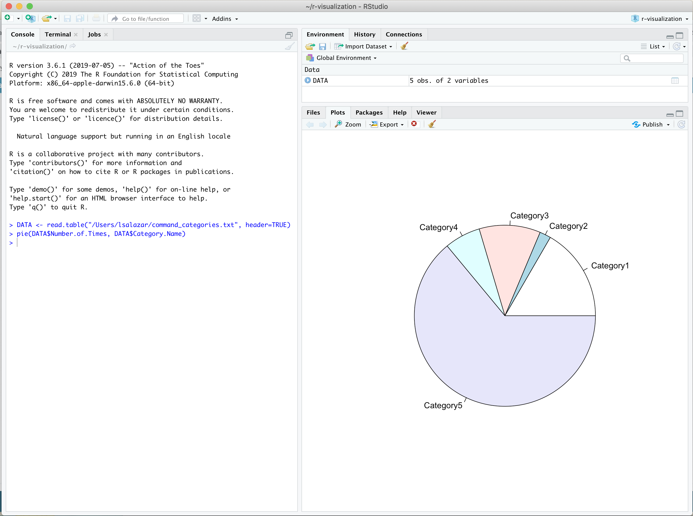
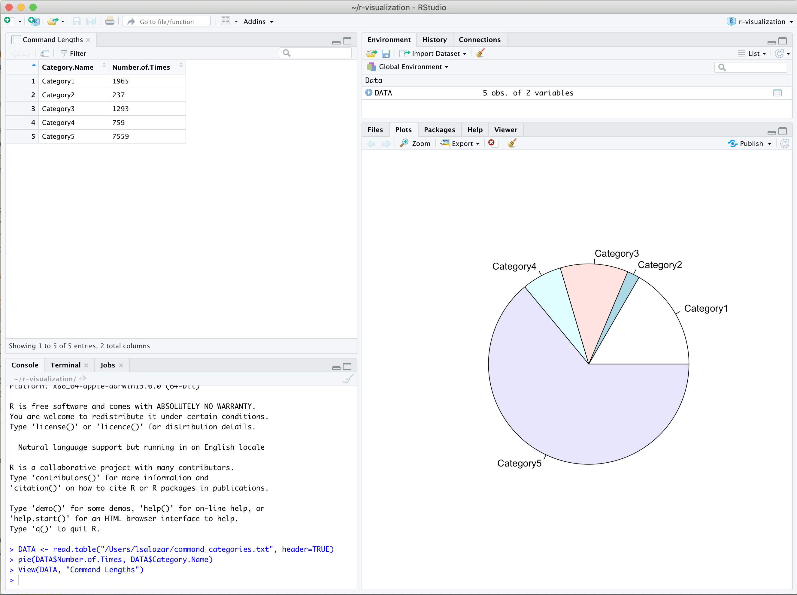
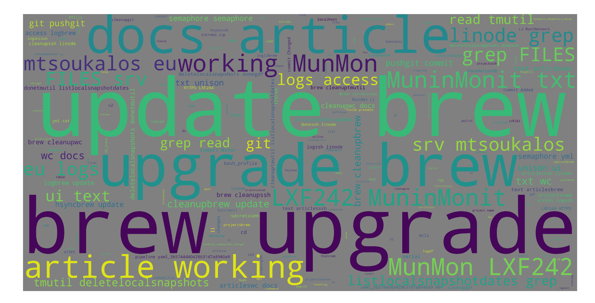

Creating graphic visualizations for a data set is a powerful way to derive meaning from vast amounts of information. It provides a way to extract meaningful relationships between different aspects of your data depending on how the data is mapped and which graphic representations are chosen. Data visualization is a common practice in many sectors, including various scientific disciplines, business settings, the government sector, and education.

There are many open source tools available to create sophisticated data visualizations for complex data sets. This guide will provide an introductory exploration of data analysis and 2D graphics rendering packages that can be used with [R](https://www.r-project.org/other-docs.html), [Python](https://docs.python.org/3/), and [JavaScript](https://developer.mozilla.org/en-US/docs/Web/JavaScript/Reference) to generate data visualizations.

In this guide you will complete the following steps:

* [Create three different data sets to use for your visualizations](/docs/guides/visualize-history/#create-your-data-sets).
* [Visualize your data using R and RStudio as a pie chart](/docs/guides/visualize-history/#visualize-your-data-with-rstudio).
* [Create a word cloud using Python and the pandas library](/docs/guides/visualize-history/#create-a-word-cloud-using-python).
* [Develop a web browser based pie chart visualization using JavaScript and the D3.js package](/docs/guides/visualize-history/#visualize-data-using-d3-js).

## Before You Begin

Ensure you have the following programs and packages installed on your computer:

1. The [R](http://cran.cnr.berkeley.edu/) programming language
1. The [RStudio Desktop](https://rstudio.com/products/rstudio/download/#download) application
1. [Python 3.7.0](https://www.python.org/downloads/) or higher
    1. [pandas](https://pypi.org/project/pandas/) Python package
    1. [Matplotlib](https://pypi.org/project/matplotlib/) Python package
    1. [wordcloud](https://pypi.org/project/wordcloud/) Python package
1. The [Golang](https://golang.org/doc/install) programming language


This guide assumes you have some basic familiarity with the following concepts and skills:

1. Basic programming principles and data structures
1. Are able to read code written in Go, Python, HTML, CSS, and JavaScript


## Create Your Data Sets

In this section, you will create a data set using the contents of your [Bash](https://en.wikipedia.org/wiki/Bash_(Unix_shell)) history file and optionally, your [Zsh](https://en.wikipedia.org/wiki/Z_shell) history file. You will then create a third data set using a Perl script that will extract information from the first two data sets. In the [Create Visualizations for your Data](/docs/guides/visualize-history/#create-visualizations-for-your-data) section of the guide, you will use these various data sets to create corresponding visualizations.

### Data Set 1 - Bash History File
A Bash history file stores all commands executed in your command line interpreter. View your 10 most recently executed commands with the following command:

    head ~/.bash_history

  Your output should resemble the following:


git commit -a -m "Fixed Constants links"
git push
git diff
docker images
brew update; brew upgrade; brew cleanup
git commit -a -m "Cleanup v2 and v3"
git push
git commit -a -m "Added examples section"
git push
cat ~/.lenses/lenses-cli.yml


Create a new directory named `data-sets`to store your data and copy your Bash history file to the directory:

    mkdir data-sets && cp ~/.bash_history data-sets/data-1

### Data Set 2 - Zsh History File

If you are using the Zsh shell interpreter, you can use its history file as a second data set. Zsh's history file format includes data that you will need to exclude from your data set. Use [AWK](/docs/guides/introduction-to-awk/) to clean up your Zsh history file and save the output to a new file in the `data-sets` directory:

    awk -F ";" '{$1=""; print $0}' ~/.zsh_history | sed -e "s/^[ \t]*//" -e "/^$/d" > data-sets/data-2

### Data Set 3 - Perl Script

To create your third data set, you will use a Perl script that categorizes the contents of your data set files. The categorization is based on the word count for each line of text in your data files or, in other words, the length of each command stored in your Bash and Zsh history files. The script creates 5 categories of command lengths; 1 - 2 words, 3 - 5 words, 6 - 10 words, 11 - 15 words, and 16 or more words.

1. Create a file named `command_length.pl` in your home directory with the following content:

    
#!/usr/bin/perl -w

use strict;

my $directory = "";
my $filename = "";

my $CAT1 = 0;
my $CAT2 = 0;
my $CAT3 = 0;
my $CAT4 = 0;
my $CAT5 = 0;

if ( @ARGV != 1 ) {
   die <<Thanatos
      usage info:
         Please use exactly 1 argument!
Thanatos
}

($directory) = @ARGV;
opendir(BIN, $directory)
    || die "Error opening directory $directory: $!\n";

while (defined ($filename = readdir BIN) ) {
    # The following command does not process . and ..
    next if( $filename =~ /^\.\.?$/ );
    process_file($directory."/".$filename);
}

print "Category1\t\t$CAT1\n";
print "Category2\t\t$CAT2\n";
print "Category3\t\t$CAT3\n";
print "Category4\t\t$CAT4\n";
print "Category5\t\t$CAT5\n";
exit 0;

sub process_file {
    my $file = shift;
    my $line = "";

    open (HISTORYFILE, "< $file")
        || die "Cannot open $file: $!\n";

    while (defined($line = <HISTORYFILE>)) {
        chomp $line;
        next if ( ! defined($line) );
        check_category($line);
    }
}

sub check_category {
    my $command = shift;
    chomp $command;
    my $length = length($command);

    if ( $length <= 2 ) { $CAT1 ++; }
    elsif ( $length <= 5 ) { $CAT2 ++; }
    elsif ( $length <= 10 ) { $CAT3 ++; }
    elsif ( $length <= 15 ) { $CAT4 ++; }
    else { $CAT5 ++; }
}
    

1. Run the Perl script. The script expects a single argument; the directory that holds all data files that you want to process. The file's output will be saved in a new file `command_categories.txt`. The `command_categories.txt` file will be used later in this guide to create visualizations using R.

        ./command_length.pl data-sets > ~/command_categories.txt

    
Your Perl script must be executable in order to run. To add these permissions, execute the following command:

    chmod +x command_length.pl
    

    Open the `.command_categories.txt` file to view the categorizations created by your Perl script. Your file should resemble the following example:

    
"Category Name" "Number of Times"
Category1 5514
Category2 2381
Category3 2624
Category4 2021
Category5 11055
    

You now have three sources of data that you can use to explore data visualization tools in the next sections.

- `~/data-sets/data-1`
- `~/data-stes/data-2`
- `~/command_categories.txt`

## Create Visualizations for your Data

In this section you will use the data sets you created in the previous section to generate visualizations for them.

### Visualize your Data with R and RStudio

[R](https://www.r-project.org/about.html) is a specialized programming language used for statistical computing and graphics. It is especially good for  creating high quality graphs, like [density plots](https://en.wikipedia.org/wiki/Density_estimation), [line charts](https://en.wikipedia.org/wiki/Line_chart), [pie charts](https://en.wikipedia.org/wiki/Pie_chart), and [scatter plots](https://en.wikipedia.org/wiki/Scatter_plot). [RStudio](https://rstudio.com/) is an integrated development environment (IDE) for R that includes debugging and plotting tools that make it easy to write, debug, and run R scripts.

In this section, you will use the `command_categories.txt` file created in the [Data Set 3 - Perl Script](/docs/guides/visualize-history/#data-set-3-perl-script) section and RStudio to create a pie chart and simple spreadsheet of your data.

1. Open RStudio Desktop and create a data frame. In R, a data frame is a table similar to a two-dimensional array.

        DATA <- read.table("~/command_categories.txt", header=TRUE)

    - This command will read the `command_categories.txt` file that was created in the [Data Set 3 - Perl Script](/docs/guides/visualize-history/#data-set-3-perl-script) section of the guide and create a data frame from it that is stored in the `DATA` variable.

    - The `header=TRUE` argument indicates that the file's first row contains variable names for column values. This means that `Category Name` and `Number of Times` will be used as variable names for the two columns of values in `command_categories.txt`.

1. Next, create a pie chart visualization for each column of values using R's `pie()` function.

        pie(DATA$Number.of.Times, DATA$Category.Name)

    - The function's first argument, `DATA$Number.of.Times` and `DATA$Category.Name`, provides the x-vector numeric values to use when creating the pie chart visualization.

    - The second argument, `DATA$Category.Name`, provides the labels for each pie slice.

    RStudio will display a pie chart visualization of your data in the **Plots and Files** window similar to the following:

    

1. Visualize your data in a spreadsheet style format using R's `View()` function.

        View(DATA, "Command Lengths")

    RStudio will display a spreadsheet style viewer in a new window pane tab.

    

Explore [R's graphics package](https://www.rdocumentation.org/packages/graphics/versions/3.6.1) to discover additional functions you can use to create more complex visualizations for your data with RStudio.

### Create a Word Cloud using Python

Word clouds depict text data using varying font sizes and colors to visually demonstrate the frequency and relative importance of each word. A common application for word clouds is to visualize tag or keyword relevancy. In this section you will use Python3 and your Bash and Zsh history files to generate a [*word cloud*](https://en.wikipedia.org/wiki/Tag_cloud) of all your shell commands. The Python packages listed below are commonly used in programs for data analysis and scientific computing and you will use them to generate your word cloud.

- [pandas](https://pypi.org/project/pandas/): this package provides data structures that make it easier to work with various types of data, including [tabular data](https://en.wikipedia.org/wiki/Table_(information)), ordered and unordered [time series data](https://en.wikipedia.org/wiki/Time_series), and [arbitrary matrix data](https://en.wikipedia.org/wiki/Random_matrix).
- [Matplotlib](https://pypi.org/project/matplotlib/): a plotting library that generates 2D graphics.
- [wordcloud](https://pypi.org/project/wordcloud/): allows you to generate word clouds.

1. Create a file named `create_wordcloud.py` in your home directory with the following content:

    
#!/usr/bin/env python3

import pandas as pd
import matplotlib.pyplot as plt
import sys
import os
from wordcloud import WordCloud, STOPWORDS
from random import randrange

path = sys.argv[1]

if os.path.exists(path):
    print("Creating word cloud for file: " + path)

    data = pd.read_table(path, header = None, names=["CMD"], encoding = "iso-8859-1")

    skipWords = []
    skipWords.extend(STOPWORDS)

    words = ''.join(data['CMD'])

    w = WordCloud(
            stopwords=set(skipWords),
            background_color='gray',
            width=4000,
            height=2000
            ).generate(words)
    filename = "word_cloud_" + str(randrange(100)) + ".png"
    print("Your wordcloud's filename is: " + filename)

    plt.imshow(w)
    plt.axis("off")
    plt.savefig(filename, dpi=1000)

else:
    print("File" + path +  "does not exist")
    

1. Run your Python script and pass the path of one of your data set files as an argument. The script will read the contents of the file using panda's `read_table()` function and convert it into a data frame with a column name of `CMD`. It will then use the data in the `CMD` column to create a concatenated string representation of the data that can be passed to wordcloud to generate a `.png` wordcloud image.

        ./create_wordcloud.py ~/data-sets/data-1

    You should see a similar output from the Python script:

    
Creating word cloud for file: /Users/username/data-sets/data-2
Your word cloud's filename is: word_cloud_58.png
    

1. Open the `word_cloud_58.png` image file to view your word cloud.

      

You could use a similar process to create a word cloud visualization for any text you want to analyze.

### Visualize Data using D3.js

D3.js is a JavaScript library that helps you visualize JSON formatted data using HTML, SVG, and CSS. In this section you will us D3.js to create and embed a pie chart visualization into a web page.

To convert your data set into JSON, you will create a [Golang](https://golang.org/) command line utility that generates JSON formatted plain text output. For more complex data sets, you might consider creating a similar command line utility using Golang's [json package](https://golang.org/pkg/encoding/json/).

1. Create a file named `cToJSON.go` in your home directory with the following content:

    
package main

import (
    "bufio"
    "flag"
    "fmt"
    "io"
    "os"
    "regexp"
    "sort"
)

var DATA = make(map[string]int)

func lineByLine(file string) error {
    var err error
    f, err := os.Open(file)
    if err != nil {
        return err
    }
    defer f.Close()

    r := bufio.NewReader(f)
    for {
        line, err := r.ReadString('\n')
        if err == io.EOF {
            break
        } else if err != nil {
            fmt.Printf("error reading file %s", err)
            break
        }

        r := regexp.MustCompile("[^\\s]+")
        words := r.FindAllString(line, -1)
        if len(words) == 0 {
            continue
        }

        if _, ok := DATA[words[0]]; ok {
            DATA[words[0]]++
        } else {
            DATA[words[0]] = 1
        }

    }
    return nil
}

func main() {
    flag.Parse()
    if len(flag.Args()) == 0 {
        fmt.Printf("usage: cToJSON <file1> [<file2> ...]\n")
        return
    }

    for _, file := range flag.Args() {
        err := lineByLine(file)
        if err != nil {
            fmt.Println(err)
        }
    }

    n := map[int][]string{}
    var a []int
    for k, v := range DATA {
        n[v] = append(n[v], k)
    }

    for k := range n {
        a = append(a, k)
    }

    fmt.Println("[")
    sort.Sort(sort.Reverse(sort.IntSlice(a)))

    counter := 0
    for _, k := range a {
        if counter >= 10 {
            break
        }

        for _, s := range n[k] {
            if counter >= 10 {
                break
            }
            counter++
            fmt.Printf("{\"command\":\"%s\",\"count\":%d},\n", s, k)
        }
    }
    fmt.Println("];")
}
    

    - The utility expects file paths to your Bash and Zsh data sets as arguments.
    - It will then read the files and find the 10 most popular commands and output it as JSON formatted data.
    - Several [Golang standard library packages](https://golang.org/pkg/) are used in the utility to perform operations liking reading files, using regular expressions, and sorting collections.

1. Run the command line utility and pass in the paths to each command history data set:

        go run cToJSON.go data-set/data-1 data-set/data-2

      Your output should resemble the following:

      
[
{"command":"ll","count":1832},
{"command":"git","count":1567},
{"command":"cd","count":982},
{"command":"brew","count":926},
{"command":"unison","count":916},
{"command":"gdf","count":478},
{"command":"ssh","count":474},
{"command":"rm","count":471},
{"command":"sync","count":440},
{"command":"ls","count":421},
];
    

    You are now ready to create your pie chart visualization and embed it into a web page using D3.js

1. Create an HTML file named `pieChart.html` and copy and paste the following content. The `DATA` variable on line 31 contains the JSON data that was created by the `cToJSON.go` script in the previous step. Remove the JSON data in the example and replace it with your own JSON data.

    
In this example, your JSON data is hardcoded in `pieChart.html` for simplicity. Web browser security constraints restrict how a document or script loaded from one origin can interact with a resource from another origin. However, you may consider using the [d3-fetch module](https://github.com/d3/d3-fetch/blob/v1.1.2/README.md#json) to fetch your JSON data from a specific URL.
    

      
<!DOCTYPE html>
<html lang="en">
  <head>
    <meta charset="utf-8">
    <title>History Visualization</title>

    
  </head>

  <body>
    

  </body>

  
  
</html>


1. Navigate to your preferred browser and enter the HTML file's absolute path to view the pie chart. For a macOS user that has stored the HTML file in their home directory, the path would resemble the following: `/Users/username/pieChart.html`

    

## Next Steps

Now that you are familiar with some data visualization tools and simple techniques, you can begin to explore more sophisticated approaches using the same tools explored in this guide. Here are a few ideas you can consider:

- Create a new data set by extracting all `git` related commands from your history files; analyze and visualize them.
- Automate some of the techniques discussed in this guide using [Cron](/docs/guides/schedule-tasks-with-cron/) jobs to generate your data sets automatically.
- Explore the [Python for Data Science](http://wavedatalab.github.io/datawithpython/index.html) eBook's [data visualization](http://wavedatalab.github.io/datawithpython/visualize.html) section for a deeper dive into using pandas.
