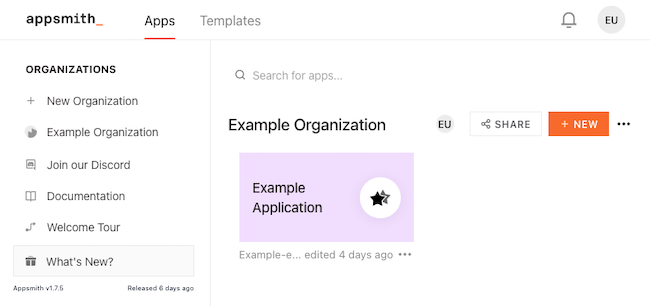
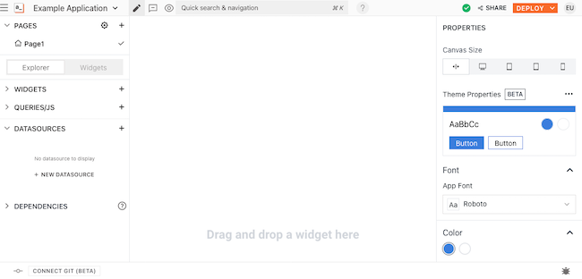
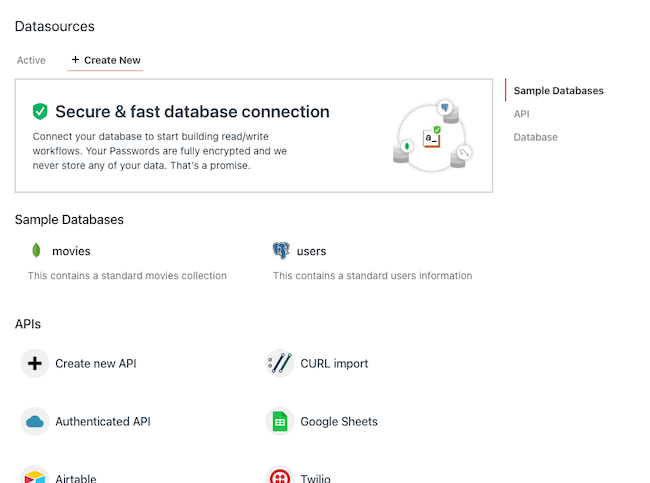
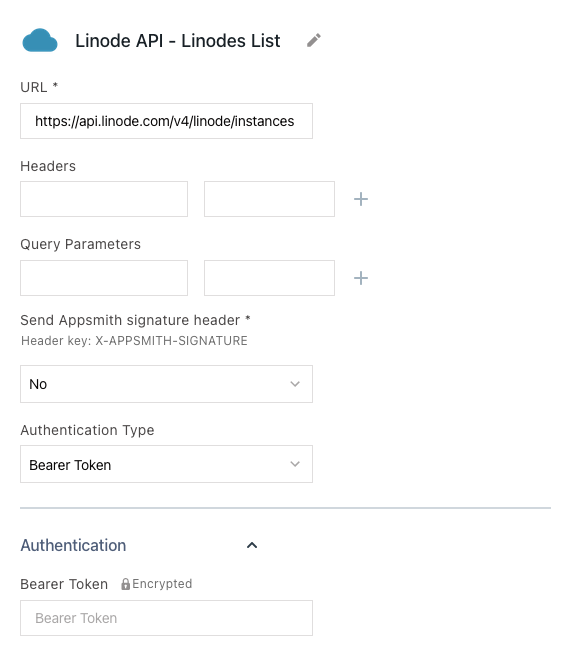
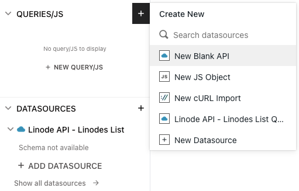
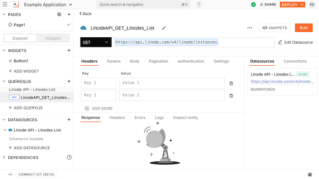
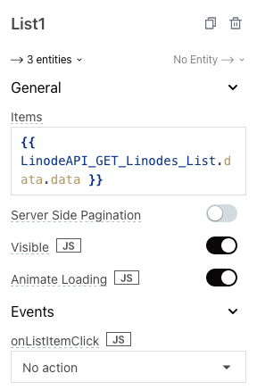
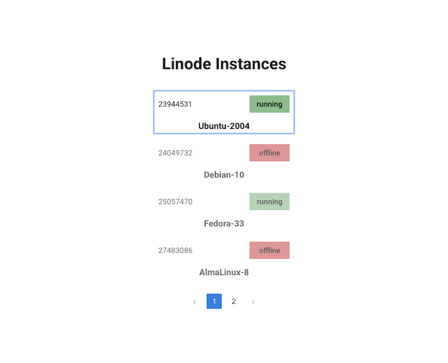
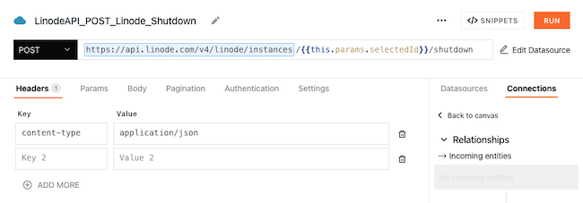
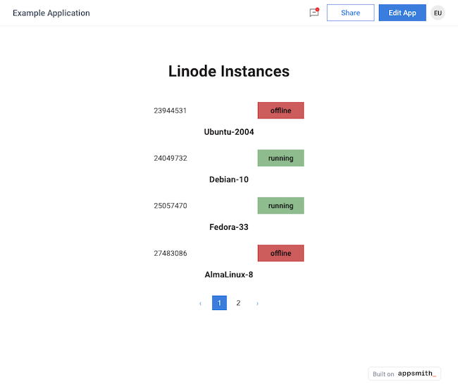

[Appsmith](https://www.appsmith.com/) is a platform for building applications in a low-code, visual interface. It is an open-source tool ideal for quickly developing internal applications with a combination of drag-and-drop UI widgets and JavaScript code.

You can learn more about Appsmith and how to host your own instance in our guide **How to Self-host Appsmith with Docker Compose**.

This tutorial covers everything you need to connect your Appsmith instance to the Linode API. With this, you can build your own Linode cloud manager or integrate Linode control into your application.

And, while this tutorial is specifically concerned with the Linode API, similar steps can be readily adapted to numerous other APIs. By the end, you should be prepared to connect other Linode APIs — like those for Linode managed databases — or other external APIs.

## Before You Begin

1. Familiarize yourself with our [Getting Started with Linode](/docs/getting-started/) guide, and complete the steps for setting your Linode's hostname and timezone.

1. This guide uses `sudo` wherever possible. Complete the sections of our [How to Secure Your Server](/docs/security/securing-your-server/) guide to create a standard user account, harden SSH access, and remove unnecessary network services.

1. Update your system.

    - On Debian and Ubuntu, you can do this with:

            sudo apt update && sudo apt upgrade

    - On AlmaLinux, CentOS (8 or later), or Fedora, use:

            sudo dnf upgrade

1. Follow our guide on **How to Self-host Appsmith with Docker Compose** for steps to install Docker and start running an Appsmith instance on your own server.


This guide is written for a non-root user. Commands that require elevated privileges are prefixed with `sudo`. If you’re not familiar with the `sudo` command, see the [Users and Groups](/docs/tools-reference/linux-users-and-groups/) guide.


## Getting Familiar with the Linode API

The [Linode API](https://www.linode.com/products/linode-api/) gives you complete access to viewing, configuring, and managing your Linode cloud servers, all with the programmatic accessibility of a RESTful API.

The API has been designed to give both developers and system administrators tools for managing Linode products and services programmatically. Not only that, but it also allows for integrating those services into other applications.

Take a look at the link to the page on the Linode API above to learn more about the API and its capabilities. Then, see the [Preparing the Linode API](/docs/guides/connect-appsmith-to-linode-api/#preparing-the-linode-api) section further on to learn about setting up the Linode API for your own use.

## Connecting Appsmith to the Linode API

The next several sections in this tutorial walk you through the steps to connect an Appsmith instance to the Linode API. Follow along to get everything from preparing Linode API credentials through testing the connection to Appsmith.

### Preparing the Linode API

To get started using the API, with the prerequisites you need for this Appsmith tutorial, follow our [Linode API documentation](/docs/api/).

Be sure particularly to follow the steps for authentication, getting either a personal access token or configuring OAuth, depending on your needs.

This tutorial assumes that you have acquired a personal access token for the Linode API. However, you should be readily able to replace this with an OAuth authentication token in any of the examples that follow.

### Creating the Appsmith Authenticated API

Within Appsmith, you typically add an API as a datasource to your application. Specifically, APIs tend to be added as *Authenticated API* resources.

This series of steps shows you how to create such an *Authenticated API* for the Linode API's *Linodes Instances*, *Linode List* endpoint. This endpoint provides a list of all Linode instances on your account, along with information like instance IDs, names, and statuses.

1. Have an Appsmith application to which you intend to add the *Authenticated API*. You can create a new application from the Appsmith dashboard by clicking the **+ New** button. You may first have to create an organization to house the application under, which you can do using the **New Organization** button on the left menu.

    For this tutorial, an application named "Example Application" is used. It is part of an "Example Organization."

    

1. Go to the page for editing the application. You may be directed there automatically after creating an application. For an existing application, hover on the application thumbnail on the dashboard, and click the **Edit** button.

    

1. Click the **+** icon by **Datasources** on the left menu to view the datasource creation prompt.

    

1. Select the **Authenticated API** option, which directs you to a form where you can enter the API information.

1. Fill out the form as shown here to create a datasource for the Linode API's [Linodes List](/docs/api/linode-instances/#linodes-list) endpoint. In the **Bearer Token** field, enter your personal authentication token for the Linode API.

    

Once created, an authenticated API can be adjusted at any time. To do so, click the button for the API in the left menu under the **Datasources** tab. Then, click the **Edit** button on the API's information page.

### Testing the Connection

The quickest way to test your connection to an *Authenticated API* in Appsmith is by creating a query. Furthermore, queries are the basis of any usage of datasources in Appsmith. So, this step is necessary to actually start using the API in your application.

1. Locate the **Query/JS** option on the left menu, and click the **+** beside it. Select the Linode API from the list of options that displays.

    

1. A query creation page displays, with the query URL already in place. Since this example uses a simple `GET` endpoint, there is no need for adding further headers or parameters. Here, the only change is that the query has been named.

    

1. Click the **Run** button in the upper right, and the response data from the API displays in the **Response** area at the bottom of the page.

    The following is example response data for the endpoint shown above. It assumes that you have one Linode instance, currently running, using Ubuntu 22.04. IP addresses have been replaced with generic alternatives.

    
{
  "data": [
    {
      "id": 36982246,
      "label": "Ubuntu-2204-Server",
      "group": "",
      "status": "running",
      "created": "2022-06-22T16:49:18",
      "updated": "2022-06-22T16:49:18",
      "type": "g6-dedicated-4",
      "ipv4": [
        "192.0.2.0"
      ],
      "ipv6": "2001:0db8:85a3:0000:0000:8a2e:0370:7334",
      "image": "linode/ubuntu22.04",
      "region": "us-southeast",
      "specs": {
        "disk": 163840,
        "memory": 8192,
        "vcpus": 4,
        "gpus": 0,
        "transfer": 5000
      },
      "alerts": {
        "cpu": 360,
        "network_in": 10,
        "network_out": 10,
        "transfer_quota": 80,
        "io": 10000
      },
      "backups": {
        "enabled": false,
        "schedule": {
          "day": null,
          "window": null
        },
        "last_successful": null
      },
      "hypervisor": "kvm",
      "watchdog_enabled": true,
      "tags": []
    }
  ],
  "page": 1,
  "pages": 1,
  "results": 1
}
    

## Implementing the API in an Appsmith Application

The Linode API is now ready to use within your Appsmith application. From there, Appsmith gives you myriad ways to implement the API into your application.

These next steps show you a simple example application using the *Authenticated API* created the previous sections. The steps gloss over some of the details of application creation in Appsmith, since the focus is on integrating an API.

Instead, these steps highlight the particular pieces that relate to mobilizing the Linode API, both for displaying data and managing Linode products and services.

### Displaying the Data

1. Start with a page, and add a *List* widget to it. Select the *List* widget, and replace the **Items** field's content with the following: `{{ LinodeAPI_GET_Linodes_List.data.data }}`.

    

1. Remove the existing widgets from within the *List* widget's first item, and begin adding other widgets. Updating the display for the first item in the *List* widget updates the way each item in the list displays.

    Which widgets you use depends on what information you want displayed for each Linode instance. For this example, the following widgets are added to the *List* widget.

    - A *Text* widget to display the instance ID. Change the **Text** field in the widget's configuration to: `{{currentItem.id}}`.

    - A *Text* widget to display the instance's name. Change the **Text** field in the widget's configuration to: `{{currentItem.label}}`.

    - A *Button* widget to display (and later control) the instance's boot status. In the widget's configuration, change the **Label** field to: `{{currentItem.status}}`.

        This example also gives the button dynamic color. To support this, change the **Button Color** field in the configuration to: `{{App_Logic.linodeInstanceStatusColor(currentItem)}}`. The next steps implement the logic behind this.

1. Create a new JavaScript object by selecting the **+** beside the **Queries/JS** button on the left menu. Select **New JS Object** from the sub-menu that appears.

1. Give the new JavaScript object the following contents. This JavaScript code supports the dynamic coloring for the status buttons on the list of Linode instances:

    
export default {
    linodeInstanceStatusColor: (currentItem) => {
        return (currentItem.status == "running") ? "darkseagreen" : "indianred";
    }
}
    

### Updating the Data

1. Create two new queries. Click on the **+** icon by the **Queries/JS** button on the left menu, and select the **Linode API** datasource from the sub-menu.

    On the query creation page for each, modify the URL by appending `/{{this.params.selectedId}}/boot` for the first and `/{{this.params.selectedId}}/shutdown` for the second.

    

    

1. Open the **App_Logic** JavaScript object again. Modify the JavaScript code there so that it now contains the following:

    
export default {
    linodeInstanceStatusColor: (currentItem) => {
        return (currentItem.status == "running") ? "darkseagreen" : "indianred";
    },
    linodeApiInstanceOnOrOff: (currentItem) => {
        if (currentItem.status == "offline") {
            LinodeAPI_POST_Linode_Boot.run({ selectedId: currentItem.id });
        } else {
            LinodeAPI_POST_Linode_Shutdown.run({ selectedId: currentItem.id });
        }
    }
}
    

    The new function, `linodeApiInstanceOnOrOff`, accepts an item from the list of Linode instances and calls the appropriate query, depending on whether the instance is on or off.

1. Access the *Button* widget again, and press the **JS** button by the **onClick** field. Now enter the following in the **onClick** field: `{{App_Logic.linodeApiInstanceOnOrOff(currentItem)}}`.

This leaves you with a functioning application for managing Linode instances. It provides a list of instances and their statuses, and gives you buttons for toggling each instance on or off.

Here is an updated view of the example application, deployed and having switched off the "Ubuntu-2004" instance on switched on the "Debian-10" instance.

## Conclusion

In this tutorial, you have the pieces you need to implement your own Appsmith application connected to the Linode API. And, moreover, the same steps and tools you have seen in this tutorial can be applied to connect your Appsmith application to other REST APIs.

To keep learning about building applications with Appsmith, you can jump into the tutorials and guides available from Appsmith. These show all the possibilities that the framework has to offer. Take a look at the links to the Appsmith documentation provided below to start.

Have more questions or want some help getting started? Feel free to reach out to our [Support](https://www.linode.com/support/) team.
