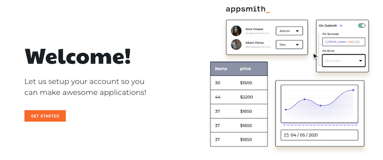
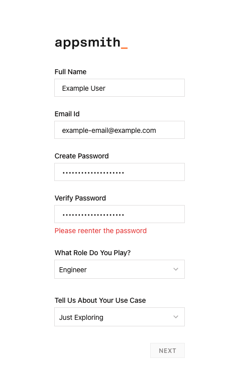
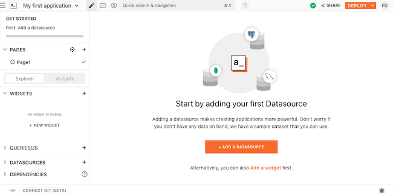
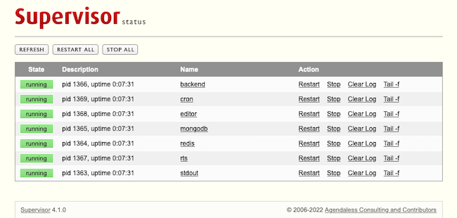

[Appsmith](https://www.appsmith.com/) is an open-source framework for developing internal applications. With Appsmith, developers can quickly develop complex applications using drag-and-drop widgets for application design and JavaScript for application logic. And Appsmith simplifies the processing of connecting your application to a wide range of data sources, from REST APIs to databases directly.

Learn in this tutorial how to get started with Appsmith, deploying your own self-hosted instance with Docker. Over the course of this tutorial, see also how to start configuring, using, and managing your Appsmith instance to get the most out of it.

## Before You Begin

1. Familiarize yourself with our [Getting Started with Linode](/docs/getting-started/) guide, and complete the steps for setting your Linode's hostname and timezone.

1. This guide uses `sudo` wherever possible. Complete the sections of our [How to Secure Your Server](/docs/security/securing-your-server/) guide to create a standard user account, harden SSH access, and remove unnecessary network services.

1. Update your system.

    - On Debian and Ubuntu, you can do this with:

            sudo apt update && sudo apt upgrade

    - On AlmaLinux, CentOS (8 or later), or Fedora, use:

            sudo dnf upgrade


This guide is written for a non-root user. Commands that require elevated privileges are prefixed with `sudo`. If you’re not familiar with the `sudo` command, see the [Users and Groups](/docs/tools-reference/linux-users-and-groups/) guide.


## What Is Appsmith?

Appsmith is an open-source framework for building web-based applications via a visual, drag-and-drop interface. Especially designed with the development of internal applications in mind, Appsmith allows you to quickly put together an application interface and get it operational.

Appsmith allows you to connect drag-and-drop UI widgets to a wide range of data sources to make a full-functioning application. Whether you access data via a REST API, GraphQL, or directly from a database, Appsmith is capable of mobilizing it in your new application.

From there, Appsmith uses JavaScript to control the logic within your application. In this way, it gives you a powerful blend of graphical application layout and design and code-first control of actions.

### Appsmith vs Retool and Budibase

There are other tools that weigh into the field with Appsmith. So, how does Appsmith compare with them? Why use Appsmith over Retool or over Budibase?

Appsmith's main advantage over the similar Retool is Appsmith's open-source nature. Appsmith is distributed as an open-source application that can be used and self-hosted freely. Retool, on the other hand, is proprietary. While Retool has a free tier, both its cloud-hosted and self-hosted offerings are limited if you are not on a paid plan.

Appsmith vs Budibase, on the other hand, comes down to emphasis and audience. Both are open-source solutions. But Budibase aims more completely to make application development visual. It is a "code optional" solution primarily with system administrators and other non-developer IT fields in mind.

Appsmith, on the other hand, aims to provide a solution to help developers to quickly build complex internal applications. It provides a balance of graphical design and coded logic to simplify UI design without sacrificing application control.

## How to Deploy Appsmith with Docker

The official method supported for deploying a self-hosted Appsmith instance is through Docker. And that is the method used here, with all the steps you need to get your own instance up and running.


These steps have been tested on Ubuntu 22.04. However, the Docker commands should apply equally on other distributions, such as Debian and CentOS. The section on installing Docker includes how to do so for these distributions as well.


### Installing Docker

The first step is to install Docker and Docker Compose. Docker runs Appsmith, while Docker Compose is used to organize its component parts and ensure the installation and coordinated execution of them.

1. Install Docker using the steps outlined in one of the following guides, depending on your Linux distribution.

    On Debian and Ubuntu, use our guide [How to Install and Use Docker on Ubuntu and Debian](/docs/guides/installing-and-using-docker-on-ubuntu-and-debian/).

    On AlmaLinux, CentOS, and Fedora, use our guide [How to Install and Use Docker on CentOS and Fedora](/docs/guides/installing-and-using-docker-on-centos-and-fedora/).

1. Install Docker Compose using your distribution's package manager.

    On Debian and Ubuntu, use the command:

        sudo apt install docker-compose

    On AlmaLinux, CentOS, and Fedora, use the command:

        sudo dnf install docker-compose

1. Verify your Docker Compose installation. Your version may not match the one shown below, but you just want to make sure that you get a version response:

        docker-compose -v

    
docker-compose version 1.29.2, build unknown
    

### Downloading Appsmith

Once you have Docker and Docker Compose installed, you need to download the Docker Compose file for Appsmith, and do so into the directory you plan to run Appsmith from.

This series of commands creates a directory for Appsmith, moves into that directory, and downloads the Docker Compose file for Appsmith. Here, the Appsmith directory is created as a subdirectory of the current user's home directory. Vary this as fits your needs:

    mkdir ~/appsmith
    cd ~/appsmith
    curl -L https://bit.ly/32jBNin -o $PWD/docker-compose.yml

All subsequent commands in this tutorial assume you are in this Appsmith directory unless noted otherwise.

### Running Appsmith

With the Docker Compose files for Appsmith downloaded, you can now start up Appsmith with the following command:

    sudo docker-compose up -d

With the initial run, Docker Compose starts by downloading the necessary image files for the Appsmith services. For this reason, the first time you run this command may take longer than subsequent times.

Docker Compose starts up the Appsmith services once it has finished with these initial downloads. Read on to the [How to Start Using Appsmith](/docs/guides/deploy-appsmith-docker/#how-to-start-using-appsmith) section below to see it in action.

### Stopping Appsmith

Once started, the Appsmith services continue running until either manually stopped or until the server is shut down. You can start the services back up anytime using the `docker-compose up -d` command as seen in the section above.

Should you need to stop the Appsmith services manually, you can do so by running the following command:

    sudo docker-compose stop -v

## How to Start Using Appsmith

Now that Appsmith is up and running, and you can access the dashboard by navigating to `http://localhost` in a web browser on the server.

However, doing so is often not feasible, especially not for numerous users. Likely, you want to be able to access the dashboard remotely.

You can do so by navigating to the Appsmith server's URL, which may often be an IP address, like `192.0.2.0`. But first, you need to ensure that the server's firewall provides external access to the HTTP port, port `80`.

- For Debian and Ubuntu, refer to our guide on [How to Configure a Firewall with UFW](/docs/guides/configure-firewall-with-ufw/).

- For AlmaLinux, CentOS, and Fedora, refer to our guide on [Enabling and Configuring FirewallD on CentOS](/docs/guides/introduction-to-firewalld-on-centos/)

Having opened the port, navigate to the server's URL/IP address, and you should be greeted by the Appsmith welcome page.

Proceeding from the welcome page, Appsmith prompts you to enter information for the current Appsmith user. This includes creation of a username (email address) and password, which are required for subsequent access to the Appsmith dashboard.

Following that, you arrive at the main Appsmith page. On your first visit, a prompt offers you the option of a tutorial, which you can access later as the **Welcome Tour** from the left menu. Otherwise, you can head right into the dashboard.

In addition to the built-in tutorial, Appsmith offers [tutorials](https://docs.appsmith.com/tutorials) on its website. These can be especially useful when it comes to applying further setup and configuration to your Appsmith instance.

## How to Configure Appsmith for Self-hosting

The main place for Appsmith configurations is `stacks/configuration/docker.env` within the Appsmith directory. There, you can setup things like an administrator username and password and API keys for integrations.

For instance, say that you want to use GitHub OAth, an email server, and a custom domain name for your Appsmith instance. You can do so by editing the following lines in the `docker.env` file, replacing the example values provided here:


# [...]

# Github OAuth
APPSMITH_OAUTH2_GITHUB_CLIENT_ID=example_github_client_id
APPSMITH_OAUTH2_GITHUB_CLIENT_SECRET=example_github_auth_secret

# [...]

# Email server
APPSMITH_MAIL_ENABLED=true
APPSMITH_MAIL_HOST=mail.example-domain.com
APPSMITH_MAIL_PORT=25
APPSMITH_MAIL_USERNAME=example_appsmith_email_user
APPSMITH_MAIL_PASSWORD=example_appsmith_user_password
APPSMITH_MAIL_FROM=appsmith@mail.example-domain.com
APPSMITH_REPLY_TO=appsmith@mail.example-domain.com

# [...]

APPSMITH_CUSTOM_DOMAIN=example-domain.com

# [...]


You can learn more about particular configuration options in the official [Appsmith configuration documentation](https://docs.appsmith.com/setup/instance-configuration).

Once you have made configuration changes, you need to restart the Appsmith services for those changes to take effect. You can use the following command to restart the services:

    sudo docker-compose restart appsmith

### Configuring Automatic Updates

Setting up Appsmith for automatic updates requires a configuration change in a different file. For this change, you need to modify the `docker-compose.yml` file in the Appsmith directory. Follow these steps to make the necessary changes and enable automatic updates.

1. Stop the Appsmith services:

        sudo docker-compose stop

1. Open the `docker-compose.yml` file, and find the commented-out lines that begin with the line remove `# Uncomment the lines below to enable auto-update`. YAML configuration files like this one use `#` to comment out lines.

1. Remove the comment syntax (`#`) from the beginnings of these lines. There may be a space preceding the `#`, which should also be removed. The section of your configuration file may afterward look something like:

    
   # Uncomment the lines below to enable auto-update
   labels:
     com.centurylinklabs.watchtower.enable: "true"

 auto_update:
   image: containrrr/watchtower:latest-dev
   volumes:
     - /var/run/docker.sock:/var/run/docker.sock
   # Update check interval in seconds.
   command: --schedule "0 0 * ? * *" --label-enable --cleanup
   restart: unless-stopped
    

1. Start the Appsmith services back up. Docker Compose downloads the necessary additional image file and creates the service for automatic updates:

        sudo docker-compose up -d

Alternatively, you can make manual updates to your Appsmith instance. Take a look at the section on [Updating Appsmith](/docs/guides/deploy-appsmith-docker/#updating-appsmith) below for the commands to do so.

## How to Manage the Appsmith Instance

The next few sections give you tools for

### Monitoring Processes

Appsmith has a dedicated web interface for monitoring Appsmith processes, called Supervisor.

You can access the Supervisor dashboard by navigating in your browser to the Supervisor path, `/supervisor`. You can do this locally with `http://localhost/supervisor`. Or you can access the Supervisor remotely through your server's domain/IP address, as in, for example `192.0.2.0/supervisor`.

Appsmith uses particular credentials for accessing the Supervisor, and you need to provide these credentials each time you want to access it. The credentials are set and stored in the main configuration file discussed above, `stacks/configuration/docker.env`. And the file comes with a default username and password you can use or change:


# [...]
APPSMITH_SUPERVISOR_USER=appsmith
APPSMITH_SUPERVISOR_PASSWORD=default_supervisor_password
# [...]


### Updating Appsmith

You can update your Appsmith instance manually, if you have not enabled automatic updates. This requires you to issue a series of commands from the Appsmith directory:

    sudo docker rmi appsmith/appsmith-ce -f
    sudo docker pull appsmith/appsmith-ce
    sudo docker rm -f appsmith
    sudo docker run -d --name appsmith -p 80:80 -v "$PWD/stacks:/appsmith-stacks" appsmith/appsmith-ce

Alternatively, refer to the [Configuring Automatic Updates](/docs/guides/deploy-appsmith-docker/#configuring-automatic-updates) section above for steps to enable automatic updates on your Appsmith instance.

### Importing and Exporting Data

Appsmith is capable of exporting its stored data, which can be useful for things like backups and migrations.

To export you Appsmith instance's data, use the following steps.

1. Create a backup dump of the instance's data:

        sudo docker-compose exec appsmith appsmithctl export_db

1. Copy the file containing the dumped data to the Appsmith directory:

        sudo docker cp appsmith:/appsmith-stacks/data/backup/appsmith-data.archive .

1. You may also want to retrieve a copy of the active `docker.env` file from the instance:

        sudo docker cp appsmith:/appsmith-stacks/configuration/docker.env .

1. At this point, you can access the data dump file form the Appsmith directory as `appsmith-data.archive`. Similarly, you can access the instance's configuration file as `docker.env` in this same directory.

To import data previously exported from an Appsmith instance, use the following steps. Again, you need to be in the Appsmith directory for the commands given here. Further, these steps assume that you have stored the `appsmith-data.archive` file and, optionally, the `docker.env` file that you want to import in the Appsmith directory.

1. Copy the data dump file into the Appsmith instance:

        docker cp ./appsmith-data.archive appsmith:/appsmith-stacks/data/restore/

1. Have Appsmith import the data dump file:

        docker-compose exec appsmith appsmithctl import_db

1. If you have a configuration file (`docker.env`) that you want to import as well, copy that file to the instance:

        docker cp ./docker.env appsmith:/appsmith-stacks/configuration/

1. Restart the Appsmith server for the configuration changes to take effect:

        docker-compose exec appsmith supervisorctl restart backend

## Conclusion

Having followed this tutorial, you have what you need to start using Appsmith to built your own applications. This tutorial covers the steps and techniques for getting an Appsmith instance up and running and managing it once you have.

From there, you can jump into the tutorials and guides available from Appsmith to learn all the possibilities that the framework has to offer. Take a look at the links to Appsmith below

Have more questions or want some help getting started? Feel free to reach out to our [Support](https://www.linode.com/support/) team.
