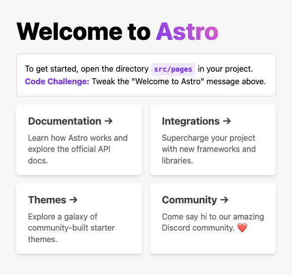
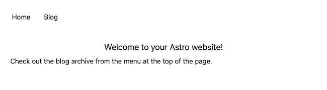
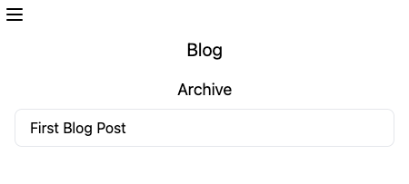

Astro provides a framework for content-centered website development. Astro's framework is flexible, allowing you use your preferred UI framework and your preferred content format, whether that is HTML, Markdown, or a CMS.

Learn more about Astro in this tutorial, covering Astro's key features and providing a walkthrough for creating your own Astro website.

## Before You Begin

1. If you have not already done so, create a Linode account and Compute Instance. See our [Getting Started with Linode](/docs/products/platform/get-started/) and [Creating a Compute Instance](/docs/products/compute/compute-instances/guides/create/) guides.

1. Follow our [Setting Up and Securing a Compute Instance](/docs/products/compute/compute-instances/guides/set-up-and-secure/) guide to update your system. You may also wish to set the timezone, configure your hostname, create a limited user account, and harden SSH access.


The steps in this guide are written for non-root users. Commands that require elevated privileges are prefixed with `sudo`. If you’re not familiar with the `sudo` command, see the [Linux Users and Groups](/docs/guides/linux-users-and-groups/) guide.


## What Is Astro?

[Astro](https://astro.build/) is a performant website framework that favors content and provides a UI-agnostic approach.

Some of the key features of Astro are:

- Supports numerous content formats, including HTML, Markdown, and content management systems (CMS)

- Un-opinionated when it comes to UI frameworks, meaning you can utilize virtually any UI framework such as React, Tailwind, or Vue.

- Deploys across numerous services and is edge-ready, with support for Static Site Generation (SSG) and live server-side rendering (SSR)

- Prioritizes server-side processing with no runtime JavaScript by default, which reduces client-side overhead

In short, Astro concerns itself less with developing web applications. Instead, Astro's focus is in creating content-rich websites.

## How to Build a Website with Astro

The best way to learn about Astro is to start using it. This tutorial walks you through the proces of setting up a default Astro project and through creating your own Astro website.

### Install the Prerequisites

Astro only has one prerequisite: the Node Package Manager (NPM). You can install NPM by following our [Install and Use the Node Package Manager (NPM) on Linux](/docs/guides/install-and-use-npm-on-linux/#how-to-install-npm) guide.

After you install the NPM, you are ready to create a new Astro project.

### Create an Astro Project

To create an Astro project, move into the directory where you would like your project to reside. Then run the following command:

```command
npm create astro@latest
```

```output
╭─────╮  Houston:
│ ◠ ◡ ◠  Keeping the internet weird since 2021.
╰─────╯

 astro   v1.9.1 Launch sequence initiated.
```

Follow the prompts to complete the project creation. This guide uses the following responses for its example.

- Create the project at `example-app`, which creates a new directory by that name for the Astro project

- Set up the project with `a few best practices`, the recommended approach

- Install the NPM dependencies

- Do not initialize a Git repository at this time

- Set up TypeScript as `Strict`, as recommended

Once the process is complete you should have a new directory named according to your input. For this tutorial, the example project is named `example-app`. Change into the project directory:

```command
cd example-app
```

The rest of the tutorial uses this directory, so be sure you are in this directory before executing any further commands.

### Run the Astro Server

Astro projects comes with a development server and a default welcome page. The following command starts Astro's development server.

```command
npm run dev
```

Astro serves the website on `localhost:3000` by default. You can access the server by navigating to that address in your web browser. To access this remotely, you can also use an SSH tunnel.

- On **Windows**, you can use the PuTTY tool to set up your SSH tunnel. Follow the PuTTY section of our guide on how to [Create an SSH Tunnel for MySQL Remote Access](/docs/guides/create-an-ssh-tunnel-for-mysql-remote-access/#how-to-access-mysql-remotely-by-creating-an-ssh-tunnel-with-putty). Use `3000` as the **Source port** and `127.0.0.1:3000` as the **Destination**.

- On **macOS** or **Linux**, use the following command to set up the SSH tunnel. Replace `example-user` in the command below with your username on the remote server and `192.0.2.0` with the remote server's IP address.

    ```output
    ssh -L3000:localhost:3000 example-user@192.0.2.0
    ```



You can stop the server at any time by using the <kbd>Ctrl</kbd> + <kbd>C</kbd> key combination.


Astro's development server is not intended for production use. To deploy your Astro website, see the [How to Deploy an Astro Website](#how-to-deploy-an-astro-website) section below.


### Understanding Astro

Before putting together your own Astro website, you should familiarize yourself with how Astro works. This section of the tutorial focuses on understanding Astro's routing and components.

You can learn more about Astro's project structure from the [official documentation](https://docs.astro.build/en/core-concepts/project-structure/). This tutorial focuses on the features most useful for putting out your own website.

#### Astro Pages, Layouts, and Components

An Astro website has three major building blocks.

- **Pages** contain your website's main content. For blogs, these would include texts, images, and other materials that constitute your blog posts. For a photography gallery, they may focus on photographs and any accompanying descriptive text. Additionally, pages cover your website's homepage and any additional landing pages, such as archives and about-me pages.

- **Components** handle reusable parts of your website. Components can contain things like menus, headers, and footers. A component is available across your website and is centralized, making it more consistent and easier to manage.

- **Layouts** control how pages are rendered. Layouts are actually a kind of component, but you can think of them as the scaffolding that arranges the display of content. For instance, you may have a layout for blog posts. That layout can then be applied automatically to each blog page, meaning that pages only have to focus on the content, not the formatting.

Each of these building blocks is covered in more detail further below.

#### File-based Routing

Astro uses a file-based approach to routing instead of the configuration-based approach of many other frameworks. The advantage of this approach is based on moving away from from configuration, allowing more focus on the delivery of the content itself.

Routes are defined by directories and content files stored in the `src/pages` directory within your project. There are three rules to Astro's routing:

- A directory creates a new path. A `src/pages/new-path/` directory creates a path of `/new-path`, and any files stored in that directory extend on that path.

- A file named `index.*` renders as the default page for its given paths. In the default project, a file at `src/pages/index.astro` creates the welcome page at `/`. Similarly, you can create a page for `/new-path` by creating a file at `src/pages/new-path/index.astro`.

- A file named otherwise renders a page for a new path on the file's given path. A file of `src/pages/new-path/1.astro` creates a page at `/new-path/1`

To illustrate, here are a few examples of how you can use Astro's routing.

- `src/pages/second-page.astro` creates a page at the `/second-page` path

- `src/blog/` creates a `/blog` path. You can add posts using slug names, like `first-post-slug.astro` and `another-post.astro`, to extend that path.

- `src/info/index.astro` creates a new page at the `/info` path

### Implementing a Website

With the Astro template set up and an understanding of how Astro structures its projects, you are ready to start making your own Astro website. This rest of this tutorial walks you through the process of creating a full working blog from the default template.

Additionally, the example makes use of the fact that Astro is UI-agnostic. The code leverages the [Tailwind CSS](https://tailwindcss.com/) framework, but other UI options are possible.

#### Add a UI Framework

Astro includes a tool for installing many popular UI frameworks. You can learn more from the [official documentation](https://docs.astro.build/en/core-concepts/framework-components/), which includes a link to a list of supported frameworks.

To follow along with this guide, install Tailwind. Run the following command from within your project directory:

```command
npx astro add tailwind
```

Answer `Yes` to each prompt, and at the end you should see `tailwind.config.cjs` in your project's base directory. This file controls the Tailwind configuration for your project. The example here uses the default configuration, but you can learn about the configuration possibilities in Tailwind's [official documentation](https://tailwindcss.com/docs/configuration).

#### Create Layouts

Astro uses layout components to determine how content should be rendered. With a layout implemented, your content files do not have to include formatting details.

Typically, layouts are stored in the `src/layouts/` directory, and the default Astro template is in that directory.. However, this example creates two new layouts that make use of the Tailwind CSS framework.

1. Remove the default layout, `src/layouts/Home.astro`.

    ```command
    rm src/layouts/Home.astro
    ```

1. Create a new `BaseLayout.astro` file in the `layouts/` directory, and give the file the contents shown here.

    ```file {title="src/layouts/BaseLayout.astro"}
    ---
    import NavMenu from '../components/NavMenu.astro';

    const { title } = Astro.props;
    ---

    <!DOCTYPE html>
    <html lang="en">
      <head>
        <meta charset="UTF-8" />
        <meta name="viewport" content="width=device-width" />
        <link rel="icon" type="image/svg+xml" href="/favicon.svg" />
        <meta name="generator" content={Astro.generator} />
        <title>{title}</title>
      </head>
      <body>
        <NavMenu/>
        <div class="p-2 md:p-4">
          <p class="text-xl text-center">{title}</p>
          <div class="p-2">
            <slot />
          </div>
        </div>
      </body>
    </html>
    ```

    The layout makes use of the `NavMenu` component you will develop in the next section. The layout also uses a `props` (short for properties) value. This allows pages to pass a variable into the layout — in this case, a title for the page.

1. Create another file in the `layouts/` directory, this one titled `BlogPostLayout.astro`. Give the file the contents shown below.

    ```file {title="src/layouts/BlogPostLayout.astro"}
    ---
    import BaseLayout from './BaseLayout.astro'

    const {frontmatter} = Astro.props;
    ---
    <BaseLayout title={frontmatter.title}>
      <div class="flex justify-center">
        <div class="w-full md:w-2/3 py-2">
          <slot />
        </div>
      </div>
    </BaseLayout>
    ```

    This layout includes the `BaseLayout` as a nested layout. This allows you to build on to existing layouts and further reduce repeated code.

    Like the previous layout, this one accepts variable data. Here, that data is the frontmatter from Markdown files, which we will explore later on.

#### Create Components

Like many web frameworks, Astro utilizes reusable components, saving you from repeated code and keeping your website consistent. Astro websites typically store these components in the `src/components/` directory, and there you can find the `Card` component that is bundled with the default Astro project.

This example uses a component for the navigation menu at the top of the website and a component for the blog list. Should your website expand, having these components can make it easier to adapt in the future.

1. Create a `NavMenu.astro` file in the `components/` directory and give the file the contents shown below.

    ```file {title="src/Components/NavMenu.astro"}
    <nav class="flex flex-wrap items-center justify-between w-full p-1 md:p-3 text-lg">
      <div class="block md:hidden">
        <svg id="navButton" xmlns="http://www.w3.org/2000/svg" class="h-6 w-6 cursor-pointer md:hidden block" viewBox="0 0 24 24" fill="none" stroke="currentColor">
          <path stroke-linecap="round" stroke-linejoin="round" stroke-width="2" d="M4 6h16M4 12h16M4 18h16" />
        </svg>
      </div>
      <div id="navMenu" class="hidden w-full md:flex md:items-center md:w-auto">
        <ul class="text-base md:flex md:justify-between">
          <li>
            <a href="/" class="block py-2 md:p-4">
              Home
            </a>
          </li>
          <li>
            <a href="/blog" class="block py-2 md:p-4">
              Blog
            </a>
          </li>
        </ul>
      </div>
    </nav>

    <script>
      const navButton = document.querySelector('#navButton');
      const navMenu = document.querySelector('#navMenu');

      navButton.addEventListener('click', () => {
          navMenu.classList.toggle('hidden');
      });
    </script>
    ```

    The component leverages Tailwind's responsive design to create a menu that "hides" on smaller screens. A brief JavaScript snippet handles expanding the menu.

1. Create another component, `ContentList.astro`. This file should have the contents shown below:

    ```file {title="src/Components/NavMenu.astro"}
    ---
    const { listTitle,  listContent } = Astro.props;
    ---
    <p class="p-2 text-lg text-center">{listTitle}</p>
    <div class="flex justify-center">
      <ul class="w-full md:w-2/3 rounded-lg border border-gray-200">
        {listContent.map((item) => (
          <li class="px-4 py-2">
            <a href={item.url}>{item.frontmatter.title}</a>
          </li>
        ))}
      </ul>
    </div>
    ```

    This component takes two input values and creates a list of titles and links. This approach makes the component easier to adapt for additional lists of content your website may incorporate later.

#### Create Pages

Astro can render pages from several content formats.

Astro's pages are stored in the `src/pages/` directory and follow the [file-based routing detailed above](#file-based-routing). Astro supports several different formats for pages. The most frequently used formats are:

- `.astro`, which employs Astro's variant of HTML markup; also used for creating Astro components

- `.md`, for Markdown, which focuses almost exclusively on content with each page

- `.html`, which allows you to construct pages with more traditional HTML, though it loses some of the features available to the `.astro` format

The examples that follow employ the two most frequently used of these formats: `.astro` and `.md`. Astro pages handle the homepage and the blog archive, allowing for more control of the presentation. Markdown, meanwhile, handles the blog post content itself.

1. Create an `index.astro` file in the base `pages/` directory. This provides the homepage, corresponding to the `/` path. Give that file these contents:

    ```file {title="src/pages/index.astro"}
    ---
    import BaseLayout from '../layouts/BaseLayout.astro';
    ---

    <BaseLayout title="Welcome to your Astro website!">
      <p>Check out the blog archive from the menu at the top of the page.</p>
    </BaseLayout>
    ```

1. Create another `index.astro` file in the `pages/blog/` directory. Doing so creates a landing page for the `/blog` path of your website. Give the file the contents shown below.

    ```file {title="src/pages/blog/index.astro"}
    ---
    import BaseLayout from '../../layouts/BaseLayout.astro';
    import ContentList from '../../components/ContentList.astro';

    const blogPosts = await Astro.glob('./*.md');
    ---
    <BaseLayout title="Blog">
        <ContentList listTitle="Archive" listContent={blogPosts} />
    </BaseLayout>
    ```

    The `Astro.glob` function fetches all of the Markdown files in the `blog/` directory. Passing this to the `ContentList` component allows that component to list the names and URLs for each of your blog posts.

1. Create a few blog posts within the `blog/` directory. These posts need to be `.md` files and need to be named something other than `index.md`. This tutorial provides one example, a file named `0001.md`, but you can add more to see how the site handles a populated blog.

    ```file {title="src/pages/blog/0001.md"}
    ---
    layout: '../../layouts/BlogPostLayout.astro'
    title: 'First Blog Post'
    ---

    This is content for the first blog post.
    ```

#### Run Your Astro Website

You can use the same steps as in the [Running the Astro Server](#run-the-astro-server) section above to run your website locally.

Navigating to `localhost:3000`, you should see the homepage of your website.

[](example-site-home.png)

Try the links from the top menu, and then the link from within the blog archive, to see the various pages.



You can see that manipulating your browser's width changes how the top menu displays. This is a result of the responsive design within the Tailwind CSS.


## How to Deploy an Astro Website

Up to this point, Astro has been running on a development server that is not suited for production websites. When your website is production ready, you need to consider how you want to deploy it.

For most options, you first need to build your website, rendering it into static content. You can do this using Astro's build command via NPM, as shown below.

```command
npm run build
```

This creates a `dist/` directory within your project that contains the static files for your website. These are the files that you want to deploy via static website hosting.

With Linode, you have two immediate options for deploying your newly-built website.

- Using a [Linode Compute Instance](/docs/products/compute/compute-instances/plans/shared-cpu/). This method uses an HTTP server like NGINX or Apache to serve the static files. You can learn more through our [Set up a Web Server and Host a Website on Linode](/docs/guides/set-up-web-server-host-website/) guide. In this case, you would move your site's files from `dist/` to `/var/www/example.com`, replacing `example.com` with your actual domain name.

- Using a [Linode Object Storage](/docs/products/storage/object-storage/) bucket. This method stores your website's built files within an object storage instance, where they can be accessed as a static website. Hosting your website in this way has the advantage of not having to set up and maintain the infrastructure for an HTTP server. You can see an example of this deployment through our tutorial [Deploy a Static Site using Hugo and Object Storage](/docs/guides/host-static-site-object-storage/). The `public/` directory in that tutorial would be equivalent to the `dist/` directory with Astro.

You can learn more about Astro deployments, including other deployment options, through Astro's [official documentation](https://docs.astro.build/en/guides/deploy/).

## Conclusion

We've outlined the process for creating a simple website with Astro. Astro is adaptable, and you can vary this process in numerous ways. From using a different UI framework like React to using a CMS for content, and more. And you can consider additional server software options, like [Caddy](/docs/guides/how-to-install-and-configure-caddy-on-debian-10/).

The Astro documentation, linked below, can give you additional ideas of what Astro is capable of.
