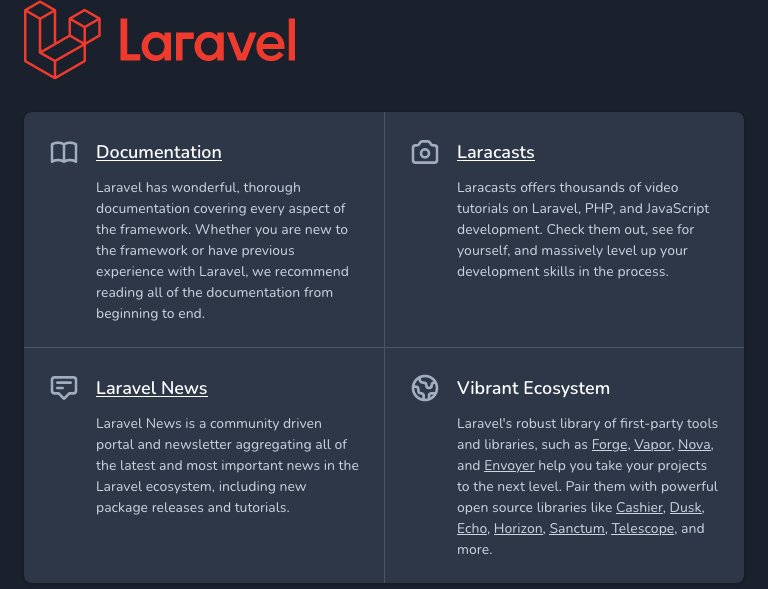
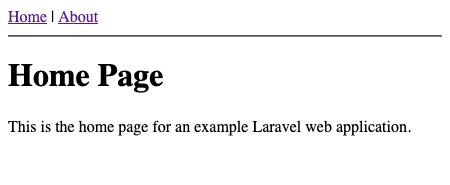

[Laravel](https://laravel.com/) is a PHP web application framework boasting an elegant and expressive syntax. With Laravel, you can easily spin up a new website while also having the features and scalability to handle advanced and large-scale applications.

This guide walks you through the setup process for Laravel, then shows you how to create and deploy your own Laravel website. Distribution-specific installation steps are given for Debian, Ubuntu, and CentOS.

## Before You Begin

1.  If you have not already done so, create a Linode account and Compute Instance. See our [Getting Started with Linode](/docs/products/platform/get-started/) and [Creating a Compute Instance](/docs/products/compute/compute-instances/guides/create/) guides.

1.  Follow our [Setting Up and Securing a Compute Instance](/docs/products/compute/compute-instances/guides/set-up-and-secure/) guide to update your system. You may also wish to set the timezone, configure your hostname, create a limited user account, and harden SSH access.


This guide is written for non-root user. Commands that require elevated privileges are prefixed with `sudo`. If you’re not familiar with the `sudo` command, see the [Users and Groups](/docs/guides/linux-users-and-groups/) guide.


## What is Laravel?

[Laravel](https://laravel.com/) is a web application framework for PHP. It aims to provide an elegant and expressive syntax and a system that grows with you. Laravel makes getting started easy while still being feature-rich for those with PHP and web development experience.

## Getting Started with Laravel

### Install the Prerequisites

1. Install PHP and Laravel's recommended PHP extensions.

    - On Debian and Ubuntu, you can use:

            sudo apt install php7.4 php7.4-bcmath php7.4-common php7.4-curl php7.4-json php7.4-mbstring php7.4-mysql php7.4-xml php7.4-zip openssl

    - On CentOS, you need to take the additional step of adding the [Remi repository](https://rpms.remirepo.net/), since the package manager's default repositories only include PHP version 7.2.

        - First, add the Remi repository:

              sudo dnf install https://dl.fedoraproject.org/pub/epel/epel-release-latest-8.noarch.rpm
              sudo dnf install https://rpms.remirepo.net/enterprise/remi-release-8.rpm

        - Then, enable PHP 7.4 from the Remi repository and update the package manager.

              sudo dnf module enable php:remi-7.4
              sudo dnf update

        - Finally, install the required PHP packages.

              sudo dnf install php php-bcmath php-common php-json php-mbstring php-mysql php-xml php-zip curl openssl

1. Change into the directory where you intend to keep your Laravel project's directory. In this example, you use the current user's home directory.

        cd ~

1. Download [Composer](https://getcomposer.org/), ensure that Composer can be used globally, and make it executable.

        curl -sS https://getcomposer.org/installer | php
        sudo mv composer.phar /usr/local/bin/composer
        sudo chmod +x /usr/local/bin/composer

1. Run the Composer installer. The following commands download the installer, verify its SHA-384 key, and run the installation script if the key is valid.

        php -r "copy('https://getcomposer.org/installer', 'composer-setup.php');"
        php -r "if (hash_file('sha384', 'composer-setup.php') === '756890a4488ce9024fc62c56153228907f1545c228516cbf63f885e036d37e9a59d27d63f46af1d4d07ee0f76181c7d3') { echo 'Installer verified'; } else { echo 'Installer corrupt'; unlink('composer-setup.php'); } echo PHP_EOL;"
        php composer-setup.php
        php -r "unlink('composer-setup.php');"

### Create a Laravel Project

1. Create your Laravel application.

        php composer.phar create-project laravel/laravel example-app

1. Change into the directory created for the application.

        cd example-app

    
Unless noted otherwise, all subsequent commands in this guide assume you are still in `example-app` project directory.


1. Run the PHP development server, Artisan, to verify that the Laravel setup is complete.

        php artisan serve

    Artisan serves the application on `localhost:8000`. To visit the application remotely, you can use an SSH tunnel:

    - On Windows, you can use the PuTTY tool to set up your SSH tunnel. Follow the appropriate section of the [Using SSH on Windows](/docs/guides/connect-to-server-over-ssh-on-windows/#ssh-tunnelingport-forwarding) guide, replacing the example port number there with **8000**.
    - On OS X or Linux, use the example command to set up the SSH tunnel. Replace `example-user` with your username on the application server and `192.0.2.0` with the server's IP address.

            ssh -L8000:localhost:8000 example-user@192.0.2.0

1. Now, you can visit the application in your browser by navigating to `localhost:8000`.

    

## Build a Website with Laravel

This section shows you how to start working with Laravel's *controllers* and *views* to make your own website.

1. Follow the steps in the [Create a Laravel Project](#create-a-laravel-project) section above to get started with a base project.

1. This example builds a website with a **Home** page and an **About** page. Create the routes for each by opening the routes file — `~/example-app/routes/web.php` — and add the following contents:

    
<?php

use Illuminate\Support\Facades\Route;

use App\Http\Controllers\HomeController;
use App\Http\Controllers\AboutController;

Route::redirect('/', '/home');

Route::get('/home', [HomeController::class, 'index']);

Route::get('/about', [AboutController::class, 'index']);
    

    First, this imports the controllers—`HomeController` and `AboutController` that get created in the next two steps. Then, it routes requests to the `/home` and `/about` URLs to their respective controllers. It also includes a route to redirect traffic from the base URL (`/`) to the `/home` URL.

1. Create the Home controller by creating an `~/example-app/app/Http/Controllers/HomeController.php` file and giving it the contents shown below:

    
<?php

namespace App\Http\Controllers;

use App\Http\Controllers\Controller;

class HomeController extends Controller
{
    public function index()
    {
        return view('home', ['title' => 'Home Page']);
    }
}
    

    This controller simply renders the Home page view and feeds a `title` parameter into it.

1. Do the same for the About controller. In this case, the new file is `~/example-app/app/Http/Controllers/AboutController.php`. This controller serves the same function as the Home controller, however, it renders the about page view instead.

    
<?php

namespace App\Http\Controllers;

use App\Http\Controllers\Controller;

class AboutController extends Controller
{
    public function index()
    {
        return view('about', ['title' => 'About Page']);
    }
}
    

1. This example's views share a navigation menu, so the website can use a layout template to reduce duplicate code. Create the layout template as `~/example-app/resources/views/layouts/master.blade.php`, and give it the contents shown in the example below.

    
Before creating your layout template, you need to create the `layouts` subdirectory.

    mkdir ~/example-app/resources/views/layouts


    
<html>
    <head>
        @if ($title)
                <title>{{ $title }}</title>
        @else
                <title>Example Laravel App</title>
        @endif
    </head>
    <body>
        
<a href="/home">Home</a> | <a href="/about">About</a>
        

        

            @yield('content')
        

    </body>
</html>
    

1. Now, to create the views themselves. Create a `~/example-app/resources/views/home.blade.php` file and a `~/example-app/resources/views/about.blade.php` file. Add the contents of the example files below:

    
@extends('layouts.master')

@section('content')
        <h1>{{ $title }}</h1>
        
This is the home page for an example Laravel web application.

@endsection
    

    
@extends('layouts.master')

@section('content')
        <h1>{{ $title }}</h1>
        
This is the about page for an example Laravel web application.

@endsection
    

    Each of these view templates first declares that it extends the `master` layout template. This lets each work within the layout, reducing the amount of code you have to rewrite and making sure the pages are consistent. Each view defines its main contents as being part of the `content` section, which was defined in the `master` layout.

1. Run the application using the steps given at the end of the [Create a Laravel Project](#create-a-laravel-project) section above.

    You can now visit the website on `localhost:8000`.

    

## Deploy a Laravel Web Application

While the Artisan server works well for development, it is recommended that you use a more robust server for production deployment. In this section, you can see how to do just that, deploying your Laravel web application using NGINX.

These steps assume your application has the same location and name as given in the previous sections.

1. Install NGINX.

    - On Debian and Ubuntu, use:

            sudo apt install nginx

    - On CentOS, use:

            sudo yum install nginx

1. Copy your Laravel project directory to `/var/www`.

        sudo cp -R ~/example-app /var/www

1. Give the `www-data` user ownership of the project's `storage` subdirectory.

        sudo chown -R www-data.www-data /var/www/example-app/storage

1. Create an NGINX configuration file for the website, and add the contents shown below. Replace `example.com` with your server's domain name.

    
server {
    listen 80;
    server_name example.com;
    root /var/www/example-app/public;

    add_header X-Frame-Options "SAMEORIGIN";
    add_header X-Content-Type-Options "nosniff";

    index index.php;

    charset utf-8;

    location / {
        try_files $uri $uri/ /index.php?$query_string;
    }

    location = /favicon.ico { access_log off; log_not_found off; }
    location = /robots.txt  { access_log off; log_not_found off; }

    error_page 404 /index.php;

    location ~ \.php$ {
        fastcgi_pass unix:/var/run/php/php7.4-fpm.sock;
        fastcgi_param SCRIPT_FILENAME $realpath_root$fastcgi_script_name;
        include fastcgi_params;
    }

    location ~ /\.(?!well-known).* {
        deny all;
    }
}
    

1. Create a symbolic link of the configuration file in the NGINX `sites-enabled` directory. You can also remove the `default` site configuration from this directory.

        sudo ln -s /etc/nginx/sites-available/example-app /etc/nginx/sites-enabled/
        sudo rm /etc/nginx/sites-enabled/default

1. Verify the NGINX configuration.

        sudo nginx -t

1. Enable and start the NGINX service.

        sudo systemctl enable nginx
        sudo systemctl start nginx

1. Similarly, enable and start the PHP-FPM service, which NGINX uses to run your application.

    - On Debian and Ubuntu, use:

            sudo systemctl enable php7.4-fpm
            sudo systemctl start php7.4-fpm

    - On CentOS, use:

            sudo systemctl enable php-fpm
            sudo systemctl start php-fpm

1. Your application should now be running — visit it by navigating to your server's domain name in your browser. Make sure you prefix your domain name with `http` rather than `https`, as the server has not been set up with an [SSL certificate](/docs/guides/security/ssl/).

## Conclusion

You now have your own Laravel website up and running! To build on what you created by following this guide, be sure to take a look through [Laravel's documentation](https://laravel.com/docs/8.x). There, you can find plenty of information to dive deeper into the components of a Laravel application.
