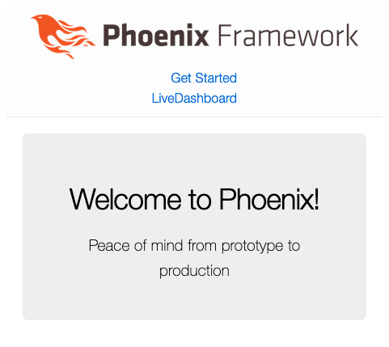
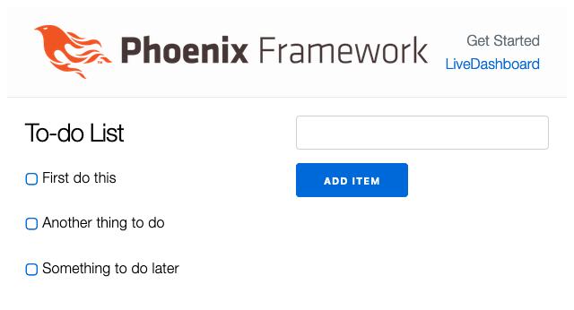
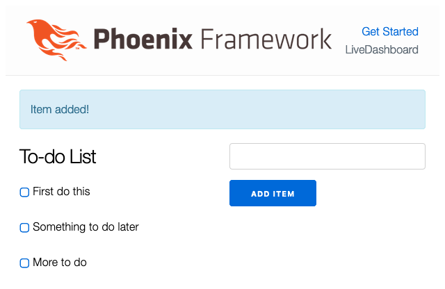

Phoenix offers a web development framework similar to Ruby on Rails, Django, and others. However, the Phoenix framework is more performant because it is built on Elixir. The result is a smooth developer experience coupled with high performance.

In this tutorial, learn more about the Phoenix framework and what sets it apart. Then, start developing your own application with Phoenix, beginning with the base template and extending it into your own application.

## Before You Begin

1. If you have not already done so, create a Linode account and Compute Instance. See our [Getting Started with Linode](/docs/guides/getting-started/) and [Creating a Compute Instance](/docs/guides/creating-a-compute-instance/) guides.

1. Follow our [Setting Up and Securing a Compute Instance](/docs/guides/set-up-and-secure/) guide to update your system. You may also wish to set the timezone, configure your hostname, create a limited user account, and harden SSH access.


The steps in this guide are written for non-root users. Commands that require elevated privileges are prefixed with `sudo`. If you’re not familiar with the `sudo` command, see the [Linux Users and Groups](/docs/guides/linux-users-and-groups/) guide.


## What Is the Phoenix Framework?

[Phoenix](https://www.phoenixframework.org/) is a web application development framework, similar in its approach to frameworks like [Ruby on Rails](/docs/guides/ruby-on-rails-apache-debian/) and [Django](https://www.djangoproject.com/).

Like these other frameworks, the Phoenix framework is a server-side solution. And like many modern web development frameworks, Phoenix uses a model-view-controller (MVC) architectural pattern for application development.

These modern frameworks aim to increase developer efficiency, streamlining the process of constructing dynamic web applications. With the MVC pattern and a host of other tools, such frameworks make it easier for developers to structure their applications.

Phoenix does the same but adds to that a promise of high performance in its applications. Frameworks like Ruby on Rails and Django may see performance sacrifices alongside their developer-experience gains. Phoenix, by contrast, keeps both strong developer experience, and high application performance.

### What Is Elixir and What Are Its Advantages?

A major feature behind the high performance of Phoenix applications is the use of the [Elixir](https://elixir-lang.org/) language. Elixir is a programming language built on the Erlang virtual machine (VM), which has been designed for low-latency, fault-tolerant, distributed systems.

In fact, Elixir itself was designed by a former Ruby on Rails developer. Looking to improve the performance of Ruby, José Valim turned to Erlang and built the Elixir language on its efficiency.

For this reason, Elixir shares many syntactic similarities with Ruby. Between this and the similarities between the Phoenix framework and Ruby on Rails, Phoenix stands out as an excellent alternative for Ruby/Rails developers. Phoenix offers improved performance, while the development pattern and the Elixir language offer something familiar and easier to jump into.

## How to Install Phoenix

To get started with Phoenix, you need to install the framework's application generator and its prerequisites. Below you can see how to set up everything you need, from Elixir and the Erlang VM to the Hex package manager used for installing Phoenix.

### Installing Erlang and Elixir

The Phoenix framework uses the Elixir programming language. To run Phoenix, you need to have Elixir installed on your system. And, moreover, you need the Erlang VM that Elixir runs on.

Elixir maintains packages within the default repositories for most major Linux distributions. Typically ou can install Elixir with a single command.

Below are commands to install Elixir for a range of distributions. You can find more covered in Elixir's [official installation guide](https://elixir-lang.org/install.html#gnulinux).

- On **Debian** and **Ubuntu** distributions, install Elixir from the APT package manager.

    ```command
    sudo apt install elixir
    ```

- On **Fedora** distributions, install Elixir from the DNF package manager.

    ```command
    sudo dnf install elixir erlang
    ```


Elixir support is not directly supported on CentOS. You can find tutorials, such as [Unixmen's tutorial](https://www.unixmen.com/install-erlang-elixir-centos-7/) that walk you through the process. However, their installation path involves numerous prerequisites and building Elixir from source.

Alternatively, you could install Elixir using Docker, as per the [official installation](https://elixir-lang.org/install.html#docker) guide.


These commands also automatically install the Erlang VM alongside Elixir. You can verify that both Erlang and Elixir have been successfully installed with the command here.

```command
elixir -v
```

```output
Erlang/OTP 24 [erts-12.3.2.6] [source] [64-bit] [smp:1:1] [ds:1:1:10] [async-threads:1] [jit]

Elixir 1.14.1 (compiled with Erlang/OTP 24)
```

One additional step remains. Phoenix also requires the Elixir package manager Hex for installing and managing project dependencies. You can install Hex with the following command.

```command
mix local.hex
```

```output
Are you sure you want to install "https://repo.hex.pm/installs/1.14.0/hex-2.0.0.ez"? [Yn] y
* creating .mix/archives/hex-2.0.0
```

### Installing the Phoenix Application Generator

With Elixir and the Hex package manager installed, you can now install the Phoenix application generator. This generator allows you to bootstrap Phoenix projects, and it is the tool to use whenever you need to create a new Phoenix application.

Install the Phoenix application generator using the Hex package manager. You can do so with the command below.

```command
mix archive.install hex phx_new
```

```output
Resolving Hex dependencies...
Resolution completed in 0.041s
New:
  phx_new 1.6.15
* Getting phx_new (Hex package)
All dependencies are up to date
Compiling 11 files (.ex)
Generated phx_new app
Generated archive "phx_new-1.6.15.ez" with MIX_ENV=prod
Are you sure you want to install "phx_new-1.6.15.ez"? [Yn] y
* creating /home/example-user/.mix/archives/phx_new-1.6.15
```

Everything is now in place to set up and run a basic Phoenix application. You can see how to use the application generator to get started further below.

### Installing a Database (Optional)

Web applications typically utilize a database server for persisting application information, like user profiles and page data. For that reason, this guide's examples employ a database server to best demonstrate Phoenix in action.

The official Phoenix documentation recommends [PostgreSQL](https://www.postgresql.org/) for your database server, and this guide follows that recommendation.

To learn more about PostgreSQL, you can refer to our [Introduction to PostgreSQL](/docs/guides/an-introduction-to-postgresql/) guide. You can also refer to our [8 Most Popular Databases](/docs/guides/list-of-databases/) guide to compare database solutions.

You can learn more about the databases supported by Phoenix through the [official documentation](https://hexdocs.pm/phoenix/ecto.html) on Phoenix and the module it uses by default for database connections, Ecto.

To install PostgreSQL on your system, you can follow one of our guides. See, for instance, [How to Install and Use PostgreSQL on Ubuntu 20.04](/docs/guides/how-to-install-use-postgresql-ubuntu-20-04/) or [How to Install and Use PostgreSQL on CentOS 8](/docs/guides/centos-install-and-use-postgresql/).

Additional distributions are covered in PostgreSQL's [official installation guide](https://www.postgresql.org/download/).

#### Configuring PostgreSQL for Phoenix

You need to take a few additional configuration steps in order for PostgreSQL work appropriately with your Phoenix application. Once you have PostgreSQL installed, follow the steps below to make the necessary configurations and create a dedicated user for your Phoenix project.

1. Add a new user to Postgres. This example and the following use the user the name `elixirdbuser` and the password `elixirdbpass`.

    ```command
    sudo -u postgres psql -c "create user elixirdbuser with superuser password 'elixirdbpass';"
    ```

1. Find where your Postgres instance's HBA file is stored using the command below. This file controls how different hosts can access your Postgres instance.

    The location can vary widely depending on distribution, which is why the command is necessary. For simplicity, this guide uses the location `/var/lib.pgsql/data/pg_hba.conf` throughout.

    ```command
    sudo -u postgres psql -c "show hba_file;"
    ```

    ```output
                hba_file
    ---------------------------------
     /var/lib/pgsql/data/pg_hba.conf
    (1 row)
    ```

1. Open the HBA file with your preferred text editor, and add the following `host` line above all other `host` lines. Typically, these lines start below an `IPv4` heading, as shown below.

    ```file {title="/var/lib/pgsql/data/pg_hba.conf"}
    # [...]
    # IPv4 local connections:
    host    all             elixirdbuser    localhost               md5
    # [...]
    ```

1. Restart the PostgreSQL service to have the configuration changes take effect.

    ```command
    sudo systemctl restart postgresql
    ```

## How to Develop a Phoenix Application

With the Phoenix application generator and Phoenix's prerequisites installed, you are ready to start building Phoenix applications of your own. This section of the guide shows you how.

The process is broken into two parts. The first shows you how to create a new Phoenix project using the base template. At that point, you can start running Phoenix and view the welcome page in your browser.

The second part of this guide shows you how to build on that template to start creating your own application. Here you can see a breakdown of the base structure of Phoenix applications and ways you can build your own features within that structure.

### Setting Up the Template

When creating a new Phoenix application, usually you start with a basic template from which you can expand. Phoenix's application generator gives you a straightforward command to create a new project. Each new project includes a simple welcome page and the structure for a robust Phoenix application.

Follow these steps to set up a Phoenix project template, run the base application on a development server, and access it from your web browser.

1. Use the Phoenix application generator to create the new project. This example command names the project `exampleapp`, and the rest of this guide uses that name as well.

    ```command
    mix phx.new exampleapp
    ```

1. Change into the new project directory created by the above step. The rest of this tutorial assumes you are in that directory for any further commands.

    ```command
    cd exampleapp
    ```

1. (Optional) Configure the database using the `config/dev.exs` file. The specific settings depend on the kind of database you are using, its configuration, and its users.

    This tutorial assumes you followed the previous section on installing and configuring a PostgreSQL server for your Phoenix application. For this, you just need to change the `username` and `password` values in the configuration file, as seen in this excerpt from the default file.

    ```file {title="config/dev.exs" lang="elixir"}
    [...]
    config :exampleapp, Exampleapp.Repo,
      username: "elixirdbuser",
      password: "elixirdbpass",
      hostname: "localhost",
      database: "exampleapp_dev",
    [...]
    ```

    This and the next step are optional if you want an application that does not use a database server. However, the custom application example in the next section uses this database server configuration.

1. (Optional) Run the command below to set up the database for your application. Phoenix uses the settings in the configuration file and automatically runs initial setup tasks on the database server.

    ```command
    mix ecto.create
    ```

    ```output
    [...]

    The database for Exampleapp.Repo has been created
    ```

1. Start up the Phoenix server. With this, Phoenix builds and starts serving the basic welcome application on a development server.

    ```command
    mix phx.server
    ```

    By default, Phoenix serves the application on `localhost:4000`. To access this remotely, you can use an SSH tunnel.

    - On **Windows**, you can use the PuTTY tool to set up your SSH tunnel. Follow the PuTTY section of our guide on how to [Create an SSH Tunnel for MySQL Remote Access](/docs/guides/create-an-ssh-tunnel-for-mysql-remote-access/#how-to-access-mysql-remotely-by-creating-an-ssh-tunnel-with-putty). Use`4000` as the **Source port** and `127.0.0.1:4000` as the **Destination**.

    - On **macOS** or **Linux**, use the following command to set up the SSH tunnel. Replace `example-user` with your username on the remote server and `192.0.2.0` with the remote server's IP address:

    ```output
    ssh -L4000:localhost:4000 example-user@192.0.2.0
    ```

1. Navigate to `localhost:4000` in a web browser to see the Phoenix welcome page.

    

1. Stop the application at any time using the <kbd>Ctrl</kbd> + <kbd>C</kbd> key combination.

### Creating an Application

Now that you have a project set up with the base template, you can start adding to it to make your own Phoenix application.

This tutorial develops a simple "to-do" list example application. Follow along to learn all of the parts of a Phoenix project and how you can work with those parts to make your application.

#### Application Structure

Your Phoenix project directory has a collection of files and subdirectories that define the project structure. You can learn more about the project structure overall in Phoenix's [official documentation](https://hexdocs.pm/phoenix/directory_structure.html).

This guide focuses mostly on the `lib` subdirectory. Within this directory are the parts that make up your application structure itself. Most of your development occurs here.

What follows is a breakdown of the `lib` directory for the default Phoenix project. This uses the `exampleapp` name from further above, so replace that in these examples with the actual name of your project.

- `exampleapp/` contains your application's models and their logic

    - `application.ex` defines the application; generally you do not need to change this until you have more advanced applications

    - `mailer.ex` defines a module for sending emails

    - `repo.ex` defines an interface for the application's database, connecting to PostgreSQL if you followed that setup above

- `exampleapp_web/`contains your application's modules related to the presentation, including its controllers and views

    - `controllers/` houses the controllers for the application

    - `templates/` holds the page templates for the application

    - `views/` has the views for the application

    - `endpoint.ex` defines the HTTP endpoint for your application, establishing that the server runs on port `4000` and enabling the LivePreview feature

    - `gettext.ex` provides internalization for your application

    - `router.ex` receives HTTP requests and routes them to the appropriate controllers

    - `telemetry.ex` collects metrics and monitoring data on application usage; used in the LiveDashboard for analyzing application behavior and performance

Think about these files as they relate to the MVC pattern.

- The router passes incoming requests to a matching controller

- The controller renders a particular view via a particular template

- The controller also calls for contexts (Phoenix's grouping for models) as needed

#### Developing the Application

With an understanding of how a Phoenix application is structured, you can start implementing your own models, views, and controllers. This section shows you how to start making changes within the application structure.

By the end of this section, you should have a to-do list application running with Phoenix alongside the default welcome-page application.

1. Add the following two lines to the `scope` section of the `router.ex` file.

    ```file {title="lib/exampleapp_web/router.ex" lang="elixir"}
    get "/todolist", TodoController, :home
    resources "/todos", TodoController, only: [:index, :show, :create, :delete]
    ```

    The first line creates a path, `/todolist`, for the landing page of the to-do list application. The second line creates a set of `resources` at the `/todos` path.

    The `resources` option here is convenient, as it creates a set of standard RESTful endpoints at a given path. Here, the options after `only:` dictate that the path only includes the options for fetching all, fetching one, creating, and deleting the given resource type.

1. Create a controller to handle all of the to-do list application's interactions. You can do so by creating a `lib/exampleapp_web/controllers/todo_controller.ex` file and giving it the contents shown here. Follow along with the in-code comments for explanations of each part of the code.

    ```file {title="lib/example_web/controllers/todo_controller.ex" lang="elixir"}
    defmodule ExampleappWeb.TodoController do
      use ExampleappWeb, :controller

      # Create an alias to easily refer to the Todo model.
      alias Exampleapp.Todo

      # Define a home endpoint, the to-do list landing page. Fetch all to-do
      # items, and render the page with that list of items.
      def home(conn, _params) do
        todo_items = Todo.fetch_all()
        render(conn, "index.html", todo_items: todo_items)
      end

      # Define an endpoint for fetching all of the to-do items. This and the
      # next endpoint are not used in the example application, but give good
      # examples for RESTful endpoints and make the application more adaptable.
      def index(conn, _params) do
        todo_items = Todo.fetch_all()
        json(conn, todo_items)
      end

      # Define an endpoint for fetching a single to-do item, based on its ID.
      def show(conn, %{"id" => todo_id}) do
        todo_item = Todo.fetch_item(todo_id)
        json(conn, todo_item)
      end

      # Define an endpoint for creating a new to-do item and pushing a
      # notification to the view to alert the user of successful submission.
      def create(conn, %{"todo" => todo_params}) do
        Todo.create_item(todo_params)
        conn
        |> put_flash(:info, "Item added!")
        |> redirect(to: "/todolist")
      end

      # Define an endpoint for deleting a to-do item based on its ID and
      # pushing a success notification to the view.
      def delete(conn, %{"id" => todo_id}) do
        Todo.remove_item(todo_id)
        conn
        |> put_flash(:info, "Item removed!")
        |> redirect(to: "/todolist")
      end
    end
    ```

    You can see the controller named in the `router.ex` lines from the previous step. And all of the endpoints defined in the router are covered here in the controller.

1. Create a `priv/migrations/create_items.exs` file, and give it the contents below. Running this migration script prepares the database with a table for the to-do list data.

    ```file {title="priv/migrations/create_items.exs" lang="elixir"}
    defmodule Exampleapp.Repo.Migrations.CreateItems do
      use Ecto.Migration

      def change do
        create table(:items) do
          add :desc, :string

          timestamps()
        end
      end
    end
    ```

1. Run the migration script to add the table with the fields defined in the script. Notice that only a `desc` field is defined in the script. Ecto, the Phoenix database handler, automatically adds the `id` field.

    ```command
    mix ecto.migrate
    ```

1. The `seed.exs` script can be used to create initial data, and you can do that for the to-do list application here. Find the file in the `priv/repo/` subdirectory, and give it contents like those shown below. This example script adds three to-do items to the database to start.

    ```file {title="priv/repo/seeds.exs" lang="elixir"}
    alias Exampleapp.Repo
    alias Exampleapp.Todo.Item

    Repo.insert!(%Item{desc: "First do this"})
    Repo.insert!(%Item{desc: "Another thing to do"})
    Repo.insert!(%Item{desc: "Something to do later"})
    ```

    Now run the script to add the items.

    ```command
    mix run priv/repo/seeds.exs
    ```

1. Start a new context for to-do items. A context is a specific kind of model that groups together related models.

    To make a to-do context, create a `lib/exampleapp/todo.ex` file, and give it the contents below. Follow the in-code comments for explanations of each part of the code.

    ```file {title="lib/exampleapp/todo.ex" lang="elixir"}
    defmodule Exampleapp.Todo do
      import Ecto.Query, warn: false

      # Create aliases for repository access and for the Item model.
      alias Exampleapp.Repo
      alias Exampleapp.Todo.Item

      # Define a function to fetch all to-do items from the database.
      def fetch_all do
        Repo.all(Item)
      end

      # Define a function to fetch a to-do item by its ID.
      def fetch_item(todo_id) do
        Repo.get(Item, todo_id)
      end

      # Define a function to create a new item. This implements a changeset
      # defined within the Item model to create the new item template.
      def create_item(todo_params \\ %{}) do
        %Item{}
        |> Item.changeset(todo_params)
        |> Repo.insert()
      end

      # Define a function to remove an item by its ID. First fetches the
      # matching item and then removes it.
      def remove_item(todo_id) do
        Repo.get(Item, todo_id)
        |> Repo.delete()
      end
    end
    ```

1. Create an `Item` model to go along with the `Todo` context. The model's file, `item.ex`, needs to go into the `lib/exampleapp/todo` directory, associating it with the `Todo` context. Give that file the contents shown here.

    ```file {title="lib/exampleapp/todo/item.ex" lang="elixir"}
    defmodule Exampleapp.Todo.Item do
      use Ecto.Schema
      import Ecto.Changeset

      # Define the schema for the Item model. Using the Jason encoder allows
      # the application to readily work with this schema for JSON content. An
      # id field is automatically included in the schema.
      @derive {Jason.Encoder, only: [:id, :desc]}
      schema "items" do
        field :desc, :string

        timestamps()
      end

      # Create a changeset for the Item model. This can provide casting and
      # validations for models.
      def changeset(item, item_params) do
        item
        |> cast(item_params, [:desc])
        |> validate_required([:desc])
      end
    end
    ```

1. Copy the `lib/exampleapp_web/view/page_view.ex` to `lib/exampleapp_web/views/todo_view.ex`. Within the new file, change `PageView` to `TodoView`. Using a new view for the to-do list makes the application code cleaner, even if the code operates the same for now.

1. Create a new template by adding a `lib/exampleapp_web/templates/todo` directory and creating an `index.html.heex` file within it. Give that new file the contents shown below to render the to-do list page.

    ```file {title="lib/exampleapp_web/templates/todo/index.html.heex"}
    <section class="row">
      <article class="column">
        <h2>To-do List</h2>
        <%= if @todo_items do %>
          <%= for todo_item <- @todo_items do %>
            <p>
              <%= link("\u25A2", to: Routes.todo_path(@conn, :delete, todo_item.id), method: :delete) %>
              <%= todo_item.desc %>
            </p>
          <% end %>
        <% else %>
          <p>Nothing to do!</p>
        <% end %>
      </article>
      <article class="column">
        <%= form_for @conn, Routes.todo_path(@conn, :create), [as: :todo], fn f -> %>
          <%= text_input f, :desc %>
          <%= submit "Add Item" %>
        <% end %>
      </article>
    </section>
    ```

#### Running the Application

Just as with the default application template, you can see the results by running the Phoenix server.

```command
mix phx.server
```

Navigate to `localhost:4000/todolist` in your web browser to see the Phoenix application in action. You should see a to-do list with the default items added using the `seed.exs` script above.



You can make some changes to the list to make sure all of the functions are working. Here, the second item has been removed using the checkbox, and another item has been added using the form on the right.



The banner at the top of the page appears so long as the application is in a development environment. This gives you access to a LiveDashboard for your application, where you can view metrics and gauge your application's performance.

## Conclusion

With that, you have the basics you need to start making web applications with Phoenix. Phoenix gives you a powerful framework for developing web applications, with a smooth developer experience and a high-performance engine.

The link below to the Phoenix documentation can help you take what you learned in this guide and keep building on it. And, if you are unfamiliar with Elixir and want to learn more about how it works, follow the link on the language provided below.
