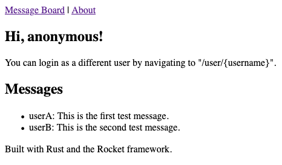

Rust is a functional programming language noted for its high performance and capabilities in systems programming. However, with the Rocket framework, you can also use Rust for building full-functioning — and efficient — web applications.

This guide explains what Rocket is, shows you how to install it, and gets you started using it to create your own website.

## Before You Begin

1. Familiarize yourself with our [Getting Started](/docs/getting-started/) guide, and complete the steps for setting your Linode's hostname and timezone.

1. This guide uses `sudo` wherever possible. Complete the sections of our [Securing Your Server](/docs/security/securing-your-server/) guide to create a standard user account, harden SSH access, and remove unnecessary network services.

1. Update your system:

        sudo apt update && sudo apt upgrade

1. Throughout, this guide uses `example-app` as the name of the Rocket application. Replace it with your preferred application name.


This guide is written for a non-root user. Commands that require elevated privileges are prefixed with `sudo`. If you’re not familiar with the `sudo` command, see the [Users and Groups](/docs/tools-reference/linux-users-and-groups/) guide.


## What is Rocket

Rocket is a framework for building web applications with the Rust programming language. Rust itself is noted for its type-safety and speediness, and Rocket aims to leverage those attributes to make secure and efficient web applications.

Beyond that, Rocket emphasizes an easy and minimalistic path to putting together the web application you need. It uses simple and intuitive APIs, and Rocket does its job without all of the boilerplate code. Moreover, it is an extensible framework designed for flexibility.

## Installing Rust

Rocket makes use of some of Rust's more cutting-edge features. As such, you need to install the nightly build of Rust to make sure Rocket works properly.

1. Install rustup, an installer for Rust. Follow the prompts the installation script presents:

        curl --proto '=https' --tlsv1.2 -sSf https://sh.rustup.rs | sh

    If you do not already have Curl isntalled, use this command to install it first:

        sudo apt install curl

1. Log out and log back in or run the following command to load the necessary executables into your Bash path:

        source $HOME/.cargo/env

1. Set `nightly` as your default Rust version:

        rustup default nightly

    Alternatively, you can set the nightly release as your default for a specific project. Once you create a project, like in the steps below, run this command in the project directory to have it use the nightly build:

        rust override set nightly

## Getting Started with Rocket

In this section, the guide shows you, first, how to download and start exploring Rocket's example applications and, second, how to create your own Rocket application.

### Example Applications

1. Use Git to clone the Rocket repository. For this example, the repository is cloned into the current user's home directory:

        cd ~
        git clone https://github.com/SergioBenitez/Rocket

    If you do not already have Git, you need to install it first, which you can do with the following command:

        sudo apt install git

1. Change into the resulting `Rocket` directory, and checkout the latest version. You can refer to Rocket's [releases page](https://github.com/SergioBenitez/Rocket/releases) to see the latest version:

        cd Rocket
        git checkout v0.4.7

1. Look through the `examples` directory for an example you would like to explore. When you have found one, change into its directory. Here, the `hello_world` example is chosen:

        cd examples/hello_world

1. Run the example:

        cargo run

    Rocket serves the application on **localhost** port **8000**. To visit the application remotely, you can use an SSH tunnel:

    - On Windows, you can use the PuTTY tool to set up your SSH tunnel. Follow the appropriate section of the [Using SSH on Windows](/docs/guides/using-ssh-on-windows/#ssh-tunnelingport-forwarding) guide, replacing the example port number there with **8000**.
    - On OS X or Linux, use the following command to set up the SSH tunnel. Replace `example-user` with your username on the application server and `198.51.100.0` with the server's IP address:

            ssh -L8000:localhost:8000 example-user@198.51.100.0

1. Now you can visit the application in your browser by navigating to `localhost:8000`.

### Creating an Application

1. Change to the location where you would like for the project directory to be created. In this case, this is the current user's home directory:

        cd ~

1. Create a new binary-based Rust project, then change into the new directory created for it:

        cargo new example-app --bin
        cd example-app

    Unless noted otherwise, all subsequent commands in this guide assume you are still in the application directory directory.

1. Open the `Cargo.toml` file, and add Rocket as a dependency for the project. Use the version number for the latest version of Rocket. Refer to the [Example Applications](/docs/guides/getting-stated-rocket/#example-applications) section above for how to identify the latest Rocket release:

    
# [...]

[dependencies]
rocket = "0.4.7"
    

1. Open the `src/main.rs` file, and populate it with the following lines:

    
#![feature(proc_macro_hygiene, decl_macro)]

#[macro_use] extern crate rocket;

#[get("/")]
fn index() -> &'static str {
    "Hello, world!"
}

fn main() {
    rocket::ignite().mount("/", routes![index]).launch();
}
    

1. With this, you have created a basic "Hello, World!" application, which you can test by using the `cargo run` command as shown in the [Example Applications](/docs/guides/getting-stated-rocket/#example-applications) section above.

## Building a Website with Rocket

Rocket can easily be setup to provide web service APIs based on the above example and the official Rocket documentation. (You can find a link to that documentation in this guide's [Conclusion](/docs/guides/how-to-build-website-using-rust-rocket/#conclusion) section.)

But pairing Rocket with a template engine like [Handlebars](https://handlebarsjs.com/) makes it ready to run to a full website. The steps below show you how to do just that and set you up with the foundations for going off and building your own.

1. Follow the steps in the [Creating an Application](/docs/guides/getting-started-rocket/#creating-an-application) section above to create a base Rocket application to work off of.

1. Open the project's `Cargo.toml`, and modify it to have the additional lines in the example below:

    
# [...]

[dependencies]
rocket = "0.4.7"
serde = { version = "1.0", features = ["derive"] }

[dependencies.rocket_contrib]
version = "*"
default-features = false
features = ["handlebars_templates"]
    

    This adds `serde`, which comes with some typing features the application needs, as a dependency. The `rocket_contrib` section allows Handlebars to be identified as a feature that the project uses.

1. Open your `src/main.rs` file, and modify it to look like the following:

    
#![feature(proc_macro_hygiene, decl_macro)]

#[macro_use] extern crate rocket;

use rocket::response::Redirect;
use rocket_contrib::templates::Template;

#[derive(serde::Serialize)]
struct Message {
    user: &'static str,
    body: &'static str
}

#[derive(serde::Serialize)]
struct BoardContext {
    current_user: Option<String>,
    messages: Vec<Message>,
    parent: &'static str
}

#[derive(serde::Serialize)]
struct AboutContext {
    parent: &'static str
}

#[get("/")]
fn index() -> Redirect {
    Redirect::to("/user/anonymous")
}

#[get("/user/<username>")]
fn board(username: String) -> Template {
    Template::render("index", &BoardContext {
        current_user: Some(username),
        messages: vec![Message{user: "userA", body: "This is the first test message."},
                        Message{user: "userB", body: "This is the second test message."}],
        parent: "layout"
    })
}

#[get("/about")]
fn about() -> Template {
    Template::render("about", &AboutContext {
        parent: "layout"
    })
}
    

    This creates a `Message` struct, defining the basic shape for messages. The `BoardContext` and `AboutContext` structs determine "context" information to be handed off to the templates. Each context struct has a `parent` attribute. The application uses these attributes in the `board` and `about` functions to apply the appropriate page layout for each page.

    These two functions are where the application loads the message board and the about pages, respectively. They populare the context information and render the templates with it.

    The application also uses a redirect to navigate users from the base URL (`/`) to the message board URL.

1. Create a template directory:

        mkdir templates

1. Create the five template files shown below.

    The `layout.hbs` file defines the page layout used on each page. Using the `parent` attribute defined in the `main.rs` file's context structs, you could also have different layouts for different sections of your site:

    
<!doctype html>
<html>
  <head>
    <title>Example App - Message Board</title>
  </head>
  <body>
    {{> header}}
    {{~> page}}
    {{> footer}}
  </body>
</html>
    

    The `header.hbs` and `footer.hbs` files provide contents for those sections. These are directly referenced in the page layout file, so they appear on each page of your site that uses that page layout:

    
<nav>
  <a href="/">Message Board</a> | <a href="/about">About</a>
</nav>
    

    
<footer>
  Built with Rust and the Rocket framework.
</footer>
    

    The `index.hbs` file defines the way your main page — in this case, the message board — gets laid out:

    
{{#*inline "page"}}

<section id="message_board">
  <h1>Hi, {{ current_user }}!</h1>
  You can login as a different user by navigating to "/user/{username}".

  <h2>Messages</h2>
  <ul>
    {{#each messages}}
      <li>{{ this.user }}: {{ this.body }}</li>
    {{/each}}
  </ul>
</section>

{{/inline}}
{{~> (parent)~}}
    

    The `about.hbs` provides the contents for the about page:

    
{{#*inline "page"}}

<section id="about">
  <h1>About</h1>
  This is an example web application built with Rust and the Rocket framework.
</section>

{{/inline}}
{{~> (parent)~}}
    

1. Now you can run the application using the `cargo run` command as shown in the [Example Applications](/docs/guides/getting-stated-rocket/#example-applications) section above.

    

## Conclusion

With that, you should have a solid understanding of how to getting started using Rocket to make web applications. Rust and Rocket are highly capable and have a lot to offer with their functional approach, high performance, and efficient design.

Check out the Rocket's [full guide](https://rocket.rs/v0.4/guide/) to learn more about the features it offers. And take a look at the Handlebars [language guide](https://handlebarsjs.com/guide/), too, if you are interested in doing more with its templates in Rocket.

To continue learning more about the Rust programming language, check out the resources linked on Rust's [learning page](https://www.rust-lang.org/learn), which includes both *The Rust Book* and a Rust course.
