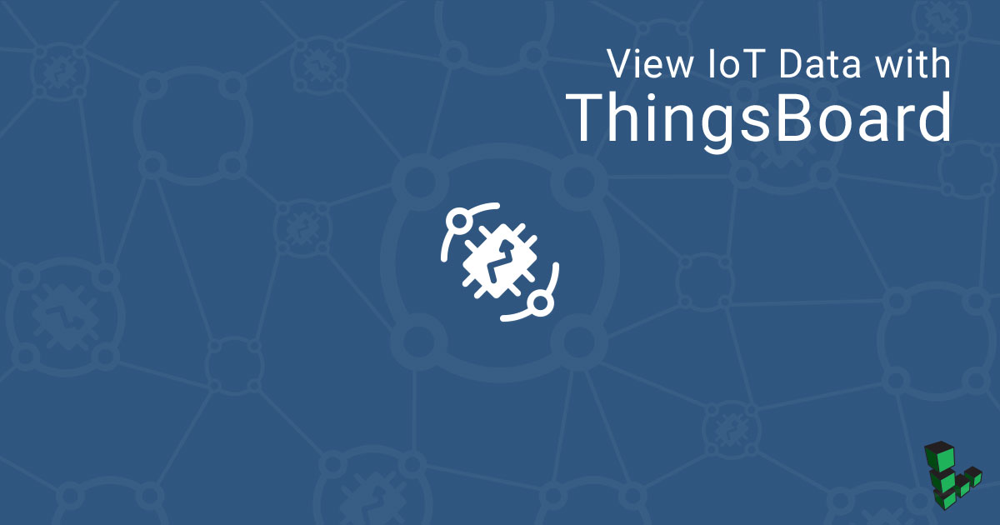
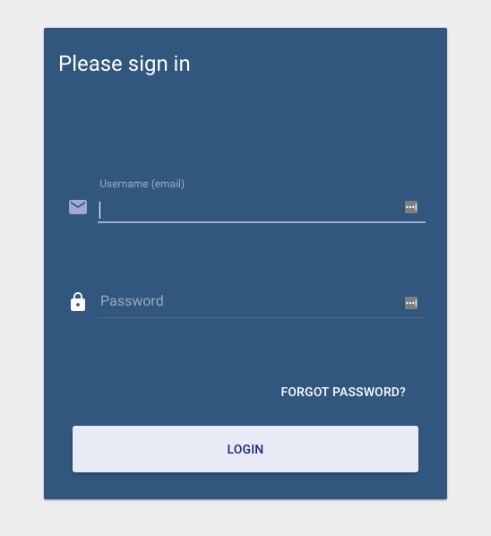
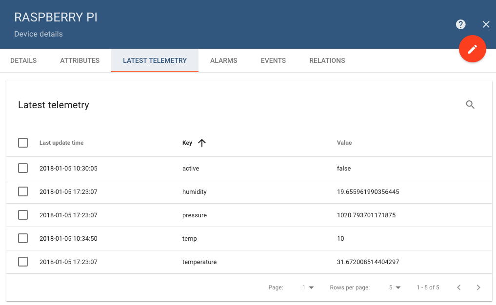
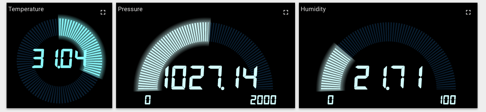

## What is ThingsBoard?

[ThingsBoard](https://thingsboard.io/) is an open source platform for collecting and visualizing data from Internet of Things devices. Data from any number of devices can be sent to a cloud server where it can be viewed or shared through a customizable dashboard.

This guide will show how to install ThingsBoard on a Linode and use a Raspberry Pi to send simple telemetry data to a cloud dashboard.


This guide will use a Raspberry Pi 3 with a [Sense HAT](https://www.raspberrypi.org/products/sense-hat/). You can substitute any device capable of sending telemetry data, or use `curl` to experiment with ThingsBoard without using any external devices.


## Install ThingsBoard

ThingsBoard runs on Java 8, and the Oracle JDK is recommended.



### Set Up PostgreSQL

1.  Install PostgreSQL:

        sudo apt install postgresql postgresql-contrib

2.  Create a database and database user for ThingsBoard:

        sudo -u postgres createdb thingsboard
        sudo -u postgres createuser thingsboard

3.  Set a password for the `thingsboard` user and grant access to the database:

        sudo -u postgres psql thingsboard
        ALTER USER thingsboard WITH PASSWORD 'thingsboard';
        GRANT ALL PRIVILEGES ON DATABASE thingsboard TO thingsboard;
        \q

### Install ThingsBoard

1.  Download the installation package. Check the [releases](https://github.com/thingsboard/thingsboard/releases) page and replace the version numbers in the following command with the version tagged **Latest release**:

        wget https://github.com/thingsboard/thingsboard/releases/download/v1.3.1/thingsboard-1.3.1.deb

2.  Install ThingsBoard:

        sudo dpkg -i thingsboard-1.3.1.deb

3.  Open `/etc/thingsboard/conf/thingsboard.yml` in a text editor and comment out the `HSQLDB DAO Configuration` section:

    
# HSQLDB DAO Configuration
#spring:
#  data:
#    jpa:
#      repositories:
#        enabled: "true"
#  jpa:
#    hibernate:
#      ddl-auto: "validate"
#    database-platform: "org.hibernate.dialect.HSQLDialect"
#  datasource:
#    driverClassName: "${SPRING_DRIVER_CLASS_NAME:org.hsqldb.jdbc.JDBCDriver}"
#    url: "${SPRING_DATASOURCE_URL:jdbc:hsqldb:file:${SQL_DATA_FOLDER:/tmp}/thingsboardDb;sql.enforce_size=false}"
#    username: "${SPRING_DATASOURCE_USERNAME:sa}"
#    password: "${SPRING_DATASOURCE_PASSWORD:}"


4.  In the same section, uncomment the PostgreSQL configuration block. Replace `thingsboard` in the username and password fields with the username and password of your `thingsboard` user:

    
# PostgreSQL DAO Configuration
spring:
  data:
    jpa:
      repositories:
        enabled: "true"
  jpa:
    hibernate:
      ddl-auto: "validate"
    database-platform: "org.hibernate.dialect.PostgreSQLDialect"
  datasource:
    driverClassName: "${SPRING_DRIVER_CLASS_NAME:org.postgresql.Driver}"
    url: "${SPRING_DATASOURCE_URL:jdbc:postgresql://localhost:5432/thingsboard}"
    username: "${SPRING_DATASOURCE_USERNAME:thingsboard}"
    password: "${SPRING_DATASOURCE_PASSWORD:thingsboard}"


5.  Run this installation script:

        sudo /usr/share/thingsboard/bin/install/install.sh --loadDemo

6.  Start the ThingsBoard service:

        sudo systemctl enable thingsboard
        sudo systemctl start thingsboard

## NGINX Reverse Proxy

ThingsBoard listens on `localhost:8080`, by default. For security purposes, it's  better to serve the dashboard through a reverse proxy. This guide will use NGINX, but any webserver can be used.

1.  Install NGINX:

        sudo apt install nginx

2.  Create `/etc/nginx/conf.d/thingsboard.conf` with a text editor and edit it to match the example below. Replace `example.com` with the public IP address or FQDN of your Linode.

    
server {
    listen 80;
    listen [::]:80;

    server_name example.com;

    location / {
        # try_files $uri $uri/ =404;
        proxy_pass http://localhost:8080/;
        proxy_http_version 1.1;
        proxy_set_header Upgrade $http_upgrade;
        proxy_set_header Connection "upgrade";
        proxy_set_header Host $host;
    }
}


3.  Restart NGINX:

        sudo systemctl restart nginx

## Set Up ThingsBoard Device

1.  Navigate to your Linode's IP address with a web browser. You should see the ThingsBoard login page:

    

    The demo account login `tenant@thingsboard.org` and the password is `tenant`. You should change this to a more secure password after you have signed in.

2.  From the main menu, click on the **Devices** icon, then click the **+** icon in the lower right to add a new device.

3.  Choose a name for your device. Set the **Device type** to **PI**.

3.  After the device is added, click on its icon in the **Devices** menu. Click on **COPY ACCESS TOKEN** to copy the API key for this device (used below).

## Configure Raspberry Pi


The following steps assume that you have terminal access to a Raspberry Pi, and that Sense HAT and its libraries are already configured. For more information on getting started with Sense HAT, see the Raspberry Pi [official documentation](https://projects.raspberrypi.org/en/projects/getting-started-with-the-sense-hat). If you would prefer to use `curl` to send mock data to ThingsBoard, you can skip this section.


### Basic Python Script

1.  Using a text editor, create `thingsboard.py` in a directory of your choice. Add the following content, using the API key copied to your clipboard in the previous section:

    
#!/usr/bin/env python

import json
import requests
from sense_hat import SenseHat
from time import sleep

# Constants

API_KEY          = "<ThingsBoard API Key>"
THINGSBOARD_HOST = "<Linode Public IP Address>"

thingsboard_url  = "http://{0}/api/v1/{1}/telemetry".format(THINGSBOARD_HOST, API_KEY)

sense = SenseHat()

data = {}

while True:
    data['temperature'] = sense.get_temperature()
    data['pressure']    = sense.get_pressure()
    data['humidity']    = sense.get_humidity()

    #r = requests.post(thingsboard_url, data=json.dumps(data))
    print(str(data))
    sleep(5)


2.  Test the script by running it from the command line:

        python thingsboard.py

    Basic telemetry should be printed to the console every five seconds:

    
{'pressure': 1020.10400390625, 'temperature': 31.81730842590332, 'humidity': 19.72637939453125}
{'pressure': 1020.166259765625, 'temperature': 31.871795654296875, 'humidity': 20.247455596923828}
{'pressure': 1020.119140625, 'temperature': 31.908119201660156, 'humidity': 19.18065643310547}
{'pressure': 1020.11669921875, 'temperature': 31.908119201660156, 'humidity': 20.279142379760742}
{'pressure': 1020.045166015625, 'temperature': 31.92628288269043, 'humidity': 20.177040100097656}


3.  If the script is working correctly, remove the `print` statement and uncomment the `r = requests.post()` line. Also increase the `sleep()` time interval:

    
while True:
    data['temperature'] = sense.get_temperature()
    data['pressure']    = sense.get_pressure()
    data['humidity']    = sense.get_humidity()

    r = requests.post(thingsboard_url, data=json.dumps(data))
    sleep(60)


### Create a Systemd Service

You should now be able to run the script from the command line to transmit temperature, pressure, and humidity data once per minute. However, to make sure that data is sent continually, it's a good idea to enable a new service that will run the script automatically whenever the server is restarted.

1.  Copy the script to `/usr/bin/` and make it executable:

        sudo cp thingsboard.py /usr/bin/thingsboard.py
        sudo chmod +x /usr/bin/thingsboard.py

2.  Create a service file to run the Python script as a service:

    
[Unit]
Description=Push telemetry data from Sense HAT to ThingsBoard.

[Service]
Type=simple
ExecStart=/usr/bin/thingsboard.py

[Install]
WantedBy=multi-user.target


3.  Enable and start the service:

        sudo systemctl enable thingsdata.service
        sudo systemctl start thingsdata.service

4.  Check the status of the new service:

        sudo systemctl status thingsdata.service

## Send Data with cURL


Skip this section if you are using a Raspberry Pi.


1.  Create a sample JSON file with dummy data:

    
{
  "temperature": 38,
  "humidity": 50,
  "pressure": 1100
}


2.  Use `curl` to send a POST request to the ThingsBoard server:

        curl -v -X POST -d @dummy_data.json http://$THINGSBOARD_HOST:$THINGSBOARD_PORT/api/v1/$ACCESS_TOKEN/telemetry --header "Content-Type:application/json"

## View Data in ThingsBoard

If the service is running successfully, data should be transmitted to your ThingsBoard server every 60 seconds.

1.  Log back into the ThingsBoard dashboard in your browser and click on your device's card in the **Devices** menu. Choose the **Latest Telemetry** tab from the resulting details page. You should see the temperature, humidity, and pressure data from your device:

    

2.  Click the checkbox next to one of the data types and then click **Show on Widget**.

3.  Use the drop-down and carousel menus to choose a one of the preset widgets to display this data type on a dashboard. Click **Add to Dashboard** when you have chosen a widget.

    

## Next Steps

The widgets provided by ThingsBoard can be easily edited, and it is possible to create new ones as well. Multiple widgets, representing multiple data streams from multiple devices, can be combined to produce customized dashboards. These dashboards can then be made public, or shared with customers.

For more information on how to customize and set up widgets and dashboards, see the ThingsBoard [Widget Library](https://thingsboard.io/docs/user-guide/ui/widget-library/#time-series) and [Dashboard page](https://thingsboard.io/docs/user-guide/ui/dashboards/) The [ThingsBoard Github repo](https://github.com/thingsboard/thingsboard) also has images of example dashboards.
