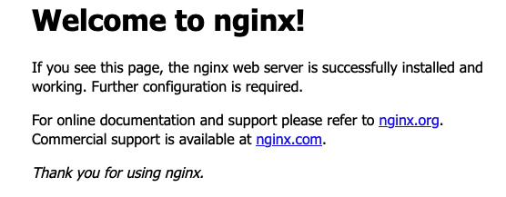

Java is a powerful and widely used programming language. Unfortunately, it is also very complex and some of the common Java IDEs are difficult to master. [Spring Boot](https://spring.io/projects/spring-boot/) and the [Spring Framework](https://spring.io/projects/spring-framework/) simplify the Java development environment and make it easier to create applications. This guide explains how to use Spring Boot tools to create a simple Java application that runs on an Apache Tomcat server. It also describes how to register the application as a service and make it available remotely through an NGINX reverse proxy.

## What is Spring Boot and the Spring Framework?

The Spring Framework is an application framework and [inversion of control container](https://en.wikipedia.org/wiki/Inversion_of_control) for Java-based programs. It constructs the low-level infrastructure for a Java application, allowing developers to focus on the business logic. Spring Boot is an enhancement to the Spring Framework that constructs default configurations and classes. It is used to create standalone Spring applications that are easy to run. When Spring Boot is used, very little configuration is required. Spring Boot is equipped with integrated metrics and health checks and can embed an Apache Tomcat service directly.

The Spring platform is very powerful and contains a large number of features. For comprehensive information about how to use Spring Boot, see the [Spring Boot Documentation](https://docs.spring.io/spring-boot/docs/current/reference/html/).

## Before You Begin

1.  If you have not already done so, create a Linode account and Compute Instance. See our [Getting Started with Linode](/docs/products/platform/get-started/) and [Creating a Compute Instance](/docs/products/compute/compute-instances/guides/create/) guides.

1.  Follow our [Setting Up and Securing a Compute Instance](/docs/products/compute/compute-instances/guides/set-up-and-secure/) guide to update your system. You may also wish to set the timezone, configure your hostname, create a limited user account, and harden SSH access.


This guide is written for a non-root user. Commands that require elevated privileges are prefixed with `sudo`. If you are not familiar with the `sudo` command, see the [Users and Groups](/docs/guides/linux-users-and-groups/) guide.


## Installing Spring Boot and all Prerequisites on Ubuntu 22.04

A Spring Boot environment relies on several other components. These include the Java JDK, the NGINX web server, and the Gradle build tool. Both Spring Boot and Gradle can be downloaded using the SDKMAN! utility. The following guide is designed for Ubuntu 22.04 users, but the installation process is very similar in Ubuntu 20.04.

### Installing Java JDK 17

To use Spring Boot, Java JDK must be installed. Spring Boot works with any release of the JDK between Java 8 and Java 18. However, a reasonably recent release is recommended.

Not all editions of Java are available for free. Starting with Java 11 and until recently, Oracle required a fee to use Java in production. However, beginning with Java 17, the Java software is now available for free again. The new [Oracle Java license](https://www.oracle.com/downloads/licenses/no-fee-license.html) allows it to be used commercially at no cost.

To install Java JDK release 17, follow these instructions.

1.  Ensure `software-properties-common` is installed. This package is often already installed on the system.

    ```command
    sudo apt install software-properties-common
    ```

1.  Add the `linuxuprising` repository, which provides access to the Java JDK installation program.

    ```command
    sudo add-apt-repository ppa:linuxuprising/java
    ```

1.  Ensure all binaries are updated.

    ```command
    sudo apt update
    ```

1.  Use `apt` to install Java JDK 17.

    ```command
    sudo apt install oracle-java17-installer --install-recommends
    ```

1.  Confirm the system is running the correct release of Java.

    ```command
    java -version
    ```

    
java version "17.0.1" 2021-10-19 LTS
Java(TM) SE Runtime Environment (build 17.0.1+12-LTS-39)
Java HotSpot(TM) 64-Bit Server VM (build 17.0.1+12-LTS-39, mixed mode, sharing)
    

### Installing NGINX

Spring Boot works well with the NGINX web server, which is now available as part of the default Ubuntu software library. For more information on NGINX, consult the [NGINX website](https://www.nginx.com/). To install NGINX, follow these instructions.

1.  Install the NGINX server.

    ```command
    sudo apt install nginx
    ```

1.  Confirm NGINX is properly running using the `systemctl` utility.

    ```command
    sudo systemctl status nginx
    ```

    
nginx.service - A high performance web server and a reverse proxy server
     Loaded: loaded (/lib/systemd/system/nginx.service; enabled; vendor preset:>
     Active: active (running) since Wed 2022-05-25 09:43:35 UTC; 19s ago
    

1.  Configure NGINX to start running automatically upon a system boot.

    ```command
    sudo systemctl enable nginx
    ```

1.  Add NGINX to the list of applications with firewall access and enable `ufw`. Ensure `OpenSSH` access is also allowed.

    ```command
    sudo ufw allow OpenSSH
    sudo ufw allow in "Nginx Full"
    sudo ufw enable
    ```

1.  Ensure the firewall is working and all expected services are allowed.

    ```command
    sudo ufw status
    ```

    
Status: active

To                         Action      From
--                         ------      ----
OpenSSH                    ALLOW       Anywhere
Nginx Full                 ALLOW       Anywhere
OpenSSH (v6)               ALLOW       Anywhere (v6)
Nginx Full (v6)            ALLOW       Anywhere (v6)
    

1.  Ensure the server is working properly. Visit the IP address of the Linode and confirm the default NGINX page appears.

    
To determine the IP address of the Ubuntu system, use the Linode Dashboard.
    

    ```command
    http://server_IP_address/
    ```

    

### Installing the Spring Boot CLI

The Spring Boot CLI utility can be installed using several different methods. This guide uses [SDKMAN!](https://sdkman.io/), which is easy to install and use. SDKMAN! allows Ubuntu users to manage different versions of their software development kits. It can run on any Linux-based platform and is able to install, remove, and switch between different releases of an SDK. SDKMAN! simplifies the installation of the Spring Boot CLI and the Gradle build tool.

1.  Install the `unzip` and `zip` utilities using `apt`.

    ```command
    sudo apt install unzip zip
    ```

1.  Install SDKMAN!

    ```command
    curl -s https://get.sdkman.io | bash
    ```

1.  Source the new SDKMAN! shell from the terminal window. Alternatively, open a new terminal to use SDKMAN!. In the following command, replace `userdir` with the name of the user directory.

    ```command
    source "/home/userdir/.sdkman/bin/sdkman-init.sh"
    ```

1.  Verify SDKMAN! is properly installed. The `sdk help` command displays information about the release and usage information.

    ```command
    sdk help
    ```

1.  Use `sdk` to install the Spring Boot CLI module.

    ```command
    sdk install springboot
    ```

    
Spring CLI v2.7.0
    

1.  Install the most recent release of the Gradle build tool. This is currently `7.4.2`.

    ```command
    sdk install gradle 7.4.2
    ```

    
Installing: gradle 7.4.2
Done installing!
Setting gradle 7.4.2 as default.
    

## How to Create a Spring Boot Application on Ubuntu 22.04

### Building the Spring Boot Application and jar File

Different tools can be used to build Spring Boot applications. The default Spring Boot build tool is [Apache Maven](https://maven.apache.org/), but this guide uses [Gradle](https://gradle.org/) instead. Some of Gradle's advantages include greater flexibility and better performance than the alternatives. However, Maven features enhanced IDE support. Gradle is typically used as a command line utility.

To build a Spring application, follow these steps.

1.  Initialize a new project using the Spring Boot CLI. The `spring init` command creates the project scaffolding. The next command creates a project named `hello` in the `hello-world` directory.

    
The `spring init` command allows for many possible options. To see all the possible parameters, run the following command.

```command
spring init --list
```
    

    ```command
    spring init --build=gradle --dependencies=web --name=hello hello-world
    ```

    
Using service at https://start.spring.io
Project extracted to '/home/userdir/hello-world'
    

1.  The `init` command creates a `HelloApplication.java` file inside `~/hello-world/src/main/java/com/example/helloworld`. This file includes some essential `import` directives along with a public `HelloApplication` class. Modify this file as follows:

    -   Add an `import` statement to import the `RestController` and `RequestMapping` functionality beneath the other import statements.
    -   Add a new `Hello` class to display the text `Hello World`.
    -   Precede the class with the `@RestController` annotation. This annotation simplifies the web service creation and indicates the class returns an object rather than a view.
    -   Inside the class, add the Spring `@RequestMapping` annotation. This technique maps a URL to a Spring function. For the root directory `/`, the class invokes the `Hello` function. When a web user accesses the root directory, "Hello World" is printed out.

    Modify `HelloApplication.java` so it matches the following example.

    ```file {title="~/hello-world/src/main/java/com/example/helloworld/HelloApplication.java" lang="java"}
    package com.example.helloworld;

    import org.springframework.boot.SpringApplication;
    import org.springframework.boot.autoconfigure.SpringBootApplication;
    import org.springframework.web.bind.annotation.RestController;
    import org.springframework.web.bind.annotation.RequestMapping;

    @SpringBootApplication
    public class HelloApplication {

        public static void main(String[] args) {
        SpringApplication.run(HelloApplication.class, args);
        }

    }

    @RestController
    class Hello {

        @RequestMapping("/")
        String index() {
            return "Hello world";
        }
    }
    ```

1.  From the root directory of the project, use Gradle to build the Java application. This command creates a new `build` directory inside the project.

    ```command
    cd hello-world
    ./gradlew build
    ```

    
BUILD SUCCESSFUL in 51s
7 actionable tasks: 7 executed
    

### Running and Testing the Spring Boot Application

1.  Run the application inside a Tomcat server. Apache Tomcat provides an HTTP web server environment that can run Java code. The following command runs a servlet at `localhost:8080`.

    ```command
    java -jar build/libs/hello-world-0.0.1-SNAPSHOT.jar
    ```

1.  **(Optional)** Alternatively, it is possible to run the application in place without first building the jar file. This is a faster option for quick internal testing, especially if the application is not yet ready for a final build.

    ```command
    gradle bootRun
    ```

1.  With Tomcat or Gradle `bootRun` still running, launch a new terminal. Use `curl` to test the application on the local host by sending a request to port `8080`. This is the default port for Apache Tomcat. If the following command returns `Hello World`, the application was built correctly and is working as expected.

    ```command
    curl localhost:8080
    ```

    
Hello world
    

1.  When testing is complete, stop the Tomcat server using **CTRL+C**.

For more detailed information on creating a Spring Boot application, see the [Developing Your First Spring Boot Application guide](https://docs.spring.io/spring-boot/docs/1.2.0.M2/reference/html/getting-started-first-application.html).

### Creating an Init Script for the Spring Boot Application

To access the new application externally across the internet, a few more steps are required. An init script for the Spring Boot application must be created inside the `systemd` server. This registers Spring Boot as a service and launches it at system start-up time.

1.  Create a service script for `helloworld.service` in the `/etc/systemd/system` directory as follows. The `ExecStart` field must contain the full path to the application `.jar` file. This is the same file that ran inside Tomcat server earlier. For the path name, replace `userdir` with the name of the user directory.

    ```file {title="/etc/systemd/system/helloworld.service"}
    [Unit]
    Description=Spring Boot HelloWorld
    After=syslog.target
    After=network.target[Service]
    User=username
    Type=simple

    [Service]
    ExecStart=/usr/bin/java -jar /home/userdir/hello-world/build/libs/hello-world-0.0.1-SNAPSHOT.jar
    Restart=always
    StandardOutput=syslog
    StandardError=syslog
    SyslogIdentifier=helloworld

    [Install]
    WantedBy=multi-user.target
    ```

1.  Start the service.

    ```command
    sudo systemctl start helloworld
    ```

1.  Verify the service is `active`.

    ```command
    sudo systemctl status helloworld
    ```

    
helloworld.service - Spring Boot HelloWorld
    Loaded: loaded (/etc/systemd/system/helloworld.service; disabled; vendor p>
    Active: active (running) since Wed 2022-05-25 17:27:17 UTC; 5s ago
    Main PID: 13160 (java)
    

### Configuring a Reverse Proxy for the Spring Boot Application

To implement the application as a web service, a reverse proxy is required. A reverse proxy provides an external shell around a web server. The reverse proxy intercepts incoming requests to the server, and forwards or redirects them as necessary. This technique can improve server performance and enhance security.

In this case, the reverse proxy permits the Java application service to run on an unprivileged port. An unprivileged port does not have an official service associated with it. The proxy receives incoming HTTP requests for the root `/` directory and redirects them to port `8080` on the same host. The Tomcat server running on this port launches the Java application.

To create and test a reverse proxy for the application, follow these steps.

1.  Create an NGINX configuration file for the service. The file should have the same name as the service and have the `.conf` extension. Place the file in the `sites-available` directory in the same manner as a regular site configuration file.

    ```file {title="/etc/nginx/sites-available/helloworld.conf"}
    server {
            listen 80;
            listen [::]:80;

            server_name example.com;

            location / {
                proxy_pass http://localhost:8080/;
                proxy_set_header X-Forwarded-For $proxy_add_x_forwarded_for;
                proxy_set_header X-Forwarded-Proto $scheme;
                proxy_set_header X-Forwarded-Port $server_port;
            }
    }
    ```

1.  Create a soft link to the `sites-enabled` directory to enable the proxy.

    ```command
    sudo ln -s /etc/nginx/sites-available/helloworld.conf /etc/nginx/sites-enabled/
    ```

1.  Unlink the default NGINX site.

    ```command
    sudo unlink /etc/nginx/sites-enabled/default
    ```

1.  Run the NGINX test utility and ensure there are no errors.

    ```command
    sudo nginx -t
    ```

    
nginx: the configuration file /etc/nginx/nginx.conf syntax is ok
nginx: configuration file /etc/nginx/nginx.conf test is successful
    

1.  Restart the NGINX server.

    ```command
    sudo systemctl restart nginx
    ```

1.  Visit the IP address of the Linode to test the new service. The browser should display the "Hello World" message, which is the output of the Java application.

    ```command
    http://ip_address
    ```

## Concluding Thoughts about Deploying Spring Boot Applications with NGINX on Ubuntu 22.04

Spring Boot is an extension of the Spring Framework that makes it easier for Ubuntu Java developers to create applications. Spring Boot is used with the NGINX web server to make standalone Spring applications available over the web. Spring requires a recent release of the Java JDK and can be downloaded and managed using the SDKMAN! package manager.

Spring Boot works with a large number of build tools, including Gradle. Developers can build upon a default Spring Boot configuration and use Spring Boot annotations to quickly add features. After building a `.jar` file using Gradle, developers can run the application locally using the Apache Tomcat server. To run the application over the web, add a service init file and create a reverse proxy to redirect traffic to the servlet. For more information about Spring Boot, consult the [Spring Boot web page](https://spring.io/projects/spring-boot/).