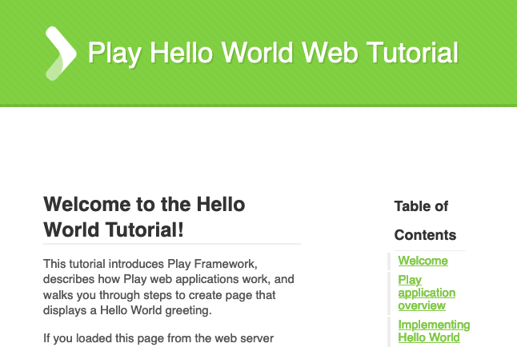
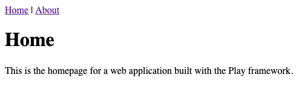

[Play](https://www.playframework.com/) is a lightweight framework for Java and Scala web applications. Play's conciseness makes it easy to develop modern and efficient web applications.

This guide helps you learn more about the Play framework and how to get started using it. It walks you through the setup process and shows you how to access some example projects. Then, it provides a brief tutorial for making a Play website of your own.

## Before You Begin

1.  If you have not already done so, create a Linode account and Compute Instance. See our [Getting Started with Linode](/docs/products/platform/get-started/) and [Creating a Compute Instance](/docs/products/compute/compute-instances/guides/create/) guides.

1.  Follow our [Setting Up and Securing a Compute Instance](/docs/products/compute/compute-instances/guides/set-up-and-secure/) guide to update your system. You may also wish to set the timezone, configure your hostname, create a limited user account, and harden SSH access.


This guide is written for non-root users. Commands that require elevated privileges are prefixed with `sudo`. If you’re not familiar with the `sudo` command, see the [Linux Users and Groups](/docs/guides/linux-users-and-groups/) guide.


## What is the Play Framework?

Play is a web application framework for the Java and Scala programming languages. It focuses on being a concise and lightweight framework that takes advantage of functional programming concepts. Play's approach to the Model–View–Controller (MVC) architecture makes the process of designing modern and efficient web applications clearer and easier.

Play is built on Scala, but it operates equally well with Java and Scala projects. Which language you choose is up to you. Scala provides a concise language oriented around functional programming concepts, and much of the Play community documentation uses Scala. Java, on the other hand, being the older of the two languages, has more general documentation, and support.

One of the great aspects of Play's design, however, is that you do not have to decide on one language over the other. Play lets you work with them both easily within the same project. For instance, you can start your project with Scala and use it for the components of your application directly concerned with Play. Then, you can start adding Java components to handle other features of your application.

This guide's examples primarily use Scala in part because of its great community support. However, in the [Build a Website with Play](#build-a-website-with-play) section, you can find an example that shows how Play lets you seamlessly use Java and Scala side by side.

## Get Started with the Play Framework

This section shows you how to set up what you need to run Play projects and helps you grab some example projects to start exploring. Lastly, it shows you how to set up a base project of your own.

### Prerequisites

Play relies on the [*sbt*](https://www.scala-sbt.org/index.html) build tool, which is also generally considered the de facto standard for managing Scala projects. Following sbt's recommended installation method, this guide uses [SDKMAN](https://sdkman.io/) to install OpenJDK and sbt.

1. Install SDKMAN, following the installation prompts.

        curl -s "https://get.sdkman.io" | bash

1. For the changes to take effect, close and reopen your terminal session or run the following command:

        source "$HOME/.sdkman/bin/sdkman-init.sh"

    You can now verify the installation using the following command:

        sdk version

1. Install OpenJDK.

        sdk install java $(sdk list java | grep -o "8\.[0-9]*\.[0-9]*\.hs-adpt" | head -1)

1. Install sbt.

        sdk install sbt

### Play Framework Example Applications

The Lightbend Tech Hub maintains a host of example Play projects for your to get started with. You can find the list of them on Lightbend's [showcase of example Play projects](https://developer.lightbend.com/start/?group=play). Alternatively, you can visit the GitHub repository with all of the [playframework's example projects](https://github.com/playframework/play-samples).

In these steps, you can see how to download and run one of these examples — the "Hello, World!" example. Then, you can use the steps to try out other examples on your own.

1. Install Git. This command works for Debian and Ubuntu distributions. You should be able to use a similar command for your distribution's package manager.

        sudo apt install git

1. Navigate to the directory where you would like to store the examples — in this example, the current user's home directory. Then, clone the Git repository with the Play example projects:

        cd ~
        git clone https://github.com/playframework/play-samples.git

1. Change the directory into the example that you want to explore. Here, that is the "Hello, World!" example for Scala.

        cd play-samples/play-scala-hello-world-tutorial

1. Run the project.

        sbt run

    Play serves the application on `localhost:9000`. To visit the application remotely, you can use an SSH tunnel.

    - On Windows, you can use the PuTTY tool to set up your SSH tunnel. Follow the appropriate section of the [Using SSH on Windows](/docs/guides/connect-to-server-over-ssh-on-windows/#ssh-tunnelingport-forwarding) guide, replacing the example port number there with **9000**.
    - On OS X or Linux, use the following command to set up the SSH tunnel. Replace `example-user` with your username on the application server and `192.0.2.0` with the server's IP address.

            ssh -L9000:localhost:9000 example-user@192.0.2.0

1. Now you can visit the application in your browser by navigating to `localhost:9000`.

    

### Create an Application

1. Create a directory for your Play project and then change to that directory.

        mkdir ~/example-play-app
        cd ~/example-play-app

    
The `example-play-app` directory in the example above can have the same name as your application. Here, however, its name has been varied to make this directory, and the one discussed below easier to distinguish.
    

1. Generate a base Play project for Scala by following the setup prompts.

        sbt new playframework/play-scala-seed.g8

    If you want to create a base Play project for Java, use the following command:

        sbt new playframework/play-java-seed.g8

1. Change into the subdirectory where the project's main files live. The subdirectory matches the name you gave your project during the setup prompts.

        cd example-app

    Unless noted otherwise, all subsequent commands in this guide assume you are still in this project directory.

1. Run your project. Follow the same steps as in the [Play Framework Example Applications](#play-framework-example-applications) section to get it running and to see the application on `localhost:9000`.

## Build a Website with Play

1. Follow the steps in the [Create an Application](#create-an-application) section above to get the base project started. This example assumes that you are using the Scala base project.

1. Open the configuration file for your application's routes (`conf/routes`), and add the following lines beneath the `GET /` line:

    
GET     /home                       controllers.HomeController.home()

GET     /about                      controllers.AboutController.about()
    

    These lines add two new routes, one for the *Home* page and one for the *About* page.

1. Open the `app/controllers/HomeController.scala` file, and replace its contents with the following:

    
package controllers

import javax.inject._
import play.api._
import play.api.mvc._

@Singleton
class HomeController @Inject()(val controllerComponents: ControllerComponents) extends BaseController {
  def index() = Action { implicit request: Request[AnyContent] =>
    Redirect(routes.HomeController.home())
  }

  def home() = Action { implicit request: Request[AnyContent] =>
    Ok(views.html.index())
  }
}
    

    Controllers like this, and the one created in the next step, handle the initial logic of your application. Any requests to your application tend to get routed into these controllers. Controllers then either render page templates, perform basic logic, or call other components to handle more complicated or reusable logic. This helps to keep your application modular and easily manageable.

    The above controller redirects requests from the base URL (`/`) to the application's path for `HomeController.home()` as defined in the routes file. Then, it renders the `index` template for any request for `/home`.

1. Create an `app/controllers/AboutController.java`, and give it the following contents:

    
package controllers;

import play.mvc.*;

public class AboutController extends Controller {
    public Result about() {
        return ok(views.html.about.render());
    }
}
    

    You could as easily have implemented this controller in Scala. However, implementing the controller in Java demonstrates how easily Play lets you work with both languages in the same project.

    This controller renders the `about` template for any request to the `/about` URL.

1. Customize your page templates. Open the `app/views/index.scala.html` template, and give it the contents below. Then, create the `app/views/about.scala.html` template, and give it the contents shown for it a little further below.

    
@()

@main("Home") {
  <h1>Home</h1>
  
This is the homepage for a web application built with the Play framework.

}
    

    
@()

@main("About") {
  <h1>About</h1>
  
This is an example web application built with the Play framework.

}
    

1. Both of the above templates frame their contents in the `main` template. Open up the `app/views/main.scala.html` template, and give it the contents below:

    
@(title: String)(content: Html)

<!DOCTYPE html>
<html lang="en">
    <head>
        <title>@title</title>
        <link rel="stylesheet" media="screen" href="@routes.Assets.versioned("stylesheets/main.css")">
        <link rel="shortcut icon" type="image/png" href="@routes.Assets.versioned("images/favicon.png")">

    </head>
    <body>
        

                <a href="/home">Home</a> | <a href="/about">About</a>
        

        

                @content
        

      
    </body>
</html>
    

1. Run the application using the steps given in the [Check Out the Example Applications](#play-framework-example-applications) section.

    You can visit the application on `localhost:9000`.

    

## Conclusion

You now have your own Play web application, ready for you to continue building out. To help you along with that, check out the [official documentation](https://www.playframework.com/documentation/2.8.x/Home) for the Play framework. The [Hello World Tutorial](https://www.playframework.com/documentation/2.8.x/HelloWorldTutorial) series of articles there can be especially helpful in better understanding how to get started working with Play applications.
