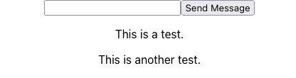

MERN is a modern web application development stack consisting of MongoDB, Express JS, React, and Node.js. Its bundle of robust and well-supported open-source software provides a solid foundation for building a wide range of web applications.

The MERN stack has the advantage of using React. Other variants exist, like the MEAN stack (which uses Angular) and the MEVN stack (which uses Vue). But with React, you get the advantage of server-side rendering and improved availability for web crawlers.

This MERN tutorial helps you get started building a MERN app of your own for an Ubuntu 20.04 or Debian 10 server.

## Before You Begin

1. Familiarize yourself with our [Getting Started with Linode](/docs/getting-started/) guide, and complete the steps for setting your Linode's hostname and timezone.

1. This guide uses `sudo` wherever possible. Complete the sections of our [How to Secure Your Server](/docs/security/securing-your-server/) guide to create a standard user account, harden SSH access, and remove unnecessary network services.

1. Update your system using the following command:

    ```command
    sudo apt update && sudo apt upgrade
    ```


The steps in this guide are written for non-root users. Commands that require elevated privileges are prefixed with `sudo`. If you’re not familiar with the `sudo` command, see the [Linux Users and Groups](/docs/tools-reference/linux-users-and-groups/) guide.


## What Is MERN Stack?

A MERN architecture is a full-stack framework for developing modern web applications. It is a variation of the MEAN stack but replaces Angular (the **A**) with React.

A MERN stack is made up of the following components:

- [MongoDB](https://www.mongodb.com/) document database
- [Express JS](https://expressjs.com/) server-side framework
- [React](https://reactjs.org/) client-side framework
- [Node](https://nodejs.org/en/about/) web server

Each of these technologies is well-supported and offers robust features. This makes a MERN stack a good choice for developing new web applications.

## How to Develop a MERN App

This section walks you through installing MongoDB and Node.js then setting up an Express JS server and React frontend. By the end, you have a complete MERN app, ready to be customized and expanded to your needs.

After building the application, the last section of this guide shows you how to start up your MERN stack and test it out.

### Install the Prerequisites

Two of the MERN components should be installed before you start on your project: MongoDB and Node.js. Once you have them installed, you can create a project, where you install Express JS and React as dependencies.

#### Install MongoDB

1.  Install `gnupg` using the following command:

    ```command
    sudo apt install gnupg
    ```

1.  Import the GPG key for MongoDB.

    ```command
    wget -qO - https://www.mongodb.org/static/pgp/server-5.0.asc | sudo apt-key add -
    ```

1.  Add the MongoDB package list to APT.

    
    
    ```command
    echo "deb http://repo.mongodb.org/apt/debian buster/mongodb-org/5.0 main" | sudo tee /etc/apt/sources.list.d/mongodb-org-5.0.list
    ```
    
    
    ```command
    echo "deb [ arch=amd64,arm64 ] https://repo.mongodb.org/apt/ubuntu focal/mongodb-org/5.0 multiverse" | sudo tee /etc/apt/sources.list.d/mongodb-org-5.0.list
    ```
    
    

1.  Update the APT package index using the following command:

    ```command
    sudo apt update
    ```

1.  Install MongoDB using the following command:

    ```command
    sudo apt install mongodb-org
    ```

See the official documentation for more on installing MongoDB [on Debian](https://docs.mongodb.com/manual/tutorial/install-mongodb-on-debian/) and [on Ubuntu](https://docs.mongodb.com/manual/tutorial/install-mongodb-on-ubuntu/). You can also refer to our [How To Install MongoDB on Ubuntu 16.04](/docs/guides/install-mongodb-on-ubuntu-16-04/) guide.

#### Install Node.js

1.  Install the Node Version Manager, the preferred method for installing Node.js.

    ```command
    curl -o- https://raw.githubusercontent.com/nvm-sh/nvm/v0.39.0/install.sh | bash
    ```

1.  Restart your shell session (logging out and logging back in), or run the following commands:

    ```command
    export NVM_DIR="$HOME/.nvm"
    [ -s "$NVM_DIR/nvm.sh" ] && \. "$NVM_DIR/nvm.sh"
    [ -s "$NVM_DIR/bash_completion" ] && \. "$NVM_DIR/bash_completion"
    ```

1.  Install the current version of Node.js:

    ```command
    nvm install node
    ```

You can additionally refer to our [How to Install and Use the Node Package Manager (NPM) on Linux](/docs/guides/install-and-use-npm-on-linux/#how-to-install-or-update-npm) guide.

### Developing the App

The MERN app project itself consists of two components:

- Express JS provides the backend web API, connecting to MongoDB to store and retrieve data
- React provides the frontend, giving the user interface for interacting with the application

The next sections show you how to set these up for a basic chat application.

#### Create the Express JS Server

1.  Create a directory for your project, and then a subdirectory for your Express JS server. Then, change into the Express JS subdirectory.

    This example creates a project directory under the current user's home directory and an Express JS subdirectory named `server`.

      ```command
      mkdir -p ~/example-mern-app/server
      cd ~/example-mern-app/server
      ```

1.  Initialize a Node.js project, and install Express JS. At the same time, install the Mongoose module for working with MongoDB:

      ```command
      npm init -y
      npm install --save express mongoose
      ```

1.  Create an `index.js` file, and give it the contents shown below. The purpose of each part of this code is elaborated in comments within the code:

    ```file {title="index.js" lang="js"}
    // Set up ExpressJS.
    const express = require("express");
    const bodyParser = require('body-parser');
    const app = express();
    const router = express.Router();
    const port = 5000;

    // Set up Mongoose.
    const mongoose = require('mongoose');
    const mongoDbUrl = 'mongodb://127.0.0.1/example_database';

    // Import MongoDB models.
    const MessageModel = require('./models/message.js');

    // Connect to the database.
    mongoose
      .connect(mongoDbUrl, {useNewUrlParser: true, useUnifiedTopology: true})
      .then(() => console.log('Database connection established.'))
      .catch((err) => console.log('Database connection error: ' + err))
    mongoose.Promise = global.Promise;

    // Prevent possible cross-origin issues.
    app.use((req, res, next) => {
      res.header('Access-Control-Allow-Origin', '*');
      res.header('Access-Control-Allow-Headers', 'Origin, X-Requested-With, Content-Type, Accept');
      next();
    });

    // Necessary to handle the JSON data.
    app.use(bodyParser.json());

    // Create endpoints for the frontend to access.
    app.get('/messages', (req, res, next) => {
      MessageModel
        .find({}, 'messageText')
        .then((data) => res.json(data))
        .catch(next);
    });

    app.post('/messages', (req, res, next) => {
      if (req.body.messageText) {
        MessageModel.create(req.body)
          .then((data) => res.json(data))
          .catch(next);
      } else {
        res.json({error: "Please provide message text."});
      }
    });

    // Listen on the port.
    app.listen(port, () => {
      console.log(`Server is running on port: ${port}`);
    });
    ```

    You can, alternatively, download the [above file](examples/server/index.js) directly.

1.  Create a `models` directory, and create a `message.js` file in it. Give the file the following contents:

    ```file {title="models/message.js" lang="js"}
    // Set up Mongoose.
    const mongoose = require('mongoose');
    const Schema = mongoose.Schema;

    // Create a schema to be used for the MessageModel.
    const MessageSchema = new Schema({
      messageText: {
        type: String,
        required: [true, 'This fields is required.'],
      },
    });

    // Create the message model from the MessageSchema.
    const MessageModel = mongoose.model('message', MessageSchema);

    module.exports = MessageModel;
    ```

    As above, you can also download [this file](examples/server/message.js) directly.

1.  To verify that everything is working, start the MongoDB service and run the Express JS server with the following commands:

    ```command
    sudo systemctl start mongod
    node index.js
    ```

    Upon execution of the commands above, you should observe the following output:

    ```output
    Server is running on port: 5000
    Database connection established.
    ```

1.  You can make sure that the endpoints are working with the following two cURL commands:

    ```command
    curl -X POST -H "Content-Type: application/json" -d '{"messageText":"This is a test."}' localhost:5000/messages
    curl localhost:5000/messages
    ```

    Upon execution of the commands above, you should observe the following output:

    ```output
    [{"_id":"61784e4251b2842f3ffe6eaf", "messageText":"This is a test."}]
    ```

    Once you have seen that the server is working, you can stop it with the <kbd>Ctrl</kbd> + <kbd>C</kbd> combination.

1.  To run the Express JS server and React simultaneously, the [Start MERN Stack Services](#start-mern-stack-services) section below uses the `concurrently` Node.js module. Install the module using the command below:

    ```command
    npm install --save-dev concurrently
    ```

1.  Open the `package.json` file, and change the `scripts` portion as shown below. This allows you to start the server and frontend simultaneously with a single command:

    ```file {title="package.json" lang="json"}
    {
      //...
      "scripts": {
        "server": "node index.js",
        "client": "cd ../client && npm start",
        "app_stack": "concurrently \"npm run server\" \"npm run client\""
      },
      //...
    }
    ```

You can learn more about getting started with Express JS in our guide [Express JS Tutorial: Get Started Building a Website](/docs/guides/express-js-tutorial/).

#### Create the React Frontend

1.  Change into the main project directory, and use the React project creation tool to initialize a React app. This example names the React project `client`.

    ```command
    cd ~/example-mern-app
    npx create-react-app client
    ```

1.  Change into the new React directory, and install the `axios` module. This facilitates making requests from the frontend to the Express JS server.

    ```command
    npm install --save axios
    ```

1.  Open the `App.js` file, and give it the contents shown below. This requires you to delete the file's existing contents. You can find comments throughout the code elaborating on each part.

    ```file {title="App.js" lang="js"}
    // Import React and the stylesheet.
    import React from 'react';
    import './App.css';

    // Import the component to be used for fetching, posting,
    // and displaying messages from the server.
    import Messages from './Messages';

    // Initialize the application display, giving a
    // placeholder for the Messages component.
    function App() {
      return (
        <div className="App">
          <Messages />
        </div>
      );
    }

    export default App;
    ```

    You can also download [this file](examples/client/App.js) directly.

1.  Create a `Messages.js` file, and give it the contents shown below:

    ```file {title="Messages.js" lang="js"}
    // Import React's Component and Axios.
    import React, { Component } from 'react';
    import axios from 'axios';

    // Create the component for handling messages.
    class Messages extends Component {
      // Create an object to hold the list of messages and the message
      // being prepared for sending.
      state = {
        list: [],
        toSend: ""
      };

      // When the component loads, get existing messages from the server.
      componentDidMount() {
        this.fetchMessages();
      }

      // Get messages from the server.
      fetchMessages = () => {
        axios
          .get('/messages')
          .then((res) => {
            if (res.data) {
              this.setState({ list: res.data, toSend: "" });
              let inputField = document.getElementById("textInputField");
              inputField.value = "";
            } else {
              this.setState({ list: ["No messages!"] });
            }
          })
          .catch((err) => console.log(err));
      }

      // Post new messages to the server, and make a call to update
      // the list of messages.
      sendMessage = () => {
        if (this.state.toSend === "") {
          console.log("Enter message text.")
        } else {
          axios
            .post('/messages', { messageText: this.state.toSend })
            .then((res) => {
              if (res.data) {
                this.fetchMessages();
              }
            })
            .catch((err) => console.log(err));
        }
      }

      // Display the list of messages.
      listMessages = () => {
        if (this.state.list && this.state.list.length > 0) {
          return (this.state.list.map((message) => {
            return (
              <p>{message.messageText}</p>
            );
          }))
        } else {
          return (<p>No messages!</p>)
        }
      }

      // Render the message component.
      render() {
        return (
          <div>
            <div>
              <input id="textInputField" type="text" onChange={ (e) => { this.setState({ toSend: e.target.value }) } } />
              <button onClick={this.sendMessage}>Send Message</button>
            </div>
            <div>{ this.listMessages() }</div>
          </div>
        );
      }
    }

    export default Messages;
    ```
    As before, you can also download [this file](examples/client/Messages.js) directly.

1.  Open the `package.json` file, and add the line shown below. This allows you to use shorthand for the Express JS server endpoints, which you can see in the `Messages.js` file above.

    ```file {title="package.json" lang="json"}
    {
      //...
      "proxy": "localhost:5000"
    }
    ```

1.  Verify that the frontend is working by starting it up using the following command:

    ```command
    npm start
    ```

    You can see the front end by navigating to `localhost:3000`.

    Stop the frontend server at any time with the <kbd>Ctrl</kbd> + <kbd>C</kbd> key combination.

To learn more about building applications with React, refer to the [official documentation](https://reactjs.org/docs/getting-started.html).

### Start MERN Stack Services

With the prerequisites installed and the project set up, you can now start up your new MERN app. These steps show you how to get all of the necessary parts running and then connect to your application, even remotely.

1.  Start the MongoDB service.

    ```command
    sudo systemctl start mongod
    ```

1.  Enable the legacy OpenSSL provider in Node.js, required to run React:

    ```command
    export NODE_OPTIONS=--openssl-legacy-provider
    ```

    To make this configuration persistent, add the line above to your `~/.bashrc` file.

1.  Change into the project's `server` directory, and execute the command below:

    ```command
    npm run app_stack
    ```

    Your MERN stack application should now be running. Access the frontend by navigating to `localhost:3000` in a browser. You can access the application remotely using an SSH tunnel:

    - On **Windows**, use the PuTTY tool to set up your SSH tunnel. Follow the appropriate section of the [Setting up an SSH Tunnel with Your Linode for Safe Browsing](/docs/guides/setting-up-an-ssh-tunnel-with-your-linode-for-safe-browsing/#windows) guide, replacing the example port number there with `3000`.

    - On **macOS** or **Linux**, use the following command to set up the SSH tunnel. Replace `example-user` with your username on the application server and `192.0.2.0` with the server's IP address.

        ```command
         ssh -L3000:localhost:3000 example-user@192.0.2.0
        ```

    

When you are ready to make your application accessible to the public, take a look at our [Deploying a React Application on Debian 10](/docs/guides/how-to-deploy-a-react-app-on-debian-10/) guide. Specifically, the [Configure your Web Server](/docs/guides/how-to-deploy-a-react-app-on-debian-10/#configure-your-web-server) and [Create your Deployment Script](/docs/guides/how-to-deploy-a-react-app-on-debian-10/#create-your-deployment-script) sections give you the additional steps you need to make your React frontend available.

## Conclusion

You now have a working MERN stack application. This code above can form a basis that you can modify and expand on to your needs.

Ready to deploy your MERN stack app to a server? Refer to our [Deploy a MERN Stack Application on Akamai](/docs/guides/deploy-a-mern-stack-application/) guide. There, you can learn how to set up a server for a MERN stack and copy over your MERN project for deployment.

One way you can enhance your MERN stack app is by adding authentication. Learn how to implement authentication into your Express JS server through our [User Authentication with JSON Web Tokens (JWTs) and Express](/docs/guides/how-to-authenticate-using-jwt/) guide.